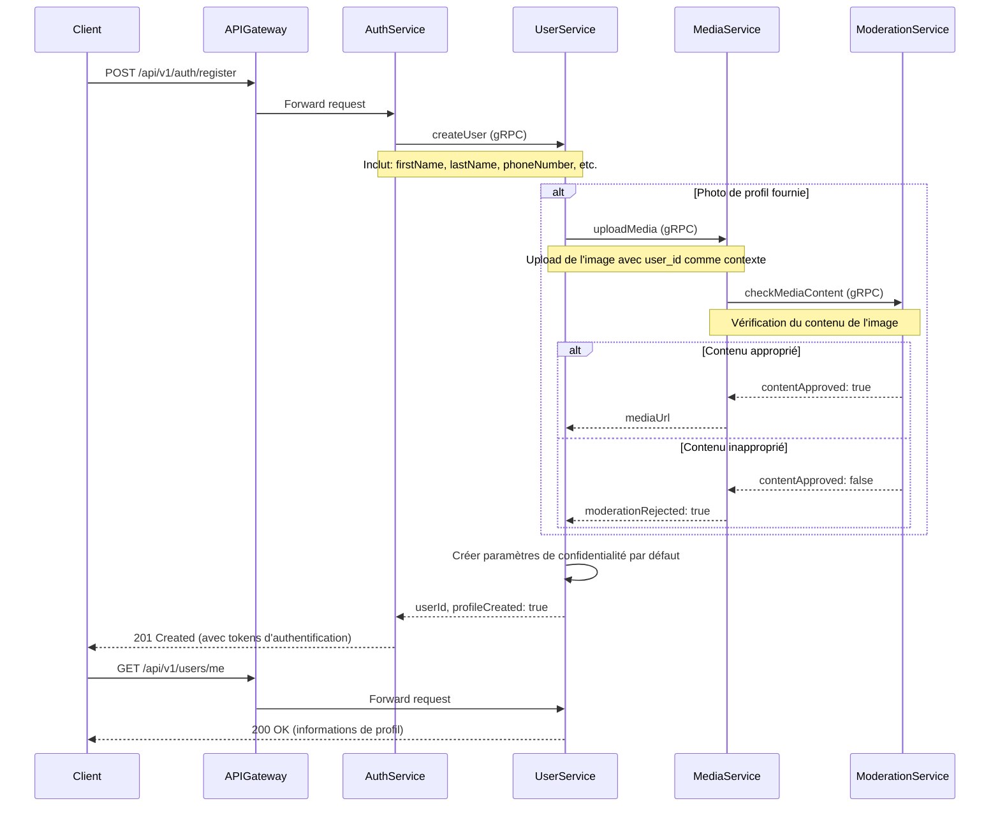
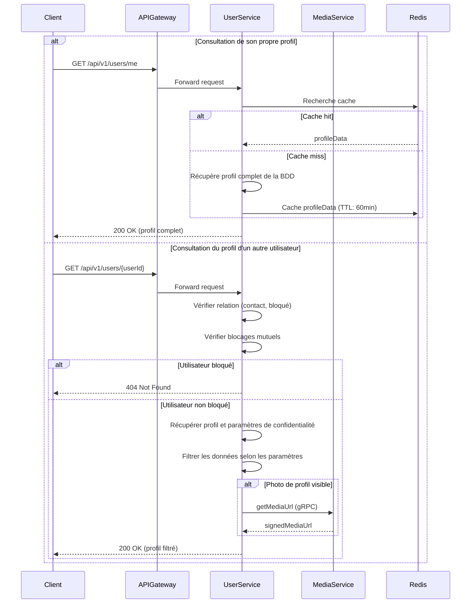
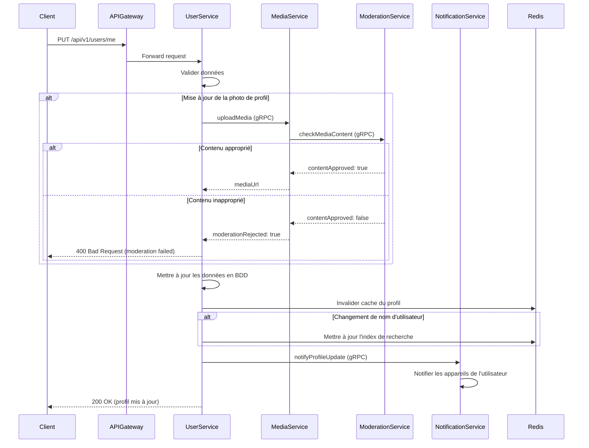
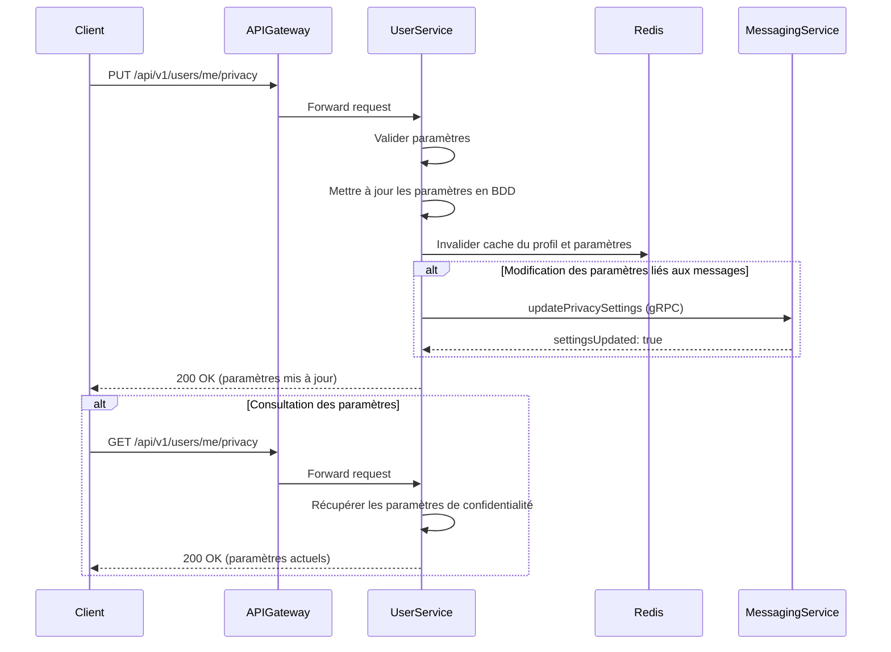
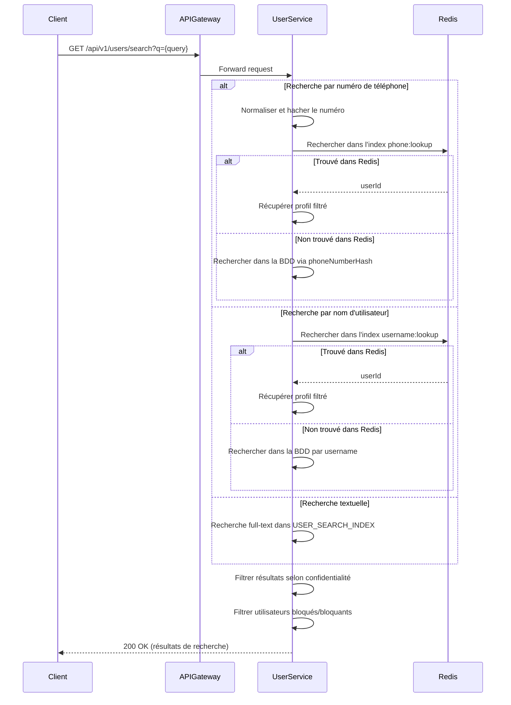

# Spécification Fonctionnelle - Gestion des Profils Utilisateurs

## 1. Vue d'ensemble

### 1.1 Objectif

Cette spécification détaille les fonctionnalités de gestion des profils utilisateurs de l'application Whispr. Elle couvre la création, la consultation, la modification des profils, ainsi que la gestion des paramètres de confidentialité associés. Ces fonctionnalités constituent le socle de l'expérience sociale de l'application, permettant aux utilisateurs de contrôler leur identité numérique et leurs informations personnelles.

### 1.2 Principes clés

- **Contrôle utilisateur**: Donner aux utilisateurs le contrôle total sur leurs données personnelles
- **Confidentialité par défaut**: Paramètres de confidentialité protecteurs par défaut
- **Granularité des permissions**: Contrôle précis sur la visibilité de chaque attribut du profil
- **Intégration cohérente**: Synchronisation avec les autres services de l'application
- **Expérience utilisateur fluide**: Interface intuitive pour la gestion du profil

### 1.3 Composants fonctionnels

Le système de gestion des profils comprend quatre processus principaux:
1. **Création de profil**: Finalisation du profil lors de l'inscription
2. **Consultation de profil**: Accès aux informations selon les paramètres de confidentialité
3. **Modification de profil**: Mise à jour des informations personnelles
4. **Gestion des paramètres de confidentialité**: Configuration des niveaux de visibilité

## 2. Processus de création de profil



### 2.1 Explication du processus de création de profil

#### Phase 1: Initialisation du profil lors de l'inscription
1. **Transmission des données initiales**: 
   - Lors de l'inscription, l'utilisateur fournit ses informations de base
   - Ces données comprennent au minimum: prénom, numéro de téléphone
   - Optionnellement: nom de famille, photo de profil
2. **Création de l'entrée utilisateur**:
   - Le service d'authentification transmet les données au service utilisateur via gRPC
   - Le service utilisateur crée une entrée dans sa base de données avec l'ID généré par le service d'authentification
   - Un nom d'utilisateur unique est proposé automatiquement (basé sur le prénom)

#### Phase 2: Traitement des médias (si présents)
1. **Upload de la photo de profil**:
   - Si une photo est fournie, elle est transmise au service de médias
   - Le service de médias effectue des vérifications techniques (format, taille)
   - La photo est stockée temporairement avec un statut "en attente de modération"
2. **Vérification du contenu**:
   - Le service de modération analyse l'image pour détecter tout contenu inapproprié
   - En cas de rejet, une image par défaut est utilisée et l'utilisateur est notifié
   - En cas d'approbation, l'URL permanente de l'image est générée et stockée

#### Phase 3: Finalisation
1. **Création des paramètres de confidentialité**:
   - Des paramètres de confidentialité par défaut sont créés automatiquement
   - Valeurs par défaut: photo de profil (everyone), prénom (everyone), nom (contacts), biographie (everyone)
2. **Confirmation de création**:
   - Le service utilisateur renvoie une confirmation au service d'authentification
   - L'utilisateur est considéré comme pleinement enregistré
   - Le client peut récupérer les informations complètes du profil

### 2.2 Validation des données

- **Prénom**: Obligatoire, 2-50 caractères, caractères alphanumériques et espaces
- **Nom**: Optionnel, 0-50 caractères, caractères alphanumériques et espaces
- **Nom d'utilisateur**: 
  - Généré automatiquement mais modifiable
  - 3-30 caractères, uniquement lettres, chiffres et soulignés
  - Unicité vérifiée dans la base de données
- **Photo de profil**:
  - Formats acceptés: JPEG, PNG, WebP
  - Taille maximale: 5 MB
  - Dimensions minimales: 200x200 pixels
  - Redimensionnement automatique pour optimisation

## 3. Consultation de profil



### 3.1 Explication du processus de consultation

#### Consultation de son propre profil
1. **Requête de profil personnel**:
   - L'utilisateur demande ses propres informations de profil
   - Le token JWT est utilisé pour identifier l'utilisateur
2. **Récupération des données**:
   - Le service vérifie d'abord le cache Redis
   - En cas d'absence, les données sont extraites de la base PostgreSQL
   - Toutes les informations sont renvoyées sans filtrage
3. **Optimisation**:
   - Le profil complet est mis en cache pour les requêtes futures
   - Les URLs des médias sont signées avec une durée de validité appropriée

#### Consultation du profil d'un autre utilisateur
1. **Requête de profil tiers**:
   - L'utilisateur demande les informations d'un autre utilisateur via son ID
2. **Vérification des relations**:
   - Le service détermine la relation entre les deux utilisateurs (contact, non-contact)
   - Vérifie s'il existe un blocage dans l'une ou l'autre direction
3. **Application des filtres de confidentialité**:
   - Si l'utilisateur cible a bloqué le demandeur, un 404 est renvoyé (utilisateur "inexistant")
   - Sinon, chaque attribut du profil est filtré selon ses paramètres de confidentialité spécifiques
   - Exemple: si le paramètre "lastNamePrivacy" est "contacts", le nom ne sera visible que pour les contacts
4. **Transmission des résultats**:
   - Seules les informations autorisées sont renvoyées au client
   - Les URLs des médias visibles sont signées et incluses dans la réponse

### 3.2 Niveaux de visibilité

| Niveau | Description | Comportement |
|--------|-------------|-------------|
| `everyone` | Public | Visible par tous les utilisateurs authentifiés |
| `contacts` | Contacts uniquement | Visible uniquement par les utilisateurs dans la liste de contacts |
| `nobody` | Privé | Visible uniquement par l'utilisateur lui-même |

## 4. Modification de profil



### 4.1 Explication du processus de modification

#### Préparation et validation
1. **Soumission des modifications**:
   - L'utilisateur envoie les données à mettre à jour via l'API
   - Les champs non modifiés ne sont pas inclus dans la requête
2. **Validation des données**:
   - Vérification du format et de la taille de chaque champ
   - Validation spécifique pour le nom d'utilisateur (unicité, format)
   - Contrôle des médias soumis (format, taille, dimensions)

#### Traitement des médias
1. **Gestion de la photo de profil**:
   - Si une nouvelle photo est fournie, elle est transmise au service de médias
   - L'ancienne photo est marquée pour suppression différée
2. **Vérification du contenu**:
   - Le service de modération analyse l'image
   - En cas de rejet, la mise à jour est annulée et l'utilisateur est informé

#### Finalisation des modifications
1. **Mise à jour des données**:
   - Les changements validés sont appliqués dans la base de données
   - L'horodatage de mise à jour (`updatedAt`) est actualisé
2. **Gestion du cache**:
   - Le cache du profil utilisateur est invalidé
   - Les index de recherche sont mis à jour si nécessaire
3. **Notification**:
   - Les appareils de l'utilisateur sont notifiés des changements
   - Les modifications sensibles (nom d'utilisateur) peuvent déclencher des alertes spécifiques

### 4.2 Champs modifiables

| Champ | Contraintes | Validation |
|-------|-------------|------------|
| `firstName` | Obligatoire, 2-50 chars | Alphanumériques et espaces |
| `lastName` | Optionnel, 0-50 chars | Alphanumériques et espaces |
| `username` | Unique, 3-30 chars | Lettres, chiffres, soulignés |
| `biography` | Optionnel, 0-500 chars | Texte avec filtrage basique |
| `profilePicture` | Max 5MB | Format JPEG, PNG, WebP |

## 5. Gestion des paramètres de confidentialité



### 5.1 Explication du processus de gestion des paramètres de confidentialité

#### Modification des paramètres
1. **Soumission des nouveaux paramètres**:
   - L'utilisateur peut mettre à jour un ou plusieurs paramètres à la fois
   - Chaque attribut de profil a son propre niveau de confidentialité
2. **Validation et application**:
   - Les valeurs sont vérifiées (uniquement `everyone`, `contacts`, `nobody`)
   - Les modifications sont enregistrées dans la base de données
3. **Propagation des changements**:
   - Le cache des paramètres est invalidé
   - Les paramètres concernant les messages sont propagés au service de messagerie
   - Exemple: le paramètre `readReceipts` affecte le comportement du messaging-service

#### Consultation des paramètres
1. **Requête des paramètres actuels**:
   - L'utilisateur peut consulter ses paramètres de confidentialité actuels
2. **Récupération des données**:
   - Les paramètres sont extraits de la base de données
   - Un objet complet avec tous les niveaux de confidentialité est renvoyé

### 5.2 Paramètres de confidentialité disponibles

| Paramètre | Description | Valeurs possibles | Défaut |
|-----------|-------------|-------------------|--------|
| `profilePicturePrivacy` | Visibilité de la photo de profil | everyone, contacts, nobody | everyone |
| `firstNamePrivacy` | Visibilité du prénom | everyone, contacts, nobody | everyone |
| `lastNamePrivacy` | Visibilité du nom de famille | everyone, contacts, nobody | contacts |
| `biographyPrivacy` | Visibilité de la biographie | everyone, contacts, nobody | everyone |
| `lastSeenPrivacy` | Visibilité de la dernière connexion | everyone, contacts, nobody | contacts |
| `searchByPhone` | Possibilité d'être trouvé par numéro | boolean | true |
| `searchByUsername` | Possibilité d'être trouvé par nom d'utilisateur | boolean | true |
| `readReceipts` | Envoi des accusés de lecture | boolean | true |

## 6. Recherche d'utilisateurs



### 6.1 Explication du processus de recherche

#### Types de recherche
1. **Recherche par numéro de téléphone**:
   - L'utilisateur saisit un numéro de téléphone
   - Le numéro est normalisé au format E.164
   - Un hash du numéro est calculé pour préserver la confidentialité
   - La recherche s'effectue d'abord dans le cache Redis puis dans la base de données
2. **Recherche par nom d'utilisateur**:
   - L'utilisateur saisit un nom d'utilisateur exact
   - La recherche est insensible à la casse
   - L'index Redis accélère la recherche des noms d'utilisateur fréquemment consultés
3. **Recherche textuelle**:
   - L'utilisateur saisit un texte libre (nom, prénom)
   - La recherche utilise l'index full-text PostgreSQL
   - Les résultats sont classés par pertinence

#### Filtrage des résultats
1. **Respect de la confidentialité**:
   - Seuls les utilisateurs cherchables sont inclus dans les résultats
   - Les paramètres `searchByPhone` et `searchByUsername` sont respectés
2. **Gestion des blocages**:
   - Les utilisateurs qui ont bloqué le demandeur sont exclus
   - Les utilisateurs bloqués par le demandeur sont exclus
3. **Limitation et pagination**:
   - Les résultats sont limités à 20 par page par défaut
   - La pagination est implémentée pour gérer de grands ensembles de résultats

### 6.2 Optimisations
- **Indexation Redis** pour les recherches exactes fréquentes
- **Index full-text PostgreSQL** pour les recherches textuelles
- **Mise en cache** des résultats de recherche populaires
- **Normalisation** des termes de recherche pour améliorer la pertinence

## 7. Intégration avec les autres services

### 7.1 Interaction avec Auth Service
- **Création initiale**: Le profil est créé sur instruction du service d'authentification
- **Synchronisation de numéro**: Les changements de numéro sont coordonnés entre les services
- **Désactivation de compte**: Le service utilisateur suit les changements d'état du service d'authentification

### 7.2 Interaction avec Media Service
- **Stockage des médias**: Toutes les images de profil sont gérées par le service médias
- **URLs signées**: Les médias sont accessibles via des URLs signées à durée limitée
- **Modération**: Les contenus sont vérifiés avant publication définitive

### 7.3 Interaction avec Messaging Service
- **Paramètres de messagerie**: Les préférences comme `readReceipts` sont partagées
- **Informations de profil**: Le service de messagerie utilise les données de profil pour l'affichage

### 7.4 Interaction avec Notification Service
- **Mises à jour de profil**: Les changements importants déclenchent des notifications
- **Alertes de sécurité**: Les modifications sensibles génèrent des alertes spécifiques

## 8. Considérations techniques

### 8.1 Structure des données

#### Table users (PostgreSQL)
```sql
CREATE TABLE users (
    id UUID PRIMARY KEY,
    phone_number VARCHAR(20) NOT NULL UNIQUE,
    username VARCHAR(30) UNIQUE,
    first_name VARCHAR(50) NOT NULL,
    last_name VARCHAR(50),
    biography TEXT,
    profile_picture_url VARCHAR(255),
    last_seen TIMESTAMP,
    is_active BOOLEAN NOT NULL DEFAULT TRUE,
    created_at TIMESTAMP NOT NULL DEFAULT NOW(),
    updated_at TIMESTAMP NOT NULL DEFAULT NOW()
);
```

#### Table privacy_settings (PostgreSQL)
```sql
CREATE TABLE privacy_settings (
    id UUID PRIMARY KEY DEFAULT uuid_generate_v4(),
    user_id UUID NOT NULL REFERENCES users(id) ON DELETE CASCADE,
    profile_picture_privacy VARCHAR(10) NOT NULL DEFAULT 'everyone',
    first_name_privacy VARCHAR(10) NOT NULL DEFAULT 'everyone',
    last_name_privacy VARCHAR(10) NOT NULL DEFAULT 'contacts',
    biography_privacy VARCHAR(10) NOT NULL DEFAULT 'everyone',
    last_seen_privacy VARCHAR(10) NOT NULL DEFAULT 'contacts',
    search_by_phone BOOLEAN NOT NULL DEFAULT TRUE,
    search_by_username BOOLEAN NOT NULL DEFAULT TRUE,
    read_receipts BOOLEAN NOT NULL DEFAULT TRUE,
    updated_at TIMESTAMP NOT NULL DEFAULT NOW()
);
```

### 8.2 Cache Redis

#### Structures principales
- **Profils utilisateurs**: `user:profile:{userId}`
- **Paramètres de confidentialité**: `user:privacy:{userId}`
- **Index de recherche rapide**: 
  - `username:lookup:{normalizedUsername}`
  - `phone:lookup:{phoneHash}`

### 8.3 Endpoints API

| Endpoint | Méthode | Description | Paramètres |
|----------|---------|-------------|------------|
| `/api/v1/users/me` | GET | Obtenir son profil | - |
| `/api/v1/users/me` | PUT | Mettre à jour son profil | Corps avec champs à modifier |
| `/api/v1/users/{userId}` | GET | Consulter un profil | - |
| `/api/v1/users/me/privacy` | GET | Obtenir ses paramètres de confidentialité | - |
| `/api/v1/users/me/privacy` | PUT | Mettre à jour ses paramètres | Corps avec paramètres à modifier |
| `/api/v1/users/search` | GET | Rechercher des utilisateurs | `q` (terme de recherche) |

## 9. Mesures de sécurité

### 9.1 Protection des données personnelles
- **Hachage des numéros**: Les numéros de téléphone sont hachés pour les recherches
- **Filtrage strict**: Application rigoureuse des paramètres de confidentialité
- **Validation des entrées**: Contrôles stricts sur les données entrantes
- **Masquage dans les logs**: Les informations sensibles sont masquées dans les journaux

### 9.2 Prévention des abus
- **Rate limiting**: Limitation du nombre de requêtes par utilisateur
- **Restrictions de recherche**: Limitations sur la fréquence et l'étendue des recherches
- **Audit des modifications**: Journalisation des changements sensibles
- **Alertes sur comportements suspects**: Détection des modèles d'activité anormaux

## 10. Tests

### 10.1 Tests unitaires
- Validation des formats de données
- Logique de filtrage des profils selon la confidentialité
- Fonctionnement des index de recherche

### 10.2 Tests d'intégration
- Flux complet de création et modification de profil
- Interactions entre services (utilisateur, médias, modération)
- Propagation des paramètres de confidentialité

### 10.3 Tests de performance
- Charge sur les opérations de recherche
- Performance du cache Redis
- Temps de réponse des requêtes de profil

## 11. Livrables

1. **Module NestJS** pour la gestion des profils et de la confidentialité
2. **Composants frontend** pour:
   - Visualisation et édition de profil
   - Configuration des paramètres de confidentialité
   - Interface de recherche d'utilisateurs
3. **Documentation utilisateur** expliquant:
   - Comment personnaliser son profil
   - Comment gérer sa confidentialité
   - Comment rechercher et interagir avec d'autres utilisateurs