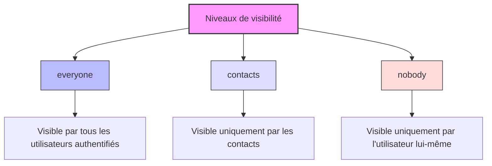
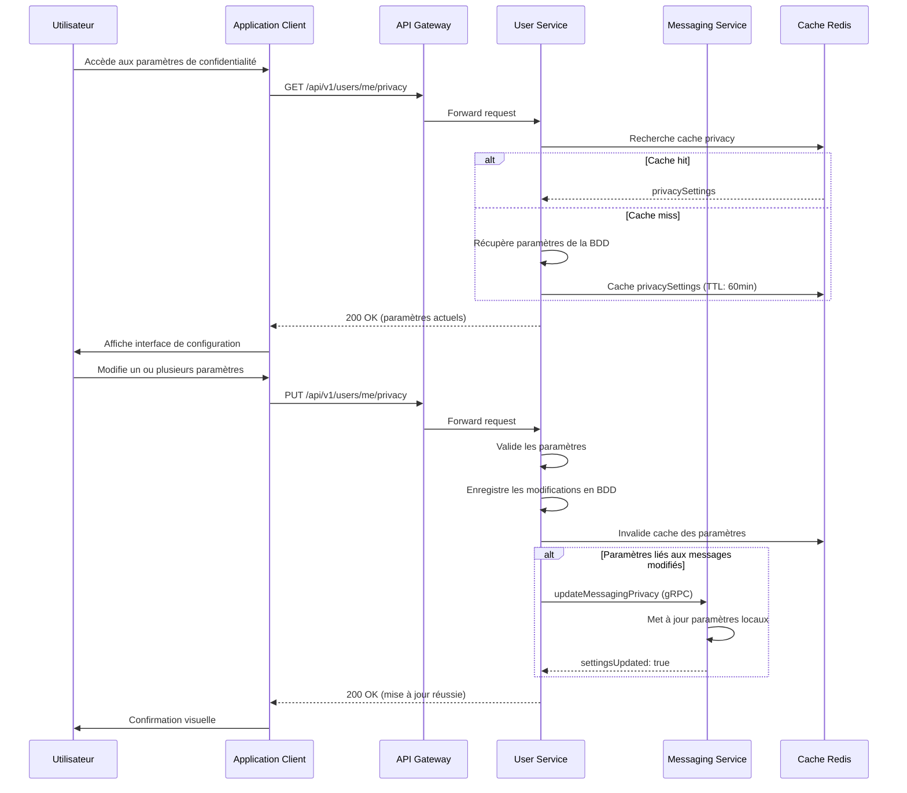
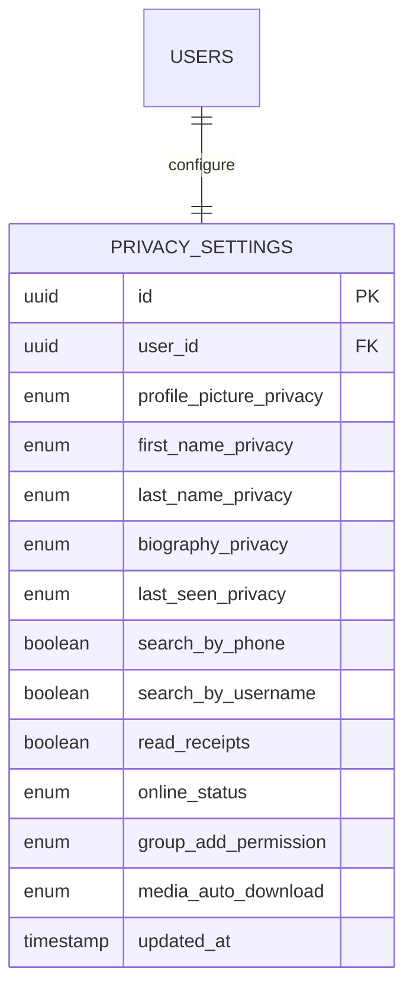
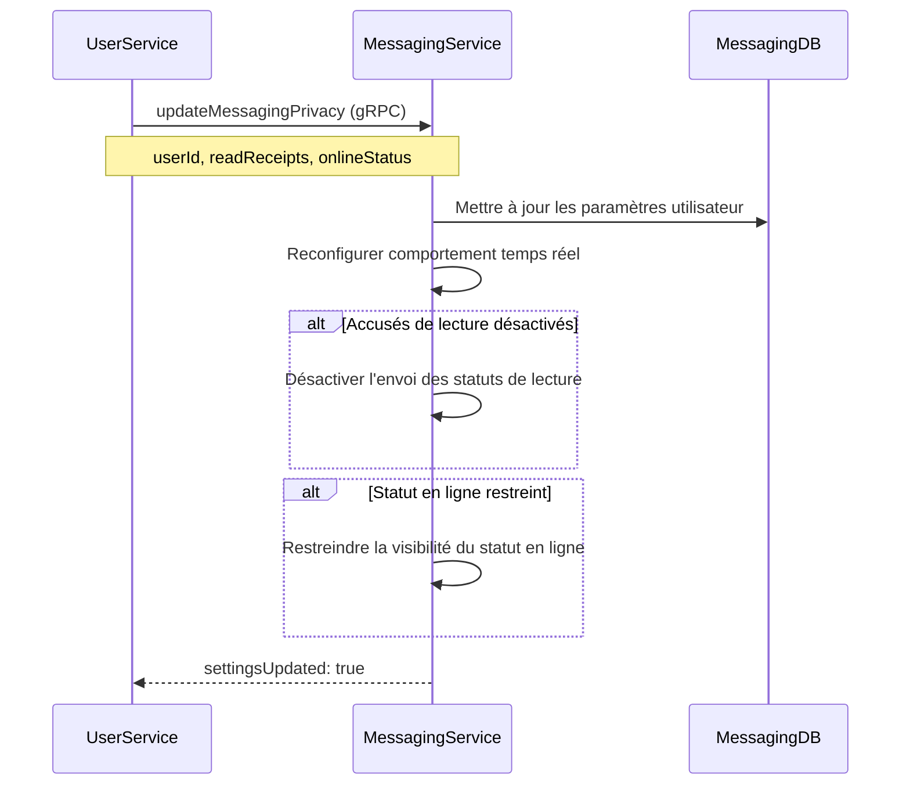
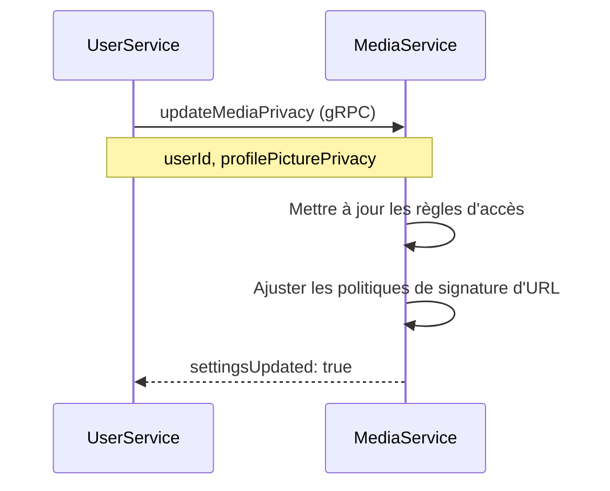

# Spécification Fonctionnelle - Paramètres de Confidentialité

## 1. Vue d'ensemble

### 1.1 Objectif

Cette spécification détaille le système de gestion des paramètres de confidentialité de l'application Whispr. Elle couvre les différents niveaux de visibilité disponibles, le modèle de contrôle d'accès, et les mécanismes permettant aux utilisateurs de personnaliser la confidentialité de leurs informations personnelles. Ces fonctionnalités offrent aux utilisateurs un contrôle granulaire sur leurs données tout en facilitant les interactions sociales au sein de l'application.

### 1.2 Principes clés

- **Granularité des contrôles**: Paramètres distincts pour chaque attribut du profil
- **Simplicité d'utilisation**: Interface intuitive malgré la complexité sous-jacente
- **Confidentialité par défaut**: Paramètres initiaux orientés vers la protection
- **Prévisibilité**: Comportement cohérent et compréhensible pour l'utilisateur
- **Flexibilité**: Adaptation aux différents cas d'usage et préférences

### 1.3 Composants fonctionnels

Le système de paramètres de confidentialité comprend trois aspects principaux:
1. **Niveaux de visibilité**: Définition de qui peut voir chaque attribut
2. **Modèle de permissions**: Structure technique sous-jacente
3. **Interface de gestion**: Mécanismes permettant aux utilisateurs de configurer leurs paramètres

## 2. Niveaux de visibilité

### 2.1 Définition des niveaux



#### 2.1.1 Niveau "everyone"
- **Description**: Information visible par tous les utilisateurs authentifiés de l'application
- **Cas d'usage**: Favorise la découverte et les interactions sociales
- **Exemple**: Photo de profil, prénom, nom d'utilisateur

#### 2.1.2 Niveau "contacts"
- **Description**: Information visible uniquement par les utilisateurs présents dans la liste de contacts
- **Cas d'usage**: Partage d'informations avec un cercle restreint
- **Exemple**: Nom de famille, dernière connexion, statut en ligne

#### 2.1.3 Niveau "nobody"
- **Description**: Information visible uniquement par l'utilisateur lui-même
- **Cas d'usage**: Données sensibles ou personnelles
- **Exemple**: Numéro de téléphone complet, adresse email

### 2.2 Matrices de visibilité

#### 2.2.1 Matrice des attributs du profil par niveau de confidentialité

| Attribut | everyone | contacts | nobody |
|----------|----------|----------|--------|
| Photo de profil | Visible par tous | Visible par les contacts uniquement | Photo par défaut pour les autres |
| Prénom | Visible par tous | Visible par les contacts uniquement | Première lettre + ... pour les autres |
| Nom | Visible par tous | Visible par les contacts uniquement | Non visible pour les autres |
| Nom d'utilisateur | Toujours visible | Toujours visible | Toujours visible |
| Biographie | Visible par tous | Visible par les contacts uniquement | Non visible pour les autres |
| Dernière connexion | Visible par tous | Visible par les contacts uniquement | Non visible pour les autres |
| Numéro de téléphone | Jamais visible | Partiellement masqué | Visible intégralement |

#### 2.2.2 Matrice des actions par relation avec l'utilisateur

| Action | Propriétaire | Contact | Non-contact | Utilisateur bloqué |
|--------|-------------|---------|-------------|-------------------|
| Voir le profil complet | ✅ | ⚠️ (selon paramètres) | ⚠️ (restrictions) | ❌ |
| Rechercher par nom | ✅ | ✅ | ✅ | ❌ |
| Rechercher par téléphone | ✅ | ⚠️ (si activé) | ⚠️ (si activé) | ❌ |
| Voir si en ligne | ✅ | ⚠️ (si activé) | ❌ | ❌ |
| Voir dernière connexion | ✅ | ⚠️ (si activé) | ❌ | ❌ |
| Recevoir accusé de lecture | ✅ | ⚠️ (si activé) | ❌ | ❌ |

## 3. Configuration des paramètres de confidentialité

### 3.1 Interface de gestion



### 3.2 Paramètres configurables

#### 3.2.1 Visibilité des attributs du profil

| Paramètre | Description | Valeurs possibles | Défaut |
|-----------|-------------|-------------------|--------|
| `profilePicturePrivacy` | Visibilité de la photo de profil | everyone, contacts, nobody | everyone |
| `firstNamePrivacy` | Visibilité du prénom | everyone, contacts, nobody | everyone |
| `lastNamePrivacy` | Visibilité du nom de famille | everyone, contacts, nobody | contacts |
| `biographyPrivacy` | Visibilité de la biographie | everyone, contacts, nobody | everyone |
| `lastSeenPrivacy` | Visibilité de la dernière connexion | everyone, contacts, nobody | contacts |

#### 3.2.2 Paramètres de découverte et recherche

| Paramètre | Description | Valeurs possibles | Défaut |
|-----------|-------------|-------------------|--------|
| `searchByPhone` | Possibilité d'être trouvé par numéro de téléphone | true, false | true |
| `searchByUsername` | Possibilité d'être trouvé par nom d'utilisateur | true, false | true |

#### 3.2.3 Paramètres de messagerie et statut

| Paramètre | Description | Valeurs possibles | Défaut |
|-----------|-------------|-------------------|--------|
| `readReceipts` | Envoi des accusés de lecture | true, false | true |
| `onlineStatus` | Affichage du statut en ligne | everyone, contacts, nobody | contacts |

#### 3.2.4 Paramètres additionnels

| Paramètre | Description | Valeurs possibles | Défaut |
|-----------|-------------|-------------------|--------|
| `groupAddPermission` | Qui peut vous ajouter à des groupes | everyone, contacts | contacts |
| `mediaAutoDownload` | Téléchargement automatique des médias | always, wifi_only, never | wifi_only |

### 3.3 Interactions avec le système de blocage

Le système de paramètres de confidentialité interagit directement avec le système de blocage d'utilisateurs:

- **Priorité du blocage**: Un blocage outrepasse tous les paramètres de confidentialité
- **Invisibilité réciproque**: Les utilisateurs bloqués ne peuvent pas voir votre profil, indépendamment des paramètres
- **Non-découvrabilité**: Les utilisateurs bloqués ne peuvent pas vous trouver dans les recherches

## 4. Modèle de permissions et implémentation

### 4.1 Structure de données



### 4.2 Algorithme de vérification d'accès

```
FONCTION verifyAccess(viewer_id, target_id, attribute):
    // Vérifier les blocages
    SI isBlocked(target_id, viewer_id) OU isBlocked(viewer_id, target_id):
        RETOURNER false
    
    // Cas spécial: le propriétaire a toujours accès
    SI viewer_id = target_id:
        RETOURNER true
    
    // Récupérer le niveau de confidentialité de l'attribut
    privacy_level = getPrivacyLevel(target_id, attribute)
    
    // Vérifier selon le niveau
    SI privacy_level = "everyone":
        RETOURNER true
    SINON SI privacy_level = "contacts":
        RETOURNER isContact(target_id, viewer_id)
    SINON SI privacy_level = "nobody":
        RETOURNER false
    
    // Par défaut, refuser l'accès
    RETOURNER false
```

### 4.3 Cache et optimisations

Pour optimiser les performances du système de confidentialité:

- **Mise en cache des paramètres** dans Redis avec TTL de 60 minutes
- **Invalidation sélective** lors des mises à jour
- **Préchargement des paramètres** lors des requêtes de profil
- **Traitement par lots** pour les vérifications multiples
- **Propagation asynchrone** vers les autres services

## 5. Cas d'utilisation détaillés

### 5.1 Consulter un profil avec différents niveaux de confidentialité

#### Cas 1: Utilisateur consultant un profil public
- **Acteurs**: Alice (viewer), Bob (profil consulté)
- **Paramètres de Bob**: profilePicturePrivacy: everyone, firstNamePrivacy: everyone, lastNamePrivacy: contacts
- **Relation**: Alice n'est pas un contact de Bob
- **Résultat**:
  - Alice voit la photo de profil de Bob
  - Alice voit le prénom de Bob
  - Alice ne voit pas le nom de famille de Bob
  - Alice voit le nom d'utilisateur de Bob (toujours visible)

#### Cas 2: Utilisateur consultant le profil d'un contact
- **Acteurs**: Alice (viewer), Bob (profil consulté)
- **Paramètres de Bob**: Mêmes que ci-dessus
- **Relation**: Alice est un contact de Bob
- **Résultat**:
  - Alice voit la photo de profil de Bob
  - Alice voit le prénom de Bob
  - Alice voit le nom de famille de Bob
  - Alice voit le nom d'utilisateur de Bob

#### Cas 3: Profil très privé
- **Acteurs**: Alice (viewer), Carol (profil consulté)
- **Paramètres de Carol**: Tous les paramètres à "nobody"
- **Relation**: Alice n'est pas un contact de Carol
- **Résultat**:
  - Alice voit une photo de profil par défaut
  - Alice voit seulement la première lettre du prénom suivi de points
  - Alice ne voit pas le nom de famille
  - Alice voit le nom d'utilisateur de Carol

### 5.2 Scénarios de recherche

#### Cas 1: Recherche par numéro de téléphone
- **Acteurs**: David (chercheur), Eve (utilisateur recherché)
- **Paramètres de Eve**: searchByPhone: true
- **Action**: David recherche Eve en utilisant son numéro de téléphone
- **Résultat**: Eve apparaît dans les résultats de recherche

#### Cas 2: Recherche par numéro avec protection
- **Acteurs**: David (chercheur), Frank (utilisateur recherché)
- **Paramètres de Frank**: searchByPhone: false
- **Action**: David recherche Frank en utilisant son numéro de téléphone
- **Résultat**: Frank n'apparaît pas dans les résultats de recherche

#### Cas 3: Recherche avec blocage
- **Acteurs**: David (chercheur), Grace (utilisateur recherché)
- **Paramètres de Grace**: searchByPhone: true, searchByUsername: true
- **Relation**: Grace a bloqué David
- **Action**: David recherche Grace par nom d'utilisateur ou numéro
- **Résultat**: Grace n'apparaît jamais dans les résultats, quelle que soit la méthode

### 5.3 Scénarios de messagerie

#### Cas 1: Accusés de lecture
- **Acteurs**: Harry (expéditeur), Irene (destinataire)
- **Paramètres de Irene**: readReceipts: true
- **Action**: Harry envoie un message à Irene, Irene le lit
- **Résultat**: Harry voit que son message a été lu

#### Cas 2: Désactivation des accusés de lecture
- **Acteurs**: Harry (expéditeur), Jack (destinataire)
- **Paramètres de Jack**: readReceipts: false
- **Action**: Harry envoie un message à Jack, Jack le lit
- **Résultat**: Harry voit uniquement que son message a été livré, pas qu'il a été lu

## 6. Interfaces utilisateur

### 6.1 Écran principal des paramètres de confidentialité

```
┌───────────────────────────────────────┐
│ Paramètres de confidentialité          │
├───────────────────────────────────────┤
│                                       │
│ Visibilité du profil                  │
│ ┌─────────────────────────┬─────────┐ │
│ │ Photo de profil         │ Tous ▼  │ │
│ ├─────────────────────────┼─────────┤ │
│ │ Prénom                  │ Tous ▼  │ │
│ ├─────────────────────────┼─────────┤ │
│ │ Nom                     │ Contacts▼│ │
│ ├─────────────────────────┼─────────┤ │
│ │ Biographie              │ Tous ▼  │ │
│ ├─────────────────────────┼─────────┤ │
│ │ Dernière connexion      │ Contacts▼│ │
│ └─────────────────────────┴─────────┘ │
│                                       │
│ Découverte et recherche               │
│ ┌─────────────────────────┬─────────┐ │
│ │ Recherche par téléphone │    ✓    │ │
│ ├─────────────────────────┼─────────┤ │
│ │ Recherche par username  │    ✓    │ │
│ └─────────────────────────┴─────────┘ │
│                                       │
│ Messages et statut                    │
│ ┌─────────────────────────┬─────────┐ │
│ │ Accusés de lecture      │    ✓    │ │
│ ├─────────────────────────┼─────────┤ │
│ │ Statut en ligne         │ Contacts▼│ │
│ └─────────────────────────┴─────────┘ │
│                                       │
└───────────────────────────────────────┘
```

### 6.2 Sélecteur de niveau de confidentialité

```
┌───────────────────────┐
│ Photo de profil       │
├───────────────────────┤
│ ● Tous                │
│ ○ Contacts uniquement │
│ ○ Personne            │
└───────────────────────┘
```

### 6.3 Prévisualisation de profil

```
┌───────────────────────────────────────┐
│ Aperçu de votre profil                │
├───────────────────────────────────────┤
│                                       │
│ Vu par tout le monde:                 │
│ ┌───────────────────────────────────┐ │
│ │  ┌────┐                           │ │
│ │  │ 👤 │  Marie                    │ │
│ │  └────┘  @marie_dupont            │ │
│ │                                   │ │
│ │  Passionnée de photographie 📷    │ │
│ └───────────────────────────────────┘ │
│                                       │
│ Vu par vos contacts:                  │
│ ┌───────────────────────────────────┐ │
│ │  ┌────┐                           │ │
│ │  │ 🖼️ │  Marie Dupont             │ │
│ │  └────┘  @marie_dupont            │ │
│ │                                   │ │
│ │  Passionnée de photographie 📷    │ │
│ │  Vu récemment: Il y a 5 min       │ │
│ └───────────────────────────────────┘ │
│                                       │
└───────────────────────────────────────┘
```

## 7. Propagation des paramètres vers d'autres services

### 7.1 Interaction avec le service de messagerie



### 7.2 Interaction avec le service média



## 8. Considérations techniques

### 8.1 Stockage et accès aux paramètres

#### 8.1.1 Structure PostgreSQL
```sql
CREATE TYPE privacy_level AS ENUM ('everyone', 'contacts', 'nobody');

CREATE TABLE privacy_settings (
    id UUID PRIMARY KEY DEFAULT uuid_generate_v4(),
    user_id UUID NOT NULL REFERENCES users(id) ON DELETE CASCADE,
    profile_picture_privacy privacy_level NOT NULL DEFAULT 'everyone',
    first_name_privacy privacy_level NOT NULL DEFAULT 'everyone',
    last_name_privacy privacy_level NOT NULL DEFAULT 'contacts',
    biography_privacy privacy_level NOT NULL DEFAULT 'everyone',
    last_seen_privacy privacy_level NOT NULL DEFAULT 'contacts',
    search_by_phone BOOLEAN NOT NULL DEFAULT TRUE,
    search_by_username BOOLEAN NOT NULL DEFAULT TRUE,
    read_receipts BOOLEAN NOT NULL DEFAULT TRUE,
    online_status privacy_level NOT NULL DEFAULT 'contacts',
    group_add_permission privacy_level NOT NULL DEFAULT 'contacts',
    media_auto_download VARCHAR(10) NOT NULL DEFAULT 'wifi_only',
    updated_at TIMESTAMP NOT NULL DEFAULT NOW(),
    UNIQUE(user_id)
);
```

#### 8.1.2 Cache Redis
```
// Format du cache
user:privacy:{userId} = {
  profilePicturePrivacy: "everyone",
  firstNamePrivacy: "everyone",
  lastNamePrivacy: "contacts",
  biographyPrivacy: "everyone",
  lastSeenPrivacy: "contacts",
  searchByPhone: true,
  searchByUsername: true,
  readReceipts: true,
  onlineStatus: "contacts",
  groupAddPermission: "contacts",
  mediaAutoDownload: "wifi_only"
}

// TTL: 60 minutes
```

### 8.2 Endpoints API

| Endpoint | Méthode | Description | Paramètres/Corps |
|----------|---------|-------------|-----------------|
| `/api/v1/users/me/privacy` | GET | Obtenir tous les paramètres | - |
| `/api/v1/users/me/privacy` | PUT | Mettre à jour plusieurs paramètres | JSON avec paramètres à modifier |
| `/api/v1/users/me/privacy/{param}` | PUT | Mettre à jour un paramètre spécifique | `value` dans le corps |
| `/api/v1/users/me/privacy/reset` | POST | Réinitialiser aux valeurs par défaut | - |

### 8.3 Performance et optimisations

- **Requêtes combinées**: Regroupement des vérifications pour minimiser les accès à la base de données
- **Mise en cache**: Paramètres fréquemment accédés conservés en cache
- **Préchargement**: Inclusion des paramètres lors des requêtes de profil
- **Agrégation d'événements**: Regroupement des notifications de changements aux autres services
- **Dénormalisation sélective**: Duplication contrôlée pour les vérifications critiques

## 9. Sécurité et validation

### 9.1 Validation des entrées
- **Validation des énumérations**: Vérification que les valeurs sont parmi les options autorisées
- **Vérification des types**: Contrôle du type des valeurs booléennes
- **Filtrage des paramètres**: Rejet des paramètres inconnus
- **Validation contextuelle**: Certains paramètres peuvent dépendre d'autres paramètres

### 9.2 Protection contre les abus
- **Rate limiting**: Limitation des changements fréquents de paramètres
- **Journalisation des modifications**: Traçabilité des changements pour la détection d'anomalies
- **Vérification d'autorisation**: Seul l'utilisateur peut modifier ses propres paramètres
- **Changements en lot**: Validation atomique des modifications multiples

## 10. Tests

### 10.1 Tests unitaires
- Tests de validation des entrées
- Tests de l'algorithme de vérification d'accès
- Tests des structures de cache

### 10.2 Tests d'intégration
- Tests des interactions entre services
- Tests de persistance et récupération des paramètres
- Tests de propagation des changements

### 10.3 Tests de cas limites
- Comportement en cas de paramètres manquants
- Interaction avec le système de blocage
- Scénarios de conflit (par exemple, mise à jour simultanée)

## 11. Expérience utilisateur

### 11.1 Principes d'interface
- **Clarté**: Explication simple de chaque paramètre
- **Prévisualisation**: Aperçu de l'impact des paramètres
- **Groupement logique**: Organisation des paramètres par catégorie
- **Accessibilité**: Contrôles faciles à comprendre et manipuler
- **Feedback**: Confirmation visuelle des modifications

### 11.2 Onboarding et éducation
- **Guide initial**: Présentation des paramètres lors de la création du compte
- **Tooltips explicatifs**: Informations contextuelles sur chaque paramètre
- **Suggestions personnalisées**: Recommandations basées sur le profil d'utilisation
- **Notifications de sécurité**: Alertes sur les paramètres sensibles

## 12. Conformité RGPD et considérations juridiques

### 12.1 Principes de protection des données
- **Transparence**: Explication claire de l'utilisation des données
- **Limitation de finalité**: Usage des données limité aux fonctionnalités nécessaires
- **Minimisation**: Collecte limitée aux données essentielles
- **Exactitude**: Possibilité de correction des informations
- **Limitation de conservation**: Durées de rétention définies

### 12.2 Droits des utilisateurs
- **Droit d'accès**: Visualisation complète des paramètres et données
- **Droit de rectification**: Modification des informations personnelles
- **Droit à l'effacement**: Suppression des données via la suppression de compte
- **Droit à la limitation**: Restriction de l'utilisation via les paramètres de confidentialité
- **Droit à la portabilité**: Export des données personnelles

## 13. Évolution et améliorations futures

### 13.1 Améliorations potentielles
- **Listes personnalisées**: Paramètres de visibilité pour des groupes définis d'utilisateurs
- **Paramètres temporaires**: Modification de confidentialité pour une durée limitée
- **Alertes de confidentialité**: Notifications sur les risques potentiels
- **Préréglages**: Configurations rapides (privé, standard, public)
- **Paramètres contextuels**: Confidentialité différente selon le contexte d'utilisation

### 13.2 Roadmap d'évolution
- **Phase 1**: Implémentation du système de base (niveaux everyone, contacts, nobody)
- **Phase 2**: Ajout des paramètres liés à la messagerie et au statut
- **Phase 3**: Intégration avec le système de groupes et listes
- **Phase 4**: Introduction des fonctionnalités avancées (listes personnalisées, etc.)

## 14. Références

### 14.1 Standards et bonnes pratiques
- GDPR/RGPD Article 25: Privacy by Design and by Default
- OWASP Privacy by Design Project
- ISO/IEC 29100 Privacy framework

### 14.2 Documentation associée
- Spécification Fonctionnelle - Gestion des Profils Utilisateurs
- Spécification Fonctionnelle - Gestion des Contacts
- Spécification Fonctionnelle - Système de Blocage