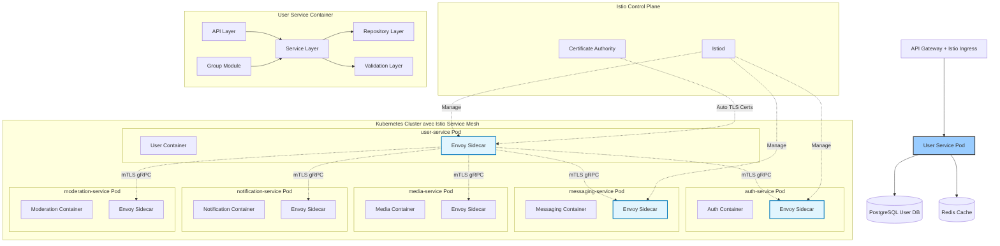

# User Service (`user-service`) - System Design Document

## 0. Sommaire

- [1. Introduction](#1-introduction)
  - [1.1 Objectif du Document](#11-objectif-du-document)
  - [1.2 Périmètre du Service](#12-périmètre-du-service)
  - [1.3 Relations avec les Autres Services](#13-relations-avec-les-autres-services)
- [2. Architecture Globale](#2-architecture-globale)
  - [2.1 Vue d'Ensemble de l'Architecture avec Istio Service Mesh](#21-vue-densemble-de-larchitecture-avec-istio-service-mesh)
  - [2.2 Principes Architecturaux](#22-principes-architecturaux)
- [3. Choix Technologiques](#3-choix-technologiques)
  - [3.1 Stack Technique](#31-stack-technique)
  - [3.2 Infrastructure](#32-infrastructure)
- [4. Composants Principaux](#4-composants-principaux)
  - [4.1 Structure NestJS](#41-structure-nestjs)
  - [4.2 Controllers (API Layer)](#42-controllers-api-layer)
  - [4.3 Services (Business Logic Layer)](#43-services-business-logic-layer)
  - [4.4 Repositories (Data Access Layer)](#44-repositories-data-access-layer)
  - [4.5 Guards et Interceptors (Security Layer)](#45-guards-et-interceptors-security-layer)
  - [4.6 Communication avec les autres services via Istio Service Mesh](#46-communication-avec-les-autres-services-via-istio-service-mesh)
    - [4.6.1 Configuration Istio pour user-service](#461-configuration-istio-pour-user-service)
  - [4.7 Configuration et Modules](#47-configuration-et-modules)
- [5. Scaling et Performances](#5-scaling-et-performances)
  - [5.1 Stratégie de Scaling](#51-stratégie-de-scaling)
  - [5.2 Cache et Optimisations](#52-cache-et-optimisations)
  - [5.3 Limites et Quotas avec Istio](#53-limites-et-quotas-avec-istio)
- [6. Monitoring et Observabilité](#6-monitoring-et-observabilité)
  - [6.1 Observabilité Istio](#61-observabilité-istio)
  - [6.2 Logging](#62-logging)
  - [6.3 Métriques](#63-métriques)
  - [6.4 Alerting](#64-alerting)
- [7. Gestion des Erreurs et Résilience](#7-gestion-des-erreurs-et-résilience)
  - [7.1 Stratégie de Gestion des Erreurs](#71-stratégie-de-gestion-des-erreurs)
  - [7.2 Résilience avec Istio](#72-résilience-avec-istio)
  - [7.3 Plan de Reprise d'Activité](#73-plan-de-reprise-dactivité)
- [8. Évolution et Maintenance](#8-évolution-et-maintenance)
  - [8.1 Versionnement](#81-versionnement)
  - [8.2 Mise à Jour et Déploiement](#82-mise-à-jour-et-déploiement)
  - [8.3 Documentation Technique](#83-documentation-technique)
- [9. Considérations Opérationnelles](#9-considérations-opérationnelles)
  - [9.1 DevOps](#91-devops)
  - [9.2 Environnements](#92-environnements)
  - [9.3 Support](#93-support)
- [Appendices](#appendices)
  - [A. Métriques de Performance Cibles](#a-métriques-de-performance-cibles)
  - [B. Estimation des Ressources](#b-estimation-des-ressources)
  - [C. Configuration Istio Examples](#c-configuration-istio-examples)
    - [C.1 PeerAuthentication (mTLS Strict)](#c1-peerauthentication-mtls-strict)
    - [C.2 AuthorizationPolicy pour user-service](#c2-authorizationpolicy-pour-user-service)
    - [C.3 DestinationRule avec Circuit Breaker](#c3-destinationrule-avec-circuit-breaker)
  - [D. Références](#d-références)

## 1. Introduction

### 1.1 Objectif du Document
Ce document décrit l'architecture et la conception technique du service utilisateur (`user-service`) de l'application Whispr. Il sert de référence pour l'équipe de développement et les parties prenantes du projet.

### 1.2 Périmètre du Service
Le User Service est responsable de la gestion des profils utilisateurs, des contacts, des relations entre utilisateurs, des paramètres de confidentialité, et des fonctionnalités sociales de l'application. Il gère également les groupes de conversation à travers un sous-module dédié.

### 1.3 Relations avec les Autres Services
Le User Service interagit avec plusieurs autres microservices de l'écosystème Whispr :
- **auth-service** : pour la validation des identités et l'autorisation (via gRPC over mTLS)
- **messaging-service** : pour les informations liées aux conversations et messages (via gRPC over mTLS)
- **media-service** : pour la gestion des médias associés aux profils (via gRPC over mTLS)
- **notification-service** : pour notifier les changements de profils, invitations, etc. (via gRPC over mTLS)
- **moderation-service** : pour vérifier le contenu des profils utilisateurs (via gRPC over mTLS)

## 2. Architecture Globale

### 2.1 Vue d'Ensemble de l'Architecture avec Istio Service Mesh

Le service utilisateur fonctionne dans un service mesh Istio qui sécurise automatiquement toutes les communications inter-services :



### 2.2 Principes Architecturaux

- **Domain-Driven Design** : Organisation du code autour des concepts métier clés
- **Stateless** : Service sans état pour faciliter le scaling horizontal
- **Zero Trust Network** : Toutes les communications inter-services sont chiffrées et authentifiées via mTLS automatique
- **Service Mesh Security** : Sécurité implémentée au niveau infrastructure via Istio
- **Idempotence** : Les opérations peuvent être répétées sans effets secondaires
- **Résilience** : Capacité à gérer les défaillances des services externes via Istio
- **Observabilité** : Logging structuré, métriques détaillées et tracing distribué via Istio
- **Privacy by Design** : Protection des données utilisateurs intégrée dès la conception

## 3. Choix Technologiques

### 3.1 Stack Technique

- **Langage** : TypeScript
- **Framework** : NestJS (framework Node.js)
- **Service Mesh** : Istio pour la sécurité et l'observabilité des communications inter-services
- **Proxy Sidecar** : Envoy (injecté automatiquement par Istio)
- **Sécurité Inter-Services** : mTLS automatique via Istio avec rotation de certificats
- **Base de données** : PostgreSQL avec TypeORM
- **Cache** : Redis pour les données fréquemment accédées (profils, contacts récents)
- **Communication inter-services** : gRPC over mTLS automatique via Istio Service Mesh
- **ORM** : TypeORM avec repository pattern
- **API** : REST avec OpenAPI/Swagger (via décorateurs NestJS)
- **Validation** : class-validator et class-transformer
- **Queues** : Bull pour les tâches asynchrones (via @nestjs/bull)
- **Testing** : Jest pour les tests unitaires et d'intégration

### 3.2 Infrastructure

- **Containerisation** : Docker
- **Orchestration** : Kubernetes (GKE)
- **Service Mesh** : Istio avec injection automatique de sidecars Envoy
- **Security** : mTLS automatique, AuthorizationPolicies et NetworkPolicies Istio
- **CI/CD** : GitHub Actions
- **Service Cloud** : Google Cloud Platform (GCP)
- **Monitoring** : Prometheus + Grafana + Kiali (Istio service topology)
- **Logging** : Loki + accès logs Envoy
- **Tracing** : Jaeger (intégré avec Istio pour le tracing distribué)
- **Certificate Management** : Istio CA pour la rotation automatique des certificats mTLS

## 4. Composants Principaux

### 4.1 Structure NestJS

L'architecture NestJS du service est organisée comme suit :

```
src/
├── main.ts                    # Point d'entrée de l'application
├── app.module.ts              # Module racine
├── modules/                   # Modules fonctionnels
│   ├── users/                 # Module profil utilisateur
│   ├── contacts/              # Module gestion des contacts
│   ├── privacy/               # Module paramètres de confidentialité
│   ├── groups/                # Module groupes de conversation
│   └── blocking/              # Module gestion des blocages
├── shared/                    # Code partagé entre modules
│   ├── guards/                # Guards d'authentification
│   ├── interceptors/          # Interceptors (logging, transformation)
│   ├── pipes/                 # Pipes de validation
│   ├── filters/               # Filtres d'exception
│   └── decorators/            # Décorateurs personnalisés
└── config/                    # Configuration de l'application
```

### 4.2 Controllers (API Layer)

Les Controllers NestJS exposent les endpoints RESTful :
- **UserController** : endpoints de gestion du profil utilisateur
- **ContactController** : endpoints de gestion des contacts
- **PrivacyController** : endpoints de gestion des paramètres de confidentialité
- **GroupController** : endpoints de gestion des groupes
- **BlockingController** : endpoints de gestion des utilisateurs bloqués

Avantages :
- Décorateurs pour définir les routes, méthodes HTTP et validation
- Génération automatique de la documentation Swagger via @nestjs/swagger
- Gestion des réponses HTTP standardisée

### 4.3 Services (Business Logic Layer)

Providers NestJS contenant la logique métier :
- **UserService** : gestion des profils utilisateurs
- **ContactService** : gestion des relations entre utilisateurs
- **PrivacyService** : gestion des paramètres de confidentialité
- **GroupService** : gestion des groupes de conversation
- **BlockingService** : gestion des utilisateurs bloqués

Avantages :
- Injection de dépendances automatique
- Testabilité améliorée (facilité de mock)
- Séparation claire des responsabilités

### 4.4 Repositories (Data Access Layer)

Gère les accès aux données via TypeORM :
- **UserRepository** : opérations liées aux utilisateurs
- **ContactRepository** : opérations liées aux contacts
- **PrivacySettingsRepository** : opérations liées aux paramètres de confidentialité
- **GroupRepository** : opérations liées aux groupes
- **GroupMemberRepository** : opérations liées aux membres des groupes
- **BlockedUserRepository** : opérations liées aux utilisateurs bloqués

### 4.5 Guards et Interceptors (Security Layer)

Centralise les fonctionnalités de sécurité :
- **JwtAuthGuard** : validation des tokens JWT via auth-service
- **RateLimitInterceptor** : protection contre les attaques par force brute
- **PrivacyGuard** : vérification des paramètres de confidentialité
- **BlockingGuard** : vérification des relations de blocage
- **ValidationPipe** : validation des données d'entrée

### 4.6 Communication avec les autres services via Istio Service Mesh

- **@nestjs/microservices** : pour l'intégration gRPC avec les autres services
- **mTLS automatique** : Toutes les communications gRPC sont automatiquement sécurisées par Istio
- **Service Discovery** : Résolution automatique des services via Istio et Kubernetes DNS
- **Load Balancing** : Répartition de charge automatique par Envoy proxies
- Création d'interfaces gRPC pour les communications inter-services :
  - **Interface AuthService** : validation des tokens, accès aux informations d'authentification
  - **Interface MessageService** : consultation des métadonnées des conversations
  - **Interface MediaService** : gestion des images de profil et de groupe
  - **Interface NotificationService** : envoi de notifications push et in-app
  - **Interface ModerationService** : vérification du contenu des profils

#### 4.6.1 Configuration Istio pour user-service

```yaml
# AuthorizationPolicy pour permettre les appels entrants au user-service
apiVersion: security.istio.io/v1beta1
kind: AuthorizationPolicy
metadata:
  name: user-service-policy
  namespace: whispr
spec:
  selector:
    matchLabels:
      app: user-service
  rules:
  - from:
    - source:
        principals: 
          - "cluster.local/ns/whispr/sa/api-gateway"
          - "cluster.local/ns/whispr/sa/auth-service"
          - "cluster.local/ns/whispr/sa/messaging-service"
  - to:
    - operation:
        methods: ["POST", "GET", "PUT", "DELETE"]
        paths: ["/user.UserService/*"]
```

### 4.7 Configuration et Modules

- **ConfigModule** (@nestjs/config) : gestion des variables d'environnement
- **TypeOrmModule** : intégration de la base de données PostgreSQL
- **CacheModule** : intégration Redis pour le cache
- **ThrottlerModule** : limitation de débit intégrée (complétée par Istio rate limiting)
- **BullModule** : gestion des tâches asynchrones
- **GrpcModule** : communication avec les autres microservices via Istio mTLS
- **HealthModule** (@nestjs/terminus) : health checks pour Kubernetes et Istio

## 5. Scaling et Performances

### 5.1 Stratégie de Scaling

- **Horizontal Pod Autoscaling (HPA)** : Scaling automatique basé sur CPU/mémoire et métriques personnalisées
- **Istio Load Balancing** : Répartition intelligente de charge avec plusieurs algorithmes (round-robin, least request, etc.)
- **Circuit Breakers** : Protection automatique contre les cascades de pannes via Istio
- **Répliques multiples** : Instances sans état pour faciliter le scaling
- **Health Checks** : Intégration avec les probes Kubernetes et Istio
- **Séparation potentielle des opérations de lecture/écriture** à volume élevé

### 5.2 Cache et Optimisations

- **Mise en cache des profils utilisateurs** fréquemment consultés
- **Cache des contacts récents** pour accélération des requêtes
- **Connection Pooling** : Gestion optimisée des connexions via Envoy
- **Request Routing** : Routage intelligent des requêtes via Istio
- **Invalidation intelligente du cache** lors des mises à jour
- **Utilisation d'indices optimisés** pour les requêtes fréquentes
- **Pagination** de toutes les requêtes retournant des collections

### 5.3 Limites et Quotas avec Istio

- **Rate Limiting Istio** : Limitation de débit au niveau du service mesh
- **Per-User Rate Limiting** : Quotas personnalisés par utilisateur
- **Circuit Breaker Istio** : Protection automatique contre la surcharge
- **Limites métier** :
  - Nombre maximum de contacts par utilisateur : 5000
  - Nombre maximum de groupes par utilisateur : 500
  - Nombre maximum de membres par groupe : 200
  - Limites sur la taille des données de profil (bio, etc.)
- **Timeout appropriés** configurés via Istio VirtualService

## 6. Monitoring et Observabilité

### 6.1 Observabilité Istio

- **Kiali** : Visualisation de la topologie du service mesh et health des services
- **Jaeger** : Tracing distribué automatique de toutes les requêtes inter-services
- **Prometheus** : Collecte automatique des métriques Istio et custom metrics
- **Grafana** : Dashboards pour les métriques système et business
- **Envoy Access Logs** : Logs détaillés de toutes les communications

### 6.2 Logging

- **Logs structurés** en JSON avec contexte utilisateur
- **Envoy Access Logs** : Logs automatiques de toutes les requêtes HTTP/gRPC
- **Distributed Tracing** : Corrélation automatique des logs via trace ID
- **Niveaux de log** différenciés selon la criticité
- **Masquage des données personnelles** dans les logs
- **Corrélation des logs** entre les services via IDs de traçage

### 6.3 Métriques

- **Métriques Istio automatiques** :
  - Latence des requêtes inter-services
  - Taux de succès/erreur par service
  - Throughput des communications
  - Métriques de sécurité mTLS
- **Métriques métier personnalisées** :
  - Nombre d'utilisateurs actifs
  - Taux de croissance des utilisateurs et contacts
  - Temps de réponse des opérations principales
  - Utilisation des ressources système
  - Taux d'erreurs par endpoint

### 6.4 Alerting

- **Alertes Istio** :
  - Dégradation de la connectivité inter-services
  - Échecs de certificats mTLS
  - Latence élevée dans le service mesh
- **Alertes business** :
  - Taux d'erreur anormal
  - Temps de réponse dégradé
  - Épuisement des ressources
  - Activité suspecte (tentatives multiples, etc.)

## 7. Gestion des Erreurs et Résilience

### 7.1 Stratégie de Gestion des Erreurs

- **Utilisation des ExceptionFilters NestJS** pour la gestion centralisée
- **Codes d'erreur standardisés** et consistants
- **Messages d'erreur clairs** et sécurisés
- **Logging détaillé** des erreurs avec contexte
- **Correlation avec Istio tracing** : Chaque erreur est tracée dans Jaeger
- **Gestion spécifique** des contraintes d'unicité

### 7.2 Résilience avec Istio

- **Circuit Breakers Istio** : Protection automatique contre les services défaillants
- **Retry Policies** : Retries automatiques configurables via Istio VirtualService
- **Timeout Management** : Timeouts granulaires par service et opération
- **Outlier Detection** : Détection automatique et éviction des instances défaillantes
- **Traffic Shifting** : Basculement de trafic en cas de problème (blue/green, canary)
- **Graceful degradation** en cas d'indisponibilité des services externes
- **Gestion des conflits** de mise à jour concurrente

### 7.3 Plan de Reprise d'Activité

- **RPO** (Recovery Point Objective) : 1 heure maximum
- **RTO** (Recovery Time Objective) : 2 heures maximum
- **Multi-AZ Deployment** : Déploiement dans plusieurs zones de disponibilité
- **Istio Multi-Cluster** : Préparation pour le déploiement multi-cluster si nécessaire
- **Sauvegardes régulières** de la base de données
- **Procédures de restauration** documentées

## 8. Évolution et Maintenance

### 8.1 Versionnement

- **Versionnement sémantique** des API
- **Traffic Routing Istio** : Déploiement progressif de nouvelles versions via traffic splitting
- **Canary Deployments** : Tests de nouvelles versions sur un pourcentage de trafic
- **Rétrocompatibilité** maintenue pour les clients existants
- **Période de dépréciation** avant suppression de fonctionnalités

### 8.2 Mise à Jour et Déploiement

- **GitOps avec ArgoCD**
- **Istio Rolling Updates** : Déploiement sans interruption via Istio
- **Blue/Green avec Istio** : Basculement de trafic instantané entre versions
- **Tests automatisés** avant déploiement
- **Rollback automatique** en cas d'échec via Istio traffic management
- **Migrations de base de données** progressives

### 8.3 Documentation Technique

- **Documentation OpenAPI** générée automatiquement via @nestjs/swagger
- **Documentation Istio** : Configurations des policies de sécurité et traffic management
- **Exemples de code** pour l'intégration
- **Documentation des entités** et relations
- **Guide d'utilisation** des API
- **Documentation des webhooks** et événements

## 9. Considérations Opérationnelles

### 9.1 DevOps

- **Pipeline CI/CD** via GitHub Actions
- **Tests d'intégration Istio** : Validation des configurations service mesh
- **Security Scanning** : Analyse des configurations Istio pour les vulnérabilités
- **Intégration continue** avec tests automatisés
- **Déploiement continu** en environnement de développement et staging via ArgoCD

### 9.2 Environnements

- **Namespaces Kubernetes** : Isolation par environnement (dev, staging, prod)
- **Istio Traffic Management** : Routage par environnement
- **mTLS par environnement** : Certificats séparés par namespace
- **Isolation complète** des données entre environnements
- **Parité de configuration** entre environnements

### 9.3 Support

- **Distributed Tracing** : Debugging facile via Jaeger
- **Service Topology** : Visualisation des dépendances via Kiali
- **Logs centralisés** pour le diagnostic
- **Istio Troubleshooting** : Outils intégrés pour diagnostiquer les problèmes de connectivité
- **Procédures documentées** pour les problèmes courants

---

## Appendices

### A. Métriques de Performance Cibles

| Métrique | Cible | Monitoring |
|----------|-------|------------|
| Temps de réponse moyen | < 100ms | Prometheus + Grafana |
| 99e percentile temps de réponse | < 500ms | Istio + Jaeger |
| Taux d'erreur | < 0.1% | Kiali + Prometheus |
| Disponibilité | > 99% | Istio Health Checks |
| Temps d'obtention d'un profil | < 50ms | Custom metrics |
| Temps de création d'un groupe | < 200ms | Custom metrics |
| mTLS Success Rate | > 99.9% | Istio metrics |
| Inter-service latency | < 50ms | Envoy metrics |
| Empreinte mémoire par instance | < 250MB | Prometheus |
| CPU utilisation moyenne | < 40% | Prometheus |

### B. Estimation des Ressources

| Ressource | Estimation Initiale | Istio Overhead |
|-----------|---------------------|----------------|
| Instances de service | 3 replicas | + Envoy sidecars |
| CPU par instance | 1 vCPU | + 0.1 vCPU (Envoy) |
| Mémoire par instance | 2 GB RAM | + 200MB (Envoy) |
| Stockage PostgreSQL | 50 GB initial | - |
| Stockage Redis | 5 GB | - |
| Bandwidth mensuel | 100 GB | + mTLS overhead (~5%) |
| Istio Control Plane | - | 1 vCPU, 1GB RAM |

### C. Configuration Istio Examples

#### C.1 PeerAuthentication (mTLS Strict)
```yaml
apiVersion: security.istio.io/v1beta1
kind: PeerAuthentication
metadata:
  name: default
  namespace: whispr
spec:
  mtls:
    mode: STRICT
```

#### C.2 AuthorizationPolicy pour user-service
```yaml
apiVersion: security.istio.io/v1beta1
kind: AuthorizationPolicy
metadata:
  name: user-service-policy
  namespace: whispr
spec:
  selector:
    matchLabels:
      app: user-service
  rules:
  - from:
    - source:
        principals: 
          - "cluster.local/ns/whispr/sa/api-gateway"
          - "cluster.local/ns/whispr/sa/auth-service"
          - "cluster.local/ns/whispr/sa/messaging-service"
          - "cluster.local/ns/whispr/sa/media-service"
          - "cluster.local/ns/whispr/sa/notification-service"
  - to:
    - operation:
        methods: ["POST", "GET", "PUT", "DELETE"]
```

#### C.3 DestinationRule avec Circuit Breaker
```yaml
apiVersion: networking.istio.io/v1beta1
kind: DestinationRule
metadata:
  name: user-service-circuit-breaker
  namespace: whispr
spec:
  host: user-service
  trafficPolicy:
    outlierDetection:
      consecutiveErrors: 3
      interval: 30s
      baseEjectionTime: 30s
    circuitBreaker:
      maxConnections: 100
      maxRequestsPerConnection: 10
      maxRetries: 3
```

### D. Références

- [Spécification OpenAPI complète](../5_integration/swagger.yaml)
- [Description des user stories](../1_requirements/user_stories.md)
- [Diagramme d'architecture système](../1_architecture/system_architecture.md)
- [Modèle de données User Service](../2_data/user_service_data_model.md)
- [Documentation officielle NestJS](https://docs.nestjs.com/)
- [Bonnes pratiques TypeORM](https://github.com/typeorm/typeorm/blob/master/docs/repository-api.md)
- [Istio Documentation](https://istio.io/latest/docs/)
- [Istio Security Best Practices](https://istio.io/latest/docs/ops/best-practices/security/)
- [Recommandations de sécurité OWASP](https://owasp.org/www-project-top-ten/)