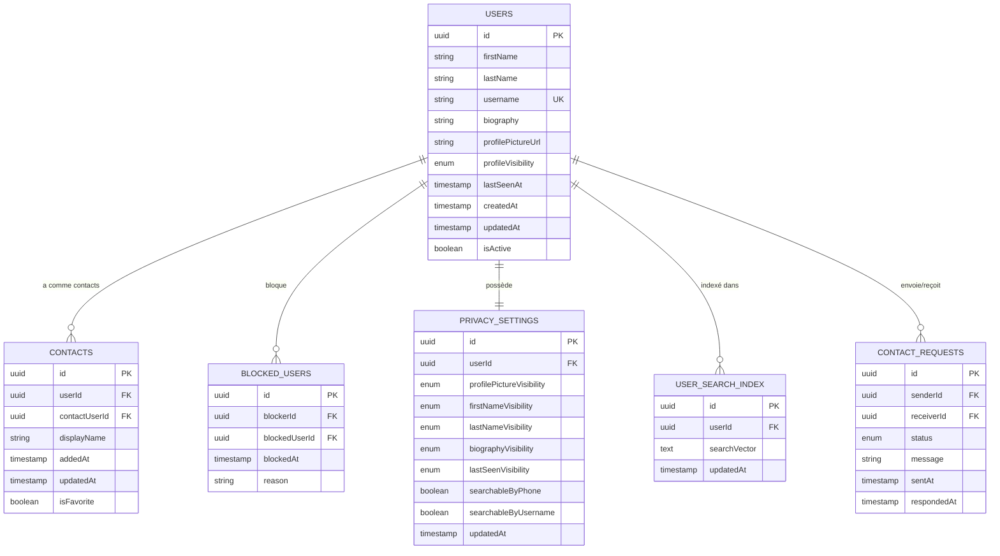
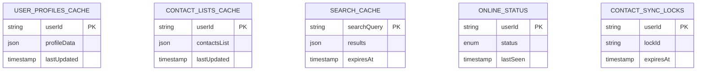
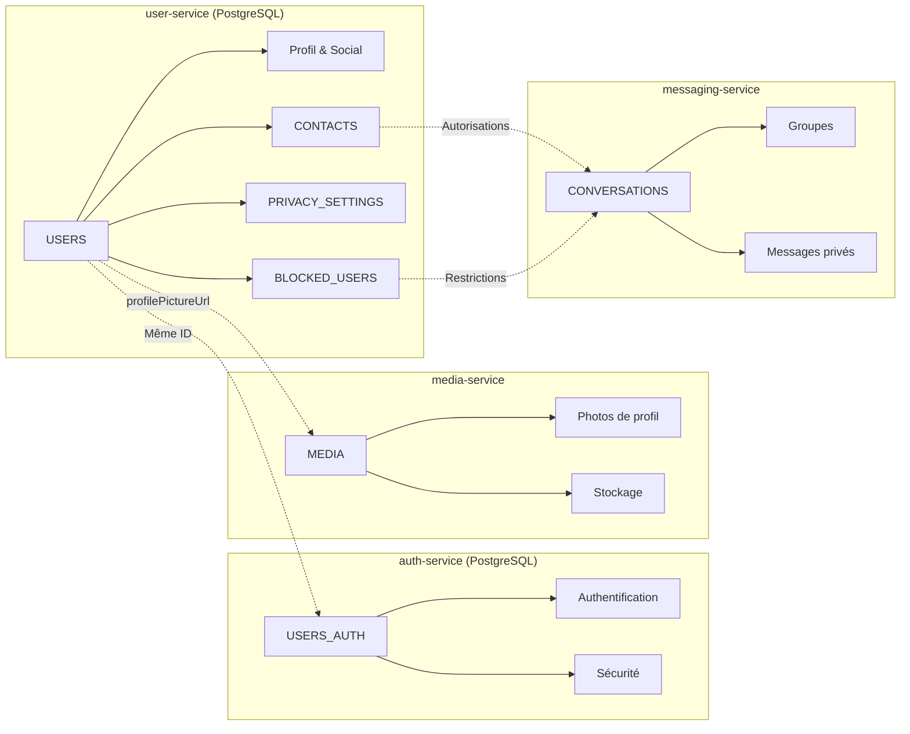
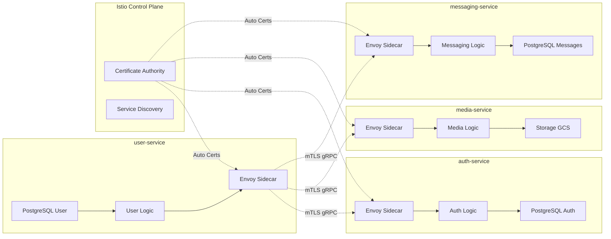
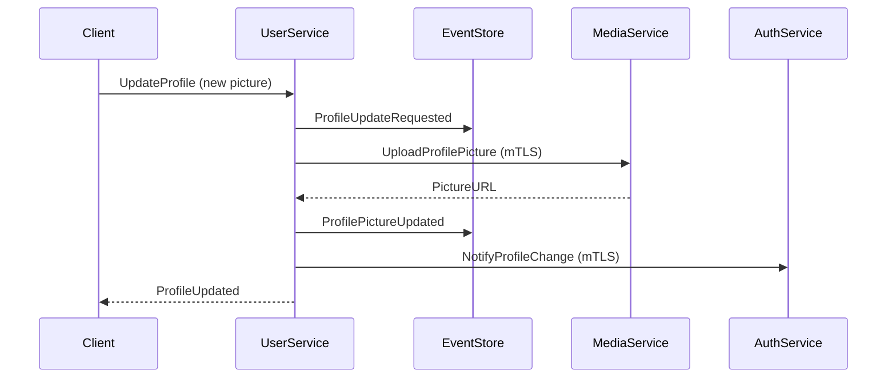
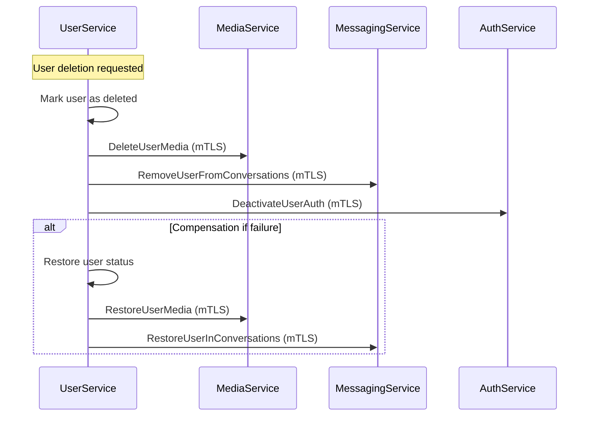

# User Service (`user-service`) - Conception de la Base de Données

## 0. Sommaire

- [1. Introduction et Principes de Conception](#1-introduction-et-principes-de-conception)
  - [1.1 Objectif](#11-objectif)
  - [1.2 Principes Architecturaux](#12-principes-architecturaux)
  - [1.3 Technologie](#13-technologie)
- [2. Schéma PostgreSQL du Service Utilisateur](#2-schéma-postgresql-du-service-utilisateur)
  - [2.1 Vue d'Ensemble](#21-vue-densemble)
  - [2.2 Description des Tables](#22-description-des-tables)
- [3. Données Temporaires dans Redis](#3-données-temporaires-dans-redis)
  - [3.1 Vue d'Ensemble](#31-vue-densemble)
  - [3.2 Description des Structures Redis](#32-description-des-structures-redis)
- [4. Relations avec les Autres Services](#4-relations-avec-les-autres-services)
  - [4.1 Démarcation des Responsabilités](#41-démarcation-des-responsabilités)
  - [4.2 Synchronisation des Données](#42-synchronisation-des-données)
- [5. Considérations de Sécurité](#5-considérations-de-sécurité)
  - [5.1 Protection des Données Personnelles](#51-protection-des-données-personnelles)
  - [5.2 Anonymisation et Pseudonymisation](#52-anonymisation-et-pseudonymisation)
  - [5.3 Audit et Logging](#53-audit-et-logging)
- [6. Considérations de Performance](#6-considérations-de-performance)
  - [6.1 Indexation](#61-indexation)
  - [6.2 Optimisations de Recherche](#62-optimisations-de-recherche)
  - [6.3 Optimisations Redis](#63-optimisations-redis)
- [7. Migrations et Évolution du Schéma](#7-migrations-et-évolution-du-schéma)
  - [7.1 Stratégie de Migration](#71-stratégie-de-migration)
  - [7.2 Gestion de l'Évolution des Données](#72-gestion-de-lévolution-des-données)
- [8. Scripts SQL d'Initialisation](#8-scripts-sql-dinitialisation)
  - [8.1 Création du Schéma PostgreSQL](#81-création-du-schéma-postgresql)
  - [8.2 Types Personnalisés](#82-types-personnalisés)
- [9. Communication Inter-Services avec Istio](#9-communication-inter-services-avec-istio)
  - [9.1 Architecture Service Mesh pour les Données](#91-architecture-service-mesh-pour-les-données)
  - [9.2 Événements et Synchronisation avec mTLS](#92-événements-et-synchronisation-avec-mtls)
  - [9.3 Gestion des Références Externes](#93-gestion-des-références-externes)

## 1. Introduction et Principes de Conception

### 1.1 Objectif
Ce document décrit la structure de la base de données du service utilisateur (user-service) de l'application Whispr, détaillant les modèles de données pour la gestion des profils, des contacts, des relations sociales et des paramètres de confidentialité.

### 1.2 Principes Architecturaux
- **Séparation des domaines**: Gestion autonome des données utilisateur distinctes de l'authentification
- **Flexibilité des relations sociales**: Support des différents types de relations entre utilisateurs
- **Confidentialité par conception**: Contrôle granulaire des paramètres de visibilité
- **Performance de recherche**: Optimisation pour les opérations de recherche d'utilisateurs et de contacts
- **Scalabilité sociale**: Architecture supportant la croissance du réseau social

### 1.3 Technologie
- **PostgreSQL**: Pour les données persistantes des profils et relations
- **Redis**: Pour le cache des profils, index de recherche et données temporaires
- **Full-Text Search**: Utilisation des capacités PostgreSQL pour la recherche textuelle

## 2. Schéma PostgreSQL du Service Utilisateur

### 2.1 Vue d'Ensemble



### 2.2 Description des Tables

#### 2.2.1 USERS
Stocke les informations de profil des utilisateurs.

| Colonne | Type | Description | Contraintes |
|---------|------|-------------|-------------|
| id | UUID | Identifiant unique (même que auth-service) | PK, NOT NULL |
| firstName | VARCHAR(100) | Prénom de l'utilisateur | NULL |
| lastName | VARCHAR(100) | Nom de famille de l'utilisateur | NULL |
| username | VARCHAR(50) | Nom d'utilisateur unique | UNIQUE, NULL |
| biography | TEXT | Description personnelle (max 500 chars) | NULL |
| profilePictureUrl | VARCHAR(255) | URL de la photo de profil | NULL |
| profileVisibility | profile_visibility_enum | Visibilité générale du profil | NOT NULL, DEFAULT 'contacts_only' |
| lastSeenAt | TIMESTAMP | Dernière activité visible | NULL |
| createdAt | TIMESTAMP | Date de création du profil | NOT NULL |
| updatedAt | TIMESTAMP | Dernière mise à jour | NOT NULL |
| isActive | BOOLEAN | Indique si le profil est actif | NOT NULL, DEFAULT TRUE |

**Indices**:
- PRIMARY KEY sur `id`
- UNIQUE sur `username`
- INDEX sur `username` pour les recherches
- INDEX sur `firstName, lastName` pour les recherches de nom
- INDEX sur `isActive` pour filtrer les comptes actifs

#### 2.2.2 CONTACTS
Gère les relations de contact entre utilisateurs.

| Colonne | Type | Description | Contraintes |
|---------|------|-------------|-------------|
| id | UUID | Identifiant unique de la relation | PK, NOT NULL |
| userId | UUID | Utilisateur propriétaire du contact | FK (USERS.id), NOT NULL |
| contactUserId | UUID | Utilisateur ajouté comme contact | FK (USERS.id), NOT NULL |
| displayName | VARCHAR(100) | Nom d'affichage personnalisé | NULL |
| addedAt | TIMESTAMP | Date d'ajout du contact | NOT NULL |
| updatedAt | TIMESTAMP | Dernière modification | NOT NULL |
| isFavorite | BOOLEAN | Contact marqué comme favori | NOT NULL, DEFAULT FALSE |

**Contraintes**:
- UNIQUE sur `(userId, contactUserId)` pour éviter les doublons
- CHECK pour empêcher l'auto-ajout (`userId != contactUserId`)

**Indices**:
- PRIMARY KEY sur `id`
- UNIQUE INDEX sur `(userId, contactUserId)`
- INDEX sur `userId` pour les requêtes de liste de contacts
- INDEX sur `contactUserId` pour les requêtes inverses

#### 2.2.3 BLOCKED_USERS
Gère les blocages entre utilisateurs.

| Colonne | Type | Description | Contraintes |
|---------|------|-------------|-------------|
| id | UUID | Identifiant unique du blocage | PK, NOT NULL |
| blockerId | UUID | Utilisateur qui effectue le blocage | FK (USERS.id), NOT NULL |
| blockedUserId | UUID | Utilisateur bloqué | FK (USERS.id), NOT NULL |
| blockedAt | TIMESTAMP | Date du blocage | NOT NULL |
| reason | VARCHAR(50) | Raison du blocage | NULL |

**Contraintes**:
- UNIQUE sur `(blockerId, blockedUserId)` pour éviter les doublons
- CHECK pour empêcher l'auto-blocage (`blockerId != blockedUserId`)

**Indices**:
- PRIMARY KEY sur `id`
- UNIQUE INDEX sur `(blockerId, blockedUserId)`
- INDEX sur `blockerId` pour vérifier les blocages sortants
- INDEX sur `blockedUserId` pour vérifier les blocages entrants

#### 2.2.4 PRIVACY_SETTINGS
Paramètres de confidentialité par utilisateur.

| Colonne | Type | Description | Contraintes |
|---------|------|-------------|-------------|
| id | UUID | Identifiant unique des paramètres | PK, NOT NULL |
| userId | UUID | Utilisateur propriétaire | FK (USERS.id), UNIQUE, NOT NULL |
| profilePictureVisibility | visibility_enum | Qui peut voir la photo de profil | NOT NULL, DEFAULT 'contacts_only' |
| firstNameVisibility | visibility_enum | Qui peut voir le prénom | NOT NULL, DEFAULT 'contacts_only' |
| lastNameVisibility | visibility_enum | Qui peut voir le nom | NOT NULL, DEFAULT 'contacts_only' |
| biographyVisibility | visibility_enum | Qui peut voir la biographie | NOT NULL, DEFAULT 'contacts_only' |
| lastSeenVisibility | visibility_enum | Qui peut voir la dernière connexion | NOT NULL, DEFAULT 'contacts_only' |
| searchableByPhone | BOOLEAN | Trouvable par numéro de téléphone | NOT NULL, DEFAULT TRUE |
| searchableByUsername | BOOLEAN | Trouvable par nom d'utilisateur | NOT NULL, DEFAULT TRUE |
| updatedAt | TIMESTAMP | Dernière mise à jour | NOT NULL |

**Indices**:
- PRIMARY KEY sur `id`
- UNIQUE INDEX sur `userId`

#### 2.2.5 USER_SEARCH_INDEX
Index de recherche optimisé pour les utilisateurs.

| Colonne | Type | Description | Contraintes |
|---------|------|-------------|-------------|
| id | UUID | Identifiant unique | PK, NOT NULL |
| userId | UUID | Utilisateur indexé | FK (USERS.id), UNIQUE, NOT NULL |
| searchVector | TSVECTOR | Vecteur de recherche full-text | NOT NULL |
| updatedAt | TIMESTAMP | Dernière mise à jour de l'index | NOT NULL |

**Indices**:
- PRIMARY KEY sur `id`
- UNIQUE INDEX sur `userId`
- GIN INDEX sur `searchVector` pour la recherche full-text

#### 2.2.6 CONTACT_REQUESTS
Gestion des demandes de contact.

| Colonne | Type | Description | Contraintes |
|---------|------|-------------|-------------|
| id | UUID | Identifiant unique de la demande | PK, NOT NULL |
| senderId | UUID | Utilisateur envoyant la demande | FK (USERS.id), NOT NULL |
| receiverId | UUID | Utilisateur recevant la demande | FK (USERS.id), NOT NULL |
| status | contact_request_status_enum | Statut de la demande | NOT NULL, DEFAULT 'pending' |
| message | TEXT | Message d'accompagnement | NULL |
| sentAt | TIMESTAMP | Date d'envoi | NOT NULL |
| respondedAt | TIMESTAMP | Date de réponse | NULL |

**Contraintes**:
- UNIQUE sur `(senderId, receiverId)` pour éviter les doublons
- CHECK pour empêcher l'auto-demande (`senderId != receiverId`)

**Indices**:
- PRIMARY KEY sur `id`
- UNIQUE INDEX sur `(senderId, receiverId)`
- INDEX sur `receiverId, status` pour les demandes en attente
- INDEX sur `sentAt` pour l'ordre chronologique

## 3. Données Temporaires dans Redis

### 3.1 Vue d'Ensemble

Redis est utilisé pour améliorer les performances et gérer les données temporaires :



### 3.2 Description des Structures Redis

#### 3.2.1 USER_PROFILES_CACHE
Cache des profils utilisateur pour un accès rapide.

**Clé**: `user:profile:{userId}`  
**Type**: Hash  
**TTL**: 30 minutes  
**Champs**:
- `firstName`: Prénom
- `lastName`: Nom de famille
- `username`: Nom d'utilisateur
- `biography`: Biographie
- `profilePictureUrl`: URL de la photo
- `lastUpdated`: Horodatage de dernière mise à jour

#### 3.2.2 CONTACT_LISTS_CACHE
Cache des listes de contacts pour éviter les requêtes répétées.

**Clé**: `user:contacts:{userId}`  
**Type**: List (JSON objects)  
**TTL**: 15 minutes  
**Structure**:
```json
[
  {
    "contactUserId": "uuid",
    "displayName": "string",
    "profilePicture": "url",
    "lastSeen": "timestamp",
    "isFavorite": boolean
  }
]
```

#### 3.2.3 SEARCH_CACHE
Cache des résultats de recherche.

**Clé**: `search:users:{query_hash}`  
**Type**: List (JSON objects)  
**TTL**: 10 minutes  
**Structure**:
```json
[
  {
    "userId": "uuid",
    "username": "string",
    "firstName": "string",
    "lastName": "string",
    "profilePicture": "url"
  }
]
```

#### 3.2.4 ONLINE_STATUS
Statut de connexion en temps réel.

**Clé**: `user:status:{userId}`  
**Type**: Hash  
**TTL**: 5 minutes (auto-renouvelé)  
**Champs**:
- `status`: online, away, offline
- `lastSeen`: Horodatage de dernière activité
- `deviceId`: Identifiant de l'appareil actif

#### 3.2.5 CONTACT_SYNC_LOCKS
Verrous pour éviter les modifications concurrentes.

**Clé**: `lock:contacts:{userId}`  
**Type**: String  
**TTL**: 30 secondes  
**Valeur**: Identifiant unique du verrou

## 4. Relations avec les Autres Services

### 4.1 Démarcation des Responsabilités



### 4.2 Synchronisation des Données

- **Création d'utilisateur**: Déclenchée par un événement du auth-service
- **Suppression d'utilisateur**: Propagation vers tous les services dépendants
- **Modification de photo**: Coordination avec le media-service
- **Blocages**: Impact sur les permissions dans messaging-service

## 5. Considérations de Sécurité

### 5.1 Protection des Données Personnelles

- **Minimisation des données**: Stockage uniquement des informations nécessaires
- **Consentement explicite**: Traçabilité des autorisations de visibilité
- **Droit à l'oubli**: Mécanismes d'effacement des données personnelles

### 5.2 Anonymisation et Pseudonymisation

- **Données sensibles**: Pas de stockage de données d'authentification
- **Logs d'audit**: Pseudonymisation des identifiants dans les logs
- **Recherche publique**: Contrôle strict de la visibilité des profils

### 5.3 Audit et Logging

- **Modifications de profil**: Historique des changements sensibles
- **Actions sociales**: Traçabilité des ajouts/suppressions de contacts
- **Accès aux données**: Logs des consultations de profils

## 6. Considérations de Performance

### 6.1 Indexation

- **Recherche textuelle**: Index GIN sur les vecteurs de recherche
- **Relations sociales**: Index composites sur les paires d'utilisateurs
- **Filtres de confidentialité**: Index sur les paramètres de visibilité

### 6.2 Optimisations de Recherche

- **Full-Text Search**: Utilisation de PostgreSQL ts_vector
- **Recherche phonétique**: Support des recherches approximatives
- **Index de popularité**: Classement des résultats par pertinence

### 6.3 Optimisations Redis

- **Cache intelligent**: Invalidation sélective des caches
- **Compression**: Compression des listes de contacts importantes
- **Partitionnement**: Distribution des données par hash d'utilisateur

## 7. Migrations et Évolution du Schéma

### 7.1 Stratégie de Migration

- **Migrations progressives**: Ajout de colonnes optionnelles avant remplissage
- **Compatibilité descendante**: Support des anciennes versions d'API
- **Rollback capability**: Possibilité de retour en arrière

### 7.2 Gestion de l'Évolution des Données

- **Nouveaux champs de profil**: Ajout dynamique sans interruption
- **Évolution des relations**: Migration des structures sociales
- **Paramètres de confidentialité**: Ajout de nouveaux contrôles

## 8. Scripts SQL d'Initialisation

### 8.1 Création du Schéma PostgreSQL

```sql
CREATE EXTENSION IF NOT EXISTS "uuid-ossp";
CREATE EXTENSION IF NOT EXISTS "pg_trgm";

-- Types énumérés
CREATE TYPE visibility_enum AS ENUM ('public', 'contacts_only', 'private');
CREATE TYPE profile_visibility_enum AS ENUM ('public', 'contacts_only', 'private');
CREATE TYPE contact_request_status_enum AS ENUM ('pending', 'accepted', 'declined', 'canceled');

-- Table des utilisateurs
CREATE TABLE users (
    id UUID PRIMARY KEY,
    first_name VARCHAR(100),
    last_name VARCHAR(100),
    username VARCHAR(50) UNIQUE,
    biography TEXT CHECK (char_length(biography) <= 500),
    profile_picture_url VARCHAR(255),
    profile_visibility profile_visibility_enum NOT NULL DEFAULT 'contacts_only',
    last_seen_at TIMESTAMP,
    created_at TIMESTAMP NOT NULL DEFAULT NOW(),
    updated_at TIMESTAMP NOT NULL DEFAULT NOW(),
    is_active BOOLEAN NOT NULL DEFAULT TRUE
);

-- Table des contacts
CREATE TABLE contacts (
    id UUID PRIMARY KEY DEFAULT uuid_generate_v4(),
    user_id UUID NOT NULL REFERENCES users(id) ON DELETE CASCADE,
    contact_user_id UUID NOT NULL REFERENCES users(id) ON DELETE CASCADE,
    display_name VARCHAR(100),
    added_at TIMESTAMP NOT NULL DEFAULT NOW(),
    updated_at TIMESTAMP NOT NULL DEFAULT NOW(),
    is_favorite BOOLEAN NOT NULL DEFAULT FALSE,
    UNIQUE(user_id, contact_user_id),
    CHECK (user_id != contact_user_id)
);

-- Table des utilisateurs bloqués
CREATE TABLE blocked_users (
    id UUID PRIMARY KEY DEFAULT uuid_generate_v4(),
    blocker_id UUID NOT NULL REFERENCES users(id) ON DELETE CASCADE,
    blocked_user_id UUID NOT NULL REFERENCES users(id) ON DELETE CASCADE,
    blocked_at TIMESTAMP NOT NULL DEFAULT NOW(),
    reason VARCHAR(50),
    UNIQUE(blocker_id, blocked_user_id),
    CHECK (blocker_id != blocked_user_id)
);

-- Table des paramètres de confidentialité
CREATE TABLE privacy_settings (
    id UUID PRIMARY KEY DEFAULT uuid_generate_v4(),
    user_id UUID NOT NULL UNIQUE REFERENCES users(id) ON DELETE CASCADE,
    profile_picture_visibility visibility_enum NOT NULL DEFAULT 'contacts_only',
    first_name_visibility visibility_enum NOT NULL DEFAULT 'contacts_only',
    last_name_visibility visibility_enum NOT NULL DEFAULT 'contacts_only',
    biography_visibility visibility_enum NOT NULL DEFAULT 'contacts_only',
    last_seen_visibility visibility_enum NOT NULL DEFAULT 'contacts_only',
    searchable_by_phone BOOLEAN NOT NULL DEFAULT TRUE,
    searchable_by_username BOOLEAN NOT NULL DEFAULT TRUE,
    updated_at TIMESTAMP NOT NULL DEFAULT NOW()
);

-- Table de l'index de recherche
CREATE TABLE user_search_index (
    id UUID PRIMARY KEY DEFAULT uuid_generate_v4(),
    user_id UUID NOT NULL UNIQUE REFERENCES users(id) ON DELETE CASCADE,
    search_vector TSVECTOR NOT NULL,
    updated_at TIMESTAMP NOT NULL DEFAULT NOW()
);

-- Table des demandes de contact
CREATE TABLE contact_requests (
    id UUID PRIMARY KEY DEFAULT uuid_generate_v4(),
    sender_id UUID NOT NULL REFERENCES users(id) ON DELETE CASCADE,
    receiver_id UUID NOT NULL REFERENCES users(id) ON DELETE CASCADE,
    status contact_request_status_enum NOT NULL DEFAULT 'pending',
    message TEXT,
    sent_at TIMESTAMP NOT NULL DEFAULT NOW(),
    responded_at TIMESTAMP,
    UNIQUE(sender_id, receiver_id),
    CHECK (sender_id != receiver_id)
);

-- Création des index
CREATE INDEX idx_users_username ON users(username);
CREATE INDEX idx_users_first_last_name ON users(first_name, last_name);
CREATE INDEX idx_users_is_active ON users(is_active);
CREATE INDEX idx_users_created_at ON users(created_at);

CREATE INDEX idx_contacts_user_id ON contacts(user_id);
CREATE INDEX idx_contacts_contact_user_id ON contacts(contact_user_id);
CREATE INDEX idx_contacts_is_favorite ON contacts(is_favorite);

CREATE INDEX idx_blocked_users_blocker_id ON blocked_users(blocker_id);
CREATE INDEX idx_blocked_users_blocked_user_id ON blocked_users(blocked_user_id);

CREATE INDEX idx_privacy_settings_user_id ON privacy_settings(user_id);

CREATE INDEX idx_contact_requests_receiver_status ON contact_requests(receiver_id, status);
CREATE INDEX idx_contact_requests_sent_at ON contact_requests(sent_at);

-- Index GIN pour la recherche full-text
CREATE INDEX idx_user_search_vector ON user_search_index USING gin(search_vector);

-- Index trigram pour la recherche approximative
CREATE INDEX idx_users_username_trgm ON users USING gin(username gin_trgm_ops);
CREATE INDEX idx_users_first_name_trgm ON users USING gin(first_name gin_trgm_ops);
CREATE INDEX idx_users_last_name_trgm ON users USING gin(last_name gin_trgm_ops);
```

### 8.2 Types Personnalisés

```sql
-- Fonction pour mettre à jour l'index de recherche
CREATE OR REPLACE FUNCTION update_user_search_index()
RETURNS TRIGGER AS $$
BEGIN
    INSERT INTO user_search_index (user_id, search_vector, updated_at)
    VALUES (
        NEW.id,
        to_tsvector('french', 
            COALESCE(NEW.first_name, '') || ' ' ||
            COALESCE(NEW.last_name, '') || ' ' ||
            COALESCE(NEW.username, '') || ' ' ||
            COALESCE(NEW.biography, '')
        ),
        NOW()
    )
    ON CONFLICT (user_id) DO UPDATE SET
        search_vector = to_tsvector('french',
            COALESCE(NEW.first_name, '') || ' ' ||
            COALESCE(NEW.last_name, '') || ' ' ||
            COALESCE(NEW.username, '') || ' ' ||
            COALESCE(NEW.biography, '')
        ),
        updated_at = NOW();
    
    RETURN NEW;
END;
$$ LANGUAGE plpgsql;

-- Trigger pour la mise à jour automatique de l'index
CREATE TRIGGER trigger_update_user_search_index
    AFTER INSERT OR UPDATE ON users
    FOR EACH ROW
    EXECUTE FUNCTION update_user_search_index();

-- Fonction pour créer les paramètres de confidentialité par défaut
CREATE OR REPLACE FUNCTION create_default_privacy_settings()
RETURNS TRIGGER AS $$
BEGIN
    INSERT INTO privacy_settings (user_id, updated_at)
    VALUES (NEW.id, NOW());
    
    RETURN NEW;
END;
$$ LANGUAGE plpgsql;

-- Trigger pour la création automatique des paramètres de confidentialité
CREATE TRIGGER trigger_create_default_privacy_settings
    AFTER INSERT ON users
    FOR EACH ROW
    EXECUTE FUNCTION create_default_privacy_settings();
```

## 9. Communication Inter-Services avec Istio

### 9.1 Architecture Service Mesh pour les Données

Le user-service communique sécurisement avec les autres services via Istio Service Mesh :



### 9.2 Événements et Synchronisation avec mTLS

#### 9.2.1 Communications Sécurisées
- **mTLS automatique** : Chiffrement et authentification automatiques des communications gRPC
- **Service Identity** : Identité cryptographique unique via SPIFFE/SPIRE
- **Certificate Rotation** : Rotation automatique des certificats par Istio CA
- **Zero Trust Network** : Aucune communication non chiffrée entre services

#### 9.2.2 Patterns de Communication de Données

**Synchronisation avec auth-service** :
```yaml
# AuthorizationPolicy pour recevoir les événements d'authentification
apiVersion: security.istio.io/v1beta1
kind: AuthorizationPolicy
metadata:
  name: auth-to-user-sync
  namespace: whispr
spec:
  selector:
    matchLabels:
      app: user-service
  rules:
  - from:
    - source:
        principals: ["cluster.local/ns/whispr/sa/auth-service"]
  - to:
    - operation:
        methods: ["POST", "PUT"]
        paths: ["/user.UserService/SyncUserData", "/user.UserService/UpdateUserStatus"]
```

**Communication avec media-service** :
```yaml
# AuthorizationPolicy pour la gestion des médias de profil
apiVersion: security.istio.io/v1beta1
kind: AuthorizationPolicy
metadata:
  name: user-to-media-profile
  namespace: whispr
spec:
  selector:
    matchLabels:
      app: media-service
  rules:
  - from:
    - source:
        principals: ["cluster.local/ns/whispr/sa/user-service"]
  - to:
    - operation:
        methods: ["POST", "PUT", "DELETE"]
        paths: ["/media.MediaService/UploadProfilePicture", "/media.MediaService/DeleteProfilePicture"]
```

**Integration avec messaging-service** :
```yaml
# AuthorizationPolicy pour la validation des contacts
apiVersion: security.istio.io/v1beta1
kind: AuthorizationPolicy
metadata:
  name: user-to-messaging-validation
  namespace: whispr
spec:
  selector:
    matchLabels:
      app: messaging-service
  rules:
  - from:
    - source:
        principals: ["cluster.local/ns/whispr/sa/user-service"]
  - to:
    - operation:
        methods: ["POST"]
        paths: ["/messaging.ValidationService/ValidateContact", "/messaging.ValidationService/CheckBlocking"]
```

### 9.3 Gestion des Références Externes

#### 9.3.1 Patterns de Consistance Distribuée

**Event Sourcing pour les changements de profil** :


**Saga Pattern pour la suppression d'utilisateur** :


#### 9.3.2 Gestion des Références Distribuées

**Validation des contacts avec blocages** :
- **Consistency Check** : Vérification des blocages avant ajout de contact
- **Cross-Service Validation** : Validation des permissions avec messaging-service
- **Eventual Consistency** : Propagation asynchrone des changements de blocage

**Synchronisation des photos de profil** :
- **URL References** : Stockage des URLs générées par media-service
- **Cache Invalidation** : Invalidation des caches lors des changements
- **Fallback Strategy** : Images par défaut en cas d'indisponibilité

#### 9.3.3 Monitoring et Observabilité

**Métriques de cohérence des données** :
- **Cross-Service Data Consistency** : Suivi de la cohérence des références
- **Profile Sync Success Rate** : Taux de succès des synchronisations de profil
- **Contact Validation Latency** : Latence des validations de contact
- **Media Reference Integrity** : Intégrité des références vers media-service

**Alertes de santé des relations** :
- **Orphaned Profile Pictures** : Photos de profil sans référence valide
- **Inconsistent Contact States** : États incohérents entre services
- **Failed Cross-Service Calls** : Échecs de communication inter-services
- **Data Drift Detection** : Détection de dérive des données distribuées

**Distributed Tracing pour les opérations sociales** :
- **Contact Addition Flow** : Traçage complet de l'ajout de contact
- **Profile Update Propagation** : Suivi de la propagation des mises à jour
- **Blocking Impact Analysis** : Analyse de l'impact des blocages
- **Search Performance Tracking** : Performance des recherches distribuées