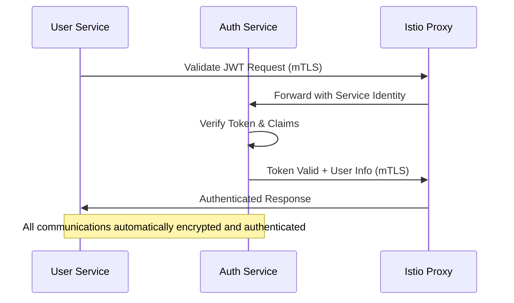
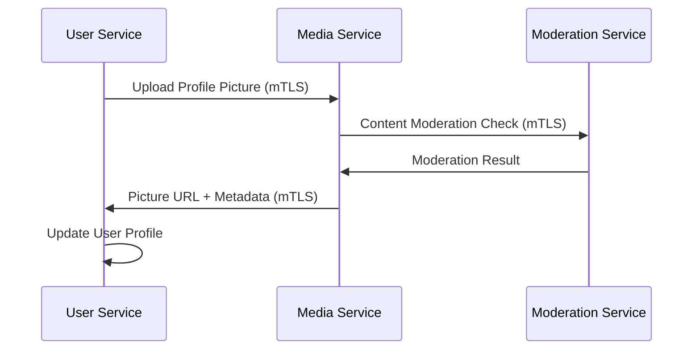

# User Service (`user-service`) - Politique de sécurité

## 0. Sommaire

- [1. Introduction](#1-introduction)
  - [1.1 Objectif du Document](#11-objectif-du-document)
  - [1.2 Contexte et Importance](#12-contexte-et-importance)
  - [1.3 Principes Fondamentaux](#13-principes-fondamentaux)
- [2. Gestion des Identités et des Accès](#2-gestion-des-identités-et-des-accès)
  - [2.1 Authentification et Autorisation](#21-authentification-et-autorisation)
  - [2.2 Contrôle d'Accès aux Profils](#22-contrôle-daccès-aux-profils)
  - [2.3 Gestion des Relations Sociales](#23-gestion-des-relations-sociales)
- [3. Chiffrement et Protection des Données](#3-chiffrement-et-protection-des-données)
  - [3.1 Chiffrement au Repos](#31-chiffrement-au-repos)
  - [3.2 Chiffrement en Transit](#32-chiffrement-en-transit)
  - [3.3 Classification et Anonymisation des Données](#33-classification-et-anonymisation-des-données)
- [4. Protection Contre les Menaces](#4-protection-contre-les-menaces)
  - [4.1 Contrôle des Accès et Rate Limiting](#41-contrôle-des-accès-et-rate-limiting)
  - [4.2 Protection Contre les Attaques Courantes](#42-protection-contre-les-attaques-courantes)
  - [4.3 Sécurité des Contenus et Médias](#43-sécurité-des-contenus-et-médias)
- [5. Gestion des Secrets](#5-gestion-des-secrets)
  - [5.1 Sécurisation des Secrets d'Application](#51-sécurisation-des-secrets-dapplication)
  - [5.2 Gestion des Tokens et Clés](#52-gestion-des-tokens-et-clés)
- [6. Détection et Réponse aux Incidents](#6-détection-et-réponse-aux-incidents)
  - [6.1 Journalisation et Surveillance](#61-journalisation-et-surveillance)
  - [6.2 Gestion des Incidents](#62-gestion-des-incidents)
- [7. Sécurité du Développement](#7-sécurité-du-développement)
  - [7.1 Pratiques de Développement Sécurisé](#71-pratiques-de-développement-sécurisé)
  - [7.2 Gestion des Dépendances](#72-gestion-des-dépendances)
- [8. Standards de Sécurité](#8-standards-de-sécurité)
  - [8.1 Normes et Bonnes Pratiques](#81-normes-et-bonnes-pratiques)
  - [8.2 Tests de Sécurité](#82-tests-de-sécurité)
- [9. Sauvegarde et Récupération](#9-sauvegarde-et-récupération)
  - [9.1 Protection et Sauvegarde des Données](#91-protection-et-sauvegarde-des-données)
  - [9.2 Gestion des Suppressions et Récupération](#92-gestion-des-suppressions-et-récupération)
- [10. Communication Inter-Services avec Istio](#10-communication-inter-services-avec-istio)
  - [10.1 Architecture Service Mesh](#101-architecture-service-mesh)
  - [10.2 Sécurité des Communications](#102-sécurité-des-communications)
  - [10.3 Intégration Sécurisée avec les Autres Services](#103-intégration-sécurisée-avec-les-autres-services)
- [11. Documentation](#11-documentation)
  - [11.1 Documentation de Sécurité](#111-documentation-de-sécurité)
  - [11.2 Documentation Utilisateur](#112-documentation-utilisateur)
- [Annexes](#annexes)
  - [A. Matrice des Risques et Contrôles](#a-matrice-des-risques-et-contrôles)
  - [B. Métriques de Sécurité](#b-métriques-de-sécurité)
  - [C. Références](#c-références)

## 1. Introduction

### 1.1 Objectif du Document
Cette politique de sécurité définit les mesures techniques et pratiques à implémenter pour protéger le service utilisateur (User Service) de l'application Whispr dans le cadre de notre projet de fin d'études.

### 1.2 Contexte et Importance
Le service utilisateur gère les informations de profil, les relations sociales entre utilisateurs, les paramètres de confidentialité et les groupes de conversation. Il détient des données personnelles sensibles et constitue un élément essentiel de l'expérience sociale de l'application.

### 1.3 Principes Fondamentaux
- **Confidentialité par défaut**: Protection des informations personnelles par défaut
- **Contrôle utilisateur**: Permettre aux utilisateurs de contrôler la visibilité de leurs données
- **Séparation des préoccupations**: Isoler les différentes fonctionnalités du service
- **Sécurité par conception**: Intégration des considérations de sécurité dès la conception
- **Mise en œuvre réaliste**: Implémentation adaptée à nos contraintes de projet

## 2. Gestion des Identités et des Accès

### 2.1 Authentification et Autorisation

#### 2.1.1 Validation des Tokens
- Vérification cryptographique des JWT émis par `auth-service`
- Cache local des clés publiques de vérification avec TTL de 1 heure
- Vérification des claims spécifiques (scope, exp, aud, etc.)
- Rejet immédiat des tokens invalides ou expirés
- Support de la rotation des clés de signature JWT

#### 2.1.2 Contrôle d'Accès par Ressource
- Authentification obligatoire pour toute requête API
- Vérification des permissions basée sur les rôles et relations
- Contrôle d'accès granulaire par ressource (profil, contact, groupe)
- Validation croisée avec le service d'authentification pour les opérations sensibles

#### 2.1.3 Gestion des Sessions Distribuées
- Intégration avec le système de sessions du auth-service
- Vérification de la validité des sessions pour les opérations sensibles
- Support de la révocation de sessions en cascade
- Synchronisation des états de session entre services

### 2.2 Contrôle d'Accès aux Profils

#### 2.2.1 Modèle de Confidentialité
- Trois niveaux d'accès configurables pour chaque attribut du profil :
  - **Public (everyone)** : visible par tous les utilisateurs authentifiés
  - **Contacts (contacts_only)** : visible uniquement par les contacts validés
  - **Privé (private)** : visible uniquement par l'utilisateur lui-même
- Paramètres par défaut sécurisés :
  - Photo de profil : contacts_only
  - Prénom : contacts_only
  - Nom de famille : contacts_only
  - Biographie : contacts_only
  - Dernière connexion : contacts_only
  - Nom d'utilisateur : public (si défini)

#### 2.2.2 Vérification des Autorisations
- Vérification systématique des paramètres de confidentialité avant exposition des données
- Cache sécurisé des paramètres de confidentialité (TTL: 15 minutes)
- Validation côté serveur obligatoire pour toutes les requêtes d'accès aux données
- Masquage automatique des données des utilisateurs bloqués
- Audit trail pour les accès aux profils sensibles

#### 2.2.3 Protection de la Vie Privée
- Contrôle de la visibilité dans les résultats de recherche
- Options de découvrabilité par numéro de téléphone ou nom d'utilisateur
- Masquage du statut en ligne selon les préférences
- Protection contre l'énumération des utilisateurs

### 2.3 Gestion des Relations Sociales

#### 2.3.1 Contacts et Blocages
- Vérification mutuelle avant établissement d'une relation de contact
- Invisibilité réciproque stricte en cas de blocage (bidirectionnel)
- Propagation automatique des restrictions d'accès après blocage
- Validation des permissions avant toute interaction sociale
- Délai de grâce configurable pour les tentatives répétées d'ajout (24h par défaut)

#### 2.3.2 Protection contre le Harcèlement
- Limites strictes sur le nombre de demandes de contact par période (5/jour)
- Rate limiting progressif en cas de comportement suspect
- Mécanisme de signalement intégré pour comportements inappropriés
- Auto-restriction temporaire des comptes signalés multiple fois
- Possibilité de masquer complètement sa présence dans les recherches

#### 2.3.3 Gestion des Groupes Sécurisée
- Validation des droits d'administration pour toute action de gestion
- Séparation claire des rôles avec permissions granulaires :
  - **Admin** : toutes les permissions
  - **Moderator** : gestion des membres et du contenu
  - **Member** : participation standard
- Vérification obligatoire des blocages entre utilisateurs avant ajout à un groupe
- Protection contre l'ajout non-consensuel à des groupes
- Audit des actions administratives dans les groupes

## 3. Chiffrement et Protection des Données

### 3.1 Chiffrement au Repos

#### 3.1.1 Données Sensibles dans PostgreSQL
- Chiffrement transparent de la base de données PostgreSQL au niveau du stockage
- Pseudonymisation des numéros de téléphone dans les index de recherche
- Utilisation du chiffrement au niveau colonne pour les données hautement sensibles :
  - Informations de contact (numéros de téléphone hachés)
  - Métadonnées sensibles de profil
- Clés de chiffrement stockées séparément de la base de données

#### 3.1.2 Cache et Données Temporaires
- TTL strict sur toutes les données en cache Redis (max 30 minutes pour les données sensibles)
- Chiffrement des données sensibles stockées en cache
- Invalidation proactive du cache lors des mises à jour critiques
- Aucun stockage des listes de blocage en clair dans Redis
- Hachage des clés de cache contenant des identifiants utilisateur

#### 3.1.3 Index de Recherche Sécurisé
- Utilisation de vecteurs de recherche PostgreSQL pour éviter l'exposition des données brutes
- Tokenisation des termes de recherche pour limiter l'exposition
- Séparation des index publics et privés selon les paramètres de confidentialité
- Anonymisation des données dans les index statistiques

### 3.2 Chiffrement en Transit

#### 3.2.1 Communications Externes
- TLS 1.3 obligatoire pour toutes les communications API
- Configuration stricte des suites de chiffrement sécurisées
- Certificats Let's Encrypt pour la production, auto-signés pour le développement
- Headers de sécurité HTTP configurés :
  - HSTS avec includeSubdomains
  - X-Content-Type-Options: nosniff
  - X-Frame-Options: DENY
  - Referrer-Policy: strict-origin-when-cross-origin

#### 3.2.2 Communications Inter-Services avec Istio
- **mTLS automatique** : Chiffrement et authentification mutuelle automatique
- **Certificate Management** : Rotation automatique des certificats par Istio CA
- **Service Identity** : Identités SPIFFE/SPIRE pour chaque service
- **Network Policies** : Isolation réseau stricte entre les namespaces
- **Zero Trust Architecture** : Aucune communication non chiffrée autorisée

### 3.3 Classification et Anonymisation des Données

#### 3.3.1 Classification des Données
- **Hautement sensibles** : Numéros de téléphone, paramètres de confidentialité, listes de blocage
- **Modérément sensibles** : Informations de profil, listes de contacts, appartenance aux groupes
- **Publiques** : Identifiants techniques, métadonnées non-personnelles
- **Logs et analytics** : Données pseudonymisées uniquement

#### 3.3.2 Techniques d'Anonymisation
- Pseudonymisation des identifiants dans les logs d'audit
- Hachage irréversible des données sensibles pour l'analytics
- Suppression automatique des données après expiration
- Agrégation des données pour l'analyse statistique

## 4. Protection Contre les Menaces

### 4.1 Contrôle des Accès et Rate Limiting

#### 4.1.1 Limitation de Débit Granulaire
- **Lecture de profils** : 300 requêtes/minute par utilisateur
- **Modifications de profil** : 60 requêtes/minute par utilisateur
- **Recherches d'utilisateurs** : 20 requêtes/minute par utilisateur
- **Actions de groupe** : 30 requêtes/minute par utilisateur
- **Demandes de contact** : 5 requêtes/heure par utilisateur
- Délai progressif après dépassement des limites (exponential backoff)

#### 4.1.2 Détection des Comportements Anormaux
- Surveillance des patterns d'accès suspects :
  - Accès massif aux profils en peu de temps
  - Tentatives répétées de contact après refus
  - Modifications fréquentes des paramètres de confidentialité
  - Création/suppression excessive de groupes
- Scoring automatique des comportements risqués
- Restrictions temporaires automatiques pour les comptes suspects

### 4.2 Protection Contre les Attaques Courantes

#### 4.2.1 Injection et Validation des Données
- Validation stricte avec class-validator pour tous les endpoints
- Utilisation exclusive de TypeORM avec requêtes paramétrées
- Sanitisation des entrées utilisateur pour les champs texte libre :
  - Biographies (max 500 caractères, filtrage HTML)
  - Noms de groupes (max 100 caractères, caractères spéciaux limités)
  - Noms d'affichage personnalisés (max 100 caractères)
- Échappement systématique des caractères spéciaux
- Validation des formats (emails, URLs, etc.)

#### 4.2.2 Protection Contre l'Énumération
- Pagination obligatoire pour tous les endpoints de liste
- Randomisation des identifiants exposés quand possible
- Réponses uniformes pour les ressources inexistantes ou interdites
- Limitation des informations dans les messages d'erreur
- Protection contre les timing attacks dans les recherches

#### 4.2.3 Prévention des Attaques IDOR
- Vérification systématique des autorisations avant accès aux ressources
- Utilisation d'identifiants non-prédictibles (UUID)
- Validation croisée des permissions pour les ressources liées
- Journalisation des tentatives d'accès non autorisé
- Tests automatisés des contrôles d'autorisation

### 4.3 Sécurité des Contenus et Médias

#### 4.3.1 Validation des Médias
- Validation stricte du type MIME des fichiers uploadés
- Restriction aux formats image sécurisés (JPEG, PNG, WebP)
- Limitation de taille des fichiers (max 5 MB pour les images de profil)
- Scan antivirus des fichiers uploadés (intégration avec media-service)
- Génération de thumbnails sécurisés

#### 4.3.2 Modération du Contenu
- Filtrage automatique du contenu textuel inapproprié
- Intégration avec moderation-service pour l'analyse des images
- Détection de contenu sensible ou violent
- Système de signalement utilisateur intégré
- Procédure de contestation des décisions de modération

#### 4.3.3 Protection Contre les Liens Malveillants
- Validation et assainissement des URLs dans les profils
- Vérification des domaines contre une liste noire
- Scan des liens pour détecter les contenus malveillants
- Avertissement utilisateur pour les liens externes

## 5. Gestion des Secrets

### 5.1 Sécurisation des Secrets d'Application

#### 5.1.1 Stockage et Organisation des Secrets
- Utilisation exclusive des variables d'environnement pour les secrets
- Séparation claire des secrets par environnement (dev, staging, prod)
- Stockage sécurisé via Docker secrets en production
- Configuration via dotenv avec fichiers .env distincts par environnement
- Exclusion stricte des fichiers de secrets du versionnement Git

#### 5.1.2 Types de Secrets Gérés
- Clés de signature JWT pour la validation des tokens
- Secrets de communication inter-services (API keys)
- Clés de chiffrement pour les données sensibles
- Credentials de base de données PostgreSQL et Redis
- Tokens d'accès aux services externes (media-service, moderation-service)

#### 5.1.3 Rotation et Gestion du Cycle de Vie
- Procédure documentée de rotation des clés de validation JWT
- Rotation mensuelle des secrets de communication inter-services
- Conservation des clés précédentes pendant 48h lors des rotations
- Invalidation automatique des anciens secrets après transition
- Audit trail de toutes les opérations de gestion des secrets

### 5.2 Gestion des Tokens et Clés

#### 5.2.1 Validation des Tokens JWT
- Cache sécurisé des clés publiques de validation (TTL: 1h)
- Validation de la signature, expiration et claims obligatoires
- Support de multiple issuers pour la scalabilité
- Révocation distribuée via Redis blacklist
- Métriques de performance pour la validation des tokens

#### 5.2.2 Sécurisation des Communications
- Tokens d'API uniques pour chaque service externe
- Authentification mutuelle avec auth-service via certificats
- Clés de session temporaires pour les opérations batch
- Chiffrement des communications sensibles avec media-service

## 6. Détection et Réponse aux Incidents

### 6.1 Journalisation et Surveillance

#### 6.1.1 Journalisation Sécurisée Structurée
- Format JSON structuré via NestJS Logger pour tous les événements de sécurité :
  ```json
  {
    "timestamp": "2025-06-10T15:30:00.000Z",
    "level": "SECURITY",
    "userId": "uuid-hash",
    "action": "profile_access",
    "resource": "user_profile",
    "source_ip": "192.168.1.100",
    "user_agent": "mobile_app_v1.0",
    "result": "allowed|denied",
    "details": {}
  }
  ```

#### 6.1.2 Événements de Sécurité Surveillés
- **Accès et modifications de profil** : Changements sensibles, accès massifs
- **Relations sociales** : Ajouts/suppressions de contacts, blocages, déblocages
- **Gestion de groupes** : Créations, modifications de rôles, suppressions
- **Paramètres de confidentialité** : Modifications des niveaux de visibilité
- **Tentatives d'accès non autorisé** : Échecs d'autorisation, token invalides
- **Comportements suspects** : Patterns anormaux d'utilisation

#### 6.1.3 Expurgation et Protection des Logs
- Masquage automatique des données sensibles (numéros, emails)
- Hachage des identifiants utilisateur dans les logs
- Rétention différenciée : 30 jours pour les logs normaux, 90 jours pour les incidents
- Chiffrement des logs archivés
- Intégrité cryptographique des logs critiques

#### 6.1.4 Surveillance et Métriques
- **Métriques Prometheus** pour les indicateurs de sécurité :
  - Taux de tentatives d'accès non autorisé
  - Nombre de blocages par période
  - Fréquence des modifications de paramètres sensibles
  - Latence des vérifications d'autorisation
- **Alertes automatiques** configurées via Grafana :
  - Spike d'activité suspect sur un compte
  - Taux élevé d'échecs d'autorisation
  - Comportements de masse (ajouts/suppressions)
  - Anomalies dans les patterns d'utilisation

### 6.2 Gestion des Incidents

#### 6.2.1 Classification et Priorisation
- **Critique (P0)** : Divulgation massive de données personnelles, compromission du service
- **Élevé (P1)** : Contournement des contrôles d'accès, accès non autorisé aux données
- **Moyen (P2)** : Abus des fonctionnalités, comportements de harcèlement détectés
- **Faible (P3)** : Anomalies mineures, tentatives d'accès isolées

#### 6.2.2 Procédures de Réponse par Niveau
- **P0/P1** : Escalade immédiate, investigation technique, notification des parties prenantes
- **P2** : Investigation dans les 2h, mesures correctives temporaires
- **P3** : Investigation dans les 24h, suivi de routine

#### 6.2.3 Mesures de Confinement
- Suspension temporaire des comptes compromis
- Restriction d'accès aux fonctionnalités sensibles
- Invalidation des sessions et tokens associés
- Activation du mode de protection renforcé
- Communication coordonnée avec les autres services

#### 6.2.4 Analyse Post-Incident
- Documentation détaillée de l'incident et de sa résolution
- Identification des causes racines et mesures préventives
- Mise à jour des procédures et contrôles de sécurité
- Formation de l'équipe sur les leçons apprises
- Tests de régression pour éviter la récurrence

## 7. Sécurité du Développement

### 7.1 Pratiques de Développement Sécurisé

#### 7.1.1 Principes de Code Sécurisé
- Application rigoureuse des principes OWASP Top 10 API Security
- Utilisation systématique des fonctionnalités de sécurité NestJS :
  - Guards pour l'authentification et autorisation
  - Interceptors pour la validation et logging
  - Pipes pour la transformation et validation des données
  - Filters pour la gestion sécurisée des exceptions
- Architecture défensive avec validation à tous les niveaux
- Principe du moindre privilège dans les permissions de code

#### 7.1.2 Patterns de Sécurité Standardisés
- **Authorization Pattern** : Décorateurs standardisés pour les contrôles d'accès
- **Input Validation Pattern** : DTOs avec validation stricte pour tous les endpoints
- **Error Handling Pattern** : Gestion uniforme des erreurs sans fuite d'information
- **Logging Pattern** : Journalisation sécurisée standardisée
- **Rate Limiting Pattern** : Application cohérente des limites de débit

#### 7.1.3 Revue de Code et Qualité
- **Revue de sécurité obligatoire** pour :
  - Toutes les fonctionnalités d'authentification/autorisation
  - Endpoints manipulant des données sensibles
  - Intégrations avec services externes
  - Modifications des paramètres de sécurité
- **Checklists de sécurité** intégrées au processus de revue
- **Tests de sécurité automatisés** dans la pipeline CI/CD
- **Analyse statique** avec ESLint et règles de sécurité personnalisées

### 7.2 Gestion des Dépendances

#### 7.2.1 Politique de Sélection des Dépendances
- Évaluation de sécurité préalable pour toute nouvelle dépendance :
  - Historique de vulnérabilités de la librairie
  - Fréquence des mises à jour et support de la communauté
  - Évaluation de la surface d'attaque ajoutée
  - Alternatives plus sécurisées disponibles
- Préférence pour les librairies maintenues activement (< 6 mois depuis dernière MAJ)
- Limitation des dépendances au strict nécessaire

#### 7.2.2 Maintenance et Surveillance
- **Audit automatique quotidien** avec `npm audit` et `yarn audit`
- **Mise à jour automatisée** des dépendances mineures et patches de sécurité
- **Évaluation manuelle** pour les mises à jour majeures
- **Tests de régression complets** après mises à jour critiques
- **Documentation des dépendances critiques** avec justification et alternatives

#### 7.2.3 Réponse aux Vulnérabilités
- **Processus d'urgence** pour les vulnérabilités critiques (< 24h)
- **Évaluation d'impact** pour déterminer l'exposition réelle
- **Plan de contingence** avec versions de fallback testées
- **Communication proactive** des impacts potentiels

## 8. Standards de Sécurité

### 8.1 Normes et Bonnes Pratiques

#### 8.1.1 Conformité aux Standards Internationaux
- **OWASP Top 10 (2021)** : Application complète des recommandations
- **OWASP API Security Top 10** : Focus sur la sécurité des APIs REST
- **NIST Cybersecurity Framework** : Structure de gouvernance de la sécurité
- **ISO 27001 principles** : Gestion de la sécurité de l'information appliquée au contexte
- **CIS Controls** : Contrôles de sécurité prioritaires implémentés

#### 8.1.2 Bonnes Pratiques Spécifiques NestJS
- Configuration sécurisée des middlewares (helmet, cors, etc.)
- Utilisation appropriée des décorateurs de sécurité
- Patterns d'architecture sécurisée (Guards, Interceptors, Filters)
- Configuration sécurisée de TypeORM (query parameterization, etc.)
- Intégration sécurisée avec Redis pour le cache

#### 8.1.3 Protection des Données Personnelles (RGPD-inspired)
- **Minimisation des données** : Collecte limitée au nécessaire fonctionnel
- **Finalité claire** : Usage défini et documenté pour chaque donnée
- **Exactitude et mise à jour** : Processus de correction des données erronées
- **Limitation de conservation** : Purge automatique des données expirées
- **Intégrité et confidentialité** : Chiffrement et contrôles d'accès appropriés
- **Accountability** : Documentation des décisions et processus

### 8.2 Tests de Sécurité

#### 8.2.1 Tests Automatisés de Sécurité
- **Tests unitaires de sécurité** pour tous les contrôles d'autorisation :
  ```typescript
  describe('Profile Access Control', () => {
    it('should deny access to private profile data', async () => {
      // Test d'accès non autorisé
    });
    it('should respect visibility settings', async () => {
      // Test des paramètres de confidentialité
    });
  });
  ```
- **Tests d'intégration des permissions** pour les scénarios complexes
- **Tests de charge de sécurité** pour vérifier la robustesse des contrôles
- **Tests de régression** pour les correctifs de sécurité

#### 8.2.2 Tests Manuels et Pénétration
- **Tests d'autorisation manuels** sur les endpoints critiques
- **Tests d'injection** (SQL, NoSQL, XSS, etc.)
- **Tests de contournement d'authentification**
- **Tests d'énumération et de fuite d'information**
- **Tests de manipulation de requêtes** (parameter pollution, etc.)

#### 8.2.3 Outils d'Analyse de Sécurité
- **SAST (Static Application Security Testing)** :
  - ESLint avec règles de sécurité personnalisées
  - SonarQube pour l'analyse de qualité et sécurité
  - Semgrep pour la détection de patterns de sécurité
- **DAST (Dynamic Application Security Testing)** :
  - OWASP ZAP pour les tests de vulnérabilités web
  - Tests d'API avec Postman/Newman
- **Dependency Scanning** :
  - npm audit / yarn audit
  - Snyk pour l'analyse des dépendances
  - GitHub Dependabot pour les alertes automatiques

#### 8.2.4 Métriques de Qualité Sécuritaire
- **Couverture des tests de sécurité** : > 90% des fonctionnalités critiques
- **Délai de correction des vulnérabilités** : < 7 jours pour les critiques
- **Taux de faux positifs** : < 10% des alertes de sécurité
- **Temps de détection des incidents** : < 30 minutes pour les patterns connus

## 9. Sauvegarde et Récupération

### 9.1 Protection et Sauvegarde des Données

#### 9.1.1 Stratégie de Sauvegarde Multi-Niveaux
- **Sauvegardes complètes automatisées** de PostgreSQL via pg_dump :
  - Quotidiennes à 02:00 UTC avec chiffrement AES-256
  - Conservation : 7 jours locaux + 30 jours archivés
  - Vérification d'intégrité automatique post-sauvegarde
- **Sauvegardes incrémentales** pour les données critiques (profils, relations) :
  - Toutes les 4 heures pendant les heures d'activité
  - Utilisation de WAL-E pour PostgreSQL
- **Réplication streaming** vers un serveur secondaire pour la haute disponibilité

#### 9.1.2 Sécurisation des Sauvegardes
- **Chiffrement des sauvegardes** avec clés distinctes de la production
- **Stockage sécurisé** dans des environnements isolés
- **Tests de restauration mensuels** pour valider l'intégrité
- **Accès restreint** aux sauvegardes avec audit trail
- **Retention policies** automatisées avec suppression sécurisée

#### 9.1.3 Objectifs de Récupération
- **RPO (Recovery Point Objective)** : Maximum 1 heure de perte de données
- **RTO (Recovery Time Objective)** : Reprise sous 2 heures pour le service complet
- **Disponibilité cible** : 99.9% (environ 8h d'indisponibilité/an)
- **Priorisation des données** : Profils > Relations > Groupes > Cache

### 9.2 Gestion des Suppressions et Récupération

#### 9.2.1 Processus de Suppression Sécurisée
- **Suppression en deux phases** pour les comptes utilisateur :
  1. Soft delete avec marquage `isActive: false` (période de grâce 30 jours)
  2. Hard delete avec purge complète des données personnelles
- **Anonymisation progressive** :
  - J+0 : Désactivation du compte et masquage dans les recherches
  - J+7 : Anonymisation des données dans les groupes publics
  - J+30 : Suppression définitive de toutes les données personnelles

#### 9.2.2 Suppression Coordonnée Inter-Services
- **Cascade de suppression** automatique vers :
  - auth-service : Invalidation des sessions et clés cryptographiques
  - media-service : Suppression des médias de profil et contenu
  - messaging-service : Anonymisation des messages historiques
  - notification-service : Suppression des tokens et préférences
- **Vérification de cohérence** post-suppression
- **Journalisation complète** des opérations de suppression pour compliance

#### 9.2.3 Récupération d'Urgence et Continuité
- **Plan de reprise d'activité** documenté et testé trimestriellement
- **Basculement automatique** vers serveur de secours si disponible
- **Procédures de récupération graduelles** :
  1. Services critiques (authentification, profils de base)
  2. Services sociaux (contacts, recherche)
  3. Services avancés (groupes, paramètres détaillés)
- **Communication utilisateur** automatisée en cas d'incident majeur

## 10. Communication Inter-Services avec Istio

### 10.1 Architecture Service Mesh

#### 10.1.1 Configuration Istio pour User Service
```yaml
# Service de base
apiVersion: v1
kind: Service
metadata:
  name: user-service
  namespace: whispr
  labels:
    app: user-service
spec:
  selector:
    app: user-service
  ports:
  - port: 3000
    name: http
---
# Configuration mTLS strict
apiVersion: security.istio.io/v1beta1
kind: PeerAuthentication
metadata:
  name: user-service-mtls
  namespace: whispr
spec:
  selector:
    matchLabels:
      app: user-service
  mtls:
    mode: STRICT
```

#### 10.1.2 Sidecar Envoy et Injection Automatique
- **Injection automatique** du sidecar Envoy dans tous les pods user-service
- **Configuration Envoy** optimisée pour les communications API fréquentes
- **Metrics et tracing** automatiques de toutes les communications
- **Circuit breakers** configurés pour la résilience inter-services

#### 10.1.3 Service Discovery et Load Balancing
- **Découverte automatique** des instances de services via Istio
- **Load balancing intelligent** avec session affinity si nécessaire
- **Health checks** intégrés pour les instances de service
- **Graceful shutdown** coordonné lors des déploiements

### 10.2 Sécurité des Communications

#### 10.2.1 mTLS Automatique et Gestion des Certificats
- **Chiffrement automatique** de toutes les communications inter-services
- **Authentification mutuelle** basée sur les identités SPIFFE/SPIRE
- **Rotation automatique** des certificats (24h par défaut)
- **Validation stricte** des identités de service avant autorisation
- **Monitoring continu** de la santé des connexions mTLS

#### 10.2.2 Politiques d'Autorisation Granulaires
```yaml
# Autorisation pour communications avec auth-service
apiVersion: security.istio.io/v1beta1
kind: AuthorizationPolicy
metadata:
  name: user-service-to-auth
  namespace: whispr
spec:
  rules:
  - from:
    - source:
        principals: ["cluster.local/ns/whispr/sa/user-service"]
  - to:
    - operation:
        methods: ["POST"]
        paths: ["/auth/validate-token", "/auth/get-user-info"]
---
# Autorisation pour communications avec media-service
apiVersion: security.istio.io/v1beta1
kind: AuthorizationPolicy
metadata:
  name: user-to-media
  namespace: whispr
spec:
  selector:
    matchLabels:
      app: media-service
  rules:
  - from:
    - source:
        principals: ["cluster.local/ns/whispr/sa/user-service"]
  - to:
    - operation:
        methods: ["POST", "GET", "DELETE"]
        paths: ["/media/profile-pictures/*", "/media/group-pictures/*"]
```

#### 10.2.3 Network Policies et Isolation
- **Isolation réseau stricte** entre les namespaces
- **Whitelist des communications** autorisées uniquement
- **Monitoring du trafic** non autorisé avec alertes
- **Segmentation micro** pour les données sensibles

### 10.3 Intégration Sécurisée avec les Autres Services

#### 10.3.1 Auth Service - Validation et Synchronisation


**Endpoints sécurisés utilisés** :
- `POST /auth/validate-token` : Validation des JWT utilisateur
- `GET /auth/user-status/{userId}` : Vérification du statut d'activation
- `POST /auth/sync-user-event` : Synchronisation des événements utilisateur

#### 10.3.2 Media Service - Gestion des Images de Profil


**Sécurisation des communications** :
- Validation des permissions avant upload/suppression
- Vérification de l'ownership des médias
- Coordination pour la suppression en cascade
- Audit trail des opérations sur les médias

#### 10.3.3 Messaging Service - Validation des Relations
```yaml
# AuthorizationPolicy pour coordination avec messaging-service
apiVersion: security.istio.io/v1beta1
kind: AuthorizationPolicy
metadata:
  name: user-messaging-sync
  namespace: whispr
spec:
  selector:
    matchLabels:
      app: messaging-service
  rules:
  - from:
    - source:
        principals: ["cluster.local/ns/whispr/sa/user-service"]
  - to:
    - operation:
        methods: ["POST", "GET"]
        paths: ["/messaging/validate-contact", "/messaging/check-blocking"]
```

**Communications sécurisées** :
- Validation des autorisations avant envoi de messages
- Propagation des blocages en temps réel
- Synchronisation des changements de groupes
- Vérification des permissions pour les mentions

#### 10.3.4 Notification Service - Coordinations des Alertes
- **Notifications de sécurité** : Changements de profil, nouveaux contacts
- **Alertes de groupe** : Modifications d'administration, nouveau membres
- **Communications chiffrées** pour les métadonnées sensibles
- **Rate limiting coordonné** pour éviter le spam

### 10.4 Monitoring et Observabilité de Sécurité

#### 10.4.1 Métriques de Sécurité Istio
```yaml
# ServiceMonitor pour métriques de sécurité
apiVersion: monitoring.coreos.com/v1
kind: ServiceMonitor
metadata:
  name: user-service-security-metrics
spec:
  selector:
    matchLabels:
      app: user-service
  endpoints:
  - port: http-monitoring
    path: /metrics
    interval: 30s
```

**Métriques surveillées** :
- `istio_request_total{response_code="403"}` : Tentatives d'accès refusées
- `istio_tcp_connections_opened_total` : Connexions mTLS établies
- `istio_request_duration_milliseconds` : Latence des appels sécurisés
- `istio_requests_total{source_app!="unknown"}` : Trafic de sources identifiées

#### 10.4.2 Distributed Tracing pour la Sécurité
- **Jaeger tracing** de toutes les opérations sensibles
- **Correlation IDs** pour tracer les requêtes cross-service
- **Security spans** pour les opérations d'autorisation
- **Performance monitoring** des vérifications de sécurité

#### 10.4.3 Alertes de Sécurité Distribuées
```yaml
# Alerte pour connexions mTLS échouées
groups:
- name: istio-security
  rules:
  - alert: mTLSConnectionFailures
    expr: increase(istio_tcp_connections_opened_total{security_policy="mutual_tls"}[5m]) == 0
    for: 2m
    labels:
      severity: warning
    annotations:
      summary: "mTLS connections failing for user-service"
      
  - alert: UnauthorizedServiceCalls
    expr: increase(istio_request_total{response_code="403",destination_service_name="user-service"}[5m]) > 10
    for: 1m
    labels:
      severity: critical
    annotations:
      summary: "High number of unauthorized calls to user-service"
```

## 11. Documentation

### 11.1 Documentation de Sécurité

#### 11.1.1 Documentation Technique Complète
- **Architecture de sécurité** avec diagrammes détaillés des flux de données
- **Modèle de menaces** spécifique au service utilisateur avec mitigations
- **Matrice des permissions** détaillant tous les contrôles d'accès
- **Guide d'implémentation** des contrôles de sécurité avec exemples de code
- **Procédures opérationnelles** pour la maintenance sécurisée
- **Runbooks** pour la réponse aux incidents de sécurité

#### 11.1.2 Documentation des Interfaces de Sécurité
- **Spécifications des APIs sécurisées** avec exemples d'autorisation
- **Contrats d'interface** avec les autres services (auth, media, messaging)
- **Protocoles de synchronisation** des données de sécurité
- **Procedures de déploiement coordonné** des services avec dépendances
- **Documentation Istio** spécifique aux politiques de sécurité

#### 11.1.3 Documentation de Conformité
- **Mappage des contrôles** par rapport aux standards (OWASP, etc.)
- **Procédures d'audit** pour vérifier la conformité
- **Documentation RGPD** pour la protection des données personnelles
- **Registre des traitements** des données personnelles
- **Politiques de retention** et procedures de suppression

### 11.2 Documentation Utilisateur

#### 11.2.1 Guides Utilisateur pour la Sécurité
- **Guide des paramètres de confidentialité** avec captures d'écran et explications
- **Bonnes pratiques de sécurité** pour les utilisateurs finaux
- **Procédures de signalement** des problèmes de sécurité ou harcèlement
- **Guide de gestion des contacts** et paramètres de blocage
- **Explication des permissions** et visibilité des données

#### 11.2.2 Communication Transparente
- **Politique de confidentialité** claire et compréhensible
- **Conditions d'utilisation** avec sections sécurité mises en évidence
- **Notifications de sécurité** pour les changements importants
- **FAQ sécurité** pour les questions fréquentes des utilisateurs
- **Procédure de contact** pour les questions de sécurité et confidentialité

---

## Annexes

### A. Matrice des Risques et Contrôles

| Risque | Probabilité | Impact | Mesures de Contrôle | Status |
|--------|-------------|--------|---------------------|--------|
| Divulgation de données personnelles | Moyenne | Critique | Paramètres de confidentialité, vérification stricte des accès, chiffrement | ✅ |
| Usurpation d'identité dans les profils | Faible | Élevé | Authentification forte, validation JWT, audit trail | ✅ |
| Énumération des utilisateurs | Moyenne | Moyen | Rate limiting, pagination forcée, réponses uniformes | ✅ |
| Harcèlement entre utilisateurs | Moyenne | Moyen | Fonctionnalités de blocage, détection comportements abusifs | ✅ |
| Manipulation non autorisée de groupes | Faible | Moyen | Contrôles d'administration stricts, journalisation des actions | ✅ |
| Injection via données de profil | Faible | Élevé | Validation stricte des entrées, requêtes paramétrées | ✅ |
| Attaques par déni de service | Moyenne | Moyen | Rate limiting, circuit breakers Istio, monitoring | ✅ |
| Compromission communication inter-services | Faible | Critique | mTLS automatique Istio, AuthorizationPolicies | ✅ |
| Fuite de données via cache Redis | Faible | Élevé | TTL stricts, chiffrement cache, invalidation proactive | ✅ |
| Contournement des contrôles de visibilité | Faible | Élevé | Tests automatisés, validation multi-niveaux | ✅ |

### B. Métriques de Sécurité

| Métrique | Objectif | Fréquence de Mesure | Responsable |
|----------|----------|---------------------|-------------|
| Taux de blocage entre utilisateurs | < 2% des interactions | Hebdomadaire | Product Owner |
| Tentatives d'accès non autorisés | < 0.1% des requêtes | Quotidienne | DevSecOps |
| Temps de détection des incidents | < 30 minutes | Par incident | Security Team |
| Taux de faux positifs dans les alertes | < 10% | Mensuelle | DevOps Team |
| Couverture des tests de sécurité | > 90% des scénarios critiques | Par release | Dev Team |
| Latence des vérifications d'autorisation | < 50ms (p95) | Continue | Performance Team |
| Taux de succès mTLS inter-services | > 99.9% | Continue | Platform Team |
| Délai de rotation des secrets | < 7 jours pour rotation planifiée | Par rotation | Security Team |
| Compliance des paramètres par défaut | 100% sécurisés | Par déploiement | Dev Team |
| Temps de récupération post-incident | < 2 heures (RTO) | Par incident majeur | Incident Response Team |

### C. Références

#### Standards et Frameworks
- **OWASP Top 10 2021** : https://owasp.org/Top10/
- **OWASP API Security Top 10** : https://owasp.org/www-project-api-security/
- **NIST Cybersecurity Framework** : https://www.nist.gov/cyberframework
- **ISO/IEC 27001:2013** : Information Security Management
- **CIS Controls v8** : https://www.cisecurity.org/controls/

#### Technologies et Outils
- **NestJS Security** : https://docs.nestjs.com/security/
- **Istio Security** : https://istio.io/latest/docs/concepts/security/
- **PostgreSQL Security** : https://www.postgresql.org/docs/current/security.html
- **Redis Security** : https://redis.io/topics/security
- **JWT Security Best Practices** : https://datatracker.ietf.org/doc/html/rfc8725

#### Compliance et Réglementation
- **RGPD/GDPR** : https://gdpr.eu/
- **CNIL Recommendations** : https://www.cnil.fr/
- **ANSSI Cybersecurity Guide** : https://www.ssi.gouv.fr/

#### Monitoring et Incident Response
- **Prometheus Security** : https://prometheus.io/docs/operating/security/
- **Grafana Security** : https://grafana.com/docs/grafana/latest/administration/security/
- **Incident Response Guide** : NIST SP 800-61 Rev. 2