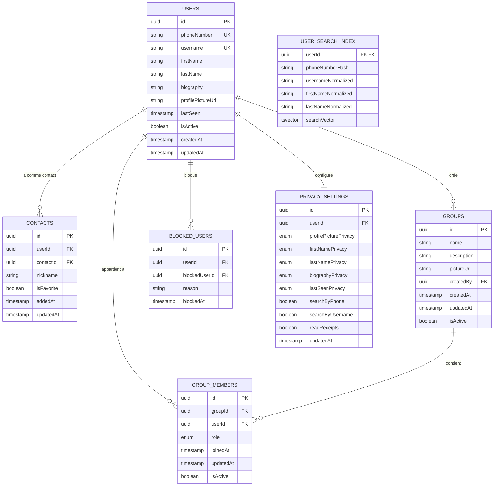
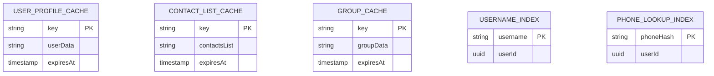
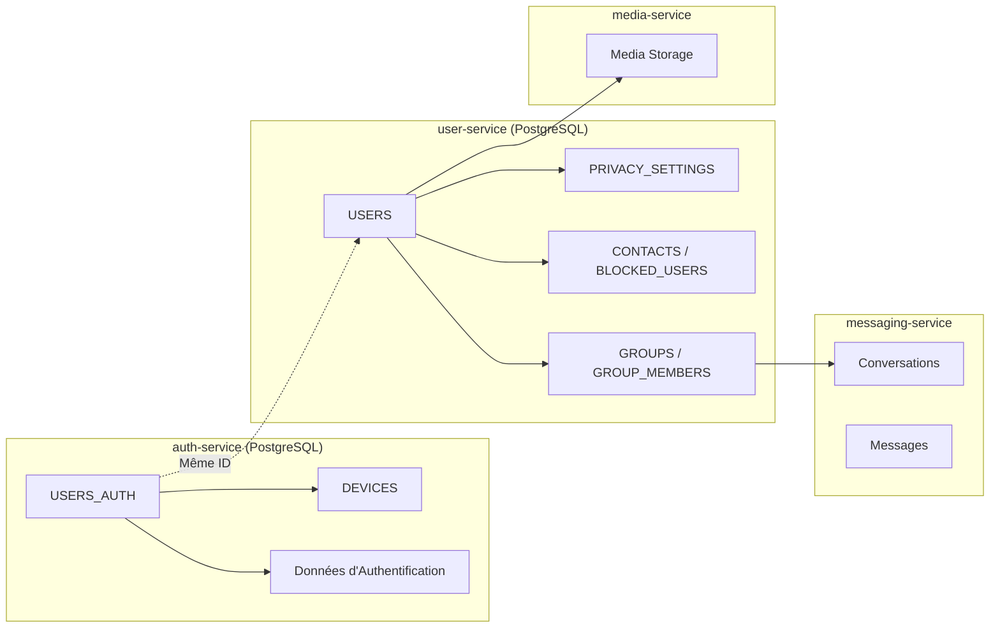

# Conception de la Base de Données - Service Utilisateur

## 1. Introduction et Principes de Conception

### 1.1 Objectif
Ce document décrit la structure de la base de données du service utilisateur (user-service) de l'application Whispr, en détaillant les modèles de données, les relations, et les considérations de performance.

### 1.2 Principes Architecturaux
- **Séparation des domaines**: Chaque service gère ses propres données dans sa propre base de données
- **Cohérence avec le domaine métier**: Les structures de données reflètent les concepts du domaine utilisateur
- **Optimisation pour les requêtes fréquentes**: Indexes et modèles adaptés aux patterns d'accès courants
- **Protection des données personnelles**: Conception tenant compte des exigences de confidentialité

### 1.3 Technologie
- **PostgreSQL**: Pour les données persistantes des utilisateurs, contacts et groupes
- **Redis**: Pour le cache de données fréquemment accédées et les recherches rapides

## 2. Schéma PostgreSQL du Service Utilisateur

### 2.1 Vue d'Ensemble



### 2.2 Description des Tables

#### 2.2.1 USERS
Stocke les informations de profil des utilisateurs.

| Colonne | Type | Description | Contraintes |
|---------|------|-------------|-------------|
| id | UUID | Identifiant unique de l'utilisateur | PK, NOT NULL |
| phoneNumber | VARCHAR(20) | Numéro de téléphone au format E.164 | UNIQUE, NOT NULL |
| username | VARCHAR(30) | Nom d'utilisateur unique | UNIQUE, NULL |
| firstName | VARCHAR(50) | Prénom de l'utilisateur | NOT NULL |
| lastName | VARCHAR(50) | Nom de famille de l'utilisateur | NULL |
| biography | TEXT | Biographie/description de l'utilisateur | NULL |
| profilePictureUrl | VARCHAR(255) | URL de l'image de profil | NULL |
| lastSeen | TIMESTAMP | Dernière connexion de l'utilisateur | NULL |
| isActive | BOOLEAN | Indique si le compte est actif | NOT NULL, DEFAULT TRUE |
| createdAt | TIMESTAMP | Date/heure de création du profil | NOT NULL |
| updatedAt | TIMESTAMP | Date/heure de la dernière mise à jour | NOT NULL |

**Indices**:
- PRIMARY KEY sur `id`
- UNIQUE sur `phoneNumber`
- UNIQUE sur `username`
- INDEX sur `firstName`, `lastName` (pour la recherche)

#### 2.2.2 PRIVACY_SETTINGS
Stocke les paramètres de confidentialité personnalisés par utilisateur.

| Colonne | Type | Description | Contraintes |
|---------|------|-------------|-------------|
| id | UUID | Identifiant unique des paramètres | PK, NOT NULL |
| userId | UUID | Référence à l'utilisateur | FK (USERS.id), NOT NULL, UNIQUE |
| profilePicturePrivacy | ENUM | Visibilité de la photo de profil (everyone, contacts, nobody) | NOT NULL, DEFAULT 'everyone' |
| firstNamePrivacy | ENUM | Visibilité du prénom (everyone, contacts, nobody) | NOT NULL, DEFAULT 'everyone' |
| lastNamePrivacy | ENUM | Visibilité du nom (everyone, contacts, nobody) | NOT NULL, DEFAULT 'contacts' |
| biographyPrivacy | ENUM | Visibilité de la biographie (everyone, contacts, nobody) | NOT NULL, DEFAULT 'everyone' |
| lastSeenPrivacy | ENUM | Visibilité de la dernière connexion (everyone, contacts, nobody) | NOT NULL, DEFAULT 'contacts' |
| searchByPhone | BOOLEAN | Possibilité d'être trouvé par numéro de téléphone | NOT NULL, DEFAULT TRUE |
| searchByUsername | BOOLEAN | Possibilité d'être trouvé par nom d'utilisateur | NOT NULL, DEFAULT TRUE |
| readReceipts | BOOLEAN | Envoyer des accusés de lecture | NOT NULL, DEFAULT TRUE |
| updatedAt | TIMESTAMP | Date/heure de la dernière mise à jour | NOT NULL |

**Indices**:
- PRIMARY KEY sur `id`
- UNIQUE sur `userId`

#### 2.2.3 CONTACTS
Stocke les relations de contact entre utilisateurs.

| Colonne | Type | Description | Contraintes |
|---------|------|-------------|-------------|
| id | UUID | Identifiant unique de la relation | PK, NOT NULL |
| userId | UUID | Utilisateur possédant ce contact | FK (USERS.id), NOT NULL |
| contactId | UUID | Utilisateur ajouté comme contact | FK (USERS.id), NOT NULL |
| nickname | VARCHAR(50) | Surnom personnalisé pour ce contact | NULL |
| isFavorite | BOOLEAN | Marqué comme favori | NOT NULL, DEFAULT FALSE |
| addedAt | TIMESTAMP | Date/heure d'ajout du contact | NOT NULL |
| updatedAt | TIMESTAMP | Date/heure de la dernière mise à jour | NOT NULL |

**Indices**:
- PRIMARY KEY sur `id`
- UNIQUE sur `(userId, contactId)` pour éviter les doublons
- INDEX sur `userId` pour les requêtes fréquentes
- INDEX sur `contactId` pour les requêtes inverses
- INDEX sur `isFavorite` pour filtrer les favoris

#### 2.2.4 BLOCKED_USERS
Stocke les relations de blocage entre utilisateurs.

| Colonne | Type | Description | Contraintes |
|---------|------|-------------|-------------|
| id | UUID | Identifiant unique du blocage | PK, NOT NULL |
| userId | UUID | Utilisateur qui a effectué le blocage | FK (USERS.id), NOT NULL |
| blockedUserId | UUID | Utilisateur qui est bloqué | FK (USERS.id), NOT NULL |
| reason | TEXT | Raison optionnelle du blocage | NULL |
| blockedAt | TIMESTAMP | Date/heure du blocage | NOT NULL |

**Indices**:
- PRIMARY KEY sur `id`
- UNIQUE sur `(userId, blockedUserId)` pour éviter les doublons
- INDEX sur `userId` pour les requêtes fréquentes
- INDEX sur `blockedUserId` pour vérifier rapidement les blocages

#### 2.2.5 GROUPS
Stocke les informations sur les groupes de conversation.

| Colonne | Type | Description | Contraintes |
|---------|------|-------------|-------------|
| id | UUID | Identifiant unique du groupe | PK, NOT NULL |
| name | VARCHAR(100) | Nom du groupe | NOT NULL |
| description | TEXT | Description du groupe | NULL |
| pictureUrl | VARCHAR(255) | URL de l'image du groupe | NULL |
| createdBy | UUID | Créateur du groupe | FK (USERS.id), NOT NULL |
| createdAt | TIMESTAMP | Date/heure de création du groupe | NOT NULL |
| updatedAt | TIMESTAMP | Date/heure de la dernière mise à jour | NOT NULL |
| isActive | BOOLEAN | Indique si le groupe est actif | NOT NULL, DEFAULT TRUE |

**Indices**:
- PRIMARY KEY sur `id`
- INDEX sur `createdBy` pour les requêtes par créateur
- INDEX sur `createdAt` pour trier par création
- INDEX sur `name` pour la recherche par nom

#### 2.2.6 GROUP_MEMBERS
Stocke les appartenances et rôles des membres dans les groupes.

| Colonne | Type | Description | Contraintes |
|---------|------|-------------|-------------|
| id | UUID | Identifiant unique de l'appartenance | PK, NOT NULL |
| groupId | UUID | Référence au groupe | FK (GROUPS.id), NOT NULL |
| userId | UUID | Référence à l'utilisateur membre | FK (USERS.id), NOT NULL |
| role | ENUM | Rôle dans le groupe (admin, moderator, member) | NOT NULL, DEFAULT 'member' |
| joinedAt | TIMESTAMP | Date/heure d'entrée dans le groupe | NOT NULL |
| updatedAt | TIMESTAMP | Date/heure de la dernière mise à jour | NOT NULL |
| isActive | BOOLEAN | Indique si le membre est actif dans le groupe | NOT NULL, DEFAULT TRUE |

**Indices**:
- PRIMARY KEY sur `id`
- UNIQUE sur `(groupId, userId)` pour éviter les doublons
- INDEX sur `groupId` pour obtenir rapidement les membres d'un groupe
- INDEX sur `userId` pour obtenir les groupes d'un utilisateur
- INDEX sur `role` pour filtrer par rôle

#### 2.2.7 USER_SEARCH_INDEX
Table optimisée pour la recherche rapide d'utilisateurs.

| Colonne | Type | Description | Contraintes |
|---------|------|-------------|-------------|
| userId | UUID | Référence à l'utilisateur | PK, FK (USERS.id), NOT NULL |
| phoneNumberHash | VARCHAR(64) | Hash du numéro de téléphone pour recherche sécurisée | NOT NULL |
| usernameNormalized | VARCHAR(30) | Nom d'utilisateur normalisé (lowercase, sans accents) | NULL |
| firstNameNormalized | VARCHAR(50) | Prénom normalisé pour recherche insensible à la casse | NOT NULL |
| lastNameNormalized | VARCHAR(50) | Nom normalisé pour recherche insensible à la casse | NULL |
| searchVector | TSVECTOR | Vecteur de recherche plein texte | NOT NULL |

**Indices**:
- PRIMARY KEY sur `userId`
- INDEX sur `phoneNumberHash` pour la recherche par numéro
- INDEX sur `usernameNormalized` pour la recherche par nom d'utilisateur
- INDEX GIN sur `searchVector` pour la recherche full-text

## 3. Données Temporaires dans Redis

### 3.1 Vue d'Ensemble

Redis est utilisé pour le cache et l'accélération des recherches fréquentes :



### 3.2 Description des Structures Redis

#### 3.2.1 USER_PROFILE_CACHE
Cache pour les profils utilisateurs fréquemment consultés.

**Clé**: `user:profile:{userId}`  
**Type**: Hash  
**TTL**: 1 heure  
**Champs**:
- Données de profil sérialisées
- Horodatage de dernière mise à jour
- État des paramètres de confidentialité

#### 3.2.2 CONTACT_LIST_CACHE
Cache pour les listes de contacts des utilisateurs.

**Clé**: `user:contacts:{userId}`  
**Type**: List ou Sorted Set  
**TTL**: 30 minutes  
**Valeurs**:
- Liste des contacts avec métadonnées essentielles
- Score pour le tri (si Sorted Set)

#### 3.2.3 GROUP_CACHE
Cache pour les informations sur les groupes actifs.

**Clé**: `group:{groupId}`  
**Type**: Hash  
**TTL**: 1 heure  
**Champs**:
- Métadonnées du groupe
- Liste des membres actifs du groupe (limité aux X premiers membres)

#### 3.2.4 USERNAME_INDEX
Index pour la recherche rapide par nom d'utilisateur.

**Clé**: `username:lookup:{normalizedUsername}`  
**Type**: String  
**TTL**: Permanent (invalidé lors des modifications)  
**Valeur**: UUID de l'utilisateur

#### 3.2.5 PHONE_LOOKUP_INDEX
Index pour la recherche rapide par numéro de téléphone.

**Clé**: `phone:lookup:{phoneHash}`  
**Type**: String  
**TTL**: Permanent (invalidé lors des modifications)  
**Valeur**: UUID de l'utilisateur

## 4. Relations avec les Autres Services

### 4.1 Démarcation des Responsabilités



### 4.2 Synchronisation des Données

- **auth-service**: Source de vérité pour l'authenticité des utilisateurs et de leurs appareils
- **user-service**: Source de vérité pour les profils, les paramètres et les relations sociales
- **media-service**: Stockage physique des images de profil et de groupe
- **messaging-service**: Utilise les données du user-service pour gérer les conversations

### 4.3 Points d'Intégration

- User-service écoute les événements de création/suppression d'utilisateurs depuis l'auth-service
- Les URLs des médias sont persistées dans le user-service, mais le contenu est géré par le media-service
- Les mises à jour de groupe déclenchent des événements pour le messaging-service

## 5. Considérations de Sécurité

### 5.1 Protection des Données Personnelles

- Respect des paramètres de confidentialité lors de l'exposition des données
- Vérification des blocages avant tout accès aux données utilisateur
- Filtrage des données selon le niveau d'accès du demandeur

### 5.2 Audit et Logging

- Journalisation des modifications sensibles (mises à jour de profile, de paramètres de confidentialité)
- Timestamps d'audit sur toutes les tables (createdAt, updatedAt)
- Journalisation des opérations administratives sur les groupes

### 5.3 Validations et Contraintes

- Validations de format pour les noms d'utilisateur (regex)
- Longueurs maximales définies pour tous les champs textuels
- Unicité stricte des noms d'utilisateur (case-insensitive)

## 6. Considérations de Performance

### 6.1 Indexation

- Index sur toutes les colonnes fréquemment utilisées pour filtrer ou joindre
- Index composites pour les patterns de requête communs
- Utilisation de GIN pour la recherche full-text sur les profils

### 6.2 Stratégies de Cache

- Cache de premier niveau dans Redis pour les profils fréquemment consultés
- Invalidation du cache basée sur les événements de mise à jour
- Structure optimisée pour les recherches fréquentes (par téléphone, par username)

### 6.3 Optimisations

- Pagination de toutes les API retournant des listes (contacts, groupes, membres)
- Lazy loading des données détaillées (information minimale dans les listes)
- Requêtes optimisées pour limiter le nombre de jointures

## 7. Migrations et Évolution du Schéma

### 7.1 Stratégie de Migration

- Migrations incrémentielles avec TypeORM
- Support pour la compatibilité descendante
- Transactions pour garantir l'atomicité des migrations
- Tests automatisés après chaque migration

### 7.2 Gestion des Versions

- Versionnement explicite du schéma de base de données
- Migrations réversibles quand c'est possible
- Documentation des changements de schéma

## 8. Scripts SQL d'Initialisation

### 8.1 Création du Schéma PostgreSQL

```sql
CREATE EXTENSION IF NOT EXISTS "uuid-ossp";
CREATE EXTENSION IF NOT EXISTS "pg_trgm";

-- Types ENUM
CREATE TYPE privacy_level AS ENUM ('everyone', 'contacts', 'nobody');
CREATE TYPE group_role AS ENUM ('admin', 'moderator', 'member');

-- Table des utilisateurs
CREATE TABLE users (
    id UUID PRIMARY KEY DEFAULT uuid_generate_v4(),
    phone_number VARCHAR(20) NOT NULL UNIQUE,
    username VARCHAR(30) UNIQUE,
    first_name VARCHAR(50) NOT NULL,
    last_name VARCHAR(50),
    biography TEXT,
    profile_picture_url VARCHAR(255),
    last_seen TIMESTAMP,
    is_active BOOLEAN NOT NULL DEFAULT TRUE,
    created_at TIMESTAMP NOT NULL DEFAULT NOW(),
    updated_at TIMESTAMP NOT NULL DEFAULT NOW()
);

-- Table des paramètres de confidentialité
CREATE TABLE privacy_settings (
    id UUID PRIMARY KEY DEFAULT uuid_generate_v4(),
    user_id UUID NOT NULL UNIQUE REFERENCES users(id) ON DELETE CASCADE,
    profile_picture_privacy privacy_level NOT NULL DEFAULT 'everyone',
    first_name_privacy privacy_level NOT NULL DEFAULT 'everyone',
    last_name_privacy privacy_level NOT NULL DEFAULT 'contacts',
    biography_privacy privacy_level NOT NULL DEFAULT 'everyone',
    last_seen_privacy privacy_level NOT NULL DEFAULT 'contacts',
    search_by_phone BOOLEAN NOT NULL DEFAULT TRUE,
    search_by_username BOOLEAN NOT NULL DEFAULT TRUE,
    read_receipts BOOLEAN NOT NULL DEFAULT TRUE,
    updated_at TIMESTAMP NOT NULL DEFAULT NOW()
);

-- Table des contacts
CREATE TABLE contacts (
    id UUID PRIMARY KEY DEFAULT uuid_generate_v4(),
    user_id UUID NOT NULL REFERENCES users(id) ON DELETE CASCADE,
    contact_id UUID NOT NULL REFERENCES users(id) ON DELETE CASCADE,
    nickname VARCHAR(50),
    is_favorite BOOLEAN NOT NULL DEFAULT FALSE,
    added_at TIMESTAMP NOT NULL DEFAULT NOW(),
    updated_at TIMESTAMP NOT NULL DEFAULT NOW(),
    UNIQUE(user_id, contact_id)
);

-- Table des utilisateurs bloqués
CREATE TABLE blocked_users (
    id UUID PRIMARY KEY DEFAULT uuid_generate_v4(),
    user_id UUID NOT NULL REFERENCES users(id) ON DELETE CASCADE,
    blocked_user_id UUID NOT NULL REFERENCES users(id) ON DELETE CASCADE,
    reason TEXT,
    blocked_at TIMESTAMP NOT NULL DEFAULT NOW(),
    UNIQUE(user_id, blocked_user_id)
);

-- Table des groupes
CREATE TABLE groups (
    id UUID PRIMARY KEY DEFAULT uuid_generate_v4(),
    name VARCHAR(100) NOT NULL,
    description TEXT,
    picture_url VARCHAR(255),
    created_by UUID NOT NULL REFERENCES users(id),
    created_at TIMESTAMP NOT NULL DEFAULT NOW(),
    updated_at TIMESTAMP NOT NULL DEFAULT NOW(),
    is_active BOOLEAN NOT NULL DEFAULT TRUE
);

-- Table des membres de groupe
CREATE TABLE group_members (
    id UUID PRIMARY KEY DEFAULT uuid_generate_v4(),
    group_id UUID NOT NULL REFERENCES groups(id) ON DELETE CASCADE,
    user_id UUID NOT NULL REFERENCES users(id) ON DELETE CASCADE,
    role group_role NOT NULL DEFAULT 'member',
    joined_at TIMESTAMP NOT NULL DEFAULT NOW(),
    updated_at TIMESTAMP NOT NULL DEFAULT NOW(),
    is_active BOOLEAN NOT NULL DEFAULT TRUE,
    UNIQUE(group_id, user_id)
);

-- Table d'index pour la recherche utilisateur
CREATE TABLE user_search_index (
    user_id UUID PRIMARY KEY REFERENCES users(id) ON DELETE CASCADE,
    phone_number_hash VARCHAR(64) NOT NULL,
    username_normalized VARCHAR(30),
    first_name_normalized VARCHAR(50) NOT NULL,
    last_name_normalized VARCHAR(50),
    search_vector TSVECTOR NOT NULL
);

-- Indexes
CREATE INDEX idx_users_phone_number ON users(phone_number);
CREATE INDEX idx_users_username ON users(username);
CREATE INDEX idx_users_first_name ON users(first_name);
CREATE INDEX idx_users_last_name ON users(last_name);
CREATE INDEX idx_users_is_active ON users(is_active);

CREATE INDEX idx_contacts_user_id ON contacts(user_id);
CREATE INDEX idx_contacts_contact_id ON contacts(contact_id);
CREATE INDEX idx_contacts_is_favorite ON contacts(is_favorite);
CREATE INDEX idx_contacts_added_at ON contacts(added_at);

CREATE INDEX idx_blocked_users_user_id ON blocked_users(user_id);
CREATE INDEX idx_blocked_users_blocked_user_id ON blocked_users(blocked_user_id);
CREATE INDEX idx_blocked_users_blocked_at ON blocked_users(blocked_at);

CREATE INDEX idx_groups_name ON groups(name);
CREATE INDEX idx_groups_created_by ON groups(created_by);
CREATE INDEX idx_groups_created_at ON groups(created_at);
CREATE INDEX idx_groups_is_active ON groups(is_active);

CREATE INDEX idx_group_members_group_id ON group_members(group_id);
CREATE INDEX idx_group_members_user_id ON group_members(user_id);
CREATE INDEX idx_group_members_role ON group_members(role);
CREATE INDEX idx_group_members_is_active ON group_members(is_active);

CREATE INDEX idx_user_search_phone_hash ON user_search_index(phone_number_hash);
CREATE INDEX idx_user_search_username ON user_search_index(username_normalized);
CREATE INDEX idx_user_search_fulltext ON user_search_index USING GIN(search_vector);

-- Triggers
CREATE OR REPLACE FUNCTION update_timestamp()
RETURNS TRIGGER AS $$
BEGIN
   NEW.updated_at = NOW();
   RETURN NEW;
END;
$$ LANGUAGE plpgsql;

CREATE TRIGGER update_users_timestamp
BEFORE UPDATE ON users
FOR EACH ROW EXECUTE PROCEDURE update_timestamp();

CREATE TRIGGER update_privacy_settings_timestamp
BEFORE UPDATE ON privacy_settings
FOR EACH ROW EXECUTE PROCEDURE update_timestamp();

CREATE TRIGGER update_contacts_timestamp
BEFORE UPDATE ON contacts
FOR EACH ROW EXECUTE PROCEDURE update_timestamp();

CREATE TRIGGER update_groups_timestamp
BEFORE UPDATE ON groups
FOR EACH ROW EXECUTE PROCEDURE update_timestamp();

CREATE TRIGGER update_group_members_timestamp
BEFORE UPDATE ON group_members
FOR EACH ROW EXECUTE PROCEDURE update_timestamp();

-- Fonction de mise à jour de l'index de recherche
CREATE OR REPLACE FUNCTION update_user_search_index()
RETURNS TRIGGER AS $$
BEGIN
  IF TG_OP = 'INSERT' OR TG_OP = 'UPDATE' THEN
    INSERT INTO user_search_index (
      user_id,
      phone_number_hash,
      username_normalized,
      first_name_normalized,
      last_name_normalized,
      search_vector
    ) VALUES (
      NEW.id,
      encode(sha256(NEW.phone_number::bytea), 'hex'),
      LOWER(NEW.username),
      LOWER(NEW.first_name),
      LOWER(NEW.last_name),
      setweight(to_tsvector('simple', COALESCE(NEW.username, '')), 'A') ||
      setweight(to_tsvector('simple', NEW.first_name), 'B') ||
      setweight(to_tsvector('simple', COALESCE(NEW.last_name, '')), 'C')
    )
    ON CONFLICT (user_id) DO UPDATE SET
      phone_number_hash = encode(sha256(NEW.phone_number::bytea), 'hex'),
      username_normalized = LOWER(NEW.username),
      first_name_normalized = LOWER(NEW.first_name),
      last_name_normalized = LOWER(NEW.last_name),
      search_vector = setweight(to_tsvector('simple', COALESCE(NEW.username, '')), 'A') ||
                      setweight(to_tsvector('simple', NEW.first_name), 'B') ||
                      setweight(to_tsvector('simple', COALESCE(NEW.last_name, '')), 'C');
  END IF;
  RETURN NULL;
END;
$$ LANGUAGE plpgsql;

CREATE TRIGGER user_search_index_update
AFTER INSERT OR UPDATE ON users
FOR EACH ROW EXECUTE PROCEDURE update_user_search_index();
```

### 8.2 Création de la Structure Redis

```
# Commandes Redis pour initialiser les structures (exemple)

# Création des index
FT.CREATE idx:username ON HASH PREFIX 1 username:lookup: SCHEMA username TEXT SORTABLE

FT.CREATE idx:phone ON HASH PREFIX 1 phone:lookup: SCHEMA phoneHash TEXT SORTABLE

# Définition des TTL par défaut
CONFIG SET user:profile:* 3600
CONFIG SET user:contacts:* 1800
CONFIG SET group:* 3600
```

## 9. Gestion des Accès et Sécurité

### 9.1 Utilisateur de Base de Données et Permissions

```sql
-- Création de l'utilisateur dédié
CREATE USER user_service WITH PASSWORD 'secure_password_here';

-- Octroi des permissions adéquates
GRANT SELECT, INSERT, UPDATE, DELETE ON ALL TABLES IN SCHEMA public TO user_service;
GRANT USAGE, SELECT ON ALL SEQUENCES IN SCHEMA public TO user_service;

-- Restrictions d'accès
REVOKE TRUNCATE, REFERENCES ON ALL TABLES IN SCHEMA public FROM user_service;
```

### 9.2 Paramètres de Sécurité PostgreSQL

```
# Extrait de postgresql.conf pour la sécurité
ssl = on
ssl_cert_file = 'server.crt'
ssl_key_file = 'server.key'
ssl_ciphers = 'HIGH:MEDIUM:+3DES:!aNULL'
ssl_prefer_server_ciphers = on
```