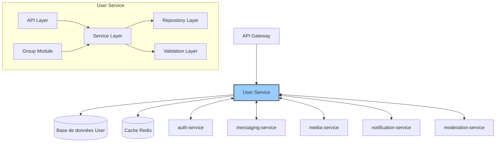
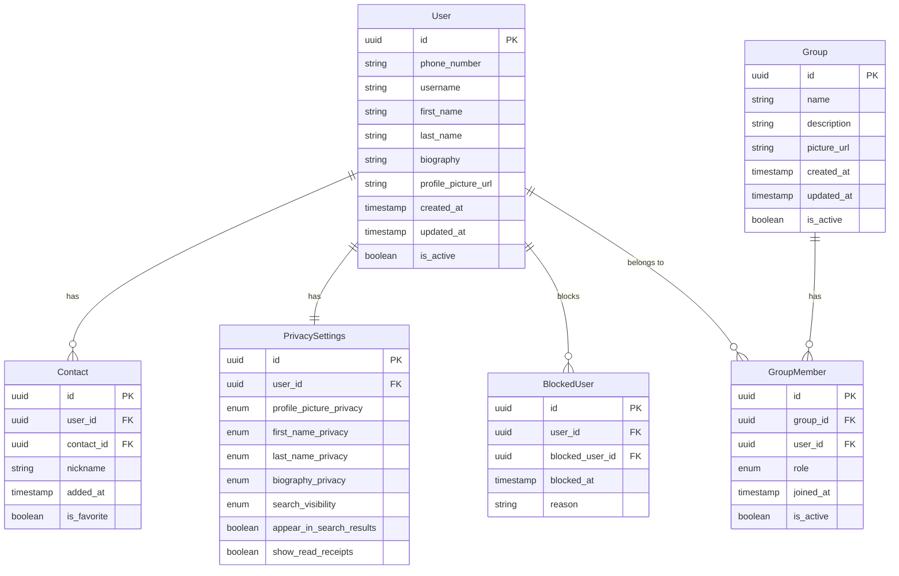

# User Service (`user-service`) - System Design Document

## 1. Introduction

### 1.1 Objectif du Document
Ce document décrit l'architecture et la conception technique du service utilisateur (User Service) de l'application Whispr. Il sert de référence pour l'équipe de développement et les parties prenantes du projet.

### 1.2 Périmètre du Service
Le User Service est responsable de la gestion des profils utilisateurs, des contacts, des relations entre utilisateurs, des paramètres de confidentialité, et des fonctionnalités sociales de l'application. Il gère également les groupes de conversation à travers un sous-module dédié.

### 1.3 Relations avec les Autres Services
Le User Service interagit avec plusieurs autres microservices de l'écosystème Whispr :
- **auth-service** : pour la validation des identités et l'autorisation
- **messaging-service** : pour les informations liées aux conversations et messages
- **media-service** : pour la gestion des médias associés aux profils
- **notification-service** : pour notifier les changements de profils, invitations, etc.
- **moderation-service** : pour vérifier le contenu des profils utilisateurs

## 2. Architecture Globale

### 2.1 Vue d'Ensemble de l'Architecture

Le service utilisateur suit une architecture en couches avec séparation claire des responsabilités :



### 2.2 Principes Architecturaux

- **Domain-Driven Design** : Organisation du code autour des concepts métier clés
- **Stateless** : Service sans état pour faciliter le scaling horizontal
- **Idempotence** : Les opérations peuvent être répétées sans effets secondaires
- **Résilience** : Capacité à gérer les défaillances des services externes
- **Observabilité** : Logging structuré et métriques détaillées
- **Privacy by Design** : Protection des données utilisateurs intégrée dès la conception

## 3. Choix Technologiques

### 3.1 Stack Technique

- **Langage** : TypeScript
- **Framework** : NestJS (framework Node.js)
- **Base de données** : PostgreSQL avec TypeORM
- **Cache** : Redis pour les données fréquemment accédées (profils, contactes récents)
- **Communication inter-services** : gRPC pour les appels synchrones, événements asynchrones via message broker
- **ORM** : TypeORM avec repository pattern
- **API** : REST avec OpenAPI/Swagger (via décorateurs NestJS)
- **Validation** : class-validator et class-transformer
- **Queues** : Bull pour les tâches asynchrones (via @nestjs/bull)
- **Testing** : Jest pour les tests unitaires et d'intégration

### 3.2 Infrastructure

- **Containerisation** : Docker
- **Orchestration** : Kubernetes (GKE)
- **CI/CD** : GitHub Actions
- **Service Cloud** : Google Cloud Platform (GCP)
- **Monitoring** : Prometheus + Grafana
- **Logging** : Loki
- **Tracing** : OpenTelemetry

## 4. Composants Principaux

### 4.1 Structure NestJS

L'architecture NestJS du service est organisée comme suit :

```
src/
├── main.ts                    # Point d'entrée de l'application
├── app.module.ts              # Module racine
├── modules/                   # Modules fonctionnels
│   ├── users/                 # Module profil utilisateur
│   ├── contacts/              # Module gestion des contacts
│   ├── privacy/               # Module paramètres de confidentialité
│   ├── groups/                # Module groupes de conversation
│   └── blocking/              # Module gestion des blocages
├── shared/                    # Code partagé entre modules
│   ├── guards/                # Guards d'authentification
│   ├── interceptors/          # Interceptors (logging, transformation)
│   ├── pipes/                 # Pipes de validation
│   ├── filters/               # Filtres d'exception
│   └── decorators/            # Décorateurs personnalisés
└── config/                    # Configuration de l'application
```

### 4.2 Controllers (API Layer)

Les Controllers NestJS exposent les endpoints RESTful :
- **UserController** : endpoints de gestion du profil utilisateur
- **ContactController** : endpoints de gestion des contacts
- **PrivacyController** : endpoints de gestion des paramètres de confidentialité
- **GroupController** : endpoints de gestion des groupes
- **BlockingController** : endpoints de gestion des utilisateurs bloqués

Avantages :
- Décorateurs pour définir les routes, méthodes HTTP et validation
- Génération automatique de la documentation Swagger via @nestjs/swagger
- Gestion des réponses HTTP standardisée

### 4.3 Services (Business Logic Layer)

Providers NestJS contenant la logique métier :
- **UserService** : gestion des profils utilisateurs
- **ContactService** : gestion des relations entre utilisateurs
- **PrivacyService** : gestion des paramètres de confidentialité
- **GroupService** : gestion des groupes de conversation
- **BlockingService** : gestion des utilisateurs bloqués

Avantages :
- Injection de dépendances automatique
- Testabilité améliorée (facilité de mock)
- Séparation claire des responsabilités

### 4.4 Repositories (Data Access Layer)

Gère les accès aux données via TypeORM :
- **UserRepository** : opérations liées aux utilisateurs
- **ContactRepository** : opérations liées aux contacts
- **PrivacySettingsRepository** : opérations liées aux paramètres de confidentialité
- **GroupRepository** : opérations liées aux groupes
- **GroupMemberRepository** : opérations liées aux membres des groupes
- **BlockedUserRepository** : opérations liées aux utilisateurs bloqués

### 4.5 Entités (Data Models)

Modèles de données principaux :
- **User** : informations du profil utilisateur
- **Contact** : relation entre deux utilisateurs
- **PrivacySettings** : paramètres de confidentialité par utilisateur
- **Group** : informations sur un groupe
- **GroupMember** : relation utilisateur-groupe avec rôle
- **BlockedUser** : relation de blocage entre utilisateurs

### 4.6 Communication avec les autres services

- **@nestjs/microservices** : pour l'intégration gRPC avec les autres services
- Création d'interfaces gRPC pour les communications inter-services :
  - Interface AuthService : validation des tokens, accès aux informations d'authentification
  - Interface MessageService : consultation des métadonnées des conversations
  - Interface MediaService : gestion des images de profil et de groupe
  - Interface NotificationService : envoi de notifications push et in-app

### 4.7 Configuration et Modules

- **ConfigModule** (@nestjs/config) : gestion des variables d'environnement
- **TypeOrmModule** : intégration de la base de données PostgreSQL
- **CacheModule** : intégration Redis pour le cache
- **ThrottlerModule** : limitation de débit intégrée
- **BullModule** : gestion des tâches asynchrones
- **GrpcModule** : communication avec les autres microservices

## 5. Modèle de Données

### 5.1 Schéma de Base de Données



### 5.2 Modèles d'Entités TypeORM

Les principales entités TypeORM sont définies avec leurs relations :

```typescript
// Exemple d'entité User
@Entity()
export class User {
  @PrimaryGeneratedColumn('uuid')
  id: string;
  
  @Column({ unique: true })
  phoneNumber: string;
  
  @Column({ unique: true, nullable: true })
  username: string;
  
  @Column()
  firstName: string;
  
  @Column({ nullable: true })
  lastName: string;
  
  @Column({ nullable: true, type: 'text' })
  biography: string;
  
  @Column({ nullable: true })
  profilePictureUrl: string;
  
  @CreateDateColumn()
  createdAt: Date;
  
  @UpdateDateColumn()
  updatedAt: Date;
  
  @Column({ default: true })
  isActive: boolean;
  
  @OneToMany(() => Contact, contact => contact.user)
  contacts: Contact[];
  
  @OneToOne(() => PrivacySettings, settings => settings.user)
  privacySettings: PrivacySettings;
  
  @OneToMany(() => BlockedUser, blockedUser => blockedUser.user)
  blockedUsers: BlockedUser[];
  
  @OneToMany(() => GroupMember, groupMember => groupMember.user)
  groupMemberships: GroupMember[];
}
```

## 6. Fonctionnalités Principales et Flux

### 6.1 Gestion des Profils Utilisateurs

#### Créer un profil utilisateur
1. Réception des données utilisateur depuis auth-service après inscription
2. Validation des données utilisateur
3. Création du profil utilisateur avec paramètres de confidentialité par défaut
4. Retour des informations du profil créé

#### Mettre à jour un profil utilisateur
1. Validation de l'authentification et des autorisations
2. Validation des données de mise à jour
3. Si image de profil fournie, coordination avec media-service
4. Mise à jour du profil utilisateur
5. Notification des mises à jour pertinentes via notification-service

### 6.2 Gestion des Contacts

#### Ajouter un contact
1. Validation de l'authentification de l'utilisateur
2. Vérification que l'utilisateur cible existe et n'est pas déjà un contact
3. Vérification que l'utilisateur cible n'a pas bloqué l'utilisateur actuel
4. Création de la relation de contact
5. Notification de l'ajout aux deux utilisateurs

#### Modifier/supprimer un contact
1. Validation de l'authentification et de l'existence du contact
2. Mise à jour ou suppression de la relation de contact
3. Notification de la modification si nécessaire

### 6.3 Gestion des Groupes

#### Créer un groupe
1. Validation de l'authentification de l'utilisateur
2. Validation des données du groupe (nom, description, etc.)
3. Si image fournie, coordination avec media-service
4. Création du groupe avec l'utilisateur comme administrateur
5. Ajout des membres initiaux avec leurs rôles respectifs
6. Notification aux membres ajoutés via notification-service

#### Gérer les membres d'un groupe
1. Validation de l'authentification et des droits d'administration
2. Vérification que les utilisateurs à ajouter existent
3. Vérification des blocages entre utilisateurs
4. Ajout/suppression/modification des membres
5. Notification aux membres concernés

### 6.4 Gestion des Blocages

#### Bloquer un utilisateur
1. Validation de l'authentification
2. Vérification que l'utilisateur à bloquer existe
3. Création de la relation de blocage
4. Mise à jour des relations existantes (suppression des contacts si nécessaire)
5. Notification à l'utilisateur qui bloque

### 6.5 Gestion de la Confidentialité

#### Mettre à jour les paramètres de confidentialité
1. Validation de l'authentification
2. Validation des nouvelles valeurs de paramètres
3. Mise à jour des paramètres de confidentialité
4. Propagation des changements pertinents aux autres services

## 7. Scaling et Performances

### 7.1 Stratégie de Scaling

- Scaling horizontal des instances via Kubernetes
- Déploiement de plusieurs répliques sans état
- Utilisation d'un cache distribué Redis pour les données fréquemment accédées
- Séparation potentielle des opérations de lecture/écriture à volume élevé

### 7.2 Cache et Optimisations

- Mise en cache des profils utilisateurs fréquemment consultés
- Invalidation intelligente du cache lors des mises à jour
- Utilisation d'indices optimisés pour les requêtes fréquentes
- Pagination de toutes les requêtes retournant des collections

### 7.3 Limites et Quotas

- Nombre maximum de contacts par utilisateur : 5000
- Nombre maximum de groupes par utilisateur : 500
- Nombre maximum de membres par groupe : 200
- Limites sur la taille des données de profil (bio, etc.)
- Rate limiting sur les opérations intensives

## 8. Sécurité

### 8.1 Contrôle d'Accès

- Validation des tokens JWT via auth-service
- Autorisation basée sur les relations et les rôles
- Vérification des blocages entre utilisateurs
- Respect des paramètres de confidentialité

### 8.2 Protection des Données

- Sanitisation des entrées utilisateur
- Validation des données selon des schémas stricts
- Audit trail pour les modifications sensibles
- Masquage des données sensibles dans les logs

### 8.3 Communication Sécurisée

- Communication entre services via gRPC avec mTLS
- Utilisation de HTTPS pour toutes les API externes
- Chiffrement des données sensibles en transit et au repos

## 9. Monitoring et Observabilité

### 9.1 Logging

- Logs structurés en JSON avec contexte utilisateur
- Niveaux de log différenciés selon la criticité
- Masquage des données personnelles dans les logs
- Corrélation des logs entre les services via IDs de traçage

### 9.2 Métriques

- Nombre d'utilisateurs actifs
- Taux de croissance des utilisateurs et contacts
- Temps de réponse des opérations principales
- Utilisation des ressources système
- Taux d'erreurs par endpoint

### 9.3 Alerting

- Alertes sur taux d'erreur anormal
- Alertes sur temps de réponse dégradé
- Alertes sur épuisement des ressources
- Alertes sur activité suspecte (tentatives multiples, etc.)

## 10. Gestion des Erreurs et Résilience

### 10.1 Stratégie de Gestion des Erreurs

- Utilisation des ExceptionFilters NestJS
- Codes d'erreur standardisés et consistants
- Messages d'erreur clairs et sécurisés
- Logging détaillé des erreurs
- Gestion spécifique des contraintes d'unicité

### 10.2 Résilience

- Circuit breakers pour les appels aux services externes
- Retries avec backoff exponentiel
- Graceful degradation en cas d'indisponibilité des services externes
- Gestion des conflits de mise à jour concurrente

### 10.3 Plan de Reprise d'Activité

- RPO (Recovery Point Objective) : 1 heure maximum
- RTO (Recovery Time Objective) : 2 heures maximum
- Sauvegardes régulières de la base de données
- Procédures de restauration documentées

## 11. Évolution et Maintenance

### 11.1 Versionnement

- Versionnement sémantique des API
- Rétrocompatibilité maintenue pour les clients existants
- Période de dépréciation avant suppression de fonctionnalités

### 11.2 Mise à Jour et Déploiement

- GitOps avec ArgoCD
- Stratégie de déploiement blue/green
- Tests automatisés avant déploiement
- Rollback automatique en cas d'échec
- Migrations de base de données progressives

### 11.3 Documentation Technique

- Documentation OpenAPI générée automatiquement via @nestjs/swagger
- Exemples de code pour l'intégration
- Documentation des entités et relations
- Guide d'utilisation des API
- Documentation des webhooks et événements

## 12. Considérations Opérationnelles

### 12.1 DevOps

- Pipeline CI/CD via GitHub Actions
- Intégration continue avec tests automatisés
- Déploiement continu en environnement de développement et staging

### 12.2 Environnements

- Développement, Staging, Production
- Isolation complète des données entre environnements
- Parité de configuration entre environnements

### 12.3 Support

- Logs centralisés pour le diagnostic
- Traçage des requêtes à travers les services
- Procédures documentées pour les problèmes courants

---

## Appendices

### A. Métriques de Performance Cibles

| Métrique | Cible |
|----------|-------|
| Temps de réponse moyen | < 100ms |
| 99e percentile temps de réponse | < 500ms |
| Taux d'erreur | < 0.1% |
| Disponibilité | > 99% |
| Temps d'obtention d'un profil | < 50ms |
| Temps de création d'un groupe | < 200ms |
| Empreinte mémoire par instance | < 250MB |
| CPU utilisation moyenne | < 40% |

### B. Estimation des Ressources

| Ressource | Estimation Initiale |
|-----------|---------------------|
| Instances de service | 3 replicas |
| CPU par instance | 1 vCPU |
| Mémoire par instance | 2 GB RAM |
| Stockage PostgreSQL | 50 GB initial |
| Stockage Redis | 5 GB |
| Bandwidth mensuel | 100 GB |

### C. Références

- [Spécification OpenAPI complète](../5_integration/swagger.yaml)
- [Description des user stories](../1_requirements/user_stories.md)
- [Diagramme d'architecture système](../1_architecture/system_architecture.md)
- [Documentation officielle NestJS](https://docs.nestjs.com/)
- [Bonnes pratiques TypeORM](https://github.com/typeorm/typeorm/blob/master/docs/repository-api.md)
- [Recommandations de sécurité OWASP](https://owasp.org/www-project-top-ten/)