# Spécification Fonctionnelle - Gestion des Contacts

## 1. Vue d'ensemble

### 1.1 Objectif

Cette spécification détaille les fonctionnalités de gestion des contacts de l'application Whispr. Elle couvre l'ajout, la gestion et la suppression de contacts, ainsi que les mécanismes de synchronisation avec les contacts téléphoniques et le système de blocage d'utilisateurs. Ces fonctionnalités constituent le cœur du réseau social de l'application, permettant aux utilisateurs de construire leur cercle de contacts et de gérer leurs relations.

### 1.2 Principes clés

- **Simplicité d'utilisation**: Interface intuitive pour l'ajout et la gestion des contacts
- **Contrôle utilisateur**: Liberté de gérer ses relations sans notifications intrusives
- **Confidentialité**: Respect des paramètres de confidentialité dans toutes les interactions
- **Synchronisation non-intrusive**: Import des contacts téléphoniques avec consentement explicite
- **Protection proactive**: Mécanismes efficaces pour bloquer les interactions indésirables

### 1.3 Composants fonctionnels

Le système de gestion des contacts comprend quatre processus principaux:
1. **Gestion des contacts**: Ajout, modification et suppression de contacts
2. **Synchronisation des contacts téléphoniques**: Import et mise à jour depuis le carnet d'adresses
3. **Blocage d'utilisateurs**: Restriction des interactions avec certains utilisateurs
4. **Recherche et découverte**: Mécanismes pour trouver de nouveaux contacts

## 2. Gestion des contacts

### 2.1 Ajout d'un contact

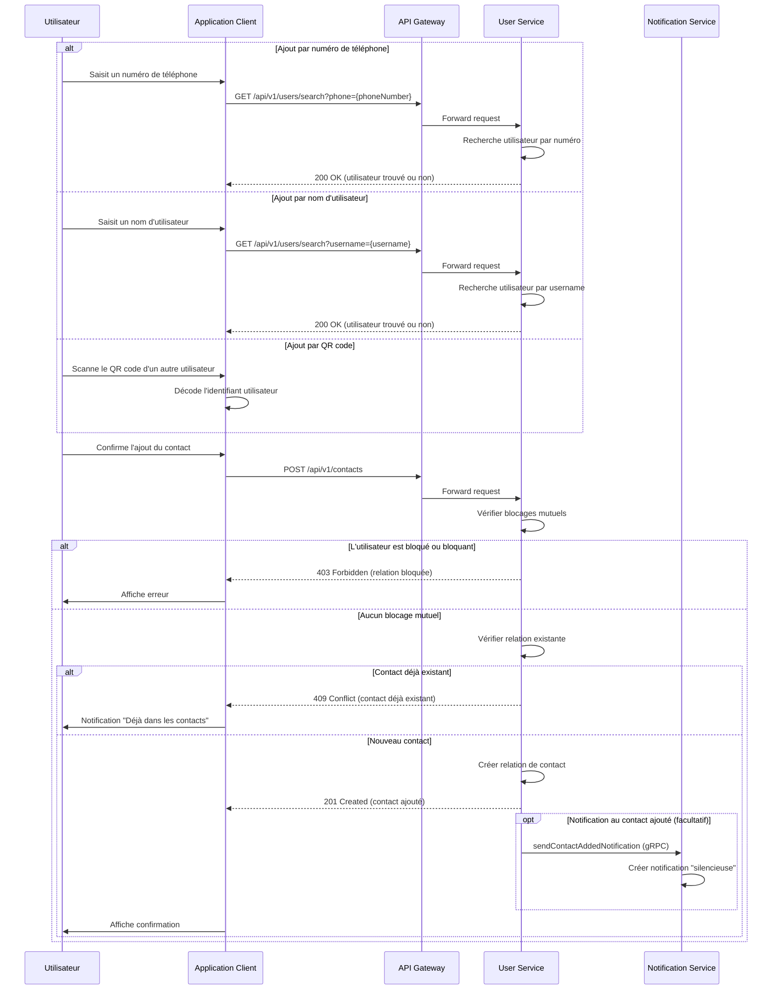
```mermaid
sequenceDiagram
    participant User as Utilisateur
    participant Client as Application Client
    participant APIGateway as API Gateway
    participant UserService as User Service
    participant NotifService as Notification Service
    
    alt Ajout par numéro de téléphone
        User->>Client: Saisit un numéro de téléphone
        Client->>APIGateway: GET /api/v1/users/search?phone={phoneNumber}
        APIGateway->>UserService: Forward request
        UserService->>UserService: Recherche utilisateur par numéro
        UserService-->>Client: 200 OK (utilisateur trouvé ou non)
    else Ajout par nom d'utilisateur
        User->>Client: Saisit un nom d'utilisateur
        Client->>APIGateway: GET /api/v1/users/search?username={username}
        APIGateway->>UserService: Forward request
        UserService->>UserService: Recherche utilisateur par username
        UserService-->>Client: 200 OK (utilisateur trouvé ou non)
    else Ajout par QR code
        User->>Client: Scanne le QR code d'un autre utilisateur
        Client->>Client: Décode l'identifiant utilisateur
    end
    
    User->>Client: Confirme l'ajout du contact
    Client->>APIGateway: POST /api/v1/contacts
    APIGateway->>UserService: Forward request
    
    UserService->>UserService: Vérifier blocages mutuels
    
    alt L'utilisateur est bloqué ou bloquant
        UserService-->>Client: 403 Forbidden (relation bloquée)
        Client->>User: Affiche erreur
    else Aucun blocage mutuel
        UserService->>UserService: Vérifier relation existante
        
        alt Contact déjà existant
            UserService-->>Client: 409 Conflict (contact déjà existant)
            Client->>User: Notification "Déjà dans les contacts"
        else Nouveau contact
            UserService->>UserService: Créer relation de contact
            UserService-->>Client: 201 Created (contact ajouté)
            
            opt Notification au contact ajouté (facultatif)
                UserService->>NotifService: sendContactAddedNotification (gRPC)
                NotifService->>NotifService: Créer notification "silencieuse"
            end
            
            Client->>User: Affiche confirmation
        end
    end
```

#### 2.1.1 Règles métier pour l'ajout de contacts

1. **Consentement unilatéral**:
   - L'ajout d'un contact est unilatéral et ne nécessite pas l'approbation du contact ajouté
   - Il s'agit d'une relation "suit" plutôt qu'une relation "ami" bidirectionnelle

2. **Vérification des blocages**:
   - Impossible d'ajouter un utilisateur qui vous a bloqué
   - Impossible d'ajouter un utilisateur que vous avez bloqué

3. **Limites et restrictions**:
   - Maximum de 5000 contacts par utilisateur
   - Rate limiting: maximum 100 ajouts par jour
   - Période de refroidissement pour les ajouts répétitifs du même contact

4. **Notifications**:
   - Notification optionnelle et discrète au contact ajouté
   - Absence de système d'approbation ou de confirmation

### 2.2 Modification d'un contact

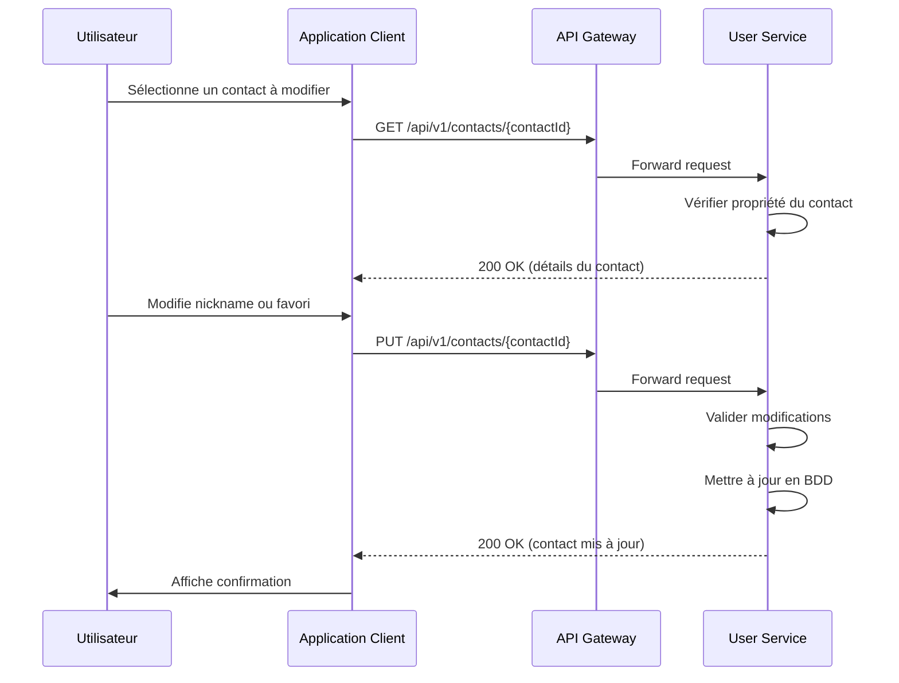
```mermaid
sequenceDiagram
    participant User as Utilisateur
    participant Client as Application Client
    participant APIGateway as API Gateway
    participant UserService as User Service
    
    User->>Client: Sélectionne un contact à modifier
    Client->>APIGateway: GET /api/v1/contacts/{contactId}
    APIGateway->>UserService: Forward request
    UserService->>UserService: Vérifier propriété du contact
    UserService-->>Client: 200 OK (détails du contact)
    
    User->>Client: Modifie nickname ou favori
    Client->>APIGateway: PUT /api/v1/contacts/{contactId}
    APIGateway->>UserService: Forward request
    
    UserService->>UserService: Valider modifications
    UserService->>UserService: Mettre à jour en BDD
    
    UserService-->>Client: 200 OK (contact mis à jour)
    Client->>User: Affiche confirmation
```

#### 2.2.1 Règles métier pour la modification de contacts

1. **Attributs modifiables**:
   - Surnom personnalisé (nickname): texte libre jusqu'à 50 caractères
   - Statut favori: booléen, permet de mettre en avant certains contacts

2. **Visibilité des modifications**:
   - Les modifications sont uniquement visibles par l'utilisateur qui les effectue
   - Le surnom n'est jamais visible par le contact concerné

3. **Persistance**:
   - Les modifications sont conservées même si le contact change son nom d'utilisateur

### 2.3 Suppression d'un contact

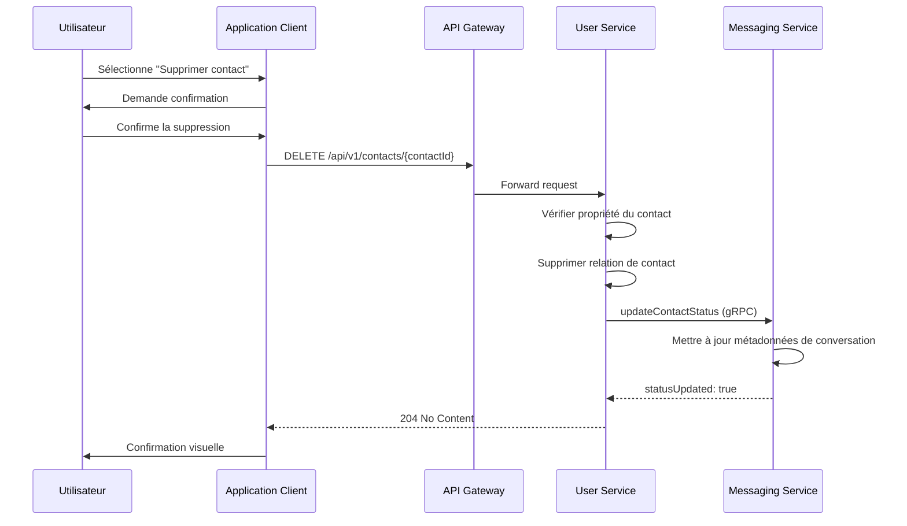
```mermaid
sequenceDiagram
    participant User as Utilisateur
    participant Client as Application Client
    participant APIGateway as API Gateway
    participant UserService as User Service
    participant MessagingService as Messaging Service
    
    User->>Client: Sélectionne "Supprimer contact"
    Client->>User: Demande confirmation
    User->>Client: Confirme la suppression
    
    Client->>APIGateway: DELETE /api/v1/contacts/{contactId}
    APIGateway->>UserService: Forward request
    
    UserService->>UserService: Vérifier propriété du contact
    UserService->>UserService: Supprimer relation de contact
    
    UserService->>MessagingService: updateContactStatus (gRPC)
    MessagingService->>MessagingService: Mettre à jour métadonnées de conversation
    
    MessagingService-->>UserService: statusUpdated: true
    UserService-->>Client: 204 No Content
    
    Client->>User: Confirmation visuelle
```

#### 2.3.1 Règles métier pour la suppression de contacts

1. **Impact sur les conversations**:
   - Les conversations existantes sont préservées
   - Le statut "contact" est retiré dans les métadonnées des conversations

2. **Impact sur la confidentialité**:
   - L'ancien contact perd accès aux informations restreintes aux contacts
   - Les paramètres de confidentialité "contacts only" s'appliquent immédiatement

3. **Réversibilité**:
   - La suppression est réversible (le contact peut être ajouté à nouveau)
   - Aucune période de refroidissement n'est imposée pour un re-ajout

## 3. Synchronisation des contacts téléphoniques

### 3.1 Import initial des contacts

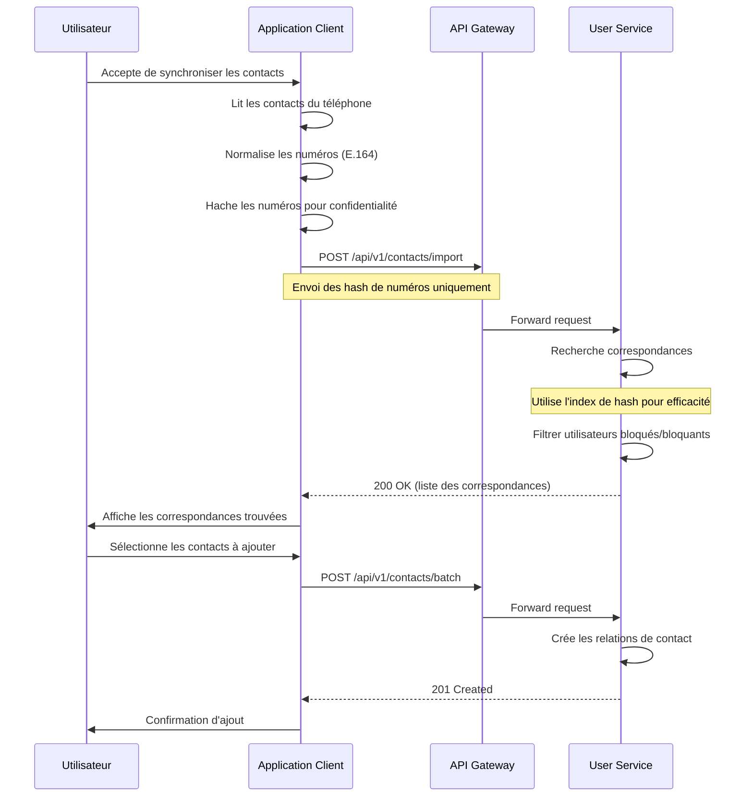
```mermaid
sequenceDiagram
    participant User as Utilisateur
    participant Client as Application Client
    participant APIGateway as API Gateway
    participant UserService as User Service
    
    User->>Client: Accepte de synchroniser les contacts
    Client->>Client: Lit les contacts du téléphone
    Client->>Client: Normalise les numéros (E.164)
    Client->>Client: Hache les numéros pour confidentialité
    
    Client->>APIGateway: POST /api/v1/contacts/import
    Note over Client,APIGateway: Envoi des hash de numéros uniquement
    APIGateway->>UserService: Forward request
    
    UserService->>UserService: Recherche correspondances
    Note over UserService: Utilise l'index de hash pour efficacité
    
    UserService->>UserService: Filtrer utilisateurs bloqués/bloquants
    UserService-->>Client: 200 OK (liste des correspondances)
    
    Client->>User: Affiche les correspondances trouvées
    User->>Client: Sélectionne les contacts à ajouter
    
    Client->>APIGateway: POST /api/v1/contacts/batch
    APIGateway->>UserService: Forward request
    UserService->>UserService: Crée les relations de contact
    UserService-->>Client: 201 Created
    
    Client->>User: Confirmation d'ajout
```

#### 3.1.1 Règles métier pour l'import de contacts

1. **Consentement et confidentialité**:
   - Consentement explicite requis avant toute synchronisation
   - Transmission uniquement des hash de numéros, jamais des numéros en clair
   - Aucun stockage permanent des numéros non-associés à des utilisateurs

2. **Matching et découverte**:
   - Correspondance uniquement si l'utilisateur cible autorise la recherche par téléphone
   - Exclusion automatique des utilisateurs ayant un blocage mutuel

3. **Contrôle utilisateur**:
   - Sélection manuelle des contacts à ajouter après affichage des correspondances
   - Option de "ne plus suggérer" pour ignorer définitivement certains contacts

4. **Fréquence et limites**:
   - Possibilité d'actualiser la synchronisation périodiquement
   - Limite de 1000 numéros par requête d'import

### 3.2 Mise à jour périodique

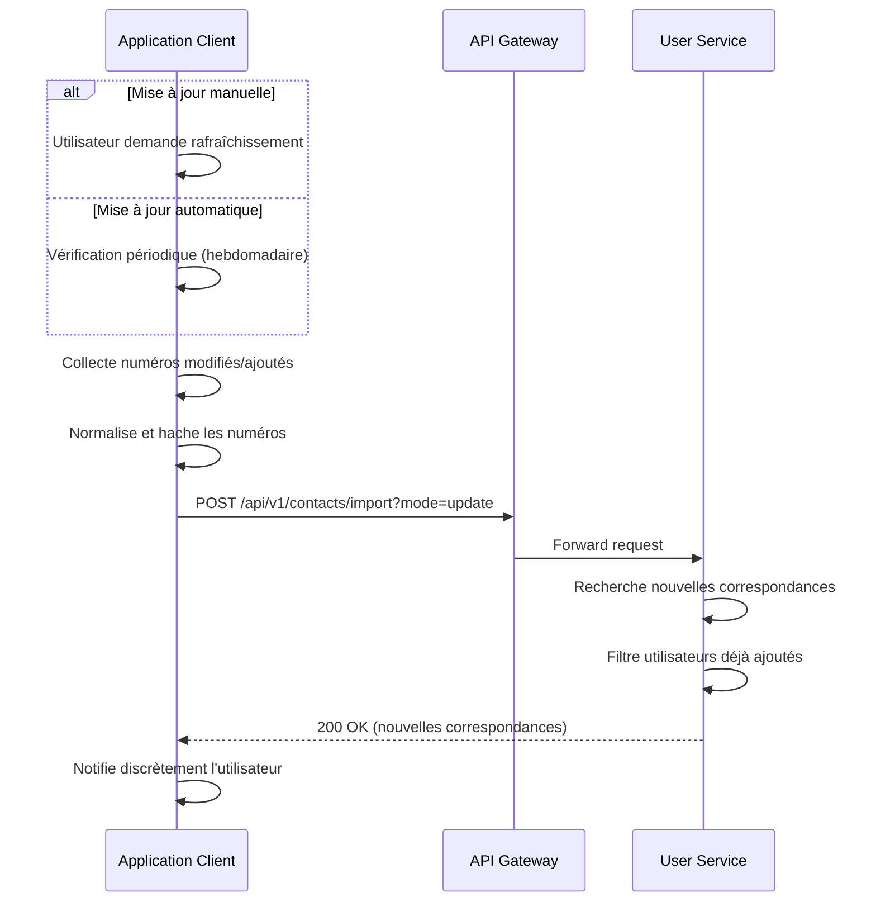
```mermaid
sequenceDiagram
    participant Client as Application Client
    participant APIGateway as API Gateway
    participant UserService as User Service
    
    alt Mise à jour manuelle
        Client->>Client: Utilisateur demande rafraîchissement
    else Mise à jour automatique
        Client->>Client: Vérification périodique (hebdomadaire)
    end
    
    Client->>Client: Collecte numéros modifiés/ajoutés
    Client->>Client: Normalise et hache les numéros
    
    Client->>APIGateway: POST /api/v1/contacts/import?mode=update
    APIGateway->>UserService: Forward request
    
    UserService->>UserService: Recherche nouvelles correspondances
    UserService->>UserService: Filtre utilisateurs déjà ajoutés
    UserService-->>Client: 200 OK (nouvelles correspondances)
    
    Client->>Client: Notifie discrètement l'utilisateur
```

#### 3.2.1 Règles métier pour la mise à jour

1. **Fréquence et déclenchement**:
   - Automatique: maximum une fois par semaine si activé
   - Manuelle: à la demande de l'utilisateur
   - Après l'installation d'une mise à jour de l'application

2. **Optimisations**:
   - Envoi uniquement des numéros modifiés depuis la dernière synchronisation
   - Conservation d'un hash local des numéros déjà traités

3. **Notifications**:
   - Notification discrète uniquement en cas de nouvelles correspondances
   - Regroupement des notifications si plusieurs correspondances

## 4. Blocage d'utilisateurs

### 4.1 Bloquer un utilisateur

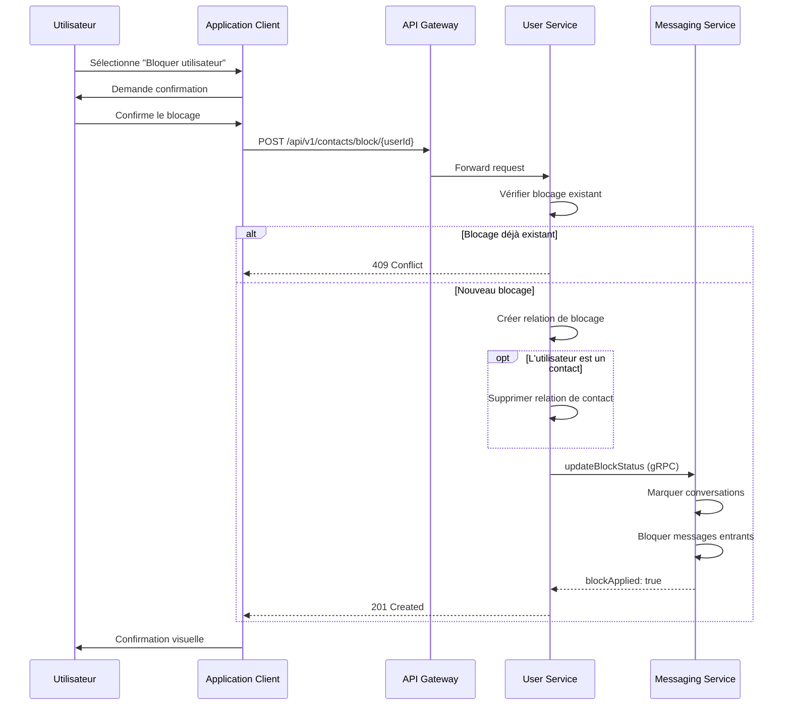
```mermaid
sequenceDiagram
    participant User as Utilisateur
    participant Client as Application Client
    participant APIGateway as API Gateway
    participant UserService as User Service
    participant MessagingService as Messaging Service
    
    User->>Client: Sélectionne "Bloquer utilisateur"
    Client->>User: Demande confirmation
    User->>Client: Confirme le blocage
    
    Client->>APIGateway: POST /api/v1/contacts/block/{userId}
    APIGateway->>UserService: Forward request
    
    UserService->>UserService: Vérifier blocage existant
    
    alt Blocage déjà existant
        UserService-->>Client: 409 Conflict
    else Nouveau blocage
        UserService->>UserService: Créer relation de blocage
        
        opt L'utilisateur est un contact
            UserService->>UserService: Supprimer relation de contact
        end
        
        UserService->>MessagingService: updateBlockStatus (gRPC)
        MessagingService->>MessagingService: Marquer conversations
        MessagingService->>MessagingService: Bloquer messages entrants
        MessagingService-->>UserService: blockApplied: true
        
        UserService-->>Client: 201 Created
    end
    
    Client->>User: Confirmation visuelle
```

#### 4.1.1 Règles métier pour le blocage

1. **Effet immédiat et étendue**:
   - Le blocage est immédiat et unilatéral
   - Impact sur toutes les formes d'interaction: messages, recherche, profil, groupes

2. **Visibilité et discrétion**:
   - L'utilisateur bloqué n'est pas notifié du blocage
   - Pour l'utilisateur bloqué, la personne qui l'a bloqué semble avoir disparu

3. **Impact sur les relations existantes**:
   - Suppression automatique de la relation de contact si elle existe
   - Messages existants conservés mais marqués comme venant d'un utilisateur bloqué

4. **Groupes et conversations collectives**:
   - Dans les groupes communs, les messages de l'utilisateur bloqué sont masqués
   - Impossibilité d'être ajouté à de nouveaux groupes contenant des utilisateurs bloqués

### 4.2 Débloquer un utilisateur

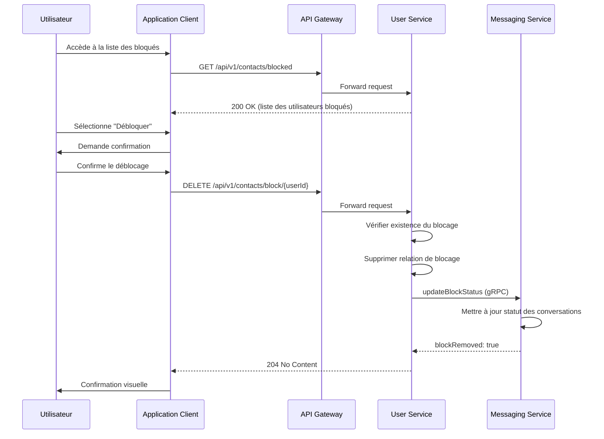
```mermaid
sequenceDiagram
    participant User as Utilisateur
    participant Client as Application Client
    participant APIGateway as API Gateway
    participant UserService as User Service
    participant MessagingService as Messaging Service
    
    User->>Client: Accède à la liste des bloqués
    Client->>APIGateway: GET /api/v1/contacts/blocked
    APIGateway->>UserService: Forward request
    UserService-->>Client: 200 OK (liste des utilisateurs bloqués)
    
    User->>Client: Sélectionne "Débloquer"
    Client->>User: Demande confirmation
    User->>Client: Confirme le déblocage
    
    Client->>APIGateway: DELETE /api/v1/contacts/block/{userId}
    APIGateway->>UserService: Forward request
    
    UserService->>UserService: Vérifier existence du blocage
    UserService->>UserService: Supprimer relation de blocage
    
    UserService->>MessagingService: updateBlockStatus (gRPC)
    MessagingService->>MessagingService: Mettre à jour statut des conversations
    MessagingService-->>UserService: blockRemoved: true
    
    UserService-->>Client: 204 No Content
    Client->>User: Confirmation visuelle
```

#### 4.2.1 Règles métier pour le déblocage

1. **Effets du déblocage**:
   - Restauration de la visibilité réciproque
   - Les anciennes relations de contact ne sont pas restaurées automatiquement

2. **Période de grâce**:
   - Option de délai de refroidissement configurable (24h par défaut)
   - Protection contre le harcèlement par blocage/déblocage répétitif

3. **Groupes et conversations**:
   - Les messages précédemment masqués redeviennent visibles
   - Les invitations de groupe redeviennent possibles

## 5. Recherche et découverte de contacts

### 5.1 Recherche par numéro de téléphone

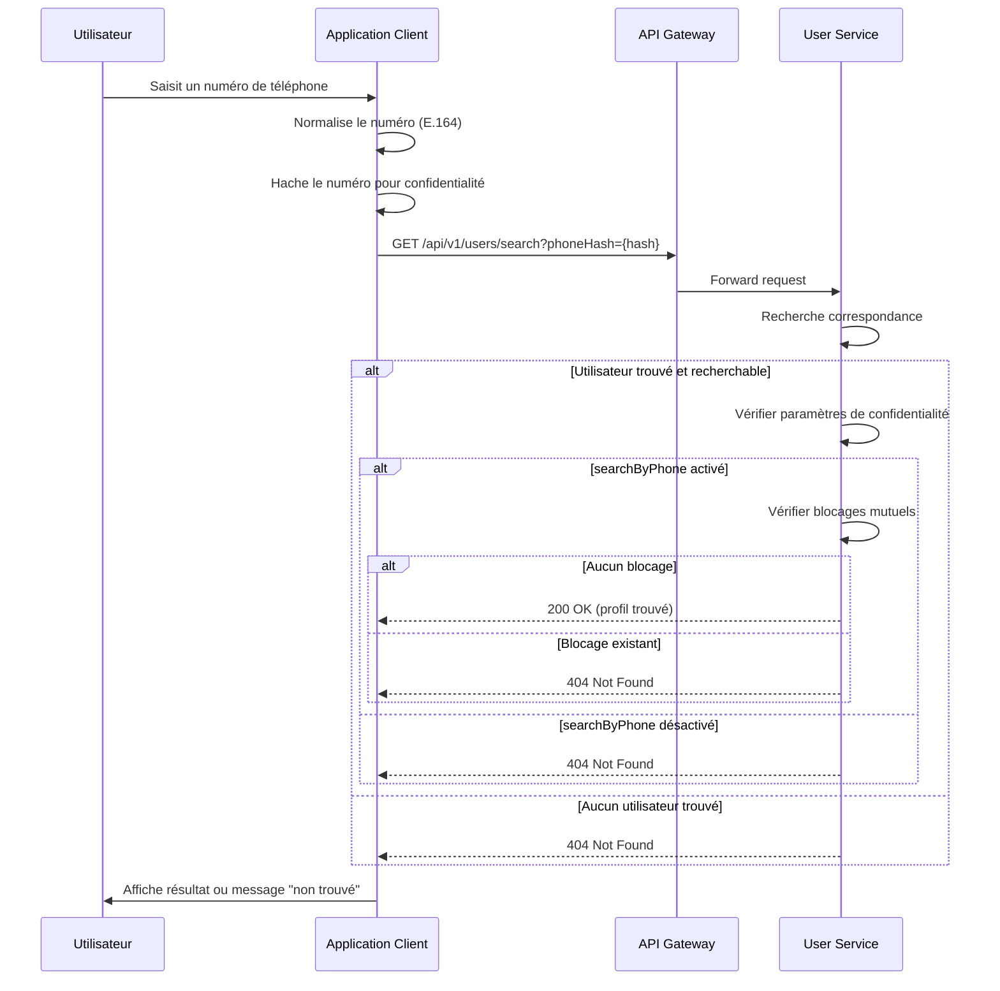
```mermaid
sequenceDiagram
    participant User as Utilisateur
    participant Client as Application Client
    participant APIGateway as API Gateway
    participant UserService as User Service
    
    User->>Client: Saisit un numéro de téléphone
    Client->>Client: Normalise le numéro (E.164)
    Client->>Client: Hache le numéro pour confidentialité
    
    Client->>APIGateway: GET /api/v1/users/search?phoneHash={hash}
    APIGateway->>UserService: Forward request
    
    UserService->>UserService: Recherche correspondance
    
    alt Utilisateur trouvé et recherchable
        UserService->>UserService: Vérifier paramètres de confidentialité
        
        alt searchByPhone activé
            UserService->>UserService: Vérifier blocages mutuels
            
            alt Aucun blocage
                UserService-->>Client: 200 OK (profil trouvé)
            else Blocage existant
                UserService-->>Client: 404 Not Found
            end
        else searchByPhone désactivé
            UserService-->>Client: 404 Not Found
        end
    else Aucun utilisateur trouvé
        UserService-->>Client: 404 Not Found
    end
    
    Client->>User: Affiche résultat ou message "non trouvé"
```

### 5.2 Recherche par nom d'utilisateur

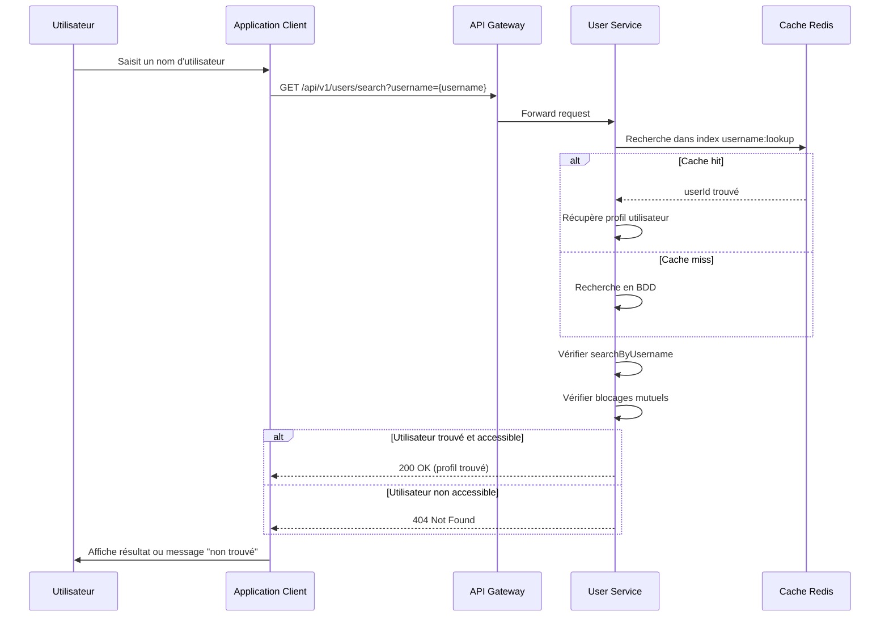
```mermaid
sequenceDiagram
    participant User as Utilisateur
    participant Client as Application Client
    participant APIGateway as API Gateway
    participant UserService as User Service
    participant Redis as Cache Redis
    
    User->>Client: Saisit un nom d'utilisateur
    Client->>APIGateway: GET /api/v1/users/search?username={username}
    APIGateway->>UserService: Forward request
    
    UserService->>Redis: Recherche dans index username:lookup
    
    alt Cache hit
        Redis-->>UserService: userId trouvé
        UserService->>UserService: Récupère profil utilisateur
    else Cache miss
        UserService->>UserService: Recherche en BDD
    end
    
    UserService->>UserService: Vérifier searchByUsername
    UserService->>UserService: Vérifier blocages mutuels
    
    alt Utilisateur trouvé et accessible
        UserService-->>Client: 200 OK (profil trouvé)
    else Utilisateur non accessible
        UserService-->>Client: 404 Not Found
    end
    
    Client->>User: Affiche résultat ou message "non trouvé"
```

#### 5.2.1 Règles métier pour la recherche

1. **Respect de la confidentialité**:
   - Les paramètres `searchByPhone` et `searchByUsername` sont strictement respectés
   - Résultat "non trouvé" pour tous les cas d'inaccessibilité (même si l'utilisateur existe)

2. **Protection de la vie privée**:
   - Transmission uniquement des hash de numéros, jamais des numéros en clair
   - Indifférenciabilité entre "n'existe pas" et "existe mais inaccessible"

3. **Optimisations et performance**:
   - Index Redis pour les recherches par nom d'utilisateur (exactes)
   - Index spécialisé pour les recherches par hash de téléphone

4. **Limites et protection contre les abus**:
   - Rate limiting: maximum 30 recherches par minute
   - Prévention du scraping systématique
   - Détection des comportements suspects (recherches massives)

## 6. Liste et gestion des contacts

### 6.1 Affichage et tri de la liste des contacts

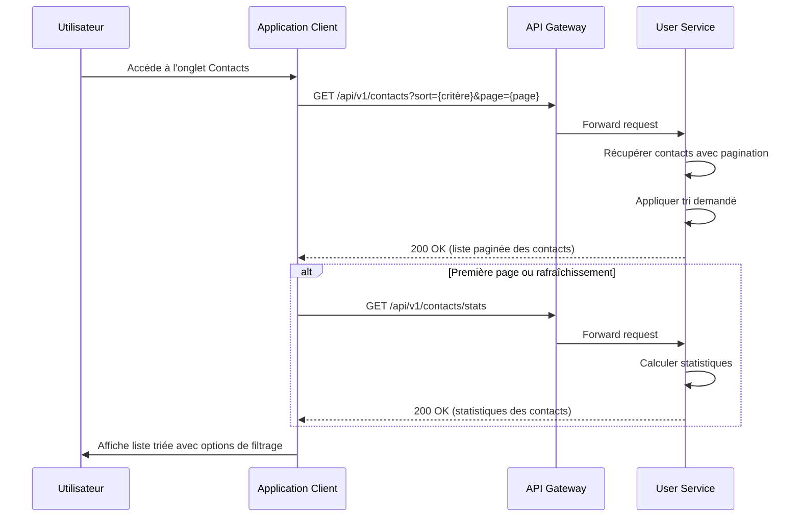
```mermaid
sequenceDiagram
    participant User as Utilisateur
    participant Client as Application Client
    participant APIGateway as API Gateway
    participant UserService as User Service
    
    User->>Client: Accède à l'onglet Contacts
    
    Client->>APIGateway: GET /api/v1/contacts?sort={critère}&page={page}
    APIGateway->>UserService: Forward request
    
    UserService->>UserService: Récupérer contacts avec pagination
    UserService->>UserService: Appliquer tri demandé
    
    UserService-->>Client: 200 OK (liste paginée des contacts)
    
    alt Première page ou rafraîchissement
        Client->>APIGateway: GET /api/v1/contacts/stats
        APIGateway->>UserService: Forward request
        UserService->>UserService: Calculer statistiques
        UserService-->>Client: 200 OK (statistiques des contacts)
    end
    
    Client->>User: Affiche liste triée avec options de filtrage
```

#### 6.1.1 Options de tri disponibles

1. **Tri alphabétique** (défaut):
   - Par prénom d'abord
   - Par nom ensuite (si disponible)
   - Insensible à la casse et aux accents

2. **Tri par récence**:
   - Date d'ajout du contact (plus récent en premier)
   - Utile pour retrouver les contacts récemment ajoutés

3. **Tri par activité**:
   - Fréquence d'interaction (messages, appels)
   - Dernière activité en ligne

4. **Favoris en premier**:
   - Les contacts marqués comme favoris apparaissent en haut
   - Peut être combiné avec les autres critères de tri

### 6.2 Filtrage et recherche dans les contacts

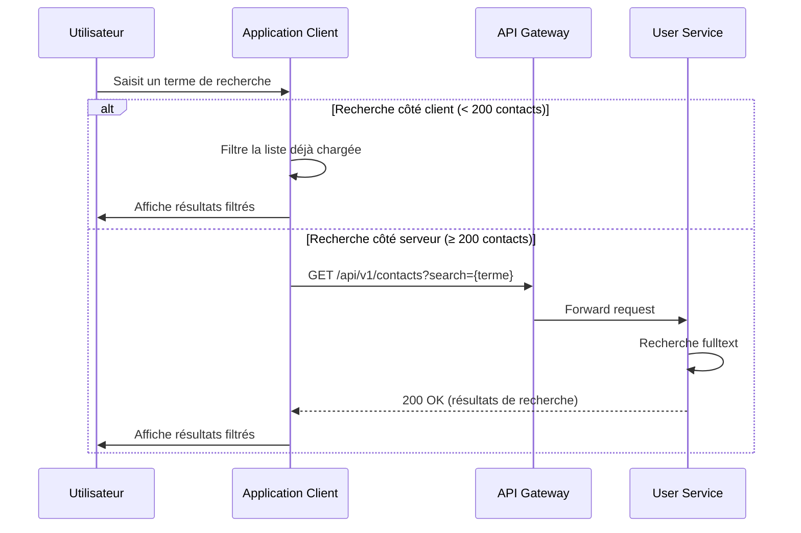
```mermaid
sequenceDiagram
    participant User as Utilisateur
    participant Client as Application Client
    participant APIGateway as API Gateway
    participant UserService as User Service
    
    User->>Client: Saisit un terme de recherche
    
    alt Recherche côté client (< 200 contacts)
        Client->>Client: Filtre la liste déjà chargée
        Client->>User: Affiche résultats filtrés
    else Recherche côté serveur (≥ 200 contacts)
        Client->>APIGateway: GET /api/v1/contacts?search={terme}
        APIGateway->>UserService: Forward request
        
        UserService->>UserService: Recherche fulltext
        UserService-->>Client: 200 OK (résultats de recherche)
        
        Client->>User: Affiche résultats filtrés
    end
```

#### 6.2.1 Critères de recherche

1. **Recherche textuelle**:
   - Par prénom, nom, surnom personnalisé
   - Insensible à la casse et aux accents
   - Support des recherches partielles (préfixe)

2. **Filtres prédéfinis**:
   - Tous les contacts
   - Favoris uniquement
   - Récemment ajoutés
   - Contacts récemment actifs

## 7. Modèle de données et considérations techniques

### 7.1 Structure de données

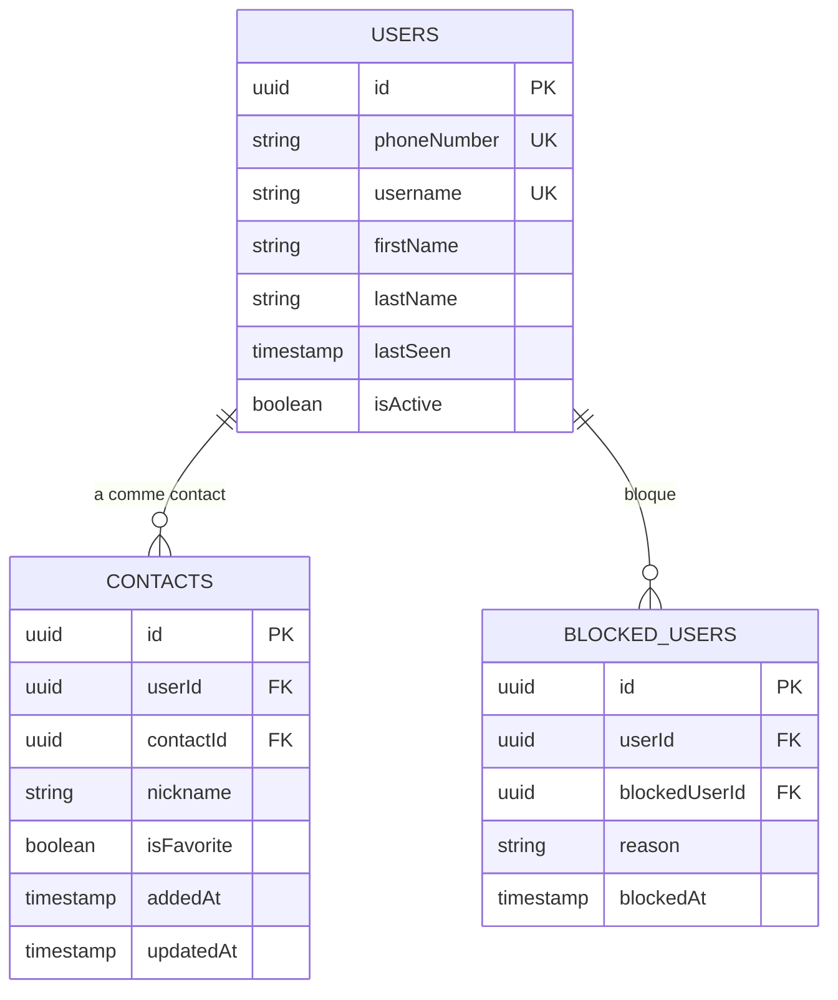
```mermaid
erDiagram
    USERS ||--o{ CONTACTS : "a comme contact"
    USERS ||--o{ BLOCKED_USERS : "bloque"
    
    USERS {
        uuid id PK
        string phoneNumber UK
        string username UK
        string firstName
        string lastName
        timestamp lastSeen
        boolean isActive
    }
    
    CONTACTS {
        uuid id PK
        uuid userId FK
        uuid contactId FK
        string nickname
        boolean isFavorite
        timestamp addedAt
        timestamp updatedAt
    }
    
    BLOCKED_USERS {
        uuid id PK
        uuid userId FK
        uuid blockedUserId FK
        string reason
        timestamp blockedAt
    }
```

### 7.2 Tables PostgreSQL

#### 7.2.1 Table CONTACTS
```sql
CREATE TABLE contacts (
    id UUID PRIMARY KEY DEFAULT uuid_generate_v4(),
    user_id UUID NOT NULL REFERENCES users(id) ON DELETE CASCADE,
    contact_id UUID NOT NULL REFERENCES users(id) ON DELETE CASCADE,
    nickname VARCHAR(50),
    is_favorite BOOLEAN NOT NULL DEFAULT FALSE,
    added_at TIMESTAMP NOT NULL DEFAULT NOW(),
    updated_at TIMESTAMP NOT NULL DEFAULT NOW(),
    UNIQUE(user_id, contact_id)
);

CREATE INDEX idx_contacts_user_id ON contacts(user_id);
CREATE INDEX idx_contacts_contact_id ON contacts(contact_id);
CREATE INDEX idx_contacts_is_favorite ON contacts(is_favorite);
CREATE INDEX idx_contacts_added_at ON contacts(added_at);
```

#### 7.2.2 Table BLOCKED_USERS
```sql
CREATE TABLE blocked_users (
    id UUID PRIMARY KEY DEFAULT uuid_generate_v4(),
    user_id UUID NOT NULL REFERENCES users(id) ON DELETE CASCADE,
    blocked_user_id UUID NOT NULL REFERENCES users(id) ON DELETE CASCADE,
    reason TEXT,
    blocked_at TIMESTAMP NOT NULL DEFAULT NOW(),
    UNIQUE(user_id, blocked_user_id)
);

CREATE INDEX idx_blocked_users_user_id ON blocked_users(user_id);
CREATE INDEX idx_blocked_users_blocked_user_id ON blocked_users(blocked_user_id);
CREATE INDEX idx_blocked_users_blocked_at ON blocked_users(blocked_at);
```

### 7.3 Cache Redis

```
# Cache des listes de contacts fréquemment consultées
user:contacts:{userId} = [{contactId, nickname, isFavorite}, ...]
TTL: 30 minutes

# Cache des blocages (accès rapide pour vérifications)
user:blocks:{userId} = [blockedId1, blockedId2, ...]
TTL: 60 minutes

# Index de recherche pour les numéros de téléphone
phone:lookup:{phoneHash} = userId
TTL: permanent (invalidé lors des modifications)
```

### 7.4 Endpoints API

| Endpoint | Méthode | Description | Paramètres |
|----------|---------|-------------|------------|
| `/api/v1/contacts` | GET | Liste des contacts | `sort`, `page`, `limit`, `search` |
| `/api/v1/contacts` | POST | Ajouter un contact | `contactId` dans le corps |
| `/api/v1/contacts/{contactId}` | GET | Détails d'un contact | - |
| `/api/v1/contacts/{contactId}` | PUT | Modifier un contact | `nickname`, `isFavorite` dans le corps |
| `/api/v1/contacts/{contactId}` | DELETE | Supprimer un contact | - |
| `/api/v1/contacts/stats` | GET | Statistiques des contacts | - |
| `/api/v1/contacts/import` | POST | Importer des contacts | Liste de `phoneHash` dans le corps |
| `/api/v1/contacts/blocked` | GET | Liste des utilisateurs bloqués | `page`, `limit` |
| `/api/v1/contacts/block/{userId}` | POST | Bloquer un utilisateur | `reason` (optionnel) dans le corps |
| `/api/v1/contacts/block/{userId}` | DELETE | Débloquer un utilisateur | - |
| `/api/v1/users/search` | GET | Rechercher des utilisateurs | `username`, `phoneHash` |

## 8. Intégration avec les autres services

### 8.1 Interaction avec Messaging Service

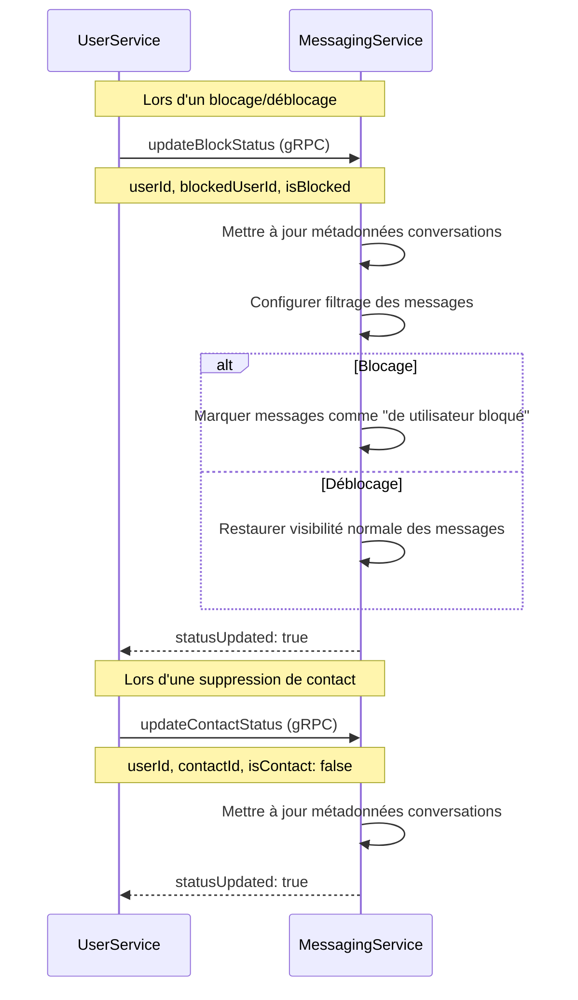
```mermaid
sequenceDiagram
    participant UserService
    participant MessagingService
    
    note over UserService,MessagingService: Lors d'un blocage/déblocage
    
    UserService->>MessagingService: updateBlockStatus (gRPC)
    Note over UserService,MessagingService: userId, blockedUserId, isBlocked
    
    MessagingService->>MessagingService: Mettre à jour métadonnées conversations
    MessagingService->>MessagingService: Configurer filtrage des messages
    
    alt Blocage
        MessagingService->>MessagingService: Marquer messages comme "de utilisateur bloqué"
    else Déblocage
        MessagingService->>MessagingService: Restaurer visibilité normale des messages
    end
    
    MessagingService-->>UserService: statusUpdated: true
    
    note over UserService,MessagingService: Lors d'une suppression de contact
    
    UserService->>MessagingService: updateContactStatus (gRPC)
    Note over UserService,MessagingService: userId, contactId, isContact: false
    
    MessagingService->>MessagingService: Mettre à jour métadonnées conversations
    MessagingService-->>UserService: statusUpdated: true
```

### 8.2 Interaction avec Notification Service

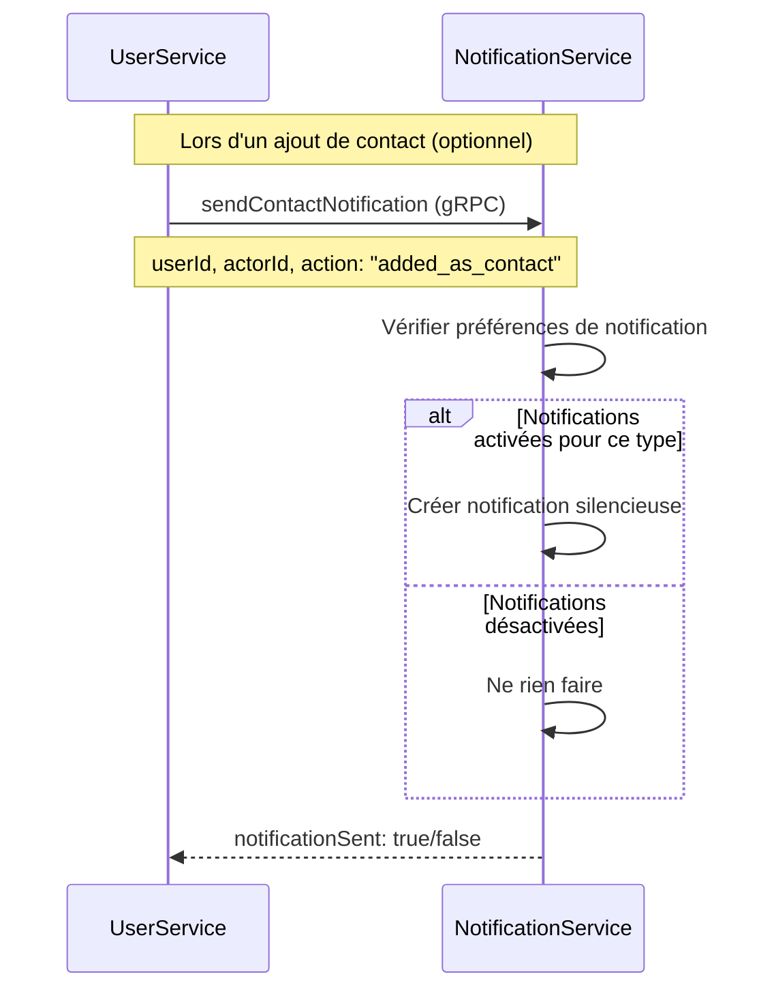
```mermaid
sequenceDiagram
    participant UserService
    participant NotificationService
    
    note over UserService,NotificationService: Lors d'un ajout de contact (optionnel)
    
    UserService->>NotificationService: sendContactNotification (gRPC)
    Note over UserService,NotificationService: userId, actorId, action: "added_as_contact"
    
    NotificationService->>NotificationService: Vérifier préférences de notification
    
    alt Notifications activées pour ce type
        NotificationService->>NotificationService: Créer notification silencieuse
    else Notifications désactivées
        NotificationService->>NotificationService: Ne rien faire
    end
    
    NotificationService-->>UserService: notificationSent: true/false
```

### 8.3 Interaction avec les services de communication externe

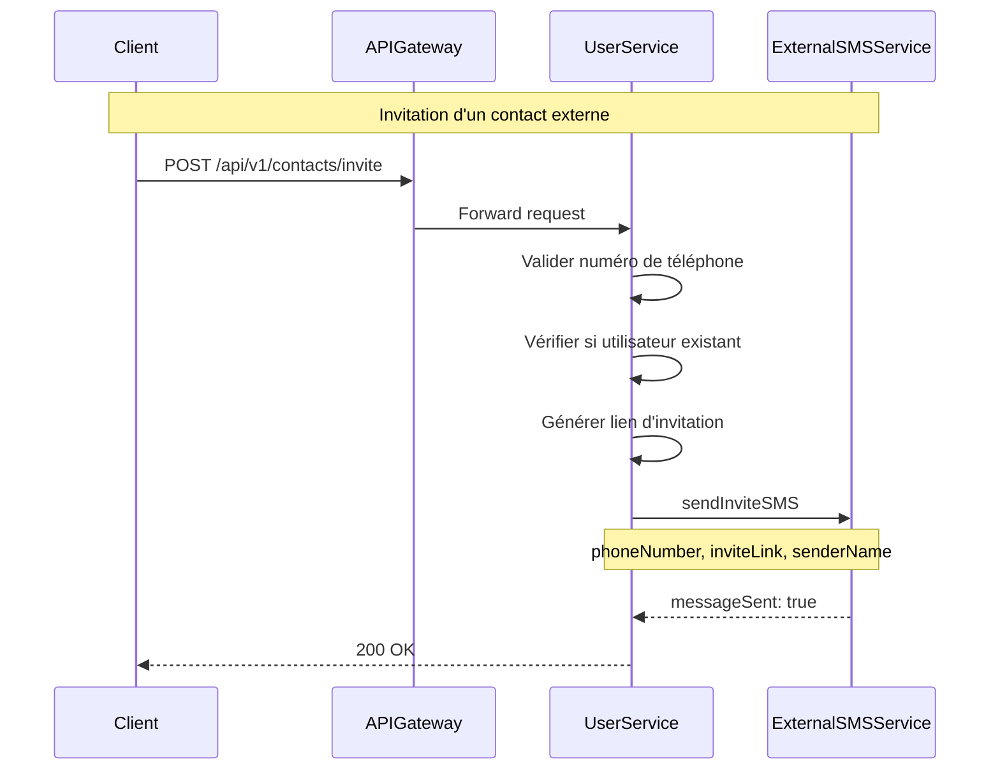
```mermaid
sequenceDiagram
    participant Client
    participant APIGateway
    participant UserService
    participant ExternalSMSService
    
    note over Client,ExternalSMSService: Invitation d'un contact externe
    
    Client->>APIGateway: POST /api/v1/contacts/invite
    APIGateway->>UserService: Forward request
    
    UserService->>UserService: Valider numéro de téléphone
    UserService->>UserService: Vérifier si utilisateur existant
    UserService->>UserService: Générer lien d'invitation
    
    UserService->>ExternalSMSService: sendInviteSMS
    Note over UserService,ExternalSMSService: phoneNumber, inviteLink, senderName
    
    ExternalSMSService-->>UserService: messageSent: true
    UserService-->>Client: 200 OK
```

## 9. Sécurité et protection de la vie privée

### 9.1 Protection des données sensibles

1. **Hachage et pseudonymisation**:
   - Les numéros de téléphone sont toujours hachés lors des recherches et synchronisations
   - Utilisation de l'algorithme SHA-256 avec sel pour le hachage des numéros
   - Conservation uniquement des hashs dans les index de recherche

2. **Minimisation des données**:
   - Transmission des données minimales nécessaires entre services
   - Filtrage des attributs sensibles lors des réponses API

3. **Accès contrôlé**:
   - Vérifications systématiques de propriété avant toute action sur les contacts
   - Journalisation des opérations sensibles (blocage, déblocage)
   - Accès API limité par authentification JWT

### 9.2 Protection contre les abus

1. **Mécanismes anti-harcèlement**:
   - Détection des comportements répétitifs (ajout/suppression répétés)
   - Blocage préventif des interactions excessives (rate limiting)
   - Périodes de refroidissement après actions sensibles

2. **Restrictions de volume**:
   - Limitation du nombre de recherches par période
   - Limitation du nombre d'ajouts de contacts par jour
   - Limitation du nombre d'invitations SMS par semaine

3. **Contrôles de confidentialité**:
   - Possibilité pour les utilisateurs de refuser d'être trouvables par numéro ou nom d'utilisateur
   - Option de visibilité de profil différente pour les contacts et non-contacts
   - Protection contre l'énumération des utilisateurs via les requêtes API

## 10. Expérience utilisateur et interfaces

### 10.1 Interface de gestion des contacts

```
┌───────────────────────────────────────┐
│ Contacts                     🔍 +    │
├───────────────────────────────────────┤
│ ⭐ FAVORIS                            │
│ ┌───────────────────────────┐         │
│ │ 👤 Alexandre Dupont       │         │
│ │   En ligne                │         │
│ └───────────────────────────┘         │
│ ┌───────────────────────────┐         │
│ │ 👤 Marie Martin           │         │
│ │   Il y a 5 min            │         │
│ └───────────────────────────┘         │
│                                       │
│ TOUS LES CONTACTS                     │
│ ┌───────────────────────────┐         │
│ │ 👤 Bernard Legrand        │         │
│ │   Hier                    │         │
│ └───────────────────────────┘         │
│ ┌───────────────────────────┐         │
│ │ 👤 Caroline Petit         │         │
│ │   Il y a 3 jours          │         │
│ └───────────────────────────┘         │
│ ┌───────────────────────────┐         │
│ │ 👤 David Robert           │         │
│ │   Il y a 1 semaine        │         │
│ └───────────────────────────┘         │
│                                       │
└───────────────────────────────────────┘
```

### 10.2 Interface d'ajout de contact

```
┌───────────────────────────────────────┐
│ Ajouter un contact          ✕         │
├───────────────────────────────────────┤
│                                       │
│ ┌───────────────────────────────────┐ │
│ │ 🔍 Rechercher par nom ou numéro   │ │
│ └───────────────────────────────────┘ │
│                                       │
│ Ou                                    │
│                                       │
│ ┌───────────────────────────────────┐ │
│ │ 📱 Importer depuis les contacts   │ │
│ └───────────────────────────────────┘ │
│                                       │
│ ┌───────────────────────────────────┐ │
│ │ 📷 Scanner le QR code             │ │
│ └───────────────────────────────────┘ │
│                                       │
│ ┌───────────────────────────────────┐ │
│ │ 💌 Inviter un ami                 │ │
│ └───────────────────────────────────┘ │
│                                       │
└───────────────────────────────────────┘
```

### 10.3 Interface de gestion des utilisateurs bloqués

```
┌───────────────────────────────────────┐
│ Utilisateurs bloqués        ←         │
├───────────────────────────────────────┤
│                                       │
│ ┌───────────────────────────┬───────┐ │
│ │ 👤 Jean Dubois           │Débloquer│ │
│ │   Bloqué le 15/04/2025    │       │ │
│ └───────────────────────────┴───────┘ │
│                                       │
│ ┌───────────────────────────┬───────┐ │
│ │ 👤 Sophie Laurent        │Débloquer│ │
│ │   Bloquée le 02/03/2025   │       │ │
│ └───────────────────────────┴───────┘ │
│                                       │
│ ┌───────────────────────────┬───────┐ │
│ │ 👤 Thomas Moreau         │Débloquer│ │
│ │   Bloqué le 14/01/2025    │       │ │
│ └───────────────────────────┴───────┘ │
│                                       │
│                                       │
│ Les utilisateurs bloqués ne peuvent   │
│ pas vous contacter ni voir votre      │
│ contenu. Ils ne sont pas notifiés     │
│ lorsque vous les bloquez.             │
│                                       │
└───────────────────────────────────────┘
```

## 11. Tests et validation

### 11.1 Tests unitaires

| Catégorie | Cas de test | Description |
|-----------|-------------|-------------|
| Ajout de contact | Ajout standard | Vérifier qu'un contact peut être ajouté avec succès |
| Ajout de contact | Contact déjà existant | Vérifier que le système détecte les doublons |
| Ajout de contact | Blocage mutuel | Vérifier qu'un contact ne peut pas être ajouté en cas de blocage |
| Modification | Surnom et favori | Vérifier la mise à jour des attributs du contact |
| Suppression | Suppression standard | Vérifier qu'un contact peut être supprimé avec succès |
| Blocage | Blocage d'un contact | Vérifier le processus de blocage d'un utilisateur |
| Blocage | Blocage utilisateur déjà bloqué | Vérifier la gestion des blocages redondants |
| Déblocage | Déblocage standard | Vérifier qu'un utilisateur peut être débloqué |
| Recherche | Recherche par téléphone | Vérifier le processus de recherche par hash de téléphone |
| Recherche | Utilisateur non trouvable | Vérifier la gestion des utilisateurs ayant désactivé searchByPhone |

### 11.2 Tests d'intégration

| Test | Services impliqués | Description |
|------|-------------------|-------------|
| Blocage et messagerie | UserService, MessagingService | Vérifier que les messages sont correctement filtrés après blocage |
| Ajout et notifications | UserService, NotificationService | Vérifier l'envoi des notifications lors de l'ajout de contact |
| Synchronisation | Client, UserService | Vérifier le processus complet d'import des contacts téléphoniques |
| Modification de confidentialité | UserService | Vérifier l'impact des changements de paramètres de confidentialité sur la recherche |
| Invitation SMS | UserService, ExternalSMSService | Vérifier le processus d'invitation d'utilisateurs externes |

### 11.3 Tests de performance

| Type de test | Objectif | Critères de succès |
|--------------|----------|-------------------|
| Charge | Import massif de contacts | Traitement de 1000 numéros en moins de 3 secondes |
| Concurrence | Opérations simultanées | Gestion correcte des conditions de concurrence |
| Volumétrie | Grand nombre de contacts | Performance stable avec 5000 contacts par utilisateur |
| Latence | Temps de réponse API | Temps de réponse < 200ms pour les opérations courantes |

## 12. Stratégie d'implémentation

### 12.1 Phases de développement

1. **Phase 1: Fonctionnalités de base**
   - Implémentation de l'ajout/modification/suppression de contacts
   - Mise en place de la recherche par nom d'utilisateur
   - Implémentation du système de blocage de base

2. **Phase 2: Synchronisation des contacts**
   - Développement de l'API d'import côté serveur
   - Implémentation de la fonctionnalité côté client
   - Optimisations pour la synchronisation incrémentale

3. **Phase 3: Optimisations et features avancées**
   - Mise en place du cache Redis
   - Implémentation des fonctionnalités de tri et filtrage avancés
   - Ajout des statistiques et métriques
   - Finalisation de l'expérience utilisateur

### 12.2 Dépendances et prérequis

| Dépendance | Type | Description |
|------------|------|-------------|
| Auth Service | Service | Fournit l'authentification et la validation des tokens |
| User Service Base | Composant | Fonctionnalités de base de profil utilisateur |
| Redis | Infrastructure | Pour le cache et les index de recherche rapide |
| PostgreSQL | Infrastructure | Pour le stockage persistant des relations |
| Messaging Service gRPC | Interface | Pour la propagation des changements de statut |
| Notification Service gRPC | Interface | Pour l'envoi des notifications optionnelles |

### 12.3 Risques et mitigations

| Risque | Impact | Probabilité | Mitigation |
|--------|--------|-------------|------------|
| Performance de l'import massif | Élevé | Moyenne | Parallélisation et traitement par lots |
| Faux positifs dans la protection anti-harcèlement | Moyen | Faible | Tests poussés et paramètres ajustables |
| Fuites de numéros de téléphone | Élevé | Très faible | Audit de sécurité et tests de pénétration |
| Inconsistances entre services | Moyen | Moyenne | Mécanismes de réconciliation et journalisation |

## 13. Documentation utilisateur

### 13.1 Guides et tutoriels

1. **Guide d'ajout de contacts**
   - Comment ajouter un contact par nom d'utilisateur ou numéro
   - Comment importer des contacts depuis le téléphone
   - Comment scanner un QR code pour ajouter un contact

2. **Guide de gestion de la confidentialité**
   - Comment rendre son profil trouvable ou non
   - Comment bloquer/débloquer un utilisateur
   - Impact des blocages sur les interactions

3. **Bonnes pratiques**
   - Conseils pour une gestion efficace des contacts
   - Recommandations de sécurité
   - Utilisation des favoris et des filtres

### 13.2 FAQ

1. **Qui peut me voir comme contact ?**
   - Les autres utilisateurs ne savent pas automatiquement que vous les avez ajoutés comme contacts.
   - Être ajouté comme contact a uniquement un impact sur ce que l'autre personne peut voir de votre profil.

2. **Que se passe-t-il quand je bloque quelqu'un ?**
   - La personne bloquée ne peut plus vous contacter ni voir votre contenu.
   - Elle n'est pas notifiée du blocage.
   - Dans les groupes communs, ses messages seront filtrés pour vous.

3. **Puis-je masquer ma présence dans les recherches ?**
   - Oui, vous pouvez désactiver la possibilité d'être trouvé par numéro de téléphone ou nom d'utilisateur dans les paramètres de confidentialité.

## 14. Annexes

### 14.1 Glossaire

| Terme | Définition |
|-------|------------|
| Contact | Relation unilatérale indiquant qu'un utilisateur suit un autre |
| Blocage | Restriction complète des interactions entre deux utilisateurs |
| Synchronisation | Processus d'import et de mise en correspondance des contacts du téléphone |
| Hash de téléphone | Transformation cryptographique irréversible du numéro de téléphone |
| Surnom | Nom personnalisé attribué à un contact, visible uniquement par l'utilisateur |

### 14.2 Références

1. **Standards et bonnes pratiques**
   - GDPR/RGPD Article 5: Principles relating to processing of personal data
   - OWASP API Security Top 10
   - RFC 8259: Phone Number Formatting and Normalization

2. **Documentation associée**
   - Spécification Fonctionnelle - Paramètres de Confidentialité
   - Spécification Fonctionnelle - Gestion des Profils Utilisateurs
   - Spécification Technique - Système de Blocage