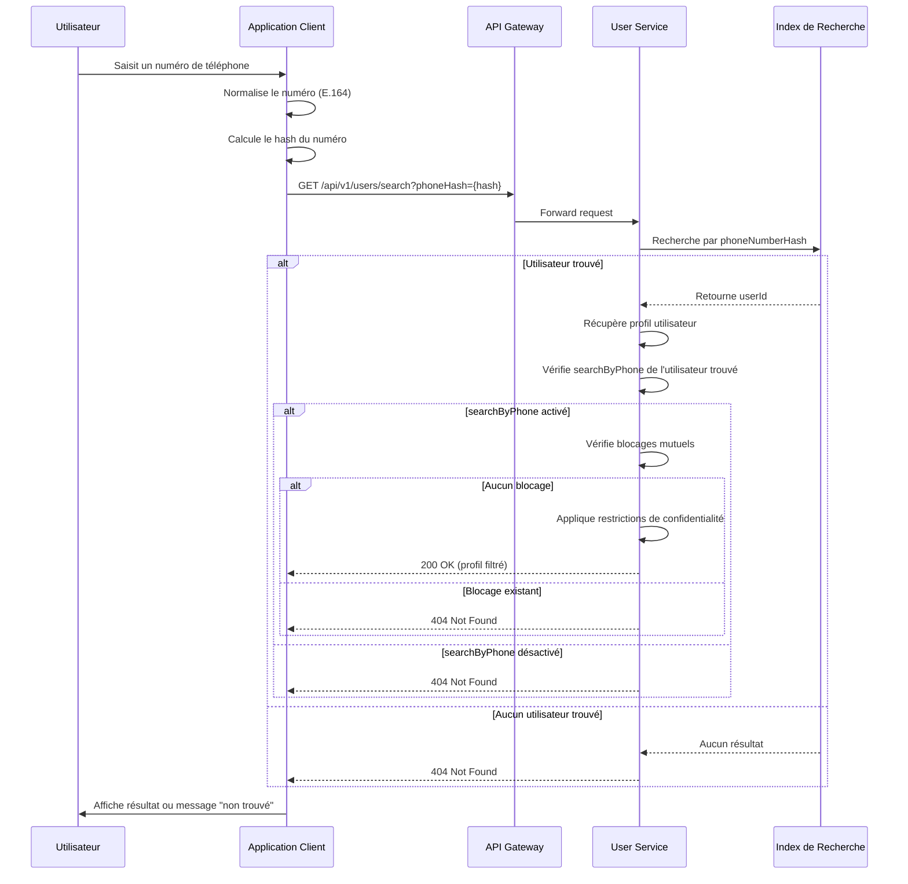
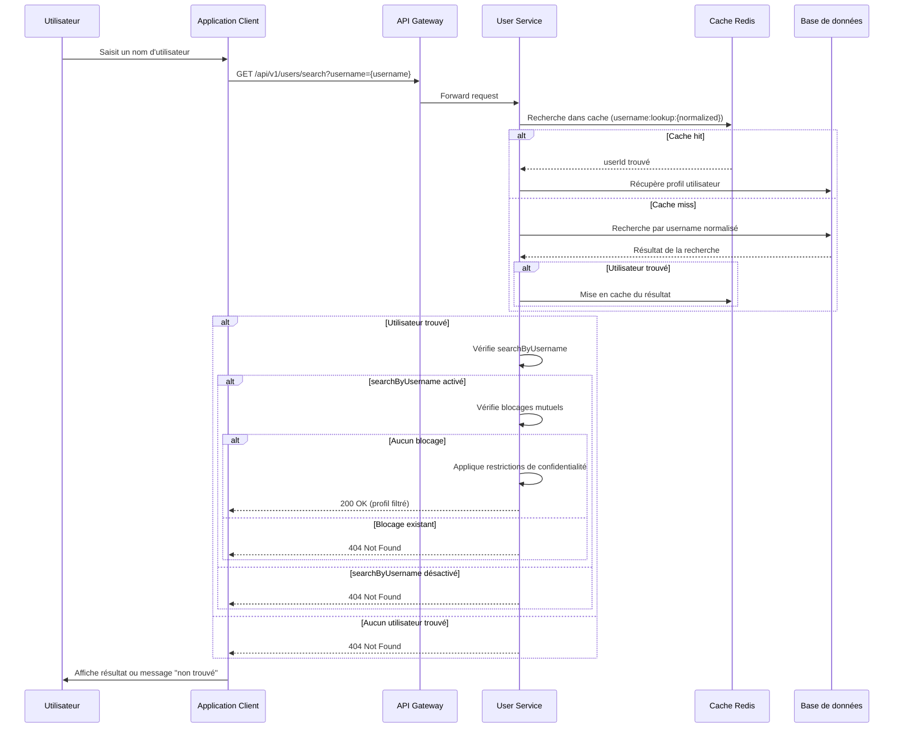
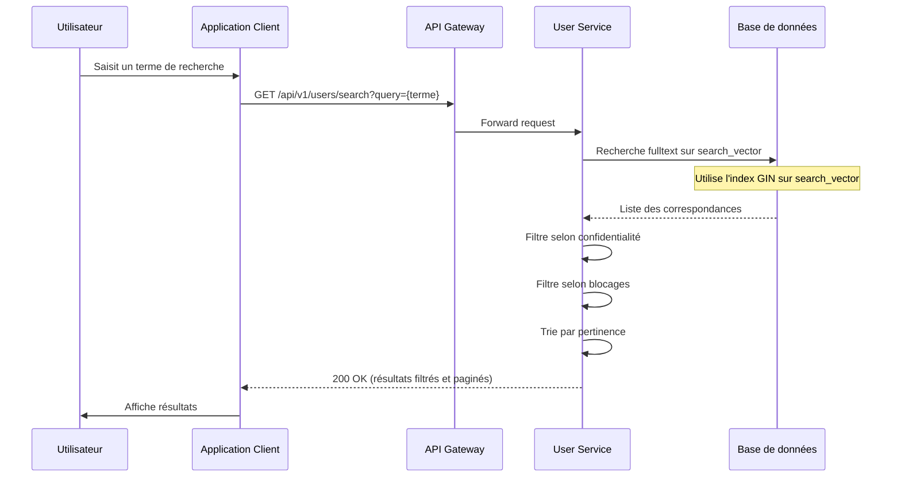
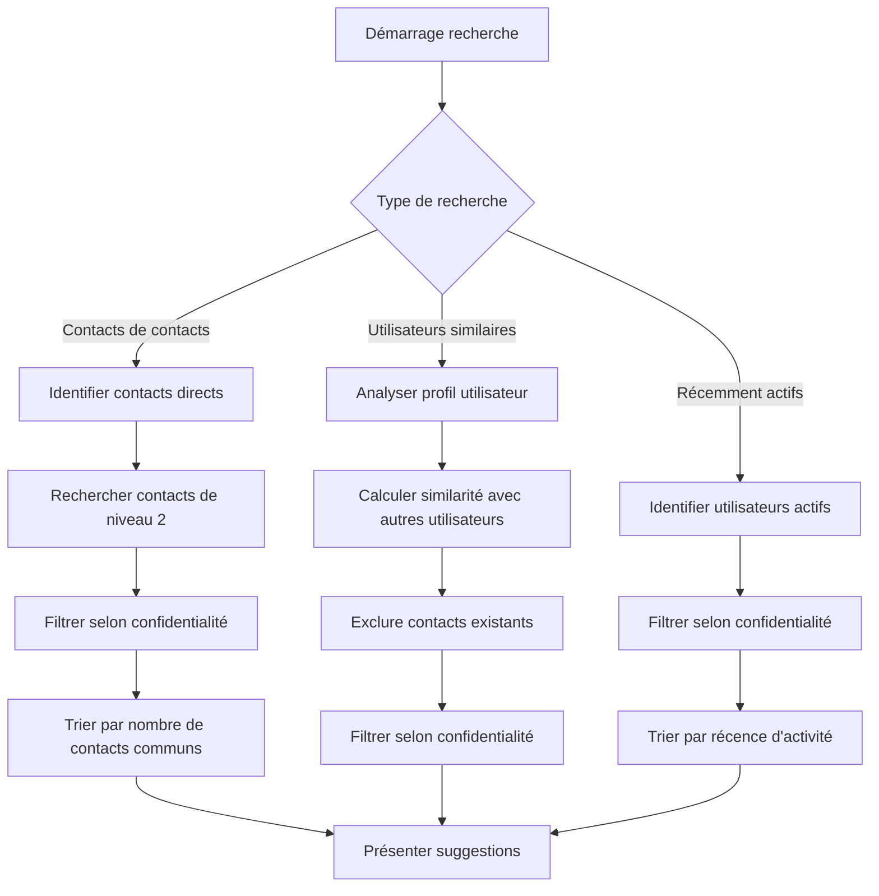

# Spécification Fonctionnelle - Recherche d'Utilisateurs

## 1. Vue d'ensemble

### 1.1 Objectif

Cette spécification détaille les fonctionnalités de recherche d'utilisateurs de l'application Whispr. Elle couvre les mécanismes de recherche par numéro de téléphone, nom d'utilisateur, et autres critères, ainsi que les optimisations nécessaires pour respecter les contraintes de performance et de confidentialité. Ces fonctionnalités sont essentielles pour permettre aux utilisateurs de se connecter avec leurs contacts et de construire leur réseau social au sein de l'application.

### 1.2 Principes clés

- **Respect de la confidentialité**: Les recherches respectent strictement les paramètres de confidentialité définis par les utilisateurs
- **Performance optimale**: Indexation et mise en cache pour des résultats rapides même avec un grand nombre d'utilisateurs
- **Sécurité des données**: Protection des informations sensibles comme les numéros de téléphone
- **Expérience utilisateur fluide**: Interface intuitive et résultats pertinents
- **Protection contre les abus**: Limitations et détection des comportements suspects

### 1.3 Composants fonctionnels

Le système de recherche d'utilisateurs comprend quatre processus principaux:
1. **Recherche par numéro de téléphone**: Trouver des utilisateurs à partir de numéros de téléphone hachés
2. **Recherche par nom d'utilisateur**: Recherche exacte et approximative des noms d'utilisateur
3. **Recherche par nom/prénom**: Recherche textuelle dans les informations de profil
4. **Découverte intelligente**: Suggestions basées sur des contacts communs et autres facteurs

## 2. Recherche par numéro de téléphone

### 2.1 Processus de recherche



### 2.2 Normalisation et hachage des numéros

1. **Normalisation E.164**:
   - Conversion au format international avec indicatif pays
   - Suppression des caractères non numériques
   - Exemple: `+33612345678`

2. **Procédure de hachage**:
   - Utilisation de SHA-256 avec sel côté client
   - Format: `SHA-256(phoneNumber + staticSalt)`
   - Transmission uniquement du hash, jamais du numéro en clair

3. **Indexation côté serveur**:
   - Table dédiée `USER_SEARCH_INDEX` avec colonne `phone_number_hash`
   - Index optimisé pour les recherches exactes
   - Mise à jour synchronisée avec les modifications de numéro

### 2.3 Règles métier pour la recherche par téléphone

1. **Visibilité contrôlée**:
   - Recherche conditionnée par le paramètre `searchByPhone` de l'utilisateur cible
   - Indistinguabilité entre "n'existe pas" et "existe mais non recherchable"

2. **Protection des données**:
   - Aucun stockage ou transmission de numéros en clair dans les logs
   - Validation côté serveur du format des hash pour prévenir les attaques
   - Rate limiting spécifique: 20 recherches par minute maximum

3. **Optimisations**:
   - Cache Redis pour les résultats fréquents
   - Structure d'index spécialisée avec clé `phone:lookup:{phoneHash}`
   - Algorithme de recherche O(1) pour les correspondances exactes

## 3. Recherche par nom d'utilisateur

### 3.1 Processus de recherche



### 3.2 Normalisation et indexation des noms d'utilisateur

1. **Normalisation**:
   - Conversion en minuscules
   - Suppression des accents et caractères spéciaux
   - Format stocké: `username_normalized` dans la table `USER_SEARCH_INDEX`

2. **Indexation**:
   - Index unique sur la colonne normalisée pour recherches exactes
   - Index secondaire de type trigram pour recherches approximatives
   - Structure Redis optimisée: `username:lookup:{normalizedUsername}`

3. **Validation**:
   - Format validé: alphanumérique avec '_' et '.', 3-30 caractères
   - Unicité vérifiée lors de la création/modification (insensible à la casse)
   - Liste de noms réservés non autorisés (admin, support, system, etc.)

### 3.3 Règles métier pour la recherche par nom d'utilisateur

1. **Précision et pertinence**:
   - Recherche exacte prioritaire
   - Recherche approximative (distance de Levenshtein ≤ 2) en second
   - Option de recherche par préfixe pour l'autocomplétion

2. **Visibilité contrôlée**:
   - Recherche conditionnée par le paramètre `searchByUsername` de l'utilisateur cible
   - Indistinguabilité entre "n'existe pas" et "existe mais non recherchable"

3. **Protection contre les abus**:
   - Rate limiting: 30 recherches par minute maximum
   - Détection des recherches séquentielles ou par motif
   - Blocage temporaire après comportements suspects

## 4. Recherche par nom/prénom

### 4.1 Processus de recherche



### 4.2 Indexation fulltext et scoring

1. **Vecteur de recherche**:
   - Structure PostgreSQL `tsvector` dans la table `USER_SEARCH_INDEX`
   - Composition: `setweight(to_tsvector('simple', username), 'A') || setweight(to_tsvector('simple', first_name), 'B') || setweight(to_tsvector('simple', last_name), 'C')`
   - Index GIN pour les performances: `CREATE INDEX idx_user_search_fulltext ON user_search_index USING GIN(search_vector);`

2. **Scoring et pertinence**:
   - Poids différenciés: username (A=1.0), prénom (B=0.4), nom (C=0.2)
   - Algorithme de ranking: `ts_rank_cd(search_vector, query, 32)`
   - Boost pour les contacts existants de l'utilisateur (+0.5)
   - Boost pour les utilisateurs actifs récemment (+0.3)

3. **Optimisations**:
   - Mise à jour automatique via trigger sur modification des données de profil
   - Tokenisation adaptée aux différentes langues
   - Dictionnaires personnalisés pour les termes spécifiques

### 4.3 Règles métier pour la recherche textuelle

1. **Respect de la confidentialité**:
   - Exclusion automatique des utilisateurs ayant désactivé la recherche
   - Filtrage selon les niveaux de confidentialité (first_name_privacy, last_name_privacy)
   - Respect des blocages mutuels

2. **Limites et pagination**:
   - Maximum 20 résultats par page
   - Pagination obligatoire sur toutes les requêtes
   - Limitation à 100 résultats maximum au total

3. **Optimisations UX**:
   - Mise en surbrillance des termes correspondants
   - Catégorisation des résultats (contacts existants, récemment actifs, etc.)
   - Suggestions intelligentes en cas de résultats limités

## 5. Découverte intelligente d'utilisateurs

### 5.1 Algorithme de suggestions



### 5.2 Mécanismes de suggestion

1. **Contacts de contacts**:
   - Algorithme de parcours de graphe social de niveau 2 (amis d'amis)
   - Score basé sur le nombre de contacts communs
   - Exclusion des utilisateurs déjà contactés ou rejetés précédemment

2. **Utilisateurs avec intérêts similaires**:
   - Analyse des groupes communs
   - Traitement sémantique des biographies pour identifier des centres d'intérêt
   - Patterns d'interaction similaires

3. **Utilisateurs récemment actifs**:
   - Priorisation des utilisateurs actifs dans les dernières 24h
   - Boost pour les utilisateurs avec activité similaire
   - Consideration des fuseaux horaires pour la pertinence

### 5.3 Règles métier pour la découverte

1. **Respect de la vie privée**:
   - Suggestions uniquement d'utilisateurs avec `searchByPhone` ou `searchByUsername` activé
   - Option utilisateur pour désactiver complètement les suggestions
   - Mécanisme de feedback "Ne plus suggérer"

2. **Personnalisation**:
   - Apprentissage des préférences basé sur les interactions précédentes
   - Diversification des suggestions pour éviter les bulles de filtre
   - Rafraîchissement périodique du pool de suggestions

3. **Limites et contraintes**:
   - Maximum 20 suggestions par jour
   - Périodicité des suggestions (pas de spam)
   - Exclusion automatique après 3 rejets consécutifs

## 6. Indexation et structures de données

### 6.1 Schéma de la table d'index de recherche

```sql
CREATE TABLE user_search_index (
    user_id UUID PRIMARY KEY REFERENCES users(id) ON DELETE CASCADE,
    phone_number_hash VARCHAR(64) NOT NULL,
    username_normalized VARCHAR(30),
    first_name_normalized VARCHAR(50) NOT NULL,
    last_name_normalized VARCHAR(50),
    search_vector TSVECTOR NOT NULL,
    last_active TIMESTAMP,
    contact_count INTEGER DEFAULT 0,
    profile_score FLOAT DEFAULT 1.0,
    updated_at TIMESTAMP NOT NULL DEFAULT NOW()
);

CREATE INDEX idx_user_search_phone_hash ON user_search_index(phone_number_hash);
CREATE INDEX idx_user_search_username ON user_search_index(username_normalized);
CREATE INDEX idx_user_search_name ON user_search_index(first_name_normalized, last_name_normalized);
CREATE INDEX idx_user_search_fulltext ON user_search_index USING GIN(search_vector);
CREATE INDEX idx_user_search_activity ON user_search_index(last_active);
CREATE INDEX idx_user_search_score ON user_search_index(profile_score);
```

### 6.2 Structures de cache Redis

```
# Lookup rapide par nom d'utilisateur
username:lookup:{normalizedUsername} → userId
TTL: permanent (invalidé lors des modifications)

# Lookup rapide par hash de téléphone
phone:lookup:{phoneHash} → userId
TTL: permanent (invalidé lors des modifications)

# Cache des résultats de recherche populaires
search:results:{queryHash} → [array_of_userIds]
TTL: 15 minutes

# Index des contacts de second niveau (contacts de contacts)
user:network:{userId}:l2 → [scored_array_of_userIds]
TTL: 24 heures

# Index des suggestions personnalisées
user:suggestions:{userId} → [scored_array_of_suggestions]
TTL: 6 heures
```

### 6.3 Maintenance des index

1. **Mise à jour synchrone**:
   - Trigger PostgreSQL après INSERT/UPDATE sur la table users
   - Mise à jour immédiate des index Redis en cas de modification de username ou phone

2. **Mise à jour asynchrone**:
   - Recalcul périodique des scores de profil (tâche planifiée)
   - Régénération des suggestions personnalisées (tâche quotidienne)
   - Mise à jour des statistiques d'activité (tâche horaire)

3. **Gestion des données obsolètes**:
   - Purge des entrées Redis non utilisées après 30 jours
   - Revalidation des hash téléphone après changement de numéro
   - Rotation des clés de sel périodiquement (sécurité)

## 7. Algorithmes de recherche

### 7.1 Recherche exacte par hash de téléphone

```typescript
// Pseudo-code de l'algorithme
async function searchByPhoneHash(phoneHash: string): Promise<User | null> {
  // 1. Essayer d'abord le cache Redis (O(1) lookup)
  const cachedUserId = await redis.get(`phone:lookup:${phoneHash}`);
  
  if (cachedUserId) {
    const user = await userRepository.findById(cachedUserId);
    if (user && isSearchableByPhone(user) && !hasBlockingRelation(user)) {
      return applyPrivacyFilter(user);
    }
    return null;
  }
  
  // 2. Si non trouvé, rechercher dans la base de données
  const searchResult = await userSearchRepository.findByPhoneHash(phoneHash);
  
  if (!searchResult) {
    return null;
  }
  
  // 3. Mettre en cache pour les futures recherches
  await redis.set(`phone:lookup:${phoneHash}`, searchResult.userId);
  
  // 4. Vérifier les conditions de visibilité
  const user = await userRepository.findById(searchResult.userId);
  if (user && isSearchableByPhone(user) && !hasBlockingRelation(user)) {
    return applyPrivacyFilter(user);
  }
  
  return null;
}
```

### 7.2 Recherche par nom d'utilisateur avec fallback approximatif

```typescript
// Pseudo-code de l'algorithme
async function searchByUsername(username: string): Promise<User | null> {
  // Normalisation du nom d'utilisateur
  const normalizedUsername = normalizeUsername(username);
  
  // 1. Recherche exacte (O(1) lookup)
  const exactMatch = await findExactUsernameMatch(normalizedUsername);
  if (exactMatch) {
    return exactMatch;
  }
  
  // 2. Si aucune correspondance exacte, essayer recherche approximative
  if (username.length >= 3) {
    const similarMatches = await findSimilarUsernames(normalizedUsername);
    
    // Trier par similarité et filtrer selon la confidentialité
    const filteredMatches = filterByPrivacyAndBlocking(similarMatches);
    
    if (filteredMatches.length > 0) {
      return filteredMatches[0]; // Retourner la meilleure correspondance
    }
  }
  
  return null;
}

async function findSimilarUsernames(normalized: string): Promise<User[]> {
  // Utiliser l'extension pg_trgm pour les correspondances approximatives
  const query = `
    SELECT * FROM user_search_index
    WHERE similarity(username_normalized, $1) > 0.4
    ORDER BY similarity(username_normalized, $1) DESC
    LIMIT 5
  `;
  
  return executeQuery(query, [normalized]);
}
```

### 7.3 Recherche fulltext avec ranking

```typescript
// Pseudo-code de l'algorithme
async function searchByQuery(
  query: string,
  options: SearchOptions
): Promise<SearchResults> {
  // 1. Préparation de la requête
  const searchQuery = prepareSearchQuery(query);
  const tsQuery = toTsQuery(searchQuery);
  
  // 2. Vérifier le cache pour les requêtes fréquentes
  const cacheKey = `search:results:${hashString(query + JSON.stringify(options))}`;
  const cachedResults = await redis.get(cacheKey);
  
  if (cachedResults && !options.skipCache) {
    return JSON.parse(cachedResults);
  }
  
  // 3. Exécuter la recherche fulltext avec ranking
  const rawResults = await executeFulltextSearch(tsQuery, options);
  
  // 4. Post-traitement des résultats
  const processedResults = await postProcessResults(rawResults, options);
  
  // 5. Mettre en cache les résultats
  if (processedResults.total > 0) {
    await redis.set(cacheKey, JSON.stringify(processedResults), 'EX', 900); // 15min
  }
  
  return processedResults;
}

async function executeFulltextSearch(
  tsQuery: any,
  options: SearchOptions
): Promise<RawSearchResult[]> {
  // Construire une requête SQL optimisée
  const query = `
    SELECT
      u.id,
      u.username,
      u.first_name,
      u.last_name,
      u.profile_picture_url,
      ts_rank_cd(si.search_vector, to_tsquery('simple', $1), 32) AS rank,
      similarity(
        concat_ws(' ', si.username_normalized, si.first_name_normalized, si.last_name_normalized),
        $2
      ) AS text_similarity
    FROM
      users u
    JOIN
      user_search_index si ON u.id = si.user_id
    LEFT JOIN
      privacy_settings ps ON u.id = ps.user_id
    WHERE
      si.search_vector @@ to_tsquery('simple', $1)
      AND u.is_active = true
      AND (
        ps.search_by_username = true
        OR ps.search_by_phone = true
      )
      ${buildPrivacyFilters()}
      ${buildBlockingFilters()}
    ORDER BY
      CASE WHEN si.user_id IN (${options.boostUserIds.join(',')}) THEN 1 ELSE 0 END DESC,
      rank DESC,
      text_similarity DESC
    LIMIT $3
    OFFSET $4
  `;
  
  return executeQuery(query, [
    tsQuery,
    options.rawQuery.toLowerCase(),
    options.limit,
    options.offset
  ]);
}
```

### 7.4 Algorithme de suggestion de contacts

```typescript
// Pseudo-code de l'algorithme
async function suggestContacts(
  userId: string,
  limit: number = 10
): Promise<UserSuggestion[]> {
  // 1. Récupérer les contacts existants
  const existingContacts = await getExistingContacts(userId);
  const existingContactIds = new Set(existingContacts.map(c => c.id));
  
  // 2. Trouver les contacts de second niveau (contacts des contacts)
  const l2Contacts = await findSecondLevelContacts(userId, existingContactIds);
  
  // 3. Trouver les utilisateurs similaires (groupes communs, etc.)
  const similarUsers = await findSimilarUsers(userId, existingContactIds);
  
  // 4. Combiner et scorer les suggestions
  const allSuggestions = [
    ...l2Contacts.map(c => ({ ...c, score: c.score * 1.2 })), // Boost contacts de contacts
    ...similarUsers
  ];
  
  // 5. Trier par score et filtrer selon confidentialité
  const rankedSuggestions = allSuggestions
    .sort((a, b) => b.score - a.score)
    .filter(s => isVisible(s, userId))
    .slice(0, limit);
  
  // 6. Mettre en cache pour optimisation
  cacheUserSuggestions(userId, rankedSuggestions);
  
  return rankedSuggestions;
}

async function findSecondLevelContacts(
  userId: string,
  existingContactIds: Set<string>
): Promise<UserSuggestion[]> {
  // Récupérer depuis le cache si disponible
  const cacheKey = `user:network:${userId}:l2`;
  const cachedL2 = await redis.get(cacheKey);
  
  if (cachedL2) {
    return JSON.parse(cachedL2).filter(c => !existingContactIds.has(c.id));
  }
  
  // Sinon, calculer les contacts de niveau 2
  const query = `
    WITH user_contacts AS (
      SELECT contact_id FROM contacts WHERE user_id = $1
    ),
    level2_contacts AS (
      SELECT
        c.contact_id AS suggestion_id,
        u.username,
        u.first_name,
        u.last_name,
        u.profile_picture_url,
        COUNT(DISTINCT c.user_id) AS common_contacts_count
      FROM
        contacts c
      JOIN
        user_contacts uc ON c.user_id = uc.contact_id
      JOIN
        users u ON c.contact_id = u.id
      LEFT JOIN
        privacy_settings ps ON u.id = ps.user_id
      WHERE
        c.contact_id != $1
        AND c.contact_id NOT IN (SELECT contact_id FROM user_contacts)
        AND (ps.search_by_username = true OR ps.search_by_phone = true)
      GROUP BY
        c.contact_id, u.username, u.first_name, u.last_name, u.profile_picture_url
      ORDER BY
        common_contacts_count DESC
      LIMIT 50
    )
    SELECT * FROM level2_contacts
  `;
  
  const results = await executeQuery(query, [userId]);
  
  // Transformer les résultats en suggestions avec score
  const suggestions = results.map(r => ({
    id: r.suggestion_id,
    username: r.username,
    firstName: r.first_name,
    lastName: r.last_name,
    profilePictureUrl: r.profile_picture_url,
    score: Math.min(1.0, r.common_contacts_count * 0.2),
    reason: 'common_contacts',
    commonContactsCount: r.common_contacts_count
  }));
  
  // Mettre en cache
  await redis.set(cacheKey, JSON.stringify(suggestions), 'EX', 86400); // 24h
  
  return suggestions;
}
```

## 8. Sécurité et protection de la vie privée

### 8.1 Protection des données sensibles

1. **Pseudonymisation des identifiants**:
   - Les numéros de téléphone ne sont jamais envoyés en clair
   - Hachage côté client avec sel pour éviter les attaques par dictionnaire
   - Validation des formats de hash côté serveur pour prévenir les injections

2. **Minimisation des données exposées**:
   - Filtrage des attributs selon les paramètres de confidentialité
   - Masquage partiel des identifiants sensibles dans les logs (123****789)
   - Limitation des champs retournés au minimum nécessaire

3. **Audit et traçabilité**:
   - Journalisation des recherches sensibles ou à volume élevé
   - Détection des patterns de recherche anormaux
   - Conservation limitée des logs de recherche (15 jours maximum)

### 8.2 Protection contre les attaques

1. **Mesures anti-scraping**:
   - Rate limiting adaptatif selon le type de recherche
   - Détection des séquences de recherche systématiques
   - CAPTCHAs pour les comportements suspects
   - Limitation du nombre total de résultats accessibles

2. **Restrictions pour contrer l'énumération**:
   - Indiscernabilité entre "n'existe pas" et "existe mais non accessible"
   - Temps de réponse normalisé pour éviter les timing attacks
   - Pagination obligatoire pour toutes les recherches avec résultats multiples

3. **Sécurisation des communications**:
   - Validation des tokens JWT pour toutes les requêtes
   - Vérification de l'origine des requêtes
   - Protection contre les attaques CSRF
   - Chiffrement TLS pour toutes les communications

### 8.3 Respect des paramètres de confidentialité

1. **Application stricte des préférences**:
   - Respect absolu des paramètres searchByPhone et searchByUsername
   - Vérification systématique des niveaux de confidentialité sur les attributs
   - Exclusion automatique des utilisateurs bloqués ou bloquants

2. **Niveaux de visibilité**:
   - Public (everyone) : visible dans les résultats de recherche générale
   - Contacts (contacts) : visible uniquement pour les utilisateurs qui ont déjà le contact
   - Privé (nobody) : jamais visible dans les résultats de recherche

3. **Contrôle utilisateur**:
   - Interface claire pour configurer les paramètres de recherche
   - Option "Ne plus me suggérer à cet utilisateur"
   - Possibilité de masquer temporairement sa présence en ligne

## 9. Optimisations de performance

### 9.1 Stratégies de mise en cache

1. **Cache multi-niveaux**:
   - Cache L1: En mémoire de l'application (TTL court, 5 minutes)
   - Cache L2: Redis distribué (TTL moyen, 30 minutes)
   - Cache L3: PostgreSQL avec index optimisés (persistant)

2. **Catégories de cache**:
   - Résultats de recherche populaires: `search:results:{queryHash}`
   - Résolutions d'identifiants: `username:lookup:{username}`, `phone:lookup:{phoneHash}`
   - Données temporaires: `user:network:{userId}:l2`, `user:suggestions:{userId}`

3. **Stratégies d'invalidation**:
   - Invalidation ciblée lors des mises à jour de profil
   - Invalidation cascade pour les relations dépendantes
   - TTL adapté selon la nature des données
   - Invalidation préemptive pour les données sensibles

### 9.2 Optimisation des requêtes

1. **Index spécialisés**:
   - Index GIN pour la recherche fulltext
   - Index B-tree pour les recherches exactes (username, phoneHash)
   - Index bitmap pour les filtres booléens fréquents
   - Index sur les