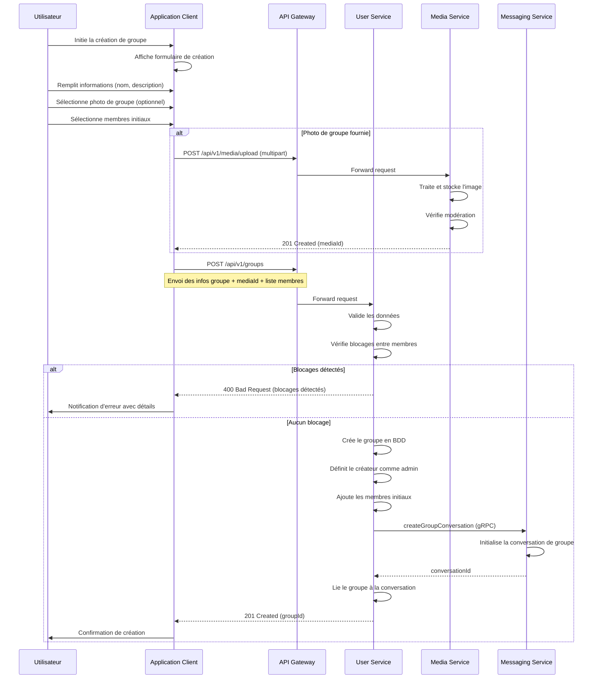
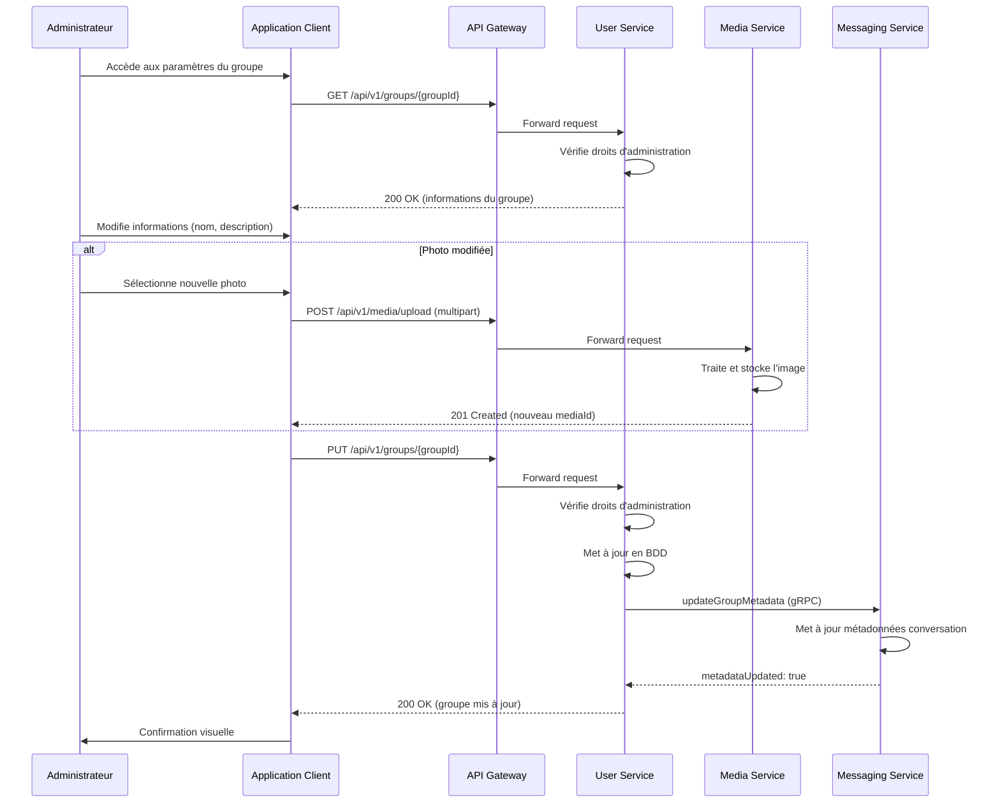
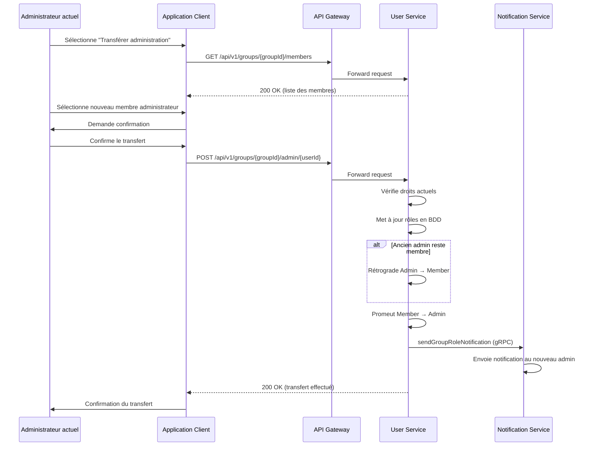
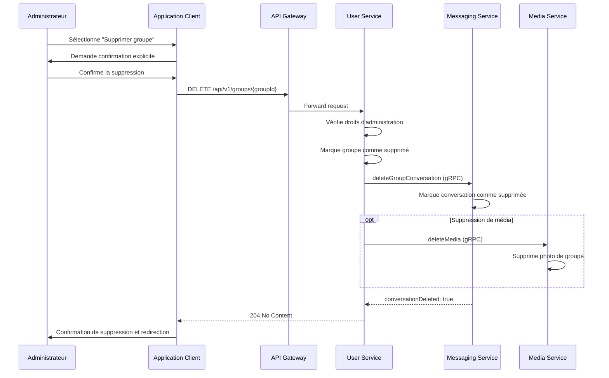
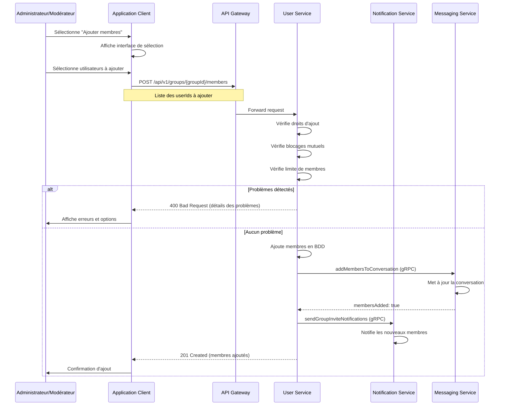
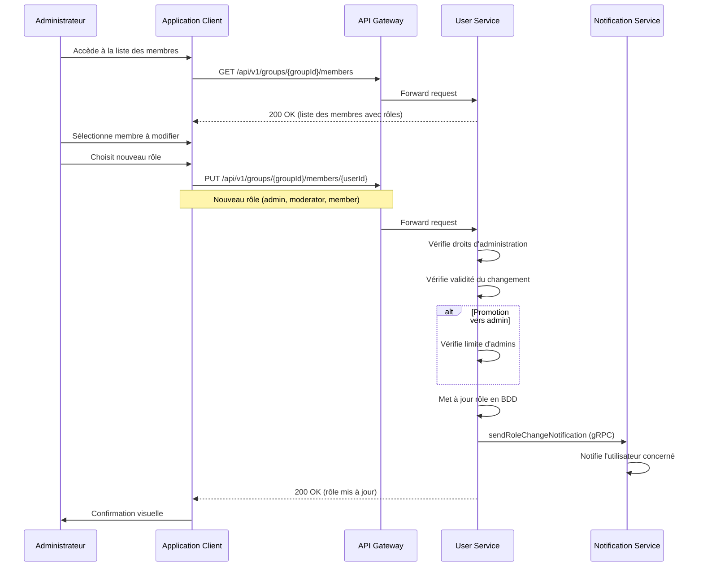
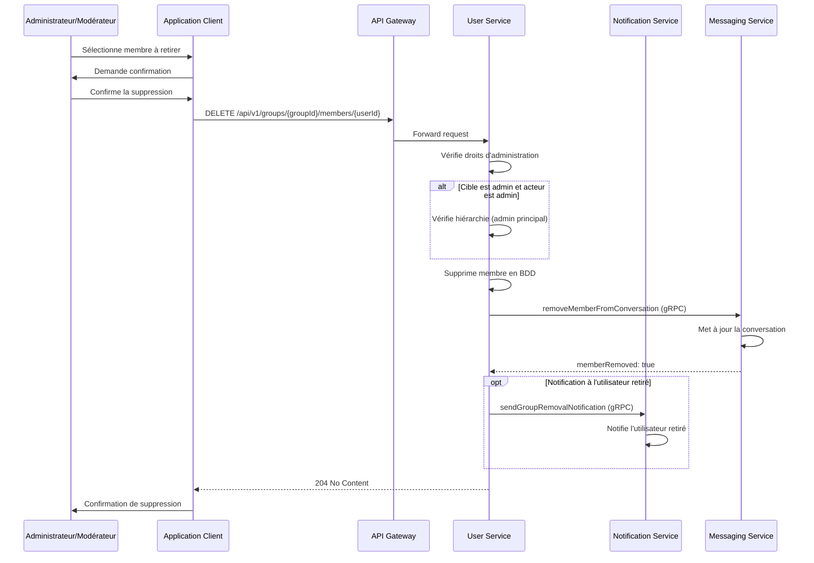
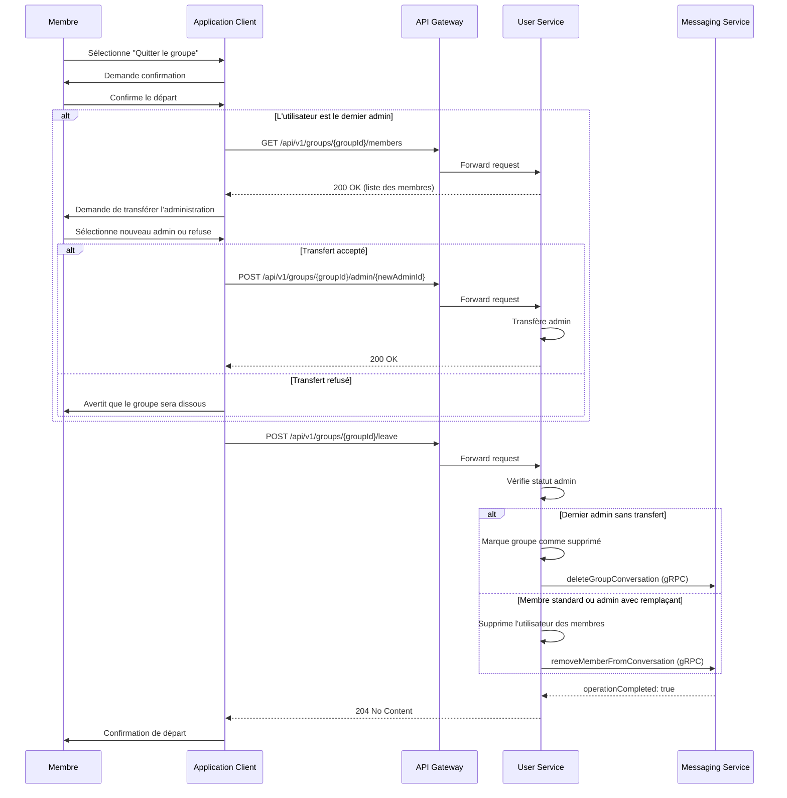
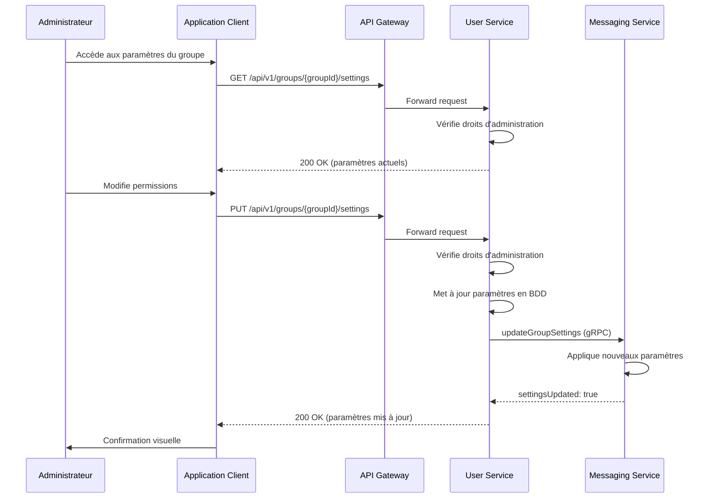
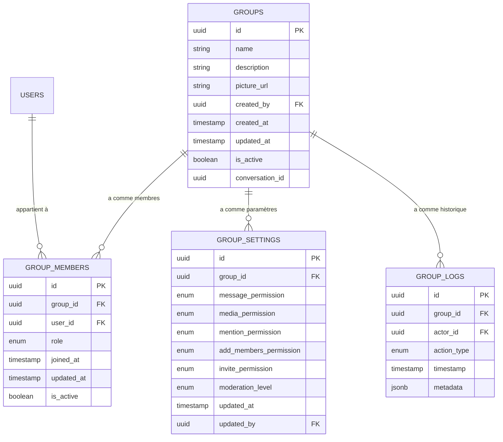

# Spécification Fonctionnelle - Gestion des Groupes

## 1. Vue d'ensemble

### 1.1 Objectif

Cette spécification détaille les fonctionnalités de gestion des groupes de l'application Whispr. Elle couvre la création de groupes, l'administration, la gestion des membres, les rôles et permissions, ainsi que les interactions entre les utilisateurs au sein des groupes. Cette fonctionnalité est essentielle pour permettre aux utilisateurs de communiquer en groupe tout en maintenant un contrôle précis sur la confidentialité et les interactions.

### 1.2 Principes clés

- **Contrôle administratif flexible** : Hiérarchie de rôles claire pour une gestion efficace des groupes
- **Sécurité et modération** : Outils pour maintenir un environnement de communication sain
- **Confidentialité et contrôle** : Respect des paramètres de blocage et de confidentialité
- **Expérience utilisateur intuitive** : Interface simple pour toutes les opérations de gestion
- **Performance et évolutivité** : Structure conçue pour supporter efficacement des groupes de grande taille

### 1.3 Composants fonctionnels

Le système de gestion des groupes comprend cinq processus principaux :
1. **Création et configuration de groupe** : Création et paramétrage initial
2. **Administration des groupes** : Gestion et mise à jour des informations du groupe
3. **Gestion des membres** : Ajout, suppression et gestion des rôles des participants
4. **Contrôle des interactions** : Gestion des permissions et des règles de communication
5. **Intégration avec les autres services** : Interactions avec les services de messagerie, de notification et de médias

## 2. Création et configuration de groupe

### 2.1 Processus de création de groupe



### 2.2 Informations de configuration initiale

1. **Attributs requis** :
   - Nom du groupe : 3-100 caractères, obligatoire
   - Membres initiaux : 1-50 utilisateurs, créateur inclus automatiquement

2. **Attributs optionnels** :
   - Description du groupe : jusqu'à 500 caractères
   - Photo de groupe : image de profil du groupe (JPEG, PNG, WebP, max 5 MB)
   - Règles de modération : paramètres initiaux de modération de contenu

3. **Limites et restrictions** :
   - Taille maximale initiale : 50 membres (extensible ensuite jusqu'à 200)
   - Maximum de groupes par utilisateur : 500 (créés ou rejoints)
   - Rate limiting : maximum 10 créations de groupe par jour par utilisateur

### 2.3 Règles métier pour la création de groupes

1. **Vérification des blocages** :
   - Impossible d'ajouter dans un même groupe deux utilisateurs qui se sont mutuellement bloqués
   - Notification explicite en cas de tentative d'ajout incompatible
   - Option d'ajout partiel (ignorer les utilisateurs problématiques)

2. **Attribution des rôles initiaux** :
   - Le créateur reçoit automatiquement le rôle d'administrateur
   - Les autres membres reçoivent le rôle de membre standard
   - Option pour définir des modérateurs lors de la création

3. **Initialisation des métadonnées** :
   - Horodatage de création pour le suivi d'ancienneté
   - Identifiant unique de groupe (UUID)
   - Liaison avec la conversation créée dans le messaging-service

## 3. Administration des groupes

### 3.1 Mise à jour des informations du groupe



### 3.2 Transfert des droits d'administration



### 3.3 Suppression d'un groupe



### 3.4 Règles métier pour l'administration

1. **Niveaux de droits administratifs** :
   - Admin principal : droits complets, peut transférer l'administration
   - Modérateur : droits limités, peut gérer les membres mais pas modifier la structure du groupe

2. **Restrictions et contraintes** :
   - La suppression d'un groupe est irréversible après une période de grâce (7 jours)
   - Nombre maximum d'administrateurs secondaires : 10
   - Le transfert d'administration nécessite une confirmation explicite
   - Conservation de l'historique des changements administratifs

3. **Propagation des modifications** :
   - Les changements de métadonnées sont synchronisés avec le messaging-service
   - Notifications aux membres pour les changements significatifs
   - Journal d'audit pour les opérations administratives

## 4. Gestion des membres

### 4.1 Ajout de membres



### 4.2 Gestion des rôles de membres



### 4.3 Suppression de membres



### 4.4 Départ volontaire d'un groupe



### 4.5 Règles métier pour la gestion des membres

1. **Hiérarchie des rôles** :
   - Admin principal (créateur ou désigné) : droits complets
   - Admins secondaires : peuvent gérer membres et contenu
   - Modérateurs : peuvent modérer le contenu et gérer les membres standard
   - Membres : droits de participation standard

2. **Contrôles d'accès** :
   - Les administrateurs peuvent ajouter/retirer des membres
   - Les modérateurs peuvent retirer des membres standard uniquement
   - Un administrateur ne peut retirer un autre administrateur que s'il est l'admin principal
   - Les administrateurs peuvent promouvoir des membres comme modérateurs

3. **Règles particulières** :
   - Si le dernier administrateur quitte, le groupe est supprimé sauf transfert d'administration
   - Impossible d'ajouter un utilisateur qui a bloqué ou est bloqué par un membre existant
   - Alertes aux administrateurs quand le groupe approche sa limite de capacité (90%)
   - Option de départ silencieux (sans notification aux autres membres)

## 5. Contrôle des interactions et paramètres de groupe

### 5.1 Configuration des permissions de groupe



### 5.2 Types de permissions configurables

1. **Permissions de communication** :
   - Envoi de messages : tous les membres, modérateurs uniquement, administrateurs uniquement
   - Envoi de médias : tous, modérateurs+, administrateurs uniquement
   - Mentions de groupe (@everyone) : tous, modérateurs+, administrateurs uniquement

2. **Permissions d'administration** :
   - Ajout de membres : administrateurs uniquement, modérateurs+
   - Modification des informations du groupe : administrateurs uniquement
   - Épinglage de messages : administrateurs uniquement, modérateurs+

3. **Règles de modération** :
   - Niveau de modération automatique : léger, modéré, strict
   - Détection automatique de contenu inapproprié : activée/désactivée
   - Filtre de contenu sensible : activé/désactivé

### 5.3 Règles métier pour les paramètres

1. **Application des permissions** :
   - Les permissions s'appliquent immédiatement après modification
   - Les administrateurs sont toujours exemptés des restrictions
   - Notification aux membres lors des changements de permissions significatifs

2. **Cas particuliers** :
   - Groups en mode "lecture seule" : seuls les admins peuvent poster
   - Groupes d'annonces : communication unidirectionnelle
   - Groupes restreints : invitation sur approbation uniquement

3. **Fonctionnalités avancées** :
   - Périodes de slowmode (limitation temporaire de fréquence de messages)
   - Verrouillage temporaire du groupe en cas d'activité suspecte
   - Paramètres de notification personnalisables par groupe

## 6. Modèle de données

### 6.1 Schéma des tables principales



### 6.2 Tables PostgreSQL détaillées

#### 6.2.1 Table GROUPS
```sql
CREATE TABLE groups (
    id UUID PRIMARY KEY DEFAULT uuid_generate_v4(),
    name VARCHAR(100) NOT NULL,
    description TEXT,
    picture_url VARCHAR(255),
    created_by UUID NOT NULL REFERENCES users(id),
    conversation_id UUID,
    created_at TIMESTAMP NOT NULL DEFAULT NOW(),
    updated_at TIMESTAMP NOT NULL DEFAULT NOW(),
    is_active BOOLEAN NOT NULL DEFAULT TRUE
);

CREATE INDEX idx_groups_name ON groups(name);
CREATE INDEX idx_groups_created_by ON groups(created_by);
CREATE INDEX idx_groups_created_at ON groups(created_at);
CREATE INDEX idx_groups_is_active ON groups(is_active);
CREATE INDEX idx_groups_conversation_id ON groups(conversation_id);
```

#### 6.2.2 Table GROUP_MEMBERS
```sql
CREATE TYPE group_role AS ENUM ('admin', 'moderator', 'member');

CREATE TABLE group_members (
    id UUID PRIMARY KEY DEFAULT uuid_generate_v4(),
    group_id UUID NOT NULL REFERENCES groups(id) ON DELETE CASCADE,
    user_id UUID NOT NULL REFERENCES users(id) ON DELETE CASCADE,
    role group_role NOT NULL DEFAULT 'member',
    joined_at TIMESTAMP NOT NULL DEFAULT NOW(),
    updated_at TIMESTAMP NOT NULL DEFAULT NOW(),
    is_active BOOLEAN NOT NULL DEFAULT TRUE,
    UNIQUE(group_id, user_id)
);

CREATE INDEX idx_group_members_group_id ON group_members(group_id);
CREATE INDEX idx_group_members_user_id ON group_members(user_id);
CREATE INDEX idx_group_members_role ON group_members(role);
CREATE INDEX idx_group_members_is_active ON group_members(is_active);
```

#### 6.2.3 Table GROUP_SETTINGS
```sql
CREATE TYPE permission_level AS ENUM ('all_members', 'moderators_plus', 'admins_only');
CREATE TYPE moderation_level AS ENUM ('light', 'medium', 'strict');

CREATE TABLE group_settings (
    id UUID PRIMARY KEY DEFAULT uuid_generate_v4(),
    group_id UUID NOT NULL UNIQUE REFERENCES groups(id) ON DELETE CASCADE,
    message_permission permission_level NOT NULL DEFAULT 'all_members',
    media_permission permission_level NOT NULL DEFAULT 'all_members',
    mention_permission permission_level NOT NULL DEFAULT 'all_members',
    add_members_permission permission_level NOT NULL DEFAULT 'moderators_plus',
    invite_permission permission_level NOT NULL DEFAULT 'moderators_plus',
    moderation_level moderation_level NOT NULL DEFAULT 'medium',
    content_filter_enabled BOOLEAN NOT NULL DEFAULT TRUE,
    join_approval_required BOOLEAN NOT NULL DEFAULT FALSE,
    updated_at TIMESTAMP NOT NULL DEFAULT NOW(),
    updated_by UUID REFERENCES users(id)
);

CREATE INDEX idx_group_settings_group_id ON group_settings(group_id);
```

#### 6.2.4 Table GROUP_LOGS
```sql
CREATE TYPE group_action AS ENUM (
    'group_created',
    'group_updated',
    'group_deleted',
    'member_added',
    'member_removed',
    'role_changed',
    'settings_updated',
    'admin_transferred'
);

CREATE TABLE group_logs (
    id UUID PRIMARY KEY DEFAULT uuid_generate_v4(),
    group_id UUID NOT NULL REFERENCES groups(id) ON DELETE CASCADE,
    actor_id UUID REFERENCES users(id),
    action_type group_action NOT NULL,
    timestamp TIMESTAMP NOT NULL DEFAULT NOW(),
    metadata JSONB
);

CREATE INDEX idx_group_logs_group_id ON group_logs(group_id);
CREATE INDEX idx_group_logs_actor_id ON group_logs(actor_id);
CREATE INDEX idx_group_logs_action_type ON group_logs(action_type);
CREATE INDEX idx_group_logs_timestamp ON group_logs(timestamp);
```

### 6.3 Cache Redis

```
# Cache des membres de groupe (accès rapide)
group:members:{groupId} = [{userId, role, joinedAt}, ...]
TTL: 15 minutes

# Cache des groupes d'un utilisateur
user:groups:{userId} = [{groupId, name, role}, ...]
TTL: 30 minutes

# Cache des informations de groupe
group:info:{groupId} = {name, description, pictureUrl, memberCount, ...}
TTL: 15 minutes

# Cache des paramètres de groupe
group:settings:{groupId} = {messagePermission, mediaPermission, ...}
TTL: 15 minutes
```

### 6.4 Endpoints API

| Endpoint | Méthode | Description | Paramètres |
|----------|---------|-------------|------------|
| `/api/v1/groups` | GET | Liste des groupes de l'utilisateur | `page`, `limit` |
| `/api/v1/groups` | POST | Créer un groupe | Infos groupe dans le corps |
| `/api/v1/groups/{groupId}` | GET | Détails d'un groupe | - |
| `/api/v1/groups/{groupId}` | PUT | Modifier un groupe | Infos modifiées dans le corps |
| `/api/v1/groups/{groupId}` | DELETE | Supprimer un groupe | - |
| `/api/v1/groups/{groupId}/members` | GET | Liste des membres | `page`, `limit`, `role` |
| `/api/v1/groups/{groupId}/members` | POST | Ajouter des membres | Liste de `userIds` dans le corps |
| `/api/v1/groups/{groupId}/members/{userId}` | PUT | Modifier le rôle d'un membre | `role` dans le corps |
| `/api/v1/groups/{groupId}/members/{userId}` | DELETE | Retirer un membre | - |
| `/api/v1/groups/{groupId}/leave` | POST | Quitter un groupe | - |
| `/api/v1/groups/{groupId}/admin/{userId}` | POST | Transférer l'administration | - |
| `/api/v1/groups/{groupId}/settings` | GET | Obtenir les paramètres | - |
| `/api/v1/groups/{groupId}/settings` | PUT | Modifier les paramètres | Paramètres dans le corps |
| `/api/v1/groups/{groupId}/logs` | GET | Historique des actions | `page`, `limit`, `actionType` |

## 7. Intégration avec les autres services

### 7.1 Interaction avec Messaging Service

```mermaid
sequenceDiagram
    participant UserService
    participant MessagingService
    
    note over UserService,MessagingService: Lors de la création d'un groupe
    
    UserService->>MessagingService: createGroupConversation (gRPC)
    Note over UserService,MessagingService: groupId, name, creatorId, memberIds
    
    MessagingService->>MessagingService: Crée conversation de groupe
    MessagingService->>MessagingService: Configure participants
    
    MessagingService-->>UserService: conversationId
    
    note over UserService,MessagingService: Lors de l'ajout/retrait de membres
    
    UserService->>MessagingService: updateGroupMembers (gRPC)
    Note over UserService,MessagingService: groupId, addedUserIds, removedUserIds
    
    MessagingService->>MessagingService: Met à jour les participants
    MessagingService-->>UserService: membersUpdated: true
    
    note over UserService,MessagingService: Lors de la mise à