# Spécification Fonctionnelle - Mécanismes Anti-Harcèlement

## 1. Vue d'ensemble

### 1.1 Objectif

Cette spécification définit les mécanismes de protection contre le harcèlement et les abus dans l'application Whispr. Ces fonctionnalités visent à créer un environnement de communication sécurisé en donnant aux utilisateurs un contrôle efficace sur leurs interactions et en implémentant des systèmes de détection et de prévention automatisés.

### 1.2 Principes clés

- **Protection proactive** : Mise en place de mesures préventives avant que le harcèlement ne se produise
- **Contrôle utilisateur** : Outils permettant aux utilisateurs de gérer leurs interactions sociales
- **Détection automatisée** : Systèmes d'identification des comportements suspects
- **Intervention graduée** : Réponses proportionnelles aux infractions détectées
- **Confidentialité** : Protection des données sensibles lors du signalement

### 1.3 Composants fonctionnels

Le système anti-harcèlement s'articule autour de cinq axes principaux :
1. **Système de blocage** : Mécanismes permettant aux utilisateurs de bloquer les interactions indésirables
2. **Détection des comportements suspects** : Algorithmes d'identification automatique des abus
3. **Restrictions automatiques** : Mesures de limitation appliquées aux comptes problématiques
4. **Signalement et modération** : Processus de signalement et de traitement des abus
5. **Protections des groupes** : Mécanismes spécifiques aux conversations de groupe

## 2. Système de blocage

### 2.1 Processus de blocage d'un contact

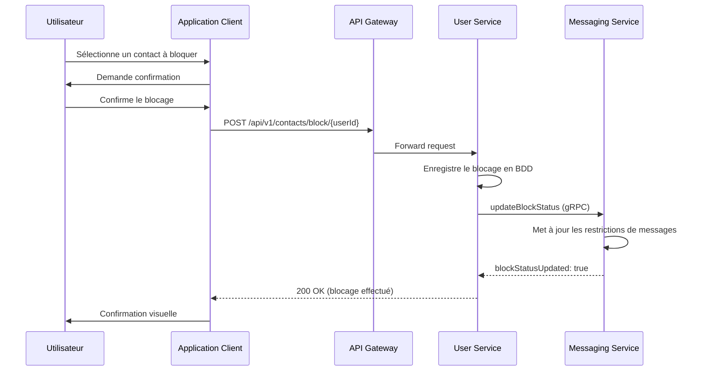

### 2.2 Effets du blocage

1. **Restrictions de communication** :
   - L'utilisateur bloqué ne peut plus envoyer de messages à l'utilisateur ayant effectué le blocage
   - Les tentatives d'envoi de messages sont rejetées avec un code d'erreur approprié
   - Les appels et notifications provenant de l'utilisateur bloqué sont filtrés

2. **Restrictions de visibilité** :
   - Le statut en ligne et l'activité de l'utilisateur ne sont plus visibles pour l'utilisateur bloqué
   - Les mises à jour de profil (photo, statut) ne sont plus visibles pour l'utilisateur bloqué
   - Option de masquage complet du profil pour les utilisateurs bloqués

3. **Gestion des groupes** :
   - Impossibilité d'ajouter un utilisateur bloqué dans un groupe créé par l'utilisateur
   - Notification discrète si l'utilisateur rejoint un groupe contenant une personne qu'il a bloquée
   - Option de quitter automatiquement les groupes rejoints par des utilisateurs bloqués

### 2.3 Règles métier du système de blocage

1. **Réciprocité et asymétrie** :
   - Le blocage est unidirectionnel par défaut (A bloque B, mais B peut toujours voir A)
   - Option de blocage réciproque automatique configurable dans les paramètres
   - Masquage des indicateurs de blocage pour l'utilisateur bloqué ("Message non distribué" plutôt que "Bloqué")

2. **Limites et restrictions** :
   - Nombre maximum d'utilisateurs bloqués : 1000 par compte
   - Délai de déblocage minimal : option de période de "refroidissement" de 24h après blocage
   - Conservation des blocages après désactivation temporaire du compte

3. **Gestion de la liste de blocage** :
   - Interface dédiée pour la gestion des contacts bloqués
   - Possibilité de débloquer en masse ou individuellement
   - Catégorisation optionnelle des blocages (harcèlement, spam, autre)

## 3. Détection des comportements suspects

### 3.1 Mécanismes de détection

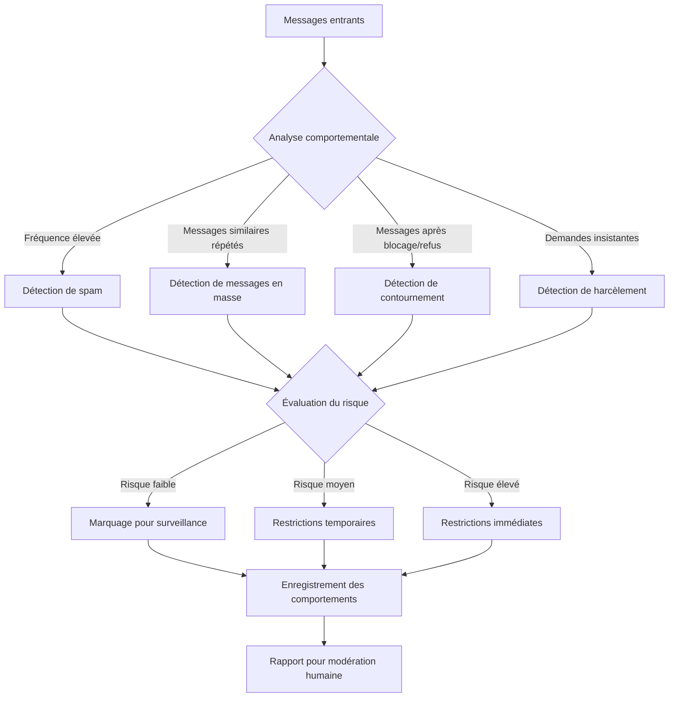

### 3.2 Indicateurs de comportements suspects

1. **Patterns de communication anormaux** :
   - Envoi de messages en rafale (plus de 10 messages en moins de 30 secondes)
   - Tentatives répétées de contact après absence de réponse (plus de 5 tentatives sans réponse)
   - Messages identiques ou très similaires envoyés à de nombreux utilisateurs
   - Démarrage de conversations avec des utilisateurs sans connexion sociale ou contextuelle

2. **Indicateurs spécifiques au contenu** :
   - Utilisation excessive de termes identifiés comme hostiles ou menaçants
   - Demandes répétées d'informations personnelles ou de photos
   - Insistance après refus explicite de l'autre utilisateur
   - Mentions de sujets sensibles dans des contextes inappropriés

3. **Comportements de contournement** :
   - Utilisation de comptes multiples pour contacter un même utilisateur
   - Tentatives de communication alternatives après blocage (via groupes, autres contacts)
   - Création de nouveaux comptes immédiatement après suspension
   - Variations subtiles de messages problématiques pour éviter la détection

### 3.3 Système de score et seuils

1. **Calcul du score de risque** :
   - Score initial: 0 (neutre) pour tout nouvel utilisateur
   - Incrémentation basée sur les comportements détectés (ex: +10 pour message en rafale, +25 pour contournement de blocage)
   - Décrémentation progressive avec le temps et les comportements positifs
   - Multiplicateurs pour récidives et comportements en série

2. **Seuils d'intervention** :
   - Surveillance (score 20-50): monitoring silencieux sans action directe
   - Avertissement (score 51-75): notification à l'utilisateur concernant son comportement
   - Restrictions légères (score 76-100): limitations temporaires de fonctionnalités
   - Restrictions sévères (score 101-150): limitations significatives nécessitant vérification
   - Suspension (score >150): suspension temporaire du compte en attente de révision

3. **Mécanismes d'appel et de réhabilitation** :
   - Processus de contestation pour les restrictions automatiques
   - Période probatoire avec score de risque élevé avant normalisation
   - Programme de "réhabilitation" avec baisse progressive du score après période sans incident

## 4. Restrictions automatiques

### 4.1 Types de restrictions applicables

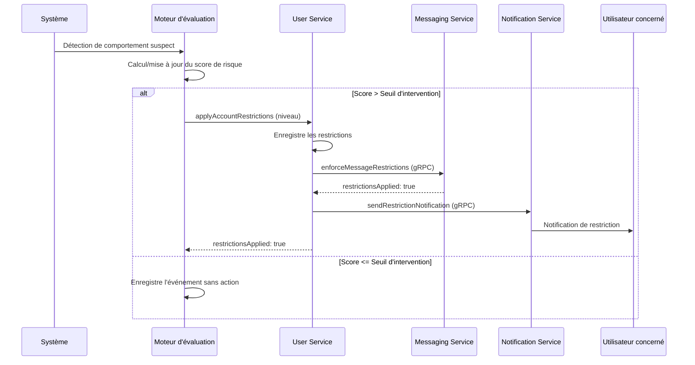

### 4.2 Niveaux de restrictions

1. **Niveau 1 - Restrictions légères** :
   - Limitation du nombre de nouveaux contacts par jour (max 5)
   - Délai forcé entre les messages (min 5 secondes)
   - Interdiction d'envoi de médias aux nouveaux contacts
   - Durée typique: 24-48 heures

2. **Niveau 2 - Restrictions modérées** :
   - Impossibilité de contacter de nouveaux utilisateurs
   - Limitation du nombre de messages par conversation (max 20/jour)
   - Restriction des fonctionnalités de groupe (création, invitation)
   - Durée typique: 3-7 jours

3. **Niveau 3 - Restrictions sévères** :
   - Limitation à la communication avec contacts établis uniquement
   - Prémodération des messages sortants (délai de distribution)
   - Blocage de la création de contenu (médias, groupes)
   - Restriction des fonctionnalités de recherche d'utilisateurs
   - Durée typique: 7-30 jours

4. **Suspension temporaire** :
   - Impossibilité d'envoi de messages
   - Notification aux utilisateurs essayant de le contacter
   - Compte en lecture seule jusqu'à révision
   - Durée: jusqu'à résolution par l'équipe de modération

### 4.3 Application et levée des restrictions

1. **Déclenchement des restrictions** :
   - Automatique basé sur le score de risque
   - Manuel par l'équipe de modération suite à signalements
   - Préventif lors de pics d'activité anormaux

2. **Notification et transparence** :
   - Information claire sur les restrictions appliquées
   - Explication du comportement ayant entraîné les restrictions
   - Indication de la durée estimée et des conditions de levée
   - Processus de contestation accessible

3. **Conditions de levée des restrictions** :
   - Expiration de la durée définie sans nouvel incident
   - Baisse du score de risque sous le seuil critique
   - Résolution favorable d'une contestation
   - Vérification d'identité ou autres mesures de sécurité

## 5. Signalement et modération

### 5.1 Processus de signalement

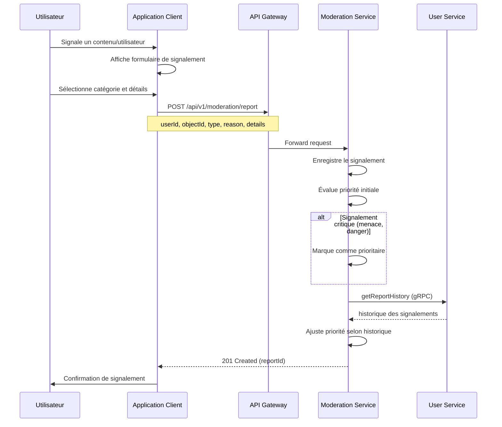

### 5.2 Catégories de signalement

1. **Catégories de base** :
   - Harcèlement ou intimidation
   - Contenu inapproprié (violence, sexuel, haineux)
   - Spam ou comportement commercial non sollicité
   - Usurpation d'identité
   - Autre violation des conditions d'utilisation

2. **Sous-catégories de harcèlement** :
   - Messages répétés non désirés
   - Menaces ou intimidation
   - Discours haineux ou discriminatoire
   - Partage non consenti d'informations personnelles
   - Harcèlement coordonné (plusieurs comptes)

3. **Informations additionnelles collectées** :
   - Capture d'écran ou contenu spécifique concerné
   - Historique de conversation pertinent (contexte)
   - Indication si contact préalable avec la personne
   - Degré d'urgence perçu par l'utilisateur

### 5.3 Traitement des signalements

1. **Processus de triage** :
   - Filtrage automatique par IA pour catégorisation et priorisation
   - Assignation de niveau de gravité (bas, moyen, élevé, critique)
   - Regroupement de signalements similaires concernant le même utilisateur
   - Priorisation des cas impliquant des mineurs ou des menaces graves

2. **Mesures immédiates automatiques** :
   - Restrictions préventives pour les signalements de haute priorité
   - Masquage temporaire du contenu signalé dans les cas graves
   - Séparation virtuelle des utilisateurs concernés (invisibilité mutuelle)
   - Limitation des fonctionnalités de l'utilisateur signalé en attente d'examen

3. **Processus de modération humaine** :
   - Révision des signalements par l'équipe de modération selon priorité
   - Investigation du contexte et de l'historique des utilisateurs impliqués
   - Décision sur les actions à prendre (rejeter, avertir, restreindre, suspendre)
   - Communication du résultat aux parties concernées

## 6. Protections spécifiques aux groupes

### 6.1 Mécanismes de protection dans les groupes

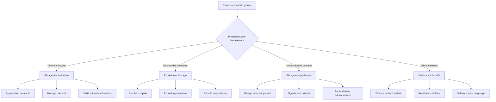

### 6.2 Contrôles préventifs pour les groupes

1. **Filtrage des ajouts et invitations** :
   - Vérification automatique des relations de blocage entre membres
   - Alertes lors de l'ajout d'utilisateurs avec historique problématique
   - Option d'approbation préalable pour les nouveaux membres
   - Périodes de probation pour les nouveaux membres (restrictions temporaires)

2. **Paramètres de protection configurables** :
   - Restriction des droits d'envoi de messages (tous, modérateurs+, admins uniquement)
   - Limitation de fréquence des messages (mode ralenti configurable)
   - Filtrage de contenu paramétrable (léger, modéré, strict)
   - Restrictions sur le partage de médias et de liens

3. **Modération automatique renforcée** :
   - Détection des comportements de spam ou flood dans le contexte de groupe
   - Identification des schémas de harcèlement ciblé envers des membres spécifiques
   - Alertes sur les pics d'activité négative ou les tendances problématiques
   - Surveillance spécifique des groupes avec historique d'incidents

### 6.3 Outils pour administrateurs et modérateurs

1. **Tableau de bord de modération** :
   - Vue d'ensemble de l'activité du groupe avec indicateurs de risque
   - Liste des incidents récents et des membres sous surveillance
   - Statistiques sur les types de contenus et les interactions
   - Accès aux signalements concernant le groupe

2. **Actions administratives rapides** :
   - Expulsion immédiate avec option de blocage permanent
   - Suppression en masse de messages problématiques
   - Mode "lecture seule" d'urgence pour le groupe entier
   - Restrictions temporaires ciblées pour membres spécifiques

3. **Paramètres avancés de groupe** :
   - Système de "trois avertissements" configurable
   - Restrictions automatiques basées sur le comportement
   - Approbation obligatoire pour certains types de contenus
   - Journal d'audit des actions administratives pour transparence

## 7. Architecture et intégration

### 7.1 Intégration avec les microservices

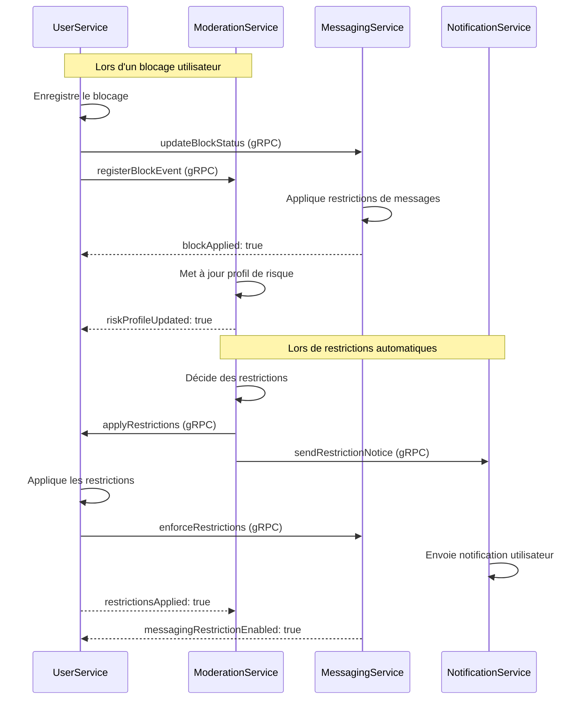

### 7.2 Modèle de données pour le système anti-harcèlement

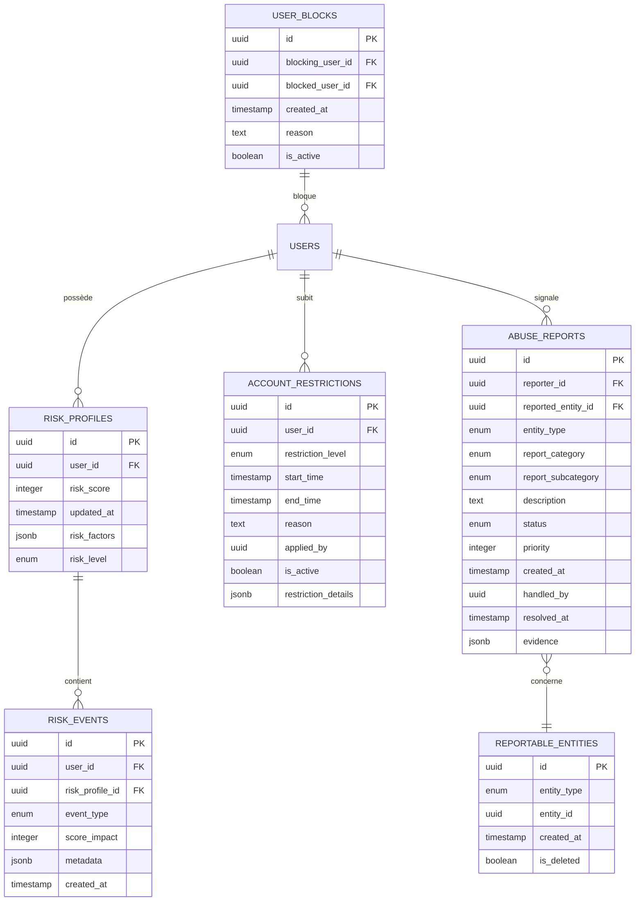

### 7.3 Endpoints API pour les fonctionnalités anti-harcèlement

| Endpoint | Méthode | Description | Paramètres |
|----------|---------|-------------|------------|
| `/api/v1/contacts/block/{userId}` | POST | Bloquer un utilisateur | - |
| `/api/v1/contacts/block/{userId}` | DELETE | Débloquer un utilisateur | - |
| `/api/v1/contacts/blocked` | GET | Liste des utilisateurs bloqués | `page`, `limit` |
| `/api/v1/moderation/report` | POST | Signaler un contenu/utilisateur | Détails dans le corps |
| `/api/v1/moderation/appeal/{decisionId}` | POST | Contester une décision | Justification dans le corps |
| `/api/v1/users/me/restrictions` | GET | Obtenir ses restrictions actuelles | - |
| `/api/v1/groups/{groupId}/settings/protection` | GET | Paramètres de protection du groupe | - |
| `/api/v1/groups/{groupId}/settings/protection` | PUT | Modifier les paramètres de protection | Paramètres dans le corps |
| `/api/v1/groups/{groupId}/members/{userId}/restrict` | POST | Restreindre un membre du groupe | Détails dans le corps |

## 8. Arbres de décision pour les interventions

### 8.1 Arbre de décision - Détection de harcèlement

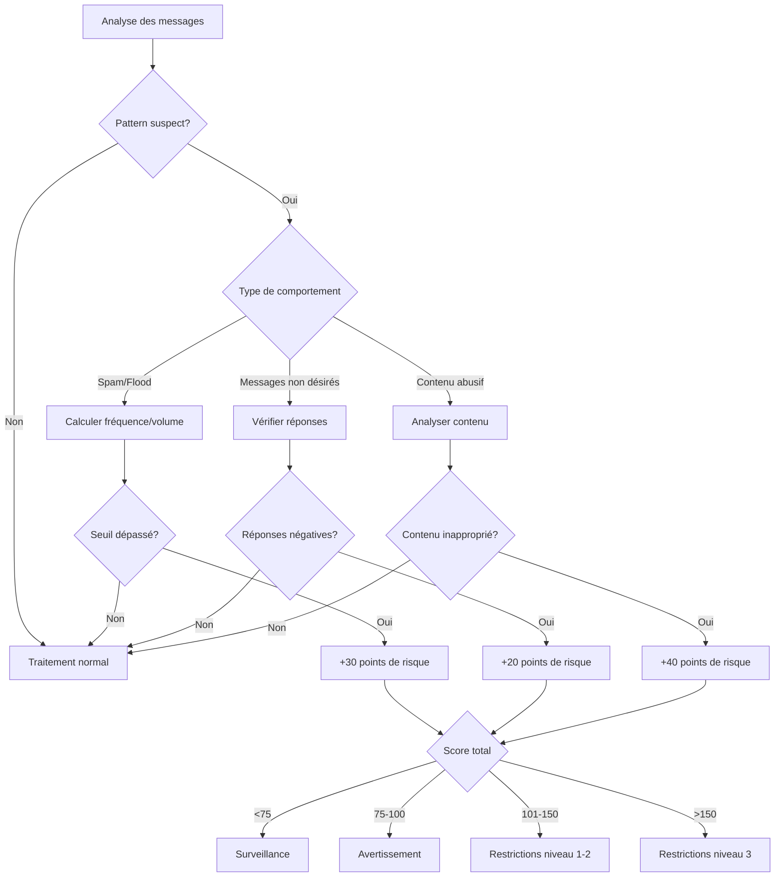

### 8.2 Arbre de décision - Traitement des signalements

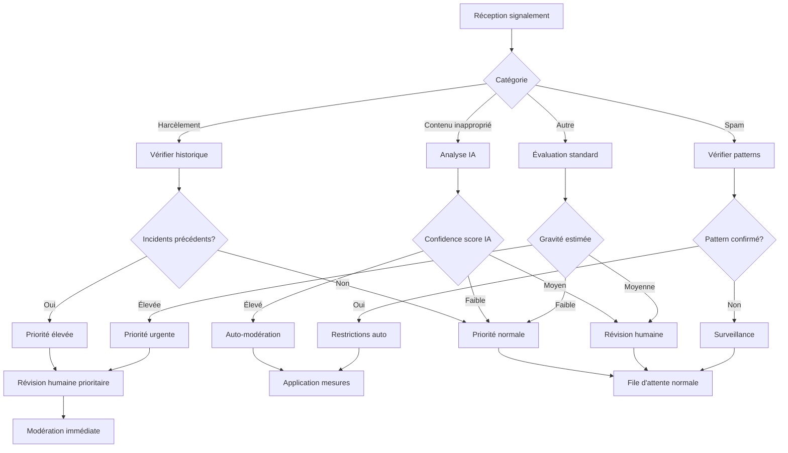

### 8.3 Arbre de décision - Application des restrictions

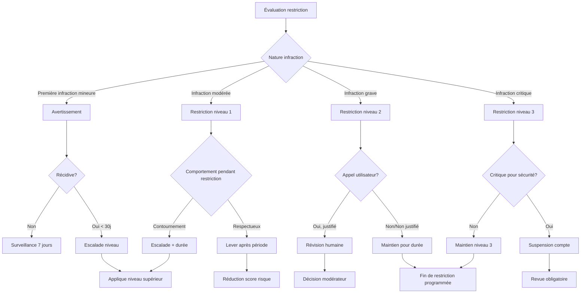

## 9. Métriques et évaluation du système

### 9.1 Indicateurs clés de performance (KPI)

1. **Métriques d'efficacité** :
   - Taux de détection des incidents confirmés
   - Taux de faux positifs/négatifs des systèmes automatisés
   - Temps moyen de résolution des signalements
   - Taux de récidive après restrictions

2. **Métriques utilisateurs** :
   - Satisfaction concernant le traitement des signalements
   - Sentiment de sécurité (enquêtes périodiques)
   - Taux d'utilisation des outils anti-harcèlement
   - Taux d'attrition lié aux problèmes de harcèlement

3. **Métriques opérationnelles** :
   - Volume de signalements par catégorie
   - Temps moyen de traitement par niveau de gravité
   - Distribution des niveaux de risque dans l'écosystème
   - Efficacité des restrictions automatiques

### 9.2 Amélioration continue

1. **Processus d'analyse et ajustement** :
   - Revue mensuelle des métriques et ajustement des seuils
   - Analyse des cas non détectés pour amélioration des algorithmes
   - Feedback structuré des utilisateurs sur l'efficacité des outils
   - Tests A/B sur les nouvelles fonctionnalités de protection

2. **Évaluation de l'impact des mesures** :
   - Suivi longitudinal des comptes ayant subi des restrictions
   - Analyse de l'efficacité des différents niveaux de restrictions
   - Évaluation des taux de contestation réussie vs. abusive
   - Impact des outils anti-harcèlement sur l'engagement général

3. **Adaptation aux nouvelles menaces** :
   - Veille sur les nouvelles formes de harcèlement
   - Mise à jour des modèles de détection selon l'évolution des comportements
   - Benchmarking avec d'autres plateformes
   - Collaboration avec des experts en cyberharcèlement

## 10. Considérations éthiques et de confidentialité

### 10.1 Protection des données sensibles

1. **Traitement des signalements** :
   - Anonymisation partielle des données de signalement
   - Accès restreint aux conversations signalées
   - Chiffrement des preuves et informations sensibles
   - Politique de conservation limitée des données de signalement

2. **Équilibre surveillance et vie privée** :
   - Transparence sur les mécanismes de détection utilisés
   - Limites claires sur les données analysées automatiquement
   - Contrôle utilisateur sur le niveau de protection souhaité
   - Non-conservation des messages analysés et jugés normaux

### 10.2 Protection des victimes et équité

1. **Mesures spéciales de protection** :
   - Outils renforcés pour utilisateurs ayant subi du harcèlement
   - Options de "mode sécurisé" avec filtrage préventif accru
   - Accompagnement personnalisé pour cas graves
   - Ressources et orientation vers services d'aide

2. **Équité du système** :
   - Audits réguliers pour détecter les biais dans les algorithmes
   - Diversité dans l'équipe de modération
   - Sensibilité culturelle et contextuelle dans l'évaluation
   - Processus d'appel accessible et équitable

### 10.3 Formation et documentation

1. **Ressources utilisateurs** :
   - Guides clairs sur les outils anti-harcèlement disponibles
   - Tutoriels intégrés sur la gestion de situations difficiles
   - Centre d'aide dédié aux questions de sécurité et de harcèlement
   - Conseils de prévention et meilleures pratiques

2. **Formation des équipes** :
   - Protocoles détaillés pour l'équipe de modération
   - Formation continue sur les formes émergentes de harcèlement
   - Sensibilisation aux impacts psychologiques du harcèlement
   - Procédures standardisées pour les cas critiques

3. **Documentation technique** :
   - Documentation complète des systèmes de détection et règles
   - Journalisation des décisions et modifications algorithmiques
   - Procédures de test et validation des nouvelles mesures
   - Audits périodiques et revue des processus

## 11. Intégration avec le modèle de modération IA

### 11.1 Synergies avec le modèle de modération

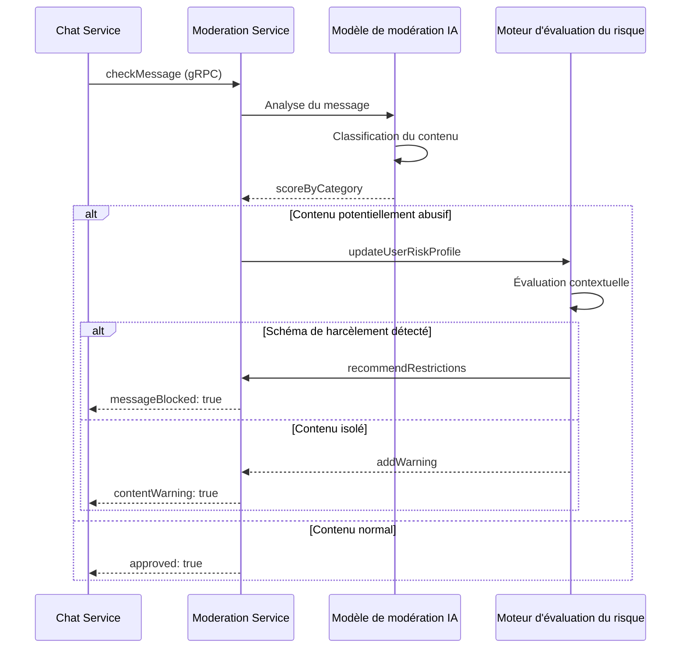

### 11.2 Classification du harcèlement par le modèle IA

1. **Catégories de contenus détectés** :
   - Insultes et langage hostile
   - Menaces explicites ou implicites
   - Contenu à caractère sexuel non sollicité
   - Discours discriminatoire ou haineux
   - Communication insistante et répétitive
   - Sollicitation d'informations personnelles

2. **Éléments contextuels pris en compte** :
   - Historique de la conversation entre les utilisateurs
   - Fréquence et intervalles des messages
   - Réponses et signaux d'intérêt du destinataire
   - Relation établie entre les utilisateurs (contacts, groupe commun)
   - Heure et patterns temporels des communications

3. **Intégration avec le système de risque** :
   - Contribution du score de modération au score de risque global
   - Alertes automatiques sur les schémas répétitifs détectés
   - Marquage des utilisateurs pour surveillance accrue
   - Analyse temporelle des tendances comportementales

### 11.3 Feedback et amélioration du modèle

1. **Boucle de rétroaction continue** :
   - Signalements utilisateurs utilisés pour l'entraînement du modèle
   - Révision humaine des faux positifs/négatifs significatifs
   - Ajustement périodique des poids et seuils du modèle
   - Tests A/B sur les améliorations algorithmiques

2. **Mesures d'efficacité et ajustement** :
   - Suivi de la précision de détection par catégorie
   - Corrélation entre détections automatiques et signalements manuels
   - Analyse des cas complexes ou limites pour amélioration
   - Adaptation aux nouvelles tactiques de harcèlement détectées

## 12. Scénarios d'utilisation et réponses

### 12.1 Scénario - Harceleur persistant

**Contexte** : Un utilisateur envoie des messages répétés à une personne qui ne répond pas.

**Réponse du système** :
1. Détection des messages répétés sans réponse (pattern de harcèlement)
2. Augmentation progressive du score de risque avec chaque tentative
3. Premier palier atteint : envoi d'un avertissement à l'expéditeur
4. Persistance : application des restrictions niveau 1 (délai entre messages)
5. Nouvelles tentatives : escalade vers restrictions niveau 2 (limitations sévères)
6. Notification au destinataire avec option de blocage facile
7. Si signalement effectué : révision prioritaire par la modération

### 12.2 Scénario - Harcèlement de groupe

**Contexte** : Plusieurs utilisateurs ciblent une personne dans un groupe.

**Réponse du système** :
1. Détection de messages négatifs convergents vers un même utilisateur
2. Analyse des liens entre les expéditeurs (possible action coordonnée)
3. Notification aux modérateurs/administrateurs du groupe
4. Proposition d'outils de protection rapide à la cible (masquage, mute)
5. Application de restrictions temporaires aux messages dans le groupe
6. Si signalement : revue prioritaire avec possibilité d'action groupée
7. Suivi proactif du groupe pour détecter des patterns similaires futurs

### 12.3 Scénario - Contournement de blocage

**Contexte** : Un utilisateur bloqué tente de contacter sa cible via d'autres moyens.

**Réponse du système** :
1. Détection des tentatives de contact via groupes ou nouveaux comptes
2. Identification des patterns et similarités dans les messages
3. Score de risque significativement augmenté (violation intentionnelle)
4. Application immédiate de restrictions niveau 3 sans avertissement
5. Alerte spéciale à l'équipe de modération (comportement à haut risque)
6. Protection renforcée activée pour la victime (filtrage préventif)
7. Surveillance étendue des activités de l'utilisateur à travers la plateforme

## 13. Contraintes et limites techniques

### 13.1 Performance et échelle

1. **Contraintes de traitement** :
   - Analyse en temps réel limitée à des messages de moins de 10Ko
   - Analyse comportementale limitée aux 1000 derniers messages
   - Maximum de 500 utilisateurs surveillés simultanément par instance
   - Latence maximale de l'analyse anti-harcèlement : 200ms

2. **Optimisations nécessaires** :
   - Mise en cache des décisions récentes pour messages similaires
   - Traitement asynchrone pour analyses approfondies
   - Échantillonnage stratégique pour utilisateurs à faible risque
   - Partitionnement des données par région pour traitement local

### 13.2 Limites connues et stratégies d'atténuation

1. **Détection de contenu subtil** :
   - Difficulté à détecter harcèlement indirect ou codé
   - Stratégie : combinaison de l'analyse textuelle avec patterns comportementaux
   - Amélioration continue via signalements utilisateurs

2. **Faux positifs et équité** :
   - Risque de restrictions injustifiées basées sur conversations mal interprétées
   - Stratégie : processus de contestation rapide et transparent
   - Révision humaine obligatoire pour restrictions de niveau 2 et supérieur

3. **Résilience face aux tactiques évolutives** :
   - Adaptation constante des harceleurs aux mesures de protection
   - Stratégie : framework flexible permettant mises à jour fréquentes
   - Veille active sur les nouvelles méthodes de harcèlement

## 14. Plan d'implémentation

### 14.1 Phases de déploiement

1. **Phase 1 - Fondations (Mois 1-2)** :
   - Implémentation du système de blocage de base
   - Mise en place de la structure de données pour les profils de risque
   - Développement des API de signalement et modération
   - Intégration initiale avec les services existants

2. **Phase 2 - Détection et automatisation (Mois 3-4)** :
   - Déploiement des algorithmes de détection comportementale
   - Mise en œuvre des restrictions automatiques (niveaux 1-2)
   - Développement du tableau de bord de modération
   - Tests utilisateurs des fonctionnalités de protection

3. **Phase 3 - Protections avancées (Mois 5-6)** :
   - Intégration complète avec le modèle IA de modération
   - Implémentation des protections spécifiques aux groupes
   - Déploiement des mécanismes de détection de contournement
   - Optimisation des performances et mise à l'échelle

### 14.2 Dépendances et prérequis

1. **Dépendances techniques** :
   - Modèle de modération IA fonctionnel
   - API de gestion des utilisateurs et contacts
   - Système de messagerie avec hooks pour interception
   - Infrastructure Redis pour scoring en temps réel

2. **Ressources nécessaires** :
   - Équipe dédiée : 2 développeurs backend, 1 data scientist
   - Environnement de test isolé avec données synthétiques
   - Infrastructure de monitoring spécifique
   - Collaboration avec experts en cyberharcèlement

### 14.3 Estimation des coûts et ressources

| Composant | Ressources CPU | Mémoire | Stockage | Instances |
|-----------|---------------|--------|-----------|-----------|
| Service de détection | 4 cores | 8 GB | 50 GB | 3 |
| Analyse comportementale | 8 cores | 16 GB | 100 GB | 2 |
| API de modération | 2 cores | 4 GB | 20 GB | 3 |
| Base de données | 8 cores | 32 GB | 500 GB | 2 |
| Redis (scoring) | 2 cores | 8 GB | 20 GB | 3 |

**Coût d'infrastructure mensuel estimé** : Inclus dans les ressources du tier gratuit de GCP tant que l'application reste sous les seuils d'utilisation critiques.

## 15. Conclusion

Le système anti-harcèlement proposé fournit une protection complète et proactive pour les utilisateurs de l'application Whispr, combinant contrôle utilisateur, détection automatisée et modération efficace. En mettant l'accent sur la prévention et l'intervention précoce, ces mécanismes contribuent à créer un environnement de communication sain et sécurisé pour tous les utilisateurs.

L'approche multicouche permet une adaptation aux différentes formes de harcèlement et une réponse proportionnée aux comportements détectés. L'intégration étroite avec le modèle de modération IA et les autres microservices assure une protection cohérente à travers toutes les fonctionnalités de l'application.

La mise en œuvre progressive de ces mécanismes, accompagnée d'une évaluation continue et d'ajustements, permettra d'améliorer constamment l'efficacité du système tout en préservant une expérience utilisateur fluide pour les interactions légitimes.