# Spécification Fonctionnelle - Interaction avec les Médias

## 1. Vue d'ensemble

### 1.1 Objectif

Cette spécification détaille les fonctionnalités de gestion des médias dans l'application Whispr, couvrant les photos de profil, images de groupe et autres contenus multimédias partagés dans les conversations. Elle définit les processus de validation, modération, stockage et distribution des médias, ainsi que l'intégration avec les autres services de l'application.

### 1.2 Principes clés

- **Confidentialité et sécurité** : Chiffrement et protection des médias partagés
- **Performance** : Optimisation du traitement et de la distribution des médias
- **Modération proactive** : Vérification automatisée des contenus inappropriés
- **Expérience utilisateur fluide** : Interface intuitive pour le partage et la visualisation
- **Évolutivité** : Architecture conçue pour supporter un volume croissant de médias

### 1.3 Composants fonctionnels

Le système de gestion des médias comprend cinq processus principaux :
1. **Téléversement et validation** : Traitement initial des médias téléversés
2. **Modération de contenu** : Vérification automatique et manuelle des médias
3. **Stockage et gestion** : Organisation et conservation des médias
4. **Distribution et accès** : Livraison des médias aux utilisateurs
5. **Gestion des profils et groupes** : Médias liés aux entités sociales

## 2. Téléversement et validation des médias

### 2.1 Processus de téléversement

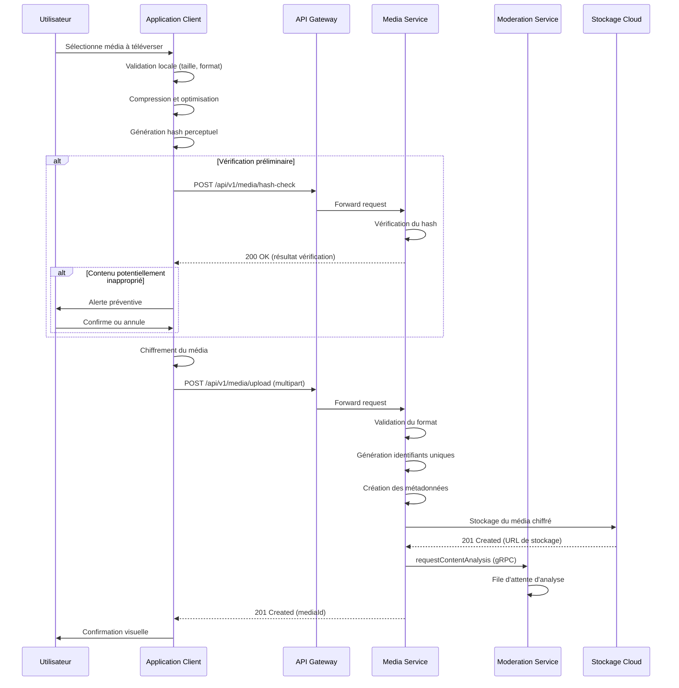

### 2.2 Types de médias supportés

1. **Images** :
   - Formats : JPEG, PNG, WebP, GIF (animé)
   - Dimensions : Maximum 4000x4000 pixels
   - Taille : Jusqu'à 10 MB
   - Compression automatique : Optimisée pour la taille/qualité

2. **Vidéos** :
   - Formats : MP4 (H.264, H.265), WebM
   - Durée : Jusqu'à 3 minutes
   - Taille : Jusqu'à 100 MB
   - Transcodage : Formats optimisés pour différents appareils

3. **Audio** :
   - Formats : MP3, AAC, OGG
   - Durée : Jusqu'à 10 minutes
   - Taille : Jusqu'à 50 MB
   - Transcodage : Format unifié pour la compatibilité

4. **Documents** :
   - Formats : PDF, DOCX, XLSX, PPTX, TXT
   - Taille : Jusqu'à 50 MB
   - Prévisualisation : Génération d'aperçus quand possible

### 2.3 Règles métier pour le téléversement

1. **Validation préliminaire** :
   - Vérification côté client des formats et tailles acceptés
   - Génération de hash perceptuel pour comparaison avec base de données
   - Détection préliminaire de contenu problématique avant envoi
   - Alerte utilisateur si le contenu pourrait violer les conditions

2. **Quotas et limites** :
   - Quota de stockage par utilisateur : 1 GB (extensible)
   - Limite de téléversements quotidiens : 100 médias
   - Restrictions temporaires après signalements multiples
   - Limites spécifiques par type de média (dimensions, durée, etc.)

3. **Métadonnées collectées** :
   - Identifiant unique du média (UUID)
   - Type MIME et extension
   - Dimensions (images/vidéos)
   - Durée (audio/vidéo)
   - Taille en octets
   - Hash de contenu (pour déduplication)
   - Hash perceptuel (pour modération)
   - Données EXIF nettoyées (sans informations de localisation)

## 3. Modération et analyse de contenu

### 3.1 Processus de modération automatique

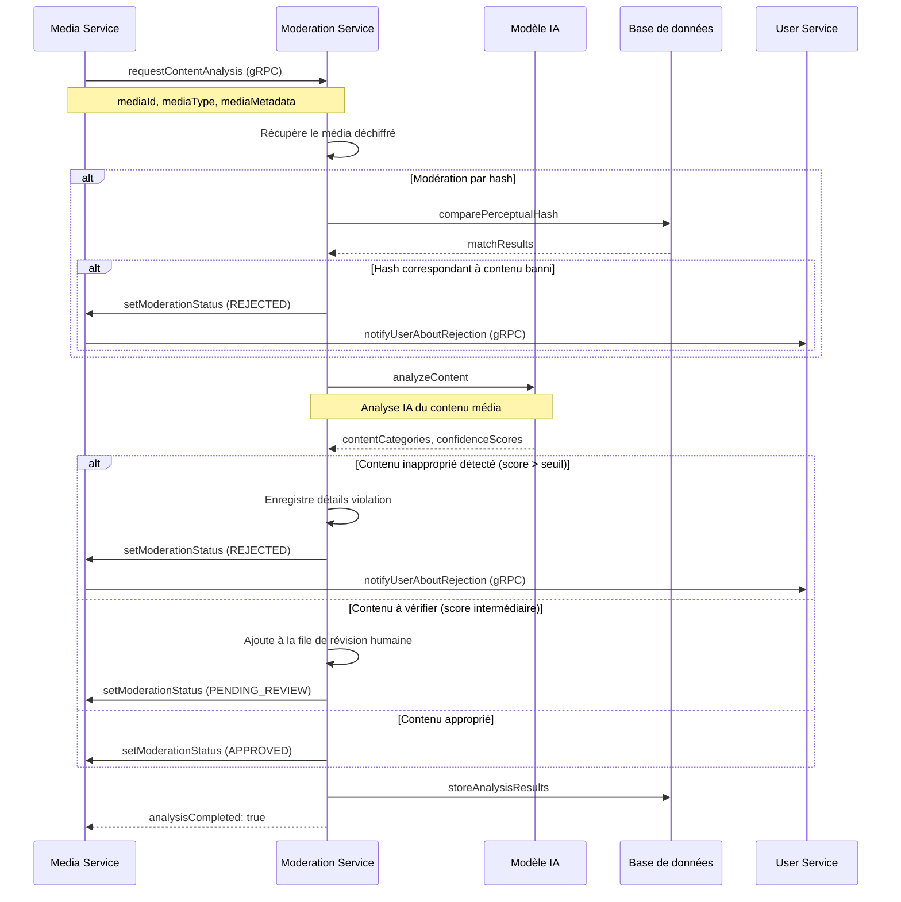

### 3.2 Catégories de modération

1. **Catégories de contenu inapproprié** :
   - **Violence** : Images de violence explicite ou graphique
   - **Contenu pour adultes** : Nudité, contenu sexuel explicite
   - **Discours haineux** : Symboles haineux, propagande extrémiste
   - **Harcèlement** : Contenu visant à intimider ou harceler
   - **Désinformation nocive** : Contenu frauduleux ou dangereux
   - **Violation de propriété intellectuelle** : Contenu protégé identifiable

2. **Niveaux de confiance et actions** :
   - **Élevé (>90%)** : Rejet automatique et notification
   - **Moyen (70-90%)** : Mise en attente et révision humaine
   - **Faible (50-70%)** : Approbation avec marquage pour surveillance
   - **Très faible (<50%)** : Approbation sans marquage

### 3.3 Révision humaine et feedback

1. **Interface de modération** :
   - File d'attente priorisée par score de confiance
   - Outils d'évaluation rapide (approbation/rejet)
   - Catégorisation précise des violations
   - Annotations pour amélioration du modèle

2. **Processus de feedback** :
   - Utilisateur informé du statut de modération
   - Option de contestation pour les rejets automatiques
   - Formulaire détaillé pour justification de la contestation
   - Révision prioritaire des contestations

3. **Amélioration continue** :
   - Collecte des faux positifs/négatifs pour entraînement
   - Ajustement régulier des seuils de confiance
   - Adaptation aux nouvelles formes de contenu inapproprié
   - A/B testing des améliorations algorithmiques

## 4. Stockage et gestion des médias

### 4.1 Architecture de stockage

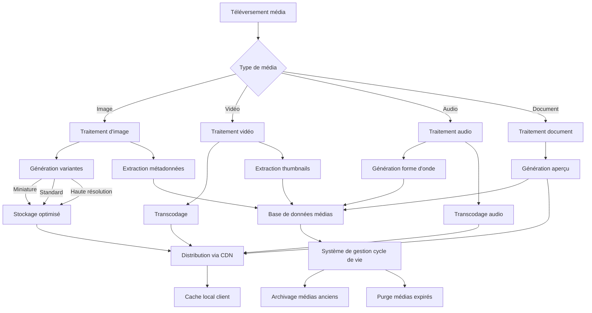

### 4.2 Organisation des données médias

1. **Structure de stockage** :
   - Organisation hiérarchique par type/année/mois
   - Séparation des environnements (développement, staging, production)
   - Isolation par utilisateur pour sécurité et gestion des quotas
   - Réplication géographique pour haute disponibilité

2. **Conventions de nommage** :
   - Format: `{type}/{userId}/{mediaId}-{variant}.{extension}`
   - Exemple: `image/7c9e6679-7425-40de-944b-e07fc1f90ae7/550e8400-e29b-41d4-a716-446655440000-thumb.jpg`
   - Variantes standardisées (original, standard, thumb, preview)
   - Métadonnées séparées du contenu pour optimisation d'accès

3. **Cycle de vie des médias** :
   - Médias de conversation : conservation selon paramètres utilisateur
   - Photos de profil : conservation des versions précédentes (limité)
   - Médias signalés : conservation pour procédures de modération
   - Politique d'archivage automatique des médias anciens non consultés

### 4.3 Sécurité et protection des données

1. **Chiffrement et sécurité** :
   - Chiffrement côté client avant téléversement
   - Chiffrement en transit (TLS 1.3)
   - Chiffrement au repos (AES-256)
   - Gestion des clés de chiffrement par utilisateur/conversation

2. **Contrôle d'accès** :
   - Tokens d'accès temporaires pour médias privés
   - Vérification des permissions à chaque requête
   - Isolation des données entre utilisateurs
   - Journalisation des accès pour audit

3. **Mesures anti-abus** :
   - Limitation de débit (rate limiting) par utilisateur
   - Détection des téléversements en masse suspects
   - Protection contre le scraping de médias
   - Signatures numériques pour authentification des sources

## 5. Distribution et accès aux médias

### 5.1 Flux de distribution des médias

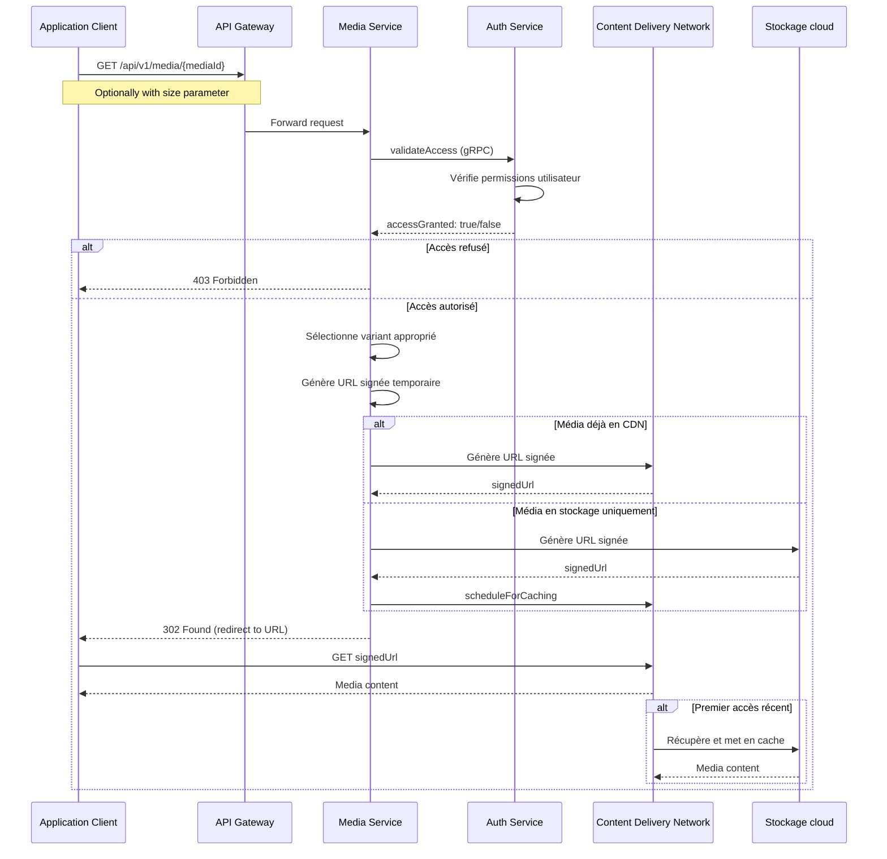

### 5.2 Optimisation de la livraison

1. **Stratégies de mise en cache** :
   - Cache multi-niveau (CDN, serveur, client)
   - Politique de cache adaptée par type de média
   - Invalidation sélective lors des mises à jour
   - Préchargement des médias fréquemment consultés

2. **Adaptation au réseau et appareil** :
   - Sélection automatique de la qualité selon la connexion
   - Formats optimisés par type d'appareil et navigateur
   - Chargement progressif pour images et vidéos
   - Téléchargement différé pour contenu hors écran

3. **Gestion de la bande passante** :
   - Compression adaptative selon la qualité de connexion
   - Limitation de téléchargements simultanés
   - Priorisation des médias dans la vue active
   - Économie de données configurable par l'utilisateur

### 5.3 Accès sécurisé et contrôle des partages

1. **Mécanismes d'autorisation** :
   - Vérification de permissions à chaque requête
   - URLs signées avec expiration (15 minutes)
   - Validation d'origine pour empêcher le hotlinking
   - Restriction géographique configurable

2. **Partage et visibilité** :
   - Visibilité par défaut limitée à la conversation/profil
   - Options de partage externes avec liens temporaires
   - Révocation d'accès possible à tout moment
   - Traçabilité des accès pour médias sensibles

3. **Gestion de la vie privée** :
   - Nettoyage des métadonnées sensibles (EXIF, localisation)
   - Option "éphémère" pour médias à durée limitée
   - Contrôle granulaire de la visibilité des médias de profil
   - Notification lors de captures d'écran (si supporté par plateforme)

## 6. Photos de profil et images de groupe

### 6.1 Gestion des photos de profil

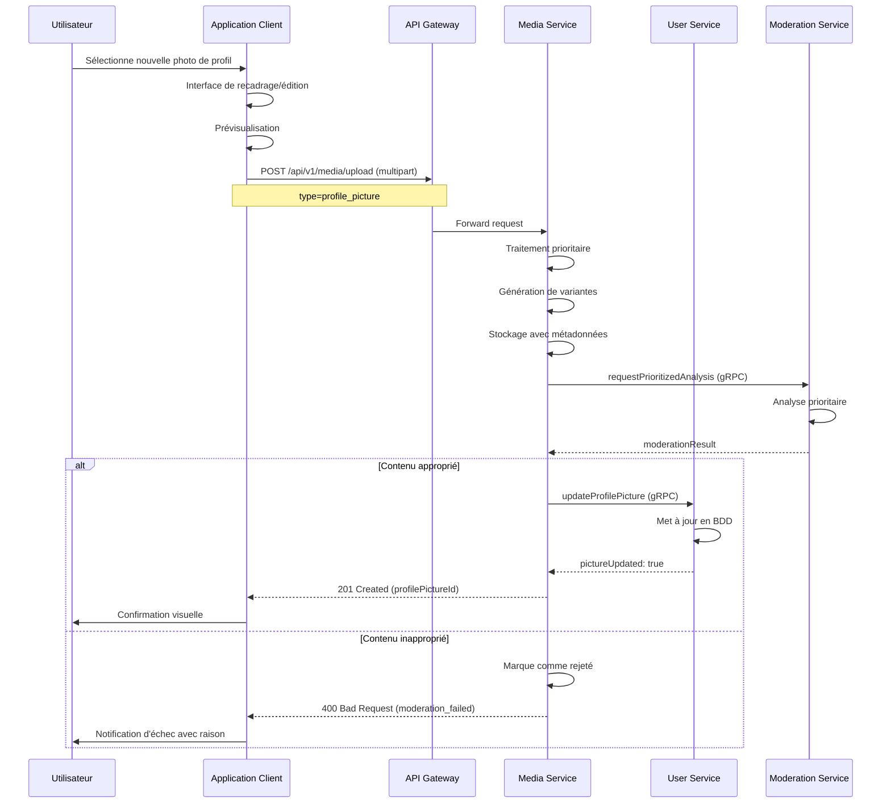

### 6.2 Spécificités des photos de profil

1. **Traitement spécialisé** :
   - Recadrage intelligent avec focus sur les visages
   - Génération de 4 variantes standardisées :
     - Original (conservé mais non distribué)
     - Grande (256x256px), Standard (128x128px), Miniature (64x64px)
   - Optimisation pour chargement rapide
   - Option de filtre/embellissement côté client

2. **Règles de confidentialité** :
   - Options de visibilité : tous, contacts uniquement, personne
   - Mise en cache spéciale pour accès fréquent
   - Version "anonymisée" pour utilisateurs sans accès
   - Conservation des versions précédentes (limité à 5)

3. **Modération renforcée** :
   - Vérification prioritaire par le système de modération
   - Standards plus stricts pour contenu approprié
   - Option de pré-approbation pour utilisateurs à risque
   - Suggestion d'alternatives en cas de rejet

### 6.3 Gestion des images de groupe

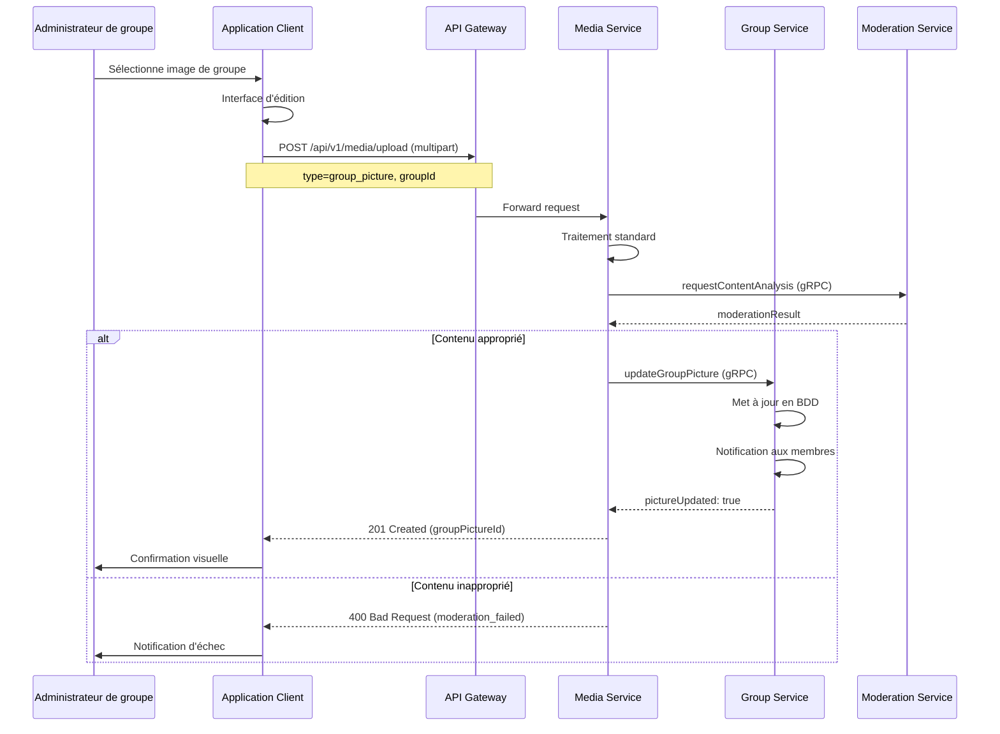

### 6.4 Spécificités des images de groupe

1. **Traitement et optimisation** :
   - Formats similaires aux photos de profil
   - Optimisation pour affichage en liste et en-tête
   - Support d'images thématiques/illustratives
   - Option de sélection depuis bibliothèque d'icônes

2. **Contrôle d'accès** :
   - Visible par tous les membres du groupe
   - Révision requise par administrateur uniquement
   - Historique des modifications accessible aux administrateurs
   - Option d'image par défaut basée sur nom du groupe

3. **Règles de gestion** :
   - Modération standard applicable
   - Conservation des versions précédentes (limité à 3)
   - Restrictions pour groupes signalés précédemment
   - Quotas partagés entre membres administrateurs

## 7. Architecture et intégration avec les services

### 7.1 Intégration avec les microservices

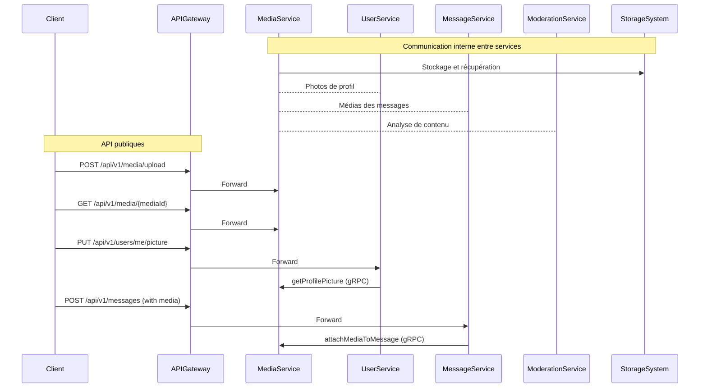

### 7.2 Interfaces gRPC entre services

| Service | Méthode | Description | Paramètres |
|---------|--------|-------------|------------|
| MediaService | uploadMedia | Téléverse un nouveau média | `mediaType`, `content`, `metadata` |
| MediaService | getMediaInfo | Obtient les informations d'un média | `mediaId` |
| MediaService | getMediaContent | Récupère le contenu d'un média | `mediaId`, `variant` |
| MediaService | deleteMedia | Supprime un média | `mediaId` |
| MediaService | attachMediaToEntity | Associe un média à une entité | `mediaId`, `entityType`, `entityId` |
| ModerationService | analyzeMediaContent | Lance l'analyse d'un média | `mediaId`, `priority` |
| ModerationService | getModerationResult | Obtient le résultat de modération | `mediaId` |
| UserService | updateProfilePicture | Met à jour la photo de profil | `userId`, `mediaId` |
| MessageService | attachMediaToMessage | Associe un média à un message | `messageId`, `mediaId` |

### 7.3 Modèle de données

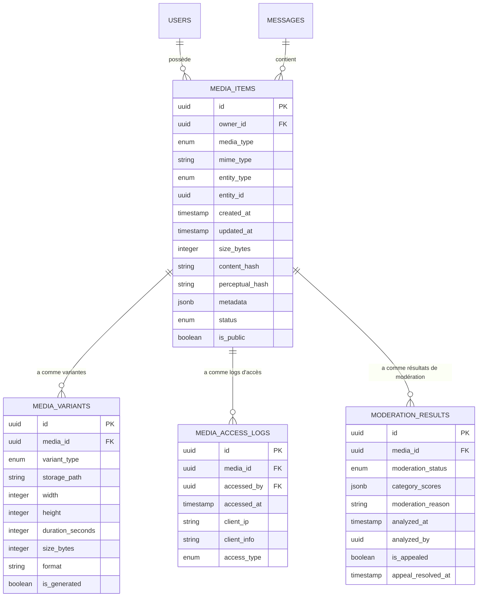

### 7.4 Endpoints API principaux

| Endpoint | Méthode | Description | Paramètres |
|----------|---------|-------------|------------|
| `/api/v1/media/upload` | POST | Téléverser un média | Multipart form data |
| `/api/v1/media/{mediaId}` | GET | Obtenir un média | `variant` (optionnel) |
| `/api/v1/media/{mediaId}` | DELETE | Supprimer un média | - |
| `/api/v1/media/{mediaId}/info` | GET | Obtenir les métadonnées | - |
| `/api/v1/media/hash-check` | POST | Vérifier un hash avant upload | `perceptualHash` |
| `/api/v1/media/user/{userId}/profile` | GET | Obtenir la photo de profil | `size` (optionnel) |
| `/api/v1/media/group/{groupId}/picture` | GET | Obtenir l'image du groupe | `size` (optionnel) |
| `/api/v1/media/storage` | GET | Obtenir l'utilisation du stockage | - |
| `/api/v1/users/me/picture` | PUT | Mettre à jour sa photo de profil | `mediaId` |
| `/api/v1/groups/{groupId}/picture` | PUT | Mettre à jour l'image du groupe | `mediaId` |

## 8. Chiffrement et sécurité des médias

### 8.1 Mécanismes de chiffrement

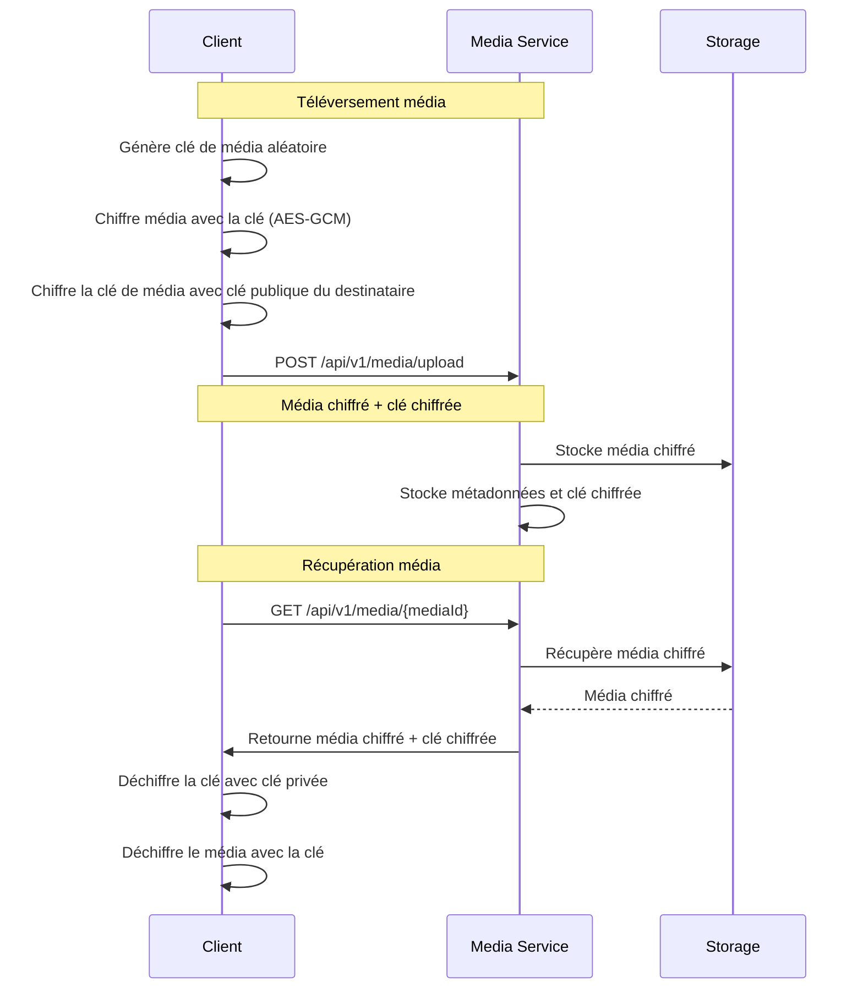

### 8.2 Protection et confidentialité

1. **Chiffrement de bout en bout** :
   - Chiffrement côté client avant téléversement
   - Utilisation d'AES-256-GCM pour le contenu
   - Chiffrement des clés via protocole Signal
   - Chiffrement différent pour médias publics/privés

2. **Gestion des clés** :
   - Clés de média uniques par fichier
   - Distribution sécurisée des clés aux destinataires autorisés
   - Rotation des clés pour médias de longue durée
   - Protection par couche additionnelle pour médias sensibles

3. **Mesures de protection avancées** :
   - Marquage unique (watermarking) optionnel
   - Détection des tentatives d'extraction non autorisées
   - Effacement sécurisé des médias supprimés
   - Isolation des environnements de traitement

## 9. Performance et optimisation

### 9.1 Stratégies d'optimisation

1. **Traitement parallèle et asynchrone** :
   - Pipeline de traitement multithreads
   - Découplage téléversement/traitement/modération
   - File d'attente priorisée pour traitement
   - Notification push de fin de traitement

2. **Optimisation de contenu** :
   - Compression adaptative selon type et utilisation
   - Formats nouvelle génération (WebP, AVIF) quand supportés
   - Redimensionnement intelligent préservant zones d'intérêt
   - Détection et optimisation des contenus similaires

3. **Architecture distribuée** :
   - Répartition géographique du stockage et traitement
   - Mise en cache progressive (cold, warm, hot)
   - Scaling automatique basé sur la charge
   - Isolation des traitements lourds (transcodage)

### 9.2 Métriques et surveillance

1. **Indicateurs clés** :
   - Temps de téléversement et traitement
   - Latence de distribution par région
   - Taux de hit/miss du cache
   - Précision de la modération automatique

2. **Alertes et monitoring** :
   - Détection des goulets d'étranglement
   - Alertes sur délais de traitement anormaux
   - Surveillance de l'utilisation du stockage
   - Détection des patterns d'utilisation suspects

## 10. Scénarios d'utilisation et cas particuliers

### 10.1 Scénario - Téléversement de photo de profil
**Contexte** : Un utilisateur met à jour sa photo de profil.

**Processus** :
1. L'utilisateur sélectionne une nouvelle photo depuis sa galerie
2. L'application propose une interface de recadrage circulaire
3. L'utilisateur valide le recadrage, l'application compresse la photo
4. Le client génère un hash perceptuel et vérifie préliminairement son contenu
5. La photo est chiffrée et téléversée avec priorité élevée
6. Le media-service traite la photo et génère les différentes variantes
7. Le moderation-service analyse la photo en priorité (visage, contenu inapproprié)
8. Si approuvée, la photo est immédiatement associée au profil utilisateur
9. Les contacts actifs reçoivent une notification de mise à jour de profil
10. Les variantes sont distribuées au CDN pour accès rapide
11. L'utilisateur peut configurer la visibilité de sa photo (tous, contacts, personne)

### 10.2 Scénario - Partage de médias dans une conversation

**Contexte** : Un utilisateur partage plusieurs photos dans une conversation de groupe.

**Processus** :
1. L'utilisateur sélectionne 5 photos depuis sa galerie
2. L'application affiche un aperçu et propose des options d'ajout de légende
3. Les photos sont compressées en parallèle et des hashes sont générés
4. Un message temporaire est créé dans la conversation indiquant "Envoi en cours..."
5. Les médias sont chiffrés avec une clé unique, elle-même chiffrée pour chaque membre
6. Les médias sont téléversés séquentiellement ou en parallèle selon la connexion
7. Le moderation-service analyse les images en arrière-plan
8. Les images approuvées sont immédiatement visibles avec statut de modération
9. Les destinataires reçoivent les médias chiffrés et les clés pour déchiffrement
10. Le client destinataire optimise le téléchargement selon conditions réseau
11. Les destinataires peuvent sauvegarder les médias dans leur galerie personnelle

### 10.3 Scénario - Modération de contenu inapproprié

**Contexte** : Un utilisateur tente de téléverser une image potentiellement inappropriée.

**Processus** :
1. L'utilisateur sélectionne une image à caractère sensible
2. L'application détecte localement un contenu potentiellement inapproprié
3. Une alerte préventive s'affiche : "Ce contenu pourrait violer nos conditions d'utilisation"
4. L'utilisateur décide de poursuivre le téléversement
5. Le système de modération détecte un score élevé dans la catégorie "contenu adulte"
6. L'image est automatiquement rejetée et n'est pas distribuée
7. L'utilisateur reçoit une notification expliquant la raison du rejet
8. Un enregistrement est créé dans le système de modération
9. L'utilisateur a la possibilité de contester la décision via un formulaire
10. En cas de contestations multiples similaires, le compte utilisateur est marqué pour surveillance

## 11. Contraintes et limites techniques

### 11.1 Limites de performance

1. **Contraintes de traitement** :
   - Traitement concurrent maximum : 50 médias par seconde
   - Temps maximum de traitement pour images standard : 2 secondes
   - Temps maximum de modération automatique : 3 secondes
   - Bande passante maximale par utilisateur : 5 MB/s

2. **Limites de stockage** :
   - Quota utilisateur standard : 1 GB par compte
   - Taille maximale individuelle : 100 MB par média
   - Nombre maximum de médias par message : 10
   - Durée maximale de conservation automatique : 6 mois pour médias non consultés

### 11.2 Optimisations et compromis

1. **Compromis qualité/performance** :
   - Compression avec perte légère pour optimiser l'espace
   - Transcodage des vidéos pour équilibrer qualité/bande passante
   - Mise en cache sélective basée sur fréquence d'accès
   - Téléchargement progressif plutôt que préchargement complet

2. **Contraintes du tier gratuit GCP** :
   - Utilisation optimisée du stockage Cloud Storage
   - Exploitation des quotas gratuits pour le CDN
   - Limitation du transcodage en période de pointe
   - Cache distribué pour réduire les accès au stockage

## 12. Plan d'implémentation

### 12.1 Phases de développement

1. **Phase 1 - Fonctionnalités essentielles (Mois 1-2)** :
   - Implémentation du téléversement de base
   - Système de stockage sécurisé
   - Support des photos de profil
   - Distribution simple des médias

2. **Phase 2 - Modération et optimisation (Mois 3-4)** :
   - Intégration du système de modération automatique
   - Optimisation des performances de distribution
   - Implémentation complète du chiffrement
   - Support des médias dans les conversations

3. **Phase 3 - Fonctionnalités avancées (Mois 5-6)** :
   - Fonctionnalités avancées de traitement d'image
   - Support complet des vidéos et documents
   - Distribution via CDN optimisée
   - Outils d'administration et de modération avancés

### 12.2 Ressources et dépendances

1. **Compétences requises** :
   - Développement backend avec TypeScript (Node.js)
   - Expertise en traitement d'image et compression
   - Connaissance des API de stockage cloud
   - Expérience en chiffrement et sécurité des données

2. **Dépendances techniques** :
   - Google Cloud Storage pour le stockage primaire
   - Services de ML pour la modération de contenu
   - Bibliothèques d'optimisation d'images (Sharp, ImageMagick)
   - Framework de chiffrement compatible avec le protocole Signal

### 12.3 Métriques de succès

1. **Performances** :
   - Téléversement complet de photo de profil < 3 secondes (4G)
   - Temps de distribution des médias < 1 seconde (CDN)
   - Précision de la modération automatique > 90%
   - Utilisation du stockage inférieure aux quotas

2. **Expérience utilisateur** :
   - Satisfaction utilisateur > 4.5/5 pour le partage de médias
   - Taux d'échec de téléversement < 1%
   - Temps de chargement des photos de profil < 0.5 seconde
   - Feedback positif sur la qualité des médias

## 13. Modèle de données détaillé

### 13.1 Tables PostgreSQL

#### 13.1.1 Table MEDIA_ITEMS
```sql
CREATE TABLE media_items (
    id UUID PRIMARY KEY DEFAULT uuid_generate_v4(),
    owner_id UUID NOT NULL REFERENCES users(id),
    media_type VARCHAR(20) NOT NULL CHECK (media_type IN ('image', 'video', 'audio', 'document')),
    mime_type VARCHAR(50) NOT NULL,
    entity_type VARCHAR(20) CHECK (entity_type IN ('profile', 'group', 'message', 'other')),
    entity_id UUID,
    created_at TIMESTAMP NOT NULL DEFAULT NOW(),
    updated_at TIMESTAMP NOT NULL DEFAULT NOW(),
    size_bytes INTEGER NOT NULL,
    content_hash VARCHAR(64) NOT NULL,
    perceptual_hash VARCHAR(64),
    metadata JSONB,
    status VARCHAR(20) NOT NULL DEFAULT 'pending' CHECK (status IN ('pending', 'processing', 'approved', 'rejected', 'deleted')),
    is_public BOOLEAN NOT NULL DEFAULT FALSE
);

CREATE INDEX idx_media_items_owner_id ON media_items(owner_id);
CREATE INDEX idx_media_items_entity ON media_items(entity_type, entity_id);
CREATE INDEX idx_media_items_content_hash ON media_items(content_hash);
CREATE INDEX idx_media_items_created_at ON media_items(created_at);
CREATE INDEX idx_media_items_status ON media_items(status);
```

#### 13.1.2 Table MEDIA_VARIANTS
```sql
CREATE TABLE media_variants (
    id UUID PRIMARY KEY DEFAULT uuid_generate_v4(),
    media_id UUID NOT NULL REFERENCES media_items(id) ON DELETE CASCADE,
    variant_type VARCHAR(20) NOT NULL CHECK (variant_type IN ('original', 'standard', 'thumb', 'preview', 'lowres', 'hires')),
    storage_path VARCHAR(255) NOT NULL,
    width INTEGER,
    height INTEGER,
    duration_seconds INTEGER,
    size_bytes INTEGER NOT NULL,
    format VARCHAR(20) NOT NULL,
    is_generated BOOLEAN NOT NULL DEFAULT TRUE,
    UNIQUE(media_id, variant_type)
);

CREATE INDEX idx_media_variants_media_id ON media_variants(media_id);
```

#### 13.1.3 Table MODERATION_RESULTS
```sql
CREATE TABLE moderation_results (
    id UUID PRIMARY KEY DEFAULT uuid_generate_v4(),
    media_id UUID NOT NULL REFERENCES media_items(id) ON DELETE CASCADE,
    moderation_status VARCHAR(20) NOT NULL DEFAULT 'pending' CHECK (moderation_status IN ('pending', 'approved', 'rejected', 'manual_review')),
    category_scores JSONB,
    moderation_reason TEXT,
    analyzed_at TIMESTAMP NOT NULL DEFAULT NOW(),
    analyzed_by UUID REFERENCES users(id),
    is_appealed BOOLEAN NOT NULL DEFAULT FALSE,
    appeal_resolved_at TIMESTAMP,
    UNIQUE(media_id)
);

CREATE INDEX idx_moderation_results_media_id ON moderation_results(media_id);
CREATE INDEX idx_moderation_results_status ON moderation_results(moderation_status);
```

#### 13.1.4 Table MEDIA_ACCESS_LOGS
```sql
CREATE TABLE media_access_logs (
    id UUID PRIMARY KEY DEFAULT uuid_generate_v4(),
    media_id UUID NOT NULL REFERENCES media_items(id) ON DELETE CASCADE,
    accessed_by UUID REFERENCES users(id),
    accessed_at TIMESTAMP NOT NULL DEFAULT NOW(),
    client_ip VARCHAR(45),
    client_info VARCHAR(255),
    access_type VARCHAR(20) NOT NULL CHECK (access_type IN ('view', 'download', 'thumbnail', 'metadata'))
);

CREATE INDEX idx_media_access_logs_media_id ON media_access_logs(media_id);
CREATE INDEX idx_media_access_logs_accessed_at ON media_access_logs(accessed_at);
```

### 13.2 Cache Redis

```
# Cache des URLs signées (évite de générer trop souvent)
media:signed_url:{mediaId}:{variant} = "https://cdn.example.com/..."
TTL: 10 minutes

# Cache des métadonnées média
media:metadata:{mediaId} = {type, size, dimensions, status...}
TTL: 30 minutes

# Cache des permissions d'accès
media:access:{mediaId}:{userId} = true/false
TTL: 5 minutes

# Cache des photos de profil par utilisateur
user:profile_picture:{userId} = {mediaId, urls: {thumb, standard, large}}
TTL: 60 minutes

# Cache des images de groupe
group:picture:{groupId} = {mediaId, urls: {thumb, standard, large}}
TTL: 60 minutes
```

## 14. Intégration avec le modèle de modération IA

### 14.1 Processus d'analyse des médias

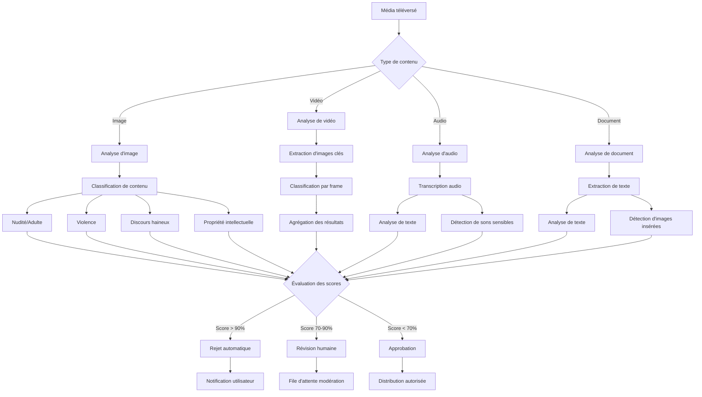

### 14.2 Catégories et seuils d'analyse

1. **Catégories d'analyse pour les images** :
   - **Contenu adulte** : Nudité, contenu sexuellement explicite
   - **Violence** : Armes, sang, blessures, scènes de violence
   - **Discours haineux** : Symboles extrémistes, contenu discriminatoire
   - **Inapproprié** : Contenus choquants divers, drogue, alcool

2. **Seuils de décision** :
   - **Rejet automatique** : Score > 90% dans toute catégorie sensible
   - **Révision manuelle** : Score entre 70-90% ou combinaison de scores moyens
   - **Approbation conditionnelle** : Score 50-70% avec marquage pour suivi
   - **Approbation complète** : Score < 50% dans toutes les catégories

3. **Traitement spécifique par type de média** :
   - **Photos de profil** : Seuils plus stricts, priorité de modération élevée
   - **Images de groupe** : Analyse standard, focus sur symboles inappropriés
   - **Médias de conversation** : Analyse contextuelle (relation entre utilisateurs)
   - **Documents** : Scan antivirus, analyse du texte extrait

### 14.3 Amélioration continue du modèle

1. **Feedback et apprentissage** :
   - Utilisation des contestations utilisateurs pour affiner le modèle
   - Collecte des faux positifs/négatifs pour réentraînement
   - A/B testing sur des améliorations d'algorithme
   - Pondération adaptative selon l'historique utilisateur

2. **Adaptation contextuelle** :
   - Prise en compte de la relation entre expéditeur et destinataire
   - Ajustement des seuils selon le contexte (privé vs groupe)
   - Considération de l'historique de conformité de l'utilisateur
   - Sensibilité aux normes culturelles différentes

## 15. Flux de distribution CDN

### 15.1 Architecture de distribution

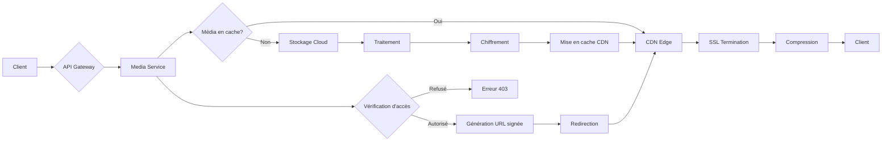

### 15.2 Optimisation de la distribution

1. **Stratégies de mise en cache** :
   - Cache par popularité et récence
   - Préchargement des médias profil/groupe fréquents
   - Politiques TTL adaptatives par type de contenu
   - Invalidation sélective lors des mises à jour

2. **Distribution géographique** :
   - Points de présence multiples (PoPs)
   - Routage intelligent vers le POP le plus proche
   - Réplication stratégique des médias populaires
   - Optimisation des chemins réseau (BGP optimized)

3. **Sécurité CDN** :
   - Protection DDoS intégrée
   - Limitation de débit par utilisateur/IP
   - Validation d'origine pour empêcher le hotlinking
   - Contrôle d'accès par token temporaire

## 16. Considérations de vie privée et sécurité

### 16.1 Protection des données personnelles

1. **Nettoyage des métadonnées** :
   - Suppression des données EXIF sensibles (localisation, appareil)
   - Nettoyage des identifiants personnels dans les fichiers
   - Anonymisation des logs d'accès après période de rétention
   - Suppression des données de reconnaissance faciale

2. **Contrôle utilisateur** :
   - Options granulaires de confidentialité pour photos de profil
   - Paramètres explicites pour chaque média partagé
   - Possibilité de révoquer l'accès à tout moment
   - Journal des accès aux médias sensibles

3. **Rétention des données** :
   - Politique claire de conservation des médias non consultés
   - Suppression définitive après période configurable
   - Option d'auto-destruction pour contenus sensibles
   - Purge des versions précédentes après délai

### 16.2 Mesures de sécurité avancées

1. **Protection contre les fuites** :
   - Cloisonnement strict des données entre utilisateurs
   - Vérification d'intégrité des médias téléchargés
   - Audit trail complet pour médias sensibles
   - Détection des tentatives d'extraction non autorisées

2. **Résilience et disponibilité** :
   - Réplication multi-zone des données critiques
   - Sauvegarde chiffrée des médias importants
   - Procédures de récupération en cas de corruption
   - Isolation des environnements de traitement

## 17. Conclusion

Le système de gestion des médias proposé pour l'application Whispr offre une solution complète, sécurisée et performante pour toutes les interactions impliquant des médias. En mettant l'accent sur la confidentialité, la modération proactive et l'expérience utilisateur, cette architecture permet un partage de médias fluide tout en garantissant la sécurité et la conformité du contenu.

L'intégration étroite avec les autres microservices de l'application, notamment les services de modération, d'authentification et de messagerie, assure une expérience cohérente à travers toutes les fonctionnalités de l'application. Le chiffrement de bout en bout des médias renforce la promesse de confidentialité de Whispr, tandis que les mécanismes de modération automatisés contribuent à maintenir un environnement sain pour tous les utilisateurs.

La conception modulaire et l'approche par phases permettent une implémentation progressive, en commençant par les fonctionnalités essentielles pour ensuite étendre les capacités du système selon les retours utilisateurs et les besoins émergents. L'utilisation optimisée des ressources cloud et la mise en œuvre de stratégies d'optimisation assurent une solution à la fois performante et économiquement viable.