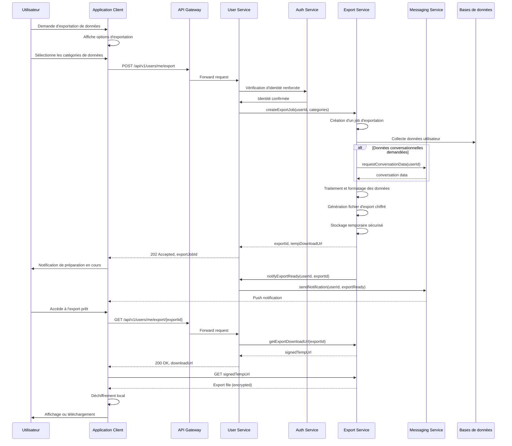
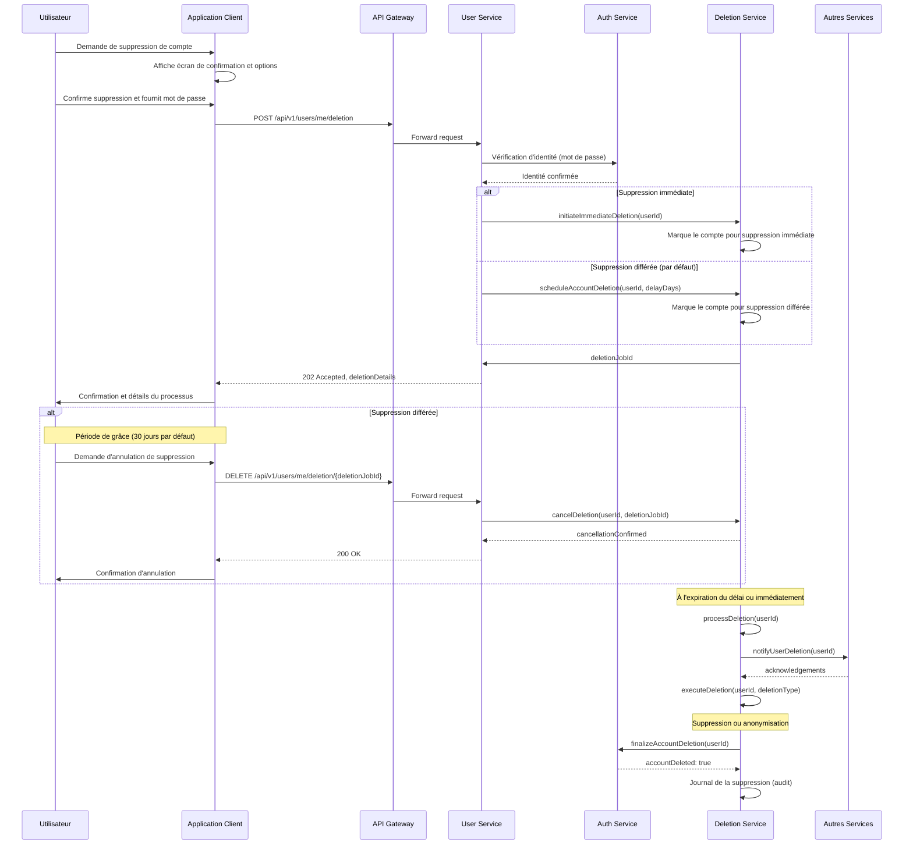
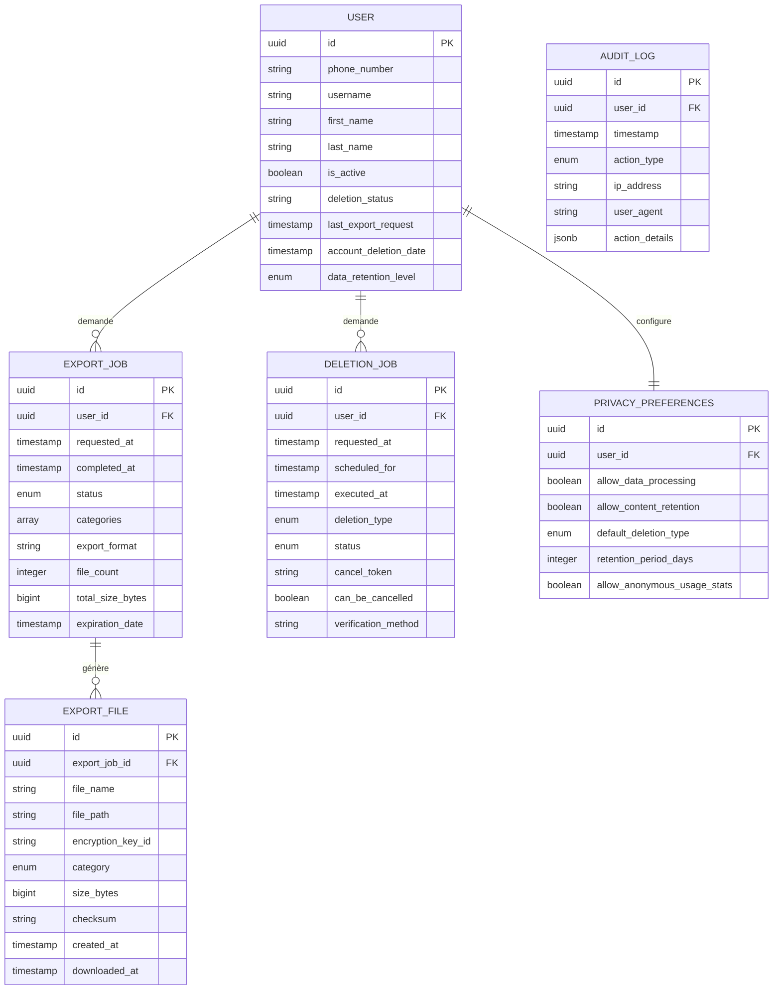
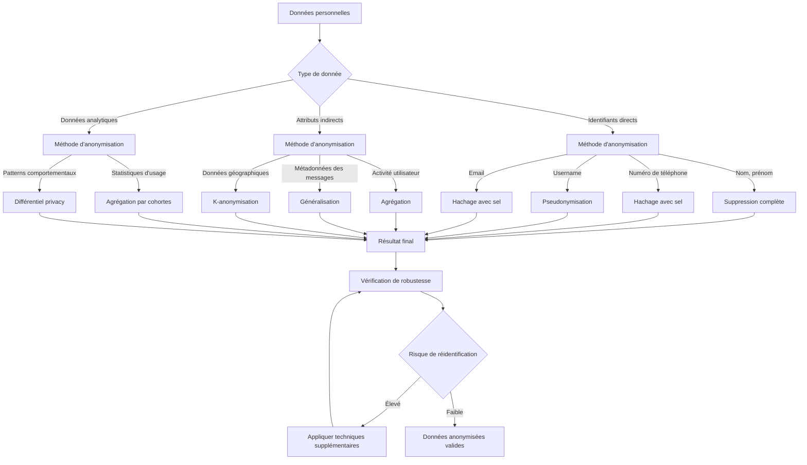

# Spécification Fonctionnelle - Export et Suppression de Données

## 1. Vue d'ensemble

### 1.1 Objectif

Cette spécification définit les processus et fonctionnalités liés aux droits des utilisateurs en matière de protection des données personnelles (RGPD) dans l'application Whispr. Elle couvre l'exportation des données personnelles, la suppression de compte et l'anonymisation, en garantissant la conformité légale tout en préservant l'intégrité et la sécurité de l'application.

### 1.2 Contexte réglementaire

L'application Whispr est soumise au Règlement Général sur la Protection des Données (RGPD), qui accorde aux utilisateurs plusieurs droits fondamentaux concernant leurs données personnelles, notamment :
- Le droit d'accès (Article 15)
- Le droit à la portabilité des données (Article 20)
- Le droit à l'effacement ("droit à l'oubli") (Article 17)
- Le droit à la limitation du traitement (Article 18)

Cette spécification implémente les processus techniques nécessaires pour respecter ces obligations légales dans le cadre du service utilisateurs.

### 1.3 Principes clés

- **Transparence** : Fournir aux utilisateurs un accès clair à leurs données personnelles
- **Portabilité** : Permettre l'exportation des données dans un format structuré et réutilisable
- **Contrôle utilisateur** : Donner aux utilisateurs un contrôle effectif sur leurs données
- **Minimisation des données** : Supprimer les données qui ne sont plus nécessaires
- **Proportionnalité** : Équilibrer les droits des utilisateurs avec les obligations légales et techniques
- **Sécurité** : Garantir que les processus d'exportation et de suppression ne compromettent pas la sécurité

## 2. Exportation des données personnelles

### 2.1 Processus d'exportation des données



### 2.2 Catégories de données exportables

1. **Données de profil**
   - Informations de base (nom, prénom, numéro de téléphone, etc.)
   - Photo de profil
   - Nom d'utilisateur et identifiants
   - Biographie et informations personnalisées
   - Date de création et dernière connexion

2. **Paramètres et préférences**
   - Paramètres de confidentialité
   - Paramètres de notification
   - Préférences d'application
   - Langue et paramètres régionaux

3. **Contacts et relations**
   - Liste des contacts
   - Groupes créés et rejoints
   - Utilisateurs bloqués
   - Demandes de contact envoyées/reçues

4. **Données de conversation** (optionnel)
   - Métadonnées des conversations (noms, dates, participants)
   - Messages texte envoyés (sans le contenu reçu des autres utilisateurs)
   - Médias partagés par l'utilisateur

5. **Informations sur les appareils**
   - Appareils connectés
   - Dates de connexion

6. **Journal d'activité**
   - Connexions
   - Modifications importantes du compte
   - Actions administratives (création de groupe, etc.)

### 2.3 Formats d'exportation

1. **Format JSON standard**
   - Format principal pour une utilisation par des machines
   - Structure hiérarchique claire
   - Inclut des métadonnées sur l'exportation
   - Horodatage précis au format UTC

```json
{
  "export_metadata": {
    "user_id": "7c9e6679-7425-40de-944b-e07fc1f90ae7",
    "export_date": "2025-05-15T14:22:31Z",
    "export_version": "1.0",
    "categories": ["profile", "settings", "contacts", "groups"]
  },
  "profile": {
    "phone_number": "+33612345678",
    "username": "utilisateur_exemple",
    "first_name": "Prénom",
    "last_name": "Nom",
    "biography": "Ma biographie",
    "profile_picture_url": "https://...",
    "created_at": "2024-01-15T10:30:00Z",
    "last_seen": "2025-05-14T18:45:12Z"
  },
  "settings": {
    "privacy": {
      "profile_picture_privacy": "contacts",
      "last_seen_privacy": "everyone",
      "biography_privacy": "contacts"
    },
    "notifications": {
      "message_notifications": true,
      "group_notifications": true
    }
  },
  // Autres sections...
}
```

2. **Format CSV pour certaines catégories**
   - Utile pour les données tabulaires
   - Fichiers séparés par catégorie
   - En-têtes clairs et explicites
   - Encodage UTF-8 avec BOM

3. **Format PDF lisible**
   - Présentation visuelle des données
   - Mise en page structurée et organisée
   - Indexation par catégorie
   - Inclut un résumé et des métadonnées
   - Optimisé pour la lecture humaine

4. **Format HTML interactif**
   - Interface navigable
   - Recherche et filtrage intégrés
   - Visualisation améliorée des médias
   - Liens entre les données associées

### 2.4 Sécurité de l'exportation

1. **Vérification d'identité renforcée**
   - Confirmation du mot de passe requise
   - Option pour authentification à deux facteurs
   - Vérification de l'appareil habituel

2. **Chiffrement des données**
   - Chiffrement de bout en bout du fichier d'exportation
   - Chiffrement en transit (TLS 1.3)
   - Clé de déchiffrement transmise via canal sécurisé distinct

3. **Accès temporaire et limité**
   - URL de téléchargement à usage unique
   - Expiration après 24 heures ou après téléchargement
   - Limitation à l'appareil demandeur

4. **Journalisation et surveillance**
   - Enregistrement de toutes les demandes d'exportation
   - Notification à l'utilisateur par canaux alternatifs
   - Détection des comportements suspects (fréquence anormale)

### 2.5 Règles métier pour l'exportation

1. **Limitations générales**
   - Maximum 1 exportation complète par période de 24 heures
   - Maximum 5 exportations partielles par période de 24 heures
   - Taille maximale d'export : 2 GB (avec pagination si nécessaire)
   - Conservation des fichiers d'export : 24 heures maximum

2. **Traitement des données de tiers**
   - Exclusion des contenus générés par d'autres utilisateurs
   - Anonymisation des identifiants des autres utilisateurs
   - Inclusion des métadonnées relationnelles sans contenu
   - Information claire sur les limites légales de l'export

3. **Gestion des volumes importants**
   - Traitement asynchrone pour les comptes volumineux
   - Notification progressive de l'avancement
   - Segmentation par catégories pour les téléchargements partiels
   - Compression des données pour optimiser le transfert

## 3. Suppression de compte

### 3.1 Processus de suppression de compte



### 3.2 Types de suppression

1. **Désactivation temporaire**
   - Permet de masquer le profil et suspendre l'activité
   - L'utilisateur n'apparaît plus dans les recherches
   - Les messages entrants sont mis en attente
   - Réactivation possible à tout moment
   - Durée maximale configurable (par défaut 180 jours)
   - Convertible en suppression définitive

2. **Suppression avec période de grâce**
   - Désactivation immédiate du compte
   - Période de grâce (30 jours par défaut) permettant la récupération
   - Notification de rappel avant suppression définitive
   - Les données sont marquées comme "en attente de suppression"
   - Annulation possible pendant la période de grâce

3. **Suppression immédiate**
   - Suppression sans période de grâce
   - Requiert une vérification d'identité renforcée
   - Irréversible une fois confirmée
   - Moins recommandée mais offerte comme option
   - Limitée à des cas particuliers justifiés

### 3.3 Niveaux d'anonymisation et suppression

1. **Niveau 1 - Suppression partielle (par défaut)**
   - **Données supprimées** :
     - Informations personnelles identifiables (nom, prénom, photo)
     - Numéro de téléphone et coordonnées
     - Contenu généré par l'utilisateur (messages, médias partagés)
     - Paramètres et préférences personnelles
   - **Données anonymisées et conservées** :
     - Structure des conversations (sans contenu)
     - Métadonnées statistiques agrégées
     - Rôles dans les groupes (remplacés par "Utilisateur anonyme")
     - Empreintes anonymisées pour prévention des abus

2. **Niveau 2 - Suppression renforcée**
   - **Données supprimées** : Tout du niveau 1, plus :
     - Toutes références aux groupes créés
     - Associations avec les contacts
     - Historique de connexion et activité
   - **Données anonymisées et conservées** :
     - Identifiants techniques avec rupture de lien
     - Métadonnées minimales de sécurité

3. **Niveau 3 - Effacement total**
   - **Données supprimées** : Suppression complète de toutes les données
     - Effacement de toutes les références directes et indirectes
     - Seuls conservés : journaux d'audit obligatoires
   - Disponible uniquement sur demande justifiée et après vérification

### 3.4 Traitement des données partagées

```mermaid
flowchart TD
    A[Données de l'utilisateur] --> B{Type de donnée}
    
    B -->|Données personnelles| C[Suppression complète]
    B -->|Contenu partagé avec d'autres| D{Contexte de partage}
    B -->|Données de groupe| E{Rôle dans le groupe}
    
    D -->|Messages privés| F[Remplacement par "Message supprimé"]
    D -->|Médias partagés| G[Options de traitement]
    D -->|Messages de groupe| H[Selon paramètres de groupe]
    
    G -->|Option 1| I[Suppression complète]
    G -->|Option 2| J[Anonymisation de la source]
    G -->|Option 3| K[Conservation avec consentement explicite]
    
    E -->|Créateur/Admin| L[Transfert de propriété ou dissolution]
    E -->|Membre| M[Simple retrait des groupes]
    
    L -->|Groupes actifs| N[Transfert automatique à un admin]
    L -->|Petits groupes| O[Notification de dissolution possible]
    
    F --> P[Notification aux destinataires]
    J --> P
    N --> P
    O --> P
    
    P --> Q[Journalisation pour audit]
```

#### 3.4.1 Messages et conversations

- Les messages envoyés par l'utilisateur dans les conversations privées sont remplacés par "Message supprimé par l'expéditeur"
- L'utilisateur peut choisir entre :
  - Supprimer uniquement pour soi (les autres continuent à voir le contenu)
  - Supprimer pour tous (remplacement par un indicateur générique)
- Les conversations initiées par l'utilisateur sont conservées pour les autres participants mais marquées comme "Conversation avec un utilisateur qui a supprimé son compte"

#### 3.4.2 Groupes créés par l'utilisateur

- Le système tente de transférer la propriété à un autre administrateur
- Si aucun administrateur n'est disponible, propose à un membre actif
- Si le groupe est inactif (aucun message depuis 30 jours), proposition de dissolution
- Le nom du créateur est remplacé par "Utilisateur anonyme" dans l'historique

### 3.5 Implications légales et obligations de conservation

1. **Données soumises à obligation légale**
   - Journaux de connexion (durée légale : 1 an)
   - Preuves d'identité pour la création de compte
   - Traces d'activité pour la détection de fraude
   - Informations nécessaires aux obligations fiscales et comptables

2. **Base légale pour la conservation**
   - Intérêt légitime pour la sécurité
   - Obligations légales et réglementaires
   - Protection contre les utilisations abusives et le harcèlement
   - Nécessité contractuelle pour les services partagés

3. **Information à l'utilisateur**
   - Explication claire des données conservées
   - Justification légale pour chaque catégorie
   - Durées de conservation spécifiques
   - Processus pour contester la conservation

### 3.6 Sécurité et vérification du processus de suppression

1. **Vérification d'identité renforcée**
   - Confirmation obligatoire par mot de passe
   - Option d'authentification à deux facteurs
   - Vérification par email/SMS pour confirmation
   - Détection des tentatives de suppression non autorisées

2. **Procédures de validation et d'audit**
   - Journalisation complète du processus de suppression
   - Vérification automatique post-suppression
   - Audit périodique des suppressions pour conformité
   - Conservation des preuves de demande et de traitement

3. **Mécanismes anti-abus**
   - Délai obligatoire entre création de compte et suppression
   - Limitation du nombre de cycles création/suppression
   - Détection des suppressions coordonnées (attaques)
   - Mesures spécifiques pour les comptes à haut risque

## 4. Architecture et implémentation technique

### 4.1 Service dédié pour les opérations RGPD

```mermaid
flowchart TD
    A[API Gateway] --> B[User Service]
    A --> C[Export Service]
    A --> D[Deletion Service]
    
    B <--> C
    B <--> D
    
    C --> E[Task Queue - Export]
    D --> F[Task Queue - Deletion]
    
    E --> G[Export Worker]
    F --> H[Deletion Worker]
    
    G --> I[(User Database)]
    G --> J[(Message Database)]
    G --> K[(Media Storage)]
    
    H --> I
    H --> J
    H --> K
    
    G --> L[Encrypted Storage]
    L --> M[Temporary Export Files]
    
    N[Notification Service] <-- Events --- C
    N <-- Events --- D
    
    O[Auth Service] <-- Verification --- C
    O <-- Verification --- D
    
    subgraph "Data Export Flow"
        E --> G --> L --> M
    end
    
    subgraph "Account Deletion Flow"
        F --> H --> P[Processing Steps]
        P --> P1[1. Disable Account]
        P1 --> P2[2. Anonymize Data]
        P2 --> P3[3. Remove Personal Data]
        P3 --> P4[4. Delete/Archive]
    end
```

### 4.2 Composants principaux

1. **Export Service**
   - Gestion des demandes d'exportation
   - Collecte des données auprès des différents services
   - Formatage et structuration des exports
   - Chiffrement et sécurisation des fichiers
   - Génération des liens temporaires sécurisés

2. **Deletion Service**
   - Gestion des demandes de suppression
   - Orchestration du processus d'anonymisation
   - Propagation des instructions aux autres services
   - Vérification de la complétion des tâches
   - Journalisation et audit

3. **Task Queue**
   - Traitement asynchrone des opérations longues
   - Prioritisation des tâches
   - Reprise sur échec
   - Monitoring et alertes

4. **Workers spécialisés**
   - Export Workers : génération des fichiers d'export
   - Deletion Workers : exécution des étapes de suppression
   - Verification Workers : validation post-opération

### 4.3 Interfaces APIs

#### 4.3.1 Endpoints d'exportation

| Endpoint | Méthode | Description | Paramètres |
|----------|---------|-------------|------------|
| `/api/v1/users/me/export` | POST | Initier une demande d'exportation | `categories`, `format` |
| `/api/v1/users/me/export/status/{exportId}` | GET | Vérifier l'état d'une exportation | - |
| `/api/v1/users/me/export/{exportId}` | GET | Récupérer un export prêt | - |
| `/api/v1/users/me/export/history` | GET | Historique des exportations | `page`, `limit` |

#### 4.3.2 Endpoints de suppression

| Endpoint | Méthode | Description | Paramètres |
|----------|---------|-------------|------------|
| `/api/v1/users/me/deletion` | POST | Initier une demande de suppression | `deletionType`, `password` |
| `/api/v1/users/me/deletion/{deletionId}` | GET | Vérifier l'état d'une suppression | - |
| `/api/v1/users/me/deletion/{deletionId}` | DELETE | Annuler une suppression pendant la période de grâce | - |
| `/api/v1/users/me/deactivation` | POST | Désactiver temporairement le compte | `duration` |
| `/api/v1/users/me/deactivation` | DELETE | Réactiver un compte désactivé | - |

### 4.4 Modèle de données



## 5. Anonymisation et archivage des données

### 5.1 Techniques d'anonymisation



#### 5.1.1 Techniques principales

1. **Suppression directe**
   - Élimination complète des identifiants directs
   - Application aux champs hautement identifiants
   - Irréversible et simple à implémenter
   - Utilisée pour les données non essentielles à conserver

2. **Pseudonymisation**
   - Remplacement des identifiants par des alias
   - Maintien de la cohérence dans les jeux de données
   - Permet le traitement sans identification directe
   - Clé de correspondance conservée séparément et sécurisée

3. **Hachage avec sel**
   - Transformation unidirectionnelle des identifiants
   - Utilisation pour les vérifications indirectes
   - Salt unique par utilisateur
   - Application sur les numéros de téléphone et emails

4. **Agrégation**
   - Regroupement des données individuelles en statistiques
   - Perte délibérée des détails individuels
   - Permet l'analyse de tendances sans identification
   - Applicable aux données d'usage et comportementales

5. **Généralisation**
   - Réduction de la précision des données
   - Transformation des valeurs exactes en plages ou catégories
   - Préservation de l'utilité analytique
   - Utilisée pour les données temporelles et géographiques

### 5.2 Archives et journaux d'audit

1. **Journalisation des actions critiques**
   - Création d'enregistrements immuables des actions suivantes :
     - Demandes d'exportation de données
     - Demandes de suppression/anonymisation
     - Modifications des paramètres de confidentialité
     - Connexions et déconnexions
   - Données journalisées :
     - Horodatage précis (UTC)
     - Type d'action
     - Adresse IP (anonymisée après 12 mois)
     - Informations sur l'appareil (anonymisées après 12 mois)
     - Résultat de l'action

2. **Structure des archives de données**
   - Séparation physique des archives et données actives
   - Chiffrement des archives avec clés distinctes
   - Rotation périodique des clés d'archivage
   - Contrôle d'accès strict sur la base du besoin d'en connaître

3. **Durées de conservation**
   - Données d'identification de compte : 5 ans après suppression
   - Journaux de connexion : 1 an (obligation légale)
   - Métadonnées de messages : 6 mois après suppression
   - Journaux d'audit de suppression : 5 ans

### 5.3 Reconstruction et suppression sélective

1. **Reconstruction partielle de compte**
   - Process de récupération après suppression accidentelle
   - Disponible uniquement pendant la période de grâce
   - Nécessite vérification d'identité renforcée
   - Limité aux données encore disponibles

2. **Suppression sélective par catégorie**
   - Suppression ciblée par type de donnée
   - Options disponibles :
     - Suppression des photos de profil
     - Suppression de l'historique de connexion
     - Suppression de l'historique des groupes
     - Suppression des médias partagés
   - Confirmation spécifique à chaque catégorie

3. **Workflows de suppression différenciés**
   - Processus adapté au volume et à la sensibilité des données
   - Étapes supplémentaires pour les comptes avec rôles particuliers
   - Traitements prioritaires pour les demandes fondées sur des motifs légitimes urgents
   - Voies spéciales pour les sujets vulnérables

## 6. Interactions avec les autres services

### 6.1 Propagation des demandes RGPD

```mermaid
sequenceDiagram
    participant UserService as User Service
    participant DeletionService as Deletion Service
    participant AuthService as Auth Service
    participant MessagingService as Messaging Service
    participant MediaService as Media Service
    participant NotificationService as Notification Service
    
    UserService->>DeletionService: processAccountDeletion(userId)
    
    par Propagation parallèle
        DeletionService->>AuthService: request

### 6.1 Propagation des demandes RGPD (suite)

```mermaid
sequenceDiagram
    participant UserService as User Service
    participant DeletionService as Deletion Service
    participant AuthService as Auth Service
    participant MessagingService as Messaging Service
    participant MediaService as Media Service
    participant NotificationService as Notification Service
    
    UserService->>DeletionService: processAccountDeletion(userId)
    
    par Propagation parallèle
        DeletionService->>AuthService: requestAccountDeletion(userId, deletionType)
        DeletionService->>MessagingService: requestConversationsDeletion(userId, deletionType)
        DeletionService->>MediaService: requestMediaDeletion(userId, deletionType)
        DeletionService->>NotificationService: requestNotificationsDeletion(userId)
    end
    
    AuthService-->>DeletionService: authDataDeletedAck
    MessagingService-->>DeletionService: messagingDataDeletedAck
    MediaService-->>DeletionService: mediaDataDeletedAck
    NotificationService-->>DeletionService: notificationsDataDeletedAck
    
    DeletionService->>DeletionService: verifyAllServicesResponded()
    DeletionService->>DeletionService: finalizeAccountDeletion(userId)
    
    DeletionService-->>UserService: accountDeletionCompleted
    
    Note over DeletionService: En cas d'échec de service...
    
    DeletionService->>DeletionService: retryFailedDeletions()
    DeletionService->>DeletionService: escalateIfPersistentFailure()
```

### 6.2 Communication inter-services

1. **Messages gRPC pour la propagation**
   - Messages typés fortement pour chaque type d'opération
   - Structure uniforme pour les requêtes et réponses
   - Statuts standardisés pour le suivi des opérations
   - Mécanismes de retry intégrés

2. **Événements de suppression**
   - Publication d'événements pour les services abonnés
   - Structure :
     ```json
     {
       "event_type": "USER_DELETION",
       "user_id": "7c9e6679-7425-40de-944b-e07fc1f90ae7",
       "deletion_type": "FULL",
       "timestamp": "2025-05-15T14:30:00Z",
       "correlation_id": "8f7e6d5c-4b3a-2d1c-0e9f-8a7b6c5d4e3f",
       "initiator": "USER_REQUEST",
       "additional_params": {
         "retain_shared_content": false,
         "compliance_required": true
       }
     }
     ```
   - Routage intelligent via le message broker

3. **Coordination et completion**
   - Mécanisme de coordination par service orchestrateur
   - Pattern de saga distribué avec compensation
   - Suivi des étapes avec timeout configurable
   - Mécanisme de récupération en cas d'échec partiel

### 6.3 Intégration spécifique par service

#### 6.3.1 Auth Service

- Suppression des informations d'authentification
- Révocation de tous les tokens actifs
- Conservation des journaux d'authentification (obligation légale)
- Désactivation des appareils enregistrés

#### 6.3.2 Messaging Service

- Anonymisation ou suppression des messages selon les paramètres
- Traitement des conversations privées et de groupe différencié
- Conservation des messages reçus par d'autres utilisateurs
- Marquage spécial des conversations avec utilisateurs supprimés

#### 6.3.3 Media Service

- Suppression physique des médias personnels (photos de profil, etc.)
- Traitement configurable des médias partagés
- Conservation des métadonnées requises pour l'intégrité du système
- Processus de nettoyage asynchrone pour les médias volumineux

#### 6.3.4 Notification Service

- Arrêt immédiat de toutes les notifications
- Suppression des tokens push
- Nettoyage des préférences de notification
- Envoi d'une notification finale confirmant la suppression

## 7. Interface utilisateur et expérience

### 7.1 Parcours d'exportation des données

```mermaid
graph TD
    A[Page Paramètres] --> B[Section "Données personnelles"]
    B --> C[Option "Exporter mes données"]
    
    C --> D[Écran principal d'exportation]
    D --> E{Choix de l'utilisateur}
    
    E -->|Export complet| F[Options d'export complet]
    E -->|Export partiel| G[Sélection des catégories]
    
    F --> H[Sélection du format]
    G --> H
    
    H --> I[Confirmations légales]
    I --> J[Vérification d'identité]
    J --> K[Écran de confirmation]
    
    K --> L[Notification "Préparation en cours"]
    L --> M[Écran de progression]
    
    M --> N[Notification "Export prêt"]
    N --> O[Écran de téléchargement]
    
    O --> P[Instructions de déchiffrement]
    P --> Q[Confirmation de téléchargement]
```

**Éléments clés de l'interface** :
- Sélection intuitive des catégories de données par cases à cocher
- Estimation de la taille et du temps de préparation
- Explication claire des formats disponibles avec avantages/inconvénients
- Barre de progression pour les exports volumineux
- Aide contextuelle sur la sécurité et la confidentialité
- Instructions détaillées pour le déchiffrement si nécessaire

### 7.2 Parcours de suppression de compte

```mermaid
graph TD
    A[Page Paramètres] --> B[Section "Compte"]
    B --> C[Option "Supprimer mon compte"]
    
    C --> D[Écran de présentation des options]
    D --> E{Choix de l'utilisateur}
    
    E -->|Désactivation temporaire| F[Options de désactivation]
    F --> F1[Durée de désactivation]
    F --> F2[Notifications lors de réactivation]
    
    E -->|Suppression avec période de grâce| G[Options de période de grâce]
    G --> G1[Durée période de grâce]
    G --> G2[Options de récupération]
    
    E -->|Suppression immédiate| H[Avertissements supplémentaires]
    
    F1 --> I[Écran de confirmation]
    G1 --> I
    H --> I
    
    I --> J[Saisie du mot de passe]
    J --> K[Vérification d'identité supplémentaire si nécessaire]
    
    K --> L[Écran de confirmation finale]
    L --> M[Écran de déconnexion]
    
    F2 --> N[Parcours de réactivation]
    G2 --> O[Parcours d'annulation]
```

**Éléments clés de l'interface** :
- Explication des différentes options de suppression
- Alertes visuelles distinctes pour les options irréversibles
- Information claire sur les conséquences de chaque option
- Mécanismes de confirmation à plusieurs niveaux pour éviter les erreurs
- Processus de vérification d'identité intuitif mais sécurisé
- Indication explicite des données qui seront conservées (légalement requises)

### 7.3 Information utilisateur et transparence

1. **Notifications et communications**
   - Notification par e-mail de confirmation de demande d'exportation
   - Notification par e-mail et application pour l'export prêt
   - Séquence de notifications pour les étapes de suppression de compte
   - Message de confirmation final de suppression de compte
   - Rappels avant expiration de la période de grâce

2. **Pages d'information dédiées**
   - Centre de confidentialité avec explication des droits RGPD
   - Guide illustré sur l'exportation des données
   - FAQ détaillée sur la suppression de compte
   - Informations sur les durées de conservation par type de données
   - Calendrier de suppression et processus d'anonymisation

3. **Aide contextuelle**
   - Tooltips explicatifs sur les options de confidentialité
   - Popups d'information lors des actions sensibles
   - Liens vers la documentation pertinente
   - Chat support dédié pour les questions RGPD

## 8. Test et validation

### 8.1 Stratégie de test

1. **Tests unitaires**
   - Couverture des fonctions d'anonymisation
   - Validation des algorithmes de formatage d'export
   - Tests des règles de validation des requêtes
   - Vérification des transformations de données

2. **Tests d'intégration**
   - Validation des flux complets d'exportation
   - Tests de bout en bout du processus de suppression
   - Vérification de la propagation entre services
   - Tests des mécanismes de reprise sur erreur

3. **Tests de sécurité**
   - Vérification du chiffrement des exports
   - Tests de pénétration sur les endpoints sensibles
   - Validation de l'accès aux données exportées
   - Vérification de l'impossibilité de récupérer des données supprimées

4. **Tests de conformité**
   - Validation des formats d'export selon normes RGPD
   - Vérification des durées de conservation
   - Tests d'exhaustivité des données exportées
   - Audit des traces de suppression

### 8.2 Validation de l'anonymisation

1. **Métriques de qualité d'anonymisation**
   - K-anonymité : chaque enregistrement doit être indistinguable d'au moins k-1 autres
   - L-diversité : les attributs sensibles doivent avoir au moins l valeurs distinctes
   - Test de réidentification par croisement de données
   - Validation statistique de l'utilité des données anonymisées

2. **Revues et audits**
   - Audit interne du processus d'anonymisation
   - Tests manuels par l'équipe de confidentialité
   - Revue de code spécifique pour les fonctions d'anonymisation
   - Validation périodique des données anonymisées

### 8.3 Tests de charge et de performance

1. **Scénarios de test**
   - Exportation simultanée par de nombreux utilisateurs
   - Suppressions massives de comptes
   - Exports de comptes volumineux (>1GB)
   - Délais et timeouts dans la chaîne de services

2. **Métriques surveillées**
   - Temps d'exportation par taille de compte
   - Consommation de ressources pendant les opérations
   - Délai entre demande et complétion
   - Débit maximal soutenable

## 9. Considérations légales et conformité

### 9.1 Conformité RGPD spécifique

1. **Droits des utilisateurs couverts**
   - Droit d'accès (Article 15)
   - Droit à l'effacement (Article 17)
   - Droit à la portabilité (Article 20)
   - Droit à la limitation du traitement (Article 18)

2. **Documentation de conformité**
   - Registre des activités de traitement
   - Analyse d'impact pour les fonctionnalités sensibles
   - Procédures documentées pour les demandes d'accès
   - Justification des durées de conservation

3. **Exceptions légitimes**
   - Conservation pour obligations légales
   - Protection contre la fraude et les abus
   - Défense des droits légaux
   - Intérêt public et recherche scientifique

### 9.2 Protection des droits des tiers

1. **Équilibre des droits contradictoires**
   - Protection des données des autres utilisateurs
   - Conservation des preuves en cas de plainte ou litige
   - Maintien de l'intégrité des conversations partagées
   - Respect du droit à l'oubli sans compromettre l'expérience des autres

2. **Processus de médiation**
   - Procédure pour les demandes contradictoires
   - Prise de décision basée sur la proportionnalité
   - Documentation des arbitrages réalisés
   - Voies de recours pour les parties concernées

### 9.3 Considérations internationales

1. **Adaptation aux juridictions**
   - Variations des processus selon la localisation de l'utilisateur
   - Respect des lois locales sur la conservation des données
   - Paramètres spécifiques par région
   - Documentation multilingue des processus

2. **Transferts internationaux**
   - Garanties pour les transferts de données
   - Chiffrement renforcé pour les données traversant les frontières
   - Options de localisation des exports dans certains cas
   - Conformité avec les clauses contractuelles types

## 10. Plan d'implémentation

### 10.1 Phases de développement

1. **Phase 1 - Fondations (Mois 1-2)**
   - Implémentation de la base de données avec les tables RGPD
   - Création des services de base d'exportation et de suppression
   - Développement des APIs REST initiales
   - Mise en place des mécanismes de chiffrement

2. **Phase 2 - Fonctionnalités principales (Mois 3-4)**
   - Implémentation complète de l'exportation de données
   - Mise en place du processus de suppression avec période de grâce
   - Intégration avec Auth Service et User Service
   - Création des interfaces utilisateur basiques

3. **Phase 3 - Intégration étendue (Mois 5-6)**
   - Intégration avec tous les services (Messaging, Media, etc.)
   - Anonymisation avancée et vérification
   - Amélioration de l'expérience utilisateur
   - Tests d'intégration complets

4. **Phase 4 - Finalisation et optimisation (Mois 7-8)**
   - Tests de charge et optimisations de performance
   - Revue de sécurité et de conformité RGPD
   - Documentation complète
   - Formation de l'équipe support

### 10.2 Ressources requises

1. **Équipe de développement**
   - 2 développeurs backend (TypeScript/NestJS)
   - 1 développeur frontend (mobile et web)
   - 1 spécialiste en sécurité des données
   - Support ponctuel d'un expert juridique RGPD

2. **Infrastructure**
   - Environnements de test distincts
   - Stockage sécurisé pour les exports temporaires
   - Capacité de calcul pour les opérations d'anonymisation
   - Mécanismes de surveillance et d'alerte

### 10.3 Planning et jalons

| Jalon | Description | Date cible |
|-------|-------------|------------|
| Conception détaillée | Finalisation des spécifications techniques | Semaine 2 |
| Alpha interne | Version minimale fonctionnelle pour tests internes | Semaine 6 |
| Beta | Intégration complète avec tous les services | Semaine 12 |
| Audit de conformité | Revue RGPD et tests de sécurité | Semaine 16 |
| Lancement V1 | Déploiement en production | Semaine 20 |
| Post-lancement | Améliorations basées sur les retours | Semaine 24+ |

## 11. Métriques et surveillance

### 11.1 Métriques de performance

1. **Métriques opérationnelles**
   - Temps moyen d'exportation par taille de compte
   - Délai de complétion des suppressions de compte
   - Taux de succès des opérations RGPD
   - Consommation de ressources par opération

2. **Métriques utilisateur**
   - Taux de complétion du processus d'exportation
   - Taux d'annulation des suppressions pendant la période de grâce
   - Satisfaction utilisateur post-exportation
   - Raisons invoquées pour les suppressions de compte

### 11.2 Surveillance et alertes

1. **Surveillance technique**
   - Alertes sur les échecs d'exportation ou de suppression
   - Surveillance de la file d'attente des jobs
   - Monitoring des temps de réponse des services
   - Détection des anomalies dans les volumes de requêtes

2. **Surveillance de conformité**
   - Délai de réponse aux demandes d'exercice des droits
   - Taux de demandes non satisfaites
   - Exceptions de conservation documentées
   - Violations potentielles détectées

## 12. Documentation

### 12.1 Documentation technique

1. **Architecture et conception**
   - Diagrammes de séquence des processus
   - Modèles de données et relations
   - Flux d'information inter-services
   - Mécanismes de sécurité et de chiffrement

2. **APIs et intégrations**
   - Spécification OpenAPI complète
   - Documentation des messages gRPC
   - Guide d'intégration pour les nouveaux services
   - Exemples de code et cas d'utilisation

### 12.2 Documentation utilisateur

1. **Guides utilisateur**
   - Guide étape par étape pour l'exportation des données
   - Guide pour la suppression et désactivation de compte
   - FAQ pour les questions RGPD fréquentes
   - Glossaire des termes techniques

2. **Documentation légale**
   - Politique de confidentialité mise à jour
   - Conditions d'utilisation en lien avec les données
   - Détail des droits RGPD et de leur exercice
   - Information sur les recours disponibles

### 12.3 Documentation opérationnelle

1. **Procédures internes**
   - Guide de gestion des incidents
   - Procédures de réponse aux demandes spéciales
   - Workflow pour les cas complexes
   - Checklist de vérification RGPD

2. **Reporting et audit**
   - Modèles de rapports d'activité RGPD
   - Procédures d'audit interne
   - Documentation des mécanismes de journalisation
   - Registre des activités de traitement

## 13. Conclusion

Le service d'Export et Suppression de Données est un composant essentiel de l'application Whispr, permettant aux utilisateurs d'exercer efficacement leurs droits en matière de protection des données. Conçu pour offrir un équilibre entre respect rigoureux du RGPD et expérience utilisateur fluide, ce service implémente des mécanismes sécurisés pour l'exportation des données personnelles et plusieurs niveaux de suppression adaptés aux besoins des utilisateurs.

Les principales forces de cette spécification sont :
- Une architecture modulaire et extensible
- Des processus clairement définis avec validation à chaque étape
- Une intégration complète avec tous les services de l'écosystème Whispr
- Des mécanismes d'anonymisation robustes et vérifiables
- Une interface utilisateur intuitive pour des opérations complexes
- Une conformité RGPD détaillée et documentée

Cette implémentation garantit non seulement la conformité légale de l'application, mais contribue également à renforcer la confiance des utilisateurs en leur offrant un contrôle transparent sur leurs données personnelles.

## Annexes

### A. Glossaire des termes RGPD

| Terme | Définition |
|-------|------------|
| Données personnelles | Toute information se rapportant à une personne physique identifiée ou identifiable |
| Traitement | Toute opération effectuée sur des données personnelles |
| Responsable du traitement | Entité qui détermine les finalités et moyens du traitement |
| Droit d'accès | Droit d'obtenir des informations sur le traitement et une copie des données |
| Droit à l'effacement | Droit d'obtenir l'effacement des données dans certaines conditions |
| Droit à la portabilité | Droit de recevoir ses données dans un format structuré et réutilisable |
| Minimisation des données | Principe limitant la collecte aux données strictement nécessaires |
| Pseudonymisation | Traitement des données de façon à ne plus pouvoir les attribuer à une personne sans information supplémentaire |
| Anonymisation | Processus rendant impossible l'identification de la personne concernée |

### B. Schémas JSON pour l'exportation

```json
{
  "export_schema": {
    "version": "1.0",
    "sections": [
      {
        "name": "profile",
        "properties": [
          {"name": "phone_number", "type": "string", "description": "Numéro de téléphone au format E.164"},
          {"name": "username", "type": "string", "description": "Nom d'utilisateur unique"},
          {"name": "first_name", "type": "string", "description": "Prénom de l'utilisateur"},
          {"name": "last_name", "type": "string", "description": "Nom de famille de l'utilisateur"},
          {"name": "biography", "type": "string", "description": "Biographie/description de l'utilisateur"},
          {"name": "profile_picture_url", "type": "string", "description": "URL de l'image de profil"},
          {"name": "created_at", "type": "datetime", "description": "Date de création du compte"},
          {"name": "last_seen", "type": "datetime", "description": "Dernière connexion visible"}
        ]
      },
      {
        "name": "privacy_settings",
        "properties": [
          {"name": "profile_picture_privacy", "type": "enum", "values": ["everyone", "contacts", "nobody"]},
          {"name": "last_seen_privacy", "type": "enum", "values": ["everyone", "contacts", "nobody"]},
          {"name": "biography_privacy", "type": "enum", "values": ["everyone", "contacts", "nobody"]}
        ]
      },
      {
        "name": "contacts",
        "array": true,
        "properties": [
          {"name": "contact_id", "type": "string", "description": "Identifiant unique du contact"},
          {"name": "nickname", "type": "string", "description": "Surnom personnalisé pour ce contact"},
          {"name": "is_favorite", "type": "boolean", "description": "Marqué comme favori"},
          {"name": "added_at", "type": "datetime", "description": "Date d'ajout du contact"}
        ]
      },
      {
        "name": "groups",
        "array": true,
        "properties": [
          {"name": "group_id", "type": "string", "description": "Identifiant unique du groupe"},
          {"name": "name", "type": "string", "description": "Nom du groupe"},
          {"name": "role", "type": "enum", "values": ["admin", "moderator", "member"]},
          {"name": "joined_at", "type": "datetime", "description": "Date d'entrée dans le groupe"}
        ]
      },
      {
        "name": "devices",
        "array": true,
        "properties": [
          {"name": "device_id", "type": "string", "description": "Identifiant unique de l'appareil"},
          {"name": "device_name", "type": "string", "description": "Nom de l'appareil"},
          {"name": "device_type", "type": "enum", "values": ["iOS", "Android", "Web"]},
          {"name": "last_active", "type": "datetime", "description": "Dernière activité de l'appareil"}
        ]
      }
    ]
  }
}
```

### C. Références légales et réglementaires

1. **Textes réglementaires**
   - Règlement Général sur la Protection des Données (RGPD) - Règlement UE 2016/679
   - Directive ePrivacy 2002/58/CE (concernant les communications électroniques)
   - Loi Informatique et Libertés (pour la France)
   - California Consumer Privacy Act (CCPA) pour les utilisateurs californiens

2. **Lignes directrices des autorités**
   - Lignes directrices de la CNIL sur le droit à la portabilité
   - Recommandations du Comité européen de la protection des données
   - Guidelines WP29 sur le droit à l'effacement
   - Documentation ISO/IEC 27001 sur la sécurité de l'information

3. **Jurisprudence pertinente**
   - Arrêts de la CJUE sur les demandes d'effacement
   - Décisions des autorités de contrôle nationales
   - Sanctions pour non-respect du droit à la portabilité
   - Interprétations sur les limites du droit à l'oublier