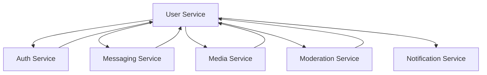

# Plan d'Implémentation - Service Utilisateur (User-Service)

## Vue d'ensemble

Ce plan d'implémentation structure le développement du service utilisateur sur 12 mois, avec une phase de P.O.C (septembre-décembre) suivie d'une phase d'implémentation complète (janvier-août).

## Phase 1 : Proof of Concept (Septembre - Décembre 2024)

### 🎯 Objectifs de la phase P.O.C
- Valider l'architecture technique du service utilisateur
- Prototyper les fonctionnalités cœur critiques
- Tester l'intégration avec les services externes
- Évaluer les performances et la sécurité
- Identifier les risques techniques majeurs

### Septembre 2024 : Fondations Architecture

**Semaines 1-2 : Setup et Architecture**
- Configuration de l'environnement de développement
- Setup du projet NestJS avec TypeScript
- Configuration PostgreSQL + Redis
- Architecture des modules principaux
- Setup CI/CD basique

**Semaines 3-4 : Modèle de données core**
- Implémentation des entités User, PrivacySettings
- Configuration TypeORM avec relations
- Migrations initiales
- Tests unitaires sur le modèle de données

### Octobre 2024 : Fonctionnalités Core

**Semaines 1-2 : Gestion des profils (P.O.C)**
Fonctionnalités prioritaires P.O.C
- CRUD profil utilisateur basique
- Validation des données
- Integration avec auth-service
- API REST endpoints basiques

**Semaines 3-4 : Paramètres de confidentialité (P.O.C)**
Fonctionnalités prioritaires P.O.C
- Système de permissions basique (everyone, contacts, nobody)
- Filtrage des profils selon confidentialité
- Tests d'intégration avec profils

### Novembre 2024 : Relations et Recherche

**Semaines 1-2 : Gestion des contacts (P.O.C)**
Fonctionnalités prioritaires P.O.C
- Ajout/suppression de contacts
- Système de blocage basique
- Relations entre utilisateurs

**Semaines 3-4 : Recherche d'utilisateurs (P.O.C)**
Fonctionnalités prioritaires P.O.C
- Recherche par nom d'utilisateur
- Index Redis pour recherche rapide
- Respect des paramètres de confidentialité

### Décembre 2024 : Intégration et Tests

**Semaines 1-2 : Intégration inter-services**
- Communication gRPC avec auth-service
- Tests d'intégration avec messaging-service
- Validation des contrats d'API

**Semaines 3-4 : Tests et Documentation P.O.C**
- Tests de charge basiques
- Documentation technique
- Retour d'expérience et recommandations
- Planification de la phase d'implémentation

### 📊 Livrables Phase P.O.C
- Architecture validée et documentée
- Prototype fonctionnel des modules core
- Tests de performance préliminaires
- Documentation des APIs
- Plan détaillé pour la phase d'implémentation

---

## Phase 2 : Implémentation Complète (Janvier - Août 2025)

### 🎯 Objectifs de la phase d'implémentation
- Implémentation complète de toutes les fonctionnalités
- Intégration totale avec l'écosystème Whispr
- Sécurisation et optimisation des performances
- Conformité RGPD complète
- Déploiement en production

### Janvier 2025 : Consolidation et Base Solide

**Semaines 1-2 : Refactoring Post-P.O.C**
- Refactoring du code basé sur les apprentissages P.O.C
- Amélioration de l'architecture
- Mise en place des patterns définitifs
- Configuration des environnements (dev, staging, prod)

**Semaines 3-4 : Gestion des profils - Version complète**

Sprint 1 - Profils utilisateurs complets

Epic: User Profile Management

Stories:
- Modification avancée de profil
- Validation robuste des données
- Gestion des photos de profil (intégration media-service)
- Historique des modifications
- API complète avec pagination

### Février 2025 : Confidentialité et Sécurité

**Semaines 1-2 : Paramètres de confidentialité avancés**

Sprint 2 - Privacy Settings

Epic: Advanced Privacy Controls

Stories:
- Niveaux de confidentialité granulaires
- Configuration par attribut de profil
- Interface de prévisualisation
- Propagation vers autres services
- Tests de confidentialité complets

**Semaines 3-4 : Gestion des contacts complète**

Sprint 3 - Contact Management

Epic: Contact Relationship Management

Stories:
- Synchronisation contacts téléphoniques
- Import/export de contacts
- Gestion des surnoms et favoris
- Statistiques de contacts
- API de recherche dans contacts

### Mars 2025 : Recherche et Découverte

**Semaines 1-2 : Système de recherche avancé**

Sprint 4 - Advanced Search

Epic: User Discovery & Search

Stories:
- Recherche full-text optimisée
- Recherche par numéro de téléphone (hashed)
- Suggestions intelligentes
- Index Redis optimisés
- Recherche avec filtres avancés

**Semaines 3-4 : Système de blocage et anti-harcèlement**

Sprint 5 - Anti-Harassment

Epic: User Safety & Blocking

Stories:
- Système de blocage bidirectionnel
- Détection de comportements suspects
- Restrictions automatiques
- Signalement et modération
- Dashboard de sécurité utilisateur

### Avril 2025 : Groupes et Communautés

**Semaines 1-2 : Gestion des groupes - Base**

Sprint 6 - Groups Foundation

Epic: Group Management - Core

Stories:
- Création et configuration de groupes
- Gestion des membres et rôles
- Permissions et administration
- Integration avec messaging-service

**Semaines 3-4 : Gestion des groupes - Avancé**

Sprint 7 - Groups Advanced

Epic: Group Management - Advanced

Stories:
- Paramètres de groupe complexes
- Modération de groupe
- Analytics et statistiques
- Export des données de groupe
- API d'administration

### Mai 2025 : Médias et Contenus

**Semaines 1-2 : Intégration médias**

Sprint 8 - Media Integration

Epic: Media Management Integration

Stories:
- Photos de profil et groupes
- Validation et modération des médias
- Gestion des quotas
- API d'upload sécurisé
- Intégration moderation-service

**Semaines 3-4 : Optimisations et Performance**

Sprint 9 - Performance & Optimization

Epic: Performance Optimization

Stories:
- Optimisation des requêtes BDD
- Cache Redis avancé
- Pagination et lazy loading
- Monitoring et métriques
- Tests de charge complets

### Juin 2025 : Conformité RGPD

**Semaines 1-2 : Export de données**

Sprint 10 - GDPR Data Export

Epic: Data Export & Portability

Stories:
- Export complet des données utilisateur
- Formats multiples (JSON, CSV, PDF)
- Chiffrement des exports
- Interface utilisateur export
- Processus de validation

**Semaines 3-4 : Suppression et anonymisation**

Sprint 11 - GDPR Data Deletion

Epic: Account Deletion & Anonymization

Stories:
- Suppression de compte avec options
- Anonymisation des données
- Propagation aux autres services
- Période de grâce configurable
- Audit trail complet

### Juillet 2025 : Intégration et Tests

**Semaines 1-2 : Intégration finale**

Sprint 12 - Final Integration

Epic: Service Integration & Testing

Stories:
- Tests d'intégration complets
- Validation des contrats gRPC
- Tests de sécurité avancés
- Performance sous charge
- Documentation API finale

**Semaines 3-4 : Sécurité et Audit**

Sprint 13 - Security & Compliance

Epic: Security Hardening

Stories:
- Audit de sécurité complet
- Tests de pénétration
- Validation RGPD complète
- Certification des processus
- Plan de réponse aux incidents

### Août 2025 : Déploiement et Monitoring

**Semaines 1-2 : Préparation production**

Sprint 14 - Production Readiness

Epic: Production Deployment

Stories:
- Configuration production GKE
- Monitoring et alerting
- Documentation opérationnelle
- Formation équipe support
- Plan de rollback

**Semaines 3-4 : Go-Live et Stabilisation**

Sprint 15 - Go-Live & Stabilization

Epic: Production Launch

Stories:
- Déploiement production
- Monitoring actif
- Support utilisateur
- Corrections post-lancement
- Retrospective complète

---

## 📋 Matrice des Dépendances

### Dépendances Critiques

| Fonctionnalité | Dépend de | Requis pour |
|---------------|-----------|-------------|
| Profils Utilisateurs | auth-service | Toutes les autres fonctionnalités |
| Paramètres Confidentialité | Profils | Recherche, Contacts, Groupes |
| Gestion Contacts | Profils, Confidentialité | Groupes, Anti-harcèlement |
| Recherche Utilisateurs | Profils, Contacts | Découverte, Groupes |
| Gestion Groupes | Contacts, messaging-service | Groupes avancés |
| Anti-harcèlement | Contacts, moderation-service | Sécurité globale |
| Médias | media-service, moderation-service | Profils, Groupes |
| RGPD | Toutes les fonctionnalités | Conformité légale |

### Intégrations Inter-Services

---

## 🛠️ Stack Technique et Outils

### Technologies Principales
- **Backend**: NestJS + TypeScript
- **Base de données**: PostgreSQL 14+
- **Cache**: Redis 7+
- **Communication**: gRPC + REST
- **ORM**: TypeORM
- **Tests**: Jest + Supertest
- **Documentation**: OpenAPI/Swagger

### Infrastructure
- **Orchestration**: Kubernetes (GKE)
- **CI/CD**: GitHub Actions
- **Monitoring**: Prometheus + Grafana
- **Logging**: Loki
- **Storage**: Google Cloud Storage

---

## 📊 Métriques de Succès

### Phase P.O.C
- ⚪️ Architecture validée techniquement
- ⚪️ Prototypes fonctionnels des modules core
- ⚪️ Tests d'intégration basiques passants
- ⚪️ Documentation technique disponible

### Phase Implémentation
- ⚪️ Couverture de tests > 80%
- ⚪️ Temps de réponse API < 200ms (99e percentile)
- ⚪️ Conformité RGPD complète
- ⚪️ Intégration avec tous les services
- ⚪️ Déploiement production réussi

---

## ⚠️ Risques et Mitigations

### Risques Techniques
| Risque | Probabilité | Impact | Mitigation |
|--------|-------------|--------|------------|
| Performance BDD | Moyenne | Élevé | Tests de charge réguliers, optimisation requêtes |
| Intégration gRPC | Faible | Élevé | Prototypage précoce, contrats stricts |
| Conformité RGPD | Moyenne | Critique | Expert juridique, audit externe |
| Sécurité données | Faible | Critique | Tests sécurité, revue de code |

### Risques Planning
| Risque | Probabilité | Impact | Mitigation |
|--------|-------------|--------|------------|
| Retard P.O.C | Moyenne | Élevé | Buffer de 2 semaines prévu |
| Complexité RGPD | Élevée | Moyen | Démarrage anticipé module RGPD |
| Intégration tardive | Moyenne | Élevé | Tests d'intégration continus |

---

## 👥 Équipe et Ressources

### Équipe Core
- **1 Tech Lead** (temps plein)
- **2 Développeurs Backend** (temps plein)
- **1 DevOps** (50% temps)
- **1 Expert Sécurité** (support ponctuel)

### Support
- **Product Owner** (suivi fonctionnel)
- **Expert RGPD** (consultation)
- **UI/UX Designer** (interfaces utilisateur)

---

## 📅 Jalons Clés

| Date | Jalon | Critères de succès |
|------|-------|-------------------|
| **Fin Nov 2024** | P.O.C Core Complete | Profils + Contacts + Recherche |
| **Fin Déc 2024** | P.O.C Validé | Intégration + Tests + Doc |
| **Fin Fév 2025** | Base Solide | Profils + Confidentialité Complete |
| **Fin Avr 2025** | Fonctionnalités Principales | Groupes + Anti-harcèlement |
| **Fin Juin 2025** | Conformité RGPD | Export + Suppression |
| **Mi-Août 2025** | Production Ready | Tests + Sécurité + Déploiement |
